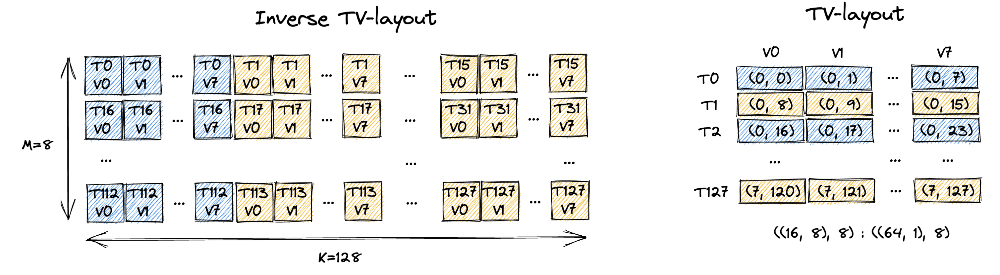

# 4 Ways to Do CuTe Copy

*Disclaimer: The content of this blog reflects my personal experiences and opinions while learning GPU programming in my own time. All information presented is publicly available and does not represent the views or positions of NVIDIA Corporation or any of its affiliates.*

## 0. Introduction

The famous Chinese writer [Lu Xun](https://en.wikipedia.org/wiki/Lu_Xun) (鲁迅) once said: 
> There are 4 ways to conduct a CuTe copy.  
> CuTe copy 有四种写法。

In this blog, I will list the 4 ways to do CuTe copy following Lu Xun's guidance.
Joke aside, through the examples, I'm hoping to convey the following messages:
- There are many equivalent ways to partition a tensor into tiles in CuTe. Depending on the specific use case, one may be preferred over the other.
- When you are writing a CuTe kernel, it is still fundamentally [SIMT](https://en.wikipedia.org/wiki/Single_instruction,_multiple_threads) (you have many threads running in parallel).

All the code in this blog can be found [here](https://github.com/Yang-YiFan/Yang-YiFan.github.io/tree/main/blogs/cute_copy/cute_copy.py).
Note that despite CuTe TMA copy falls under the hood of CuTe copy, it is a completely different beast and we already covered it in a previous blog [Using TMA Load, Prefetch, and Multicast Load in CuTe](../cute_tma/cute_tma.md).
This blog focuses on the generic and basic CuTe copy that uses [ld.global](https://docs.nvidia.com/cuda/parallel-thread-execution/#data-movement-and-conversion-instructions-ld), [st.shared](https://docs.nvidia.com/cuda/parallel-thread-execution/#data-movement-and-conversion-instructions-st), [cp.async](https://docs.nvidia.com/cuda/parallel-thread-execution/#data-movement-and-conversion-instructions-cp-async), etc. instructions.

## 1. Working Example

We are going to do something extremely simple: load a `8x128` GMEM tensor (row major) into RF using 128 threads and 1 CTA.
The way we partition the tensor to each thread is shown in the following figure:


Essentially each thread loads a `1x8` tile of the GMEM tensor.
In the following sections, we will show 4 ways to do this simple task.
They should all be functionally and performance-wise equivalent.
And we will use [CuTe DSL](https://docs.nvidia.com/cutlass/latest/media/docs/pythonDSL/cute_dsl_api.html) to write the kernel.

## 2. Approach 1: Traditional CUDA C++ Style

Version 1 of the kernel tries to mimic what you would do in CUDA C++ as much as possible.
The only CuTe part we leverage the layout of input tensor such that we don't need to hand calculate the GMEM address.


```python
# Approach 1: Traditional CUDA C++ Style
@cute.kernel
def cute_copy_kernel_1(
    mA: cute.Tensor,  # Input tensor A
    CTA_M: cutlass.Constexpr,
    CTA_K: cutlass.Constexpr,
    NUM_VAL_PER_THREAD: cutlass.Constexpr,
):
    # 128 threads
    tidx, _, _ = cute.arch.thread_idx()

    NUM_THREAD_PER_ROW = CTA_K // NUM_VAL_PER_THREAD # i.e. 128 // 8 = 16

    # starting index of the tile for this thread
    m_idx = tidx // NUM_THREAD_PER_ROW
    k_idx = (tidx % NUM_THREAD_PER_ROW) * NUM_VAL_PER_THREAD

    # allocate rmem tensor for this thread
    rA = cute.make_rmem_tensor((NUM_VAL_PER_THREAD), dtype=mA.element_type)

    # load the value one by one in CUDA C++ style
    for i in cutlass.range(NUM_VAL_PER_THREAD):
        # indexing like CUDA C++
        rA[i] = mA[m_idx, k_idx + i]

    if tidx == 1:
        cute.print_tensor(rA)
```

The kernel above is pretty straightforward and would be roughly what you would write in a normal CUDA C++ code.
Using the thread index `tidx` we can calculate the index (i.e. `(m_idx, k_idx)`) of the GMEM tensor that this thread is responsible for.
Then we just do a simple load of each element from GMEM to RF by using the appropriate indexing:
```python
rA[i] = mA[m_idx, k_idx + i]
```
Because CuTe understands the layout of the GMEM tensor `mA`, it can correctly calculate GMEM address of each element given its (natural) coordinate (the layout encodes the mapping `(m, k) -> address`).
So calculating the `(m_idx, k_idx)` is sufficient to obtain the correct value of each element.

However, this index calculation for each thread is error prone and hard to maintain.
If you change the thread partitioning (each thread is responsible for a different (shape) tile of the GMEM tensor), every index calculation would need to be updated.
That's exactly the value proposition of CuTe.
By abstracting the thread partitioning through layout algebra, we'd never need to hand calculate the index for each thread, CuTe does all the heavy lifting for us.

## 3. Approach 2: Using CuTe Layout Algebra

In approach 2, we will use CuTe layout algebra represent the thread partitioning pattern to avoid explicit index calculation.

```python
# Approach 2: Using CuTe Layout Algebra
@cute.kernel
def cute_copy_kernel_2(
    mA: cute.Tensor,  # Input tensor A
    CTA_M: cutlass.Constexpr,
    CTA_K: cutlass.Constexpr,
    NUM_VAL_PER_THREAD: cutlass.Constexpr,
):
    # 128 threads
    tidx, _, _ = cute.arch.thread_idx()

    # (M, K) -> addr
    gA = cute.local_tile(mA, (CTA_M, CTA_K), (0, 0))

    NUM_THREAD_PER_ROW = CTA_K // NUM_VAL_PER_THREAD # i.e. 128 // 8 = 16

    # use layout algebra to get the per thread tile of gA
    tAgA = cute.flat_divide(gA, (1, NUM_VAL_PER_THREAD)) # (TileM, TileK, RestM, RestK, L, ...)
    tAgA_layout = cute.select(tAgA.layout, [0, 1, 3, 2]) # (TileM, TileK, RestK, RestM)
    tAgA = cute.make_tensor(tAgA.iterator, tAgA_layout) # (TileM, TileK, RestK, RestM)
    tAgA = cute.group_modes(tAgA, 2, 4) # (TileM, TileK, (RestK, RestM))
    tAgA = tAgA[0, None, tidx] # (TileK)

    # allocate rmem tensor for this thread
    rA = cute.make_rmem_tensor((NUM_VAL_PER_THREAD), dtype=mA.element_type)

    # will iterate over each element and do the copy underneath
    # equivalent to cute::copy(tAgA, rA) in C++
    cute.basic_copy(tAgA, rA)

    if tidx == 1:
        cute.print_tensor(rA)
```

Compared to [approach 1](#2-approach-1-traditional-cuda-c-style), we are doing 3 things differently:
1. We use CuTe layout algebra to get the tile of data this CTA is responsible for (aka CTA partitioning). `gA = cute.local_tile(mA, (CTA_M, CTA_K), (0, 0))` does exactly this (you can refer to my previous blog [CuTe Layout and Tensor](../cute_layout/cute_layout.md) for the definition of `local_tile`). Since we use a single CTA to load the whole tile, this code basically gives the GMEM tensor a static/compile time shape of `(CTA_M, CTA_K)`, which would make the subsequent layout algebra slightly more efficient due to constant folding. 
2. The second change is we obtain the thread level partitioning `tAgA` also using CuTe layout algebra (similar to CTA level partitioning) rather than explicit index calculation. Each thread is responsible for a `(TileM=1, TileK=NUM_VAL_PER_THREAD)` tile of the GMEM tensor. `RestM` and `RestK` mean how many repetition along the `M` and `K` dimensions we stack `(TileM, TileK)` to form the entire GMEM tensor `(CTA_M, CTA_K)`. You can follow the comment to see how we mechanically reshape the GMEM tensor layout to the shape we want. Finally, we index into `tAgA` with the thread index `tidx` to get the tile of data this thread is responsible for. The final `tAgA` tensor is a tile (of shape `(TileK)`) of the original `gA` tensor. We index into the mode `(RestK, RestM)` with 1d coordinate of `tidx` so that the thread id rasterizes along row (`K`) first. This is the thread partitioning pattern we want. If we index into the mode `(RestM, RestK)` then thread id rasterizes along column (`M`) first. 
3. The last modification is we use the CuTe algorithm `cute.basic_copy` to copy from `tAgA` to `rA` rather than doing for loop manually. Underneath, `cute.basic_copy` will do a loop over each element of `tAgA` and load it to `rA` one by one. Like `cute::copy` in C++, there might be some smartness built underneath to auto vectorize the copy and stuff, so it's recommended to use `cute.basic_copy` instead of doing for loop manually.

You can see we are doing 2 indexing operations in kernel 2: `tidx` indexing to get the tile of data this thread is responsible for, and `i` indexing to load each element from `tAgA` to `rA`.
We never explicitly calculate any other wired indices like `m_idx` and `k_idx` in [approach 1](#2-approach-1-traditional-cuda-c-style) because CuTe layout algebra handles all the heavy lifting for us!
Layout algebra manipulates `tAgA` such that index `tidx` will just give the correct thread partitioned tile (and correct base address of the tile).
Layout of `tAgA` makes sure that index `i` will just give the correct GMEM address for elements in this subtile.

Another important point I want to make is this is clearly still SIMT code.
A lot of the partitioning operation are done at compile time (due to constant folding, etc.), so few runtime instructions are generated.
But the CuTe algorithm (i.e. `cute.basic_copy`) part is decidedly running on 128 threads in parallel during runtime.
Each thread is issuing copy operations on a disjoint tile of the GMEM tensor.
Sometimes people forget they are still writing SIMT code when they are using CuTe such that lots of duplicated operations are performed per thread.

## 4. Approach 3: Using TV-Layout + Composition

[Approach 2](#3-approach-2-using-cute-layout-algebra) demonstrates that CTA/thread level partitioning can be done using CuTe layout algebra.
An equivalent way to do the same thing is to use TV-Layout + Composition.

TV-Layout stands for Thread-Value Layout.
It is a layout that represents the mapping from `(T, V)` to `(M, K)` (the tensor coordinates).
`T` stands for thread id and `V` stands for value id.
`T1V2` means the third value in thread 1.
In our example, we have 128 threads and 8 values per thread.
The figure below shows the desirable TV-Layout for our example.



The left figure shows the inverse TV-Layout, which is the mapping from `(M, K)` to `(T, V)`.
This is easier for human to understand and it's basically the partitioning pattern we designed in [Sec. 1](#1-working-example).
In reality, the kernel actual needs the TV-Layout rather than the inverse TV-Layout, which is shown at the right.
The TV-Layout it describes is: `((16, 8), 8) : ((64, 1), 8)` (we come up with that manually).
We can follow the method we described in [CuTe Layout and Tensor](../cute_layout/cute_layout.md) to validate the TV-Layout is indeed what we want.

```bash
# TV-Layout: (T, V) -> (M, K)
Shape : ((16, 8), 8)
        ((t0, t1), v)
Stride: ((64, 1), 8)

TV_layout((t0, t1), v) # natural/2d coordinate
  = t0 * 64 + t1 * 1 + v * 8 # 1d coordinate in (M, K) domain
  = t1 * 1 + (v * 1 + t0 * 8) * 8
  = (t1, (v, t0)) # 2d coordinate in (M, K) domain
  = (m, k) # 2d coordinate in (M, K) domain

t = t0 + t1 * 16

m = t1 = t // 16
k = v + t0 * 8 = v + (t % 16) * 8
```

Notice that the final equation of `m` and `k` is exactly the manual index calculation we did for `m_idx` and `k_idx` in [approach 1](#2-approach-1-traditional-cuda-c-style)!
This means the manual index calculation for the thread partitioning can be represented by TV-layout.
Hence approach 3 does the following leveraging TV-layout to partition the GMEM tensor into tiles for each thread:

```python
# Approach 3: Using TV-Layout + Composition
@cute.kernel
def cute_copy_kernel_3(
    mA: cute.Tensor,  # Input tensor A
    CTA_M: cutlass.Constexpr,
    CTA_K: cutlass.Constexpr,
    NUM_VAL_PER_THREAD: cutlass.Constexpr,
):
    # 128 threads
    tidx, _, _ = cute.arch.thread_idx()

    # (M, K) -> addr
    gA = cute.local_tile(mA, (CTA_M, CTA_K), (0, 0))

    NUM_THREAD_PER_ROW = CTA_K // NUM_VAL_PER_THREAD # i.e. 128 // 8 = 16

    # create the TV-layout to represent the thread partitioning
    # (T, V) -> (M, K)
    TV_layout = cute.make_layout(((NUM_THREAD_PER_ROW, CTA_M), NUM_VAL_PER_THREAD), stride=((CTA_M * NUM_VAL_PER_THREAD, 1), CTA_M))
    tAgA = cute.composition(gA, TV_layout) # (T, V) -> addr
    tAgA = tAgA[tidx, None] # (V)

    # allocate rmem tensor for this thread
    rA = cute.make_rmem_tensor((NUM_VAL_PER_THREAD), dtype=mA.element_type)

    # will iterate over each element and do the copy underneath
    # equivalent to cute::copy(tAgA, rA) in C++
    cute.basic_copy(tAgA, rA)

    if tidx == 1:
        cute.print_tensor(rA)
```

Thread partitioning is achieved by composing the GMEM tensor layout (`(M, K) - > addr`) with the TV-layout (`(T, V) -> (M, K)`) and then do a indexing with thread id.
The composition does the following: 
```bash
             gA layout
          |-------------|
(T, V) -> (M, K) -> addr
|---------------|
    TV layout
|-----------------------|
     composed layout
```
The final composed layout is `(T, V) -> addr`.
Then we index into the composed layout with thread id `tidx` to get the tile of data this thread is responsible for.
The final `tAgA` tensor is a tile (of shape `(V=NUM_VAL_PER_THREAD)`) of the original `gA` tensor.
The rest of the code stays the same.

Both [approach 2](#3-approach-2-using-cute-layout-algebra) and approach 3 try to get this composed layout of `(T, V) -> addr` and index into it with thread id.
[Approach 2](#3-approach-2-using-cute-layout-algebra) takes an initial GMEM tensor layout of `(M, K) -> addr` and then use layout algebra to manipulate the layout to get `(T, V) -> addr`.
Approach 3 *decouples* the thread partitioning and the GMEM tensor layout, first it creates the TV-layout `(T, V) -> (M, K)` and then composes it with the GMEM tensor layout `(M, K) -> addr` to get `(T, V) -> addr`.
They will get equivalent results but depending upon the partitioning pattern, one may be more complex than the other.

The magic of CuTe is you can specify arbitrary *valid* partitioning pattern (TV-layout) and tensor layout (GMEM tensor layout) and it will just always work functionally.
This can be easier seen from approach 3 where partitioning is represented by TV-layout and tensor layout `gA` is another independent layout.
Composing these two layouts should always give us the desired/correct composed layout `(T, V) -> addr`.
But they may vary in performance due to different memory access patterns.

And you can obviously mix and match the two partitioning approaches.
Approach 3 uses layout algebra do the CTA level partitioning.
It then uses TV-layout to do the thread level partitioning.
The `T` in the TV-layout doesn't necessarily mean a CUDA thread, it could be a CTA, a cluster, a warp, etc.
It simply represents a mode we want to partition the tensor into.


## 5. Approach 4: Using TV-Layout + TiledCopy

You may think using TV-layout + Composition + indexing is still too low level that involves CuTe algebra.
CuTe `TiledCopy` is designed exactly to abstract away the underlying algebra manipulation part and provide a high level interface to do the copy.
You can refer to my previous blog [Using TMA Load, Prefetch, and Multicast Load in CuTe](../cute_tma/cute_tma.md) for the details of `CopyAtom` and `TiledCopy`.
The code is as follows:

```python
# Approach 4: Using TV-Layout + TiledCopy
@cute.kernel
def cute_copy_kernel_4(
    mA: cute.Tensor,  # Input tensor A
    CTA_M: cutlass.Constexpr,
    CTA_K: cutlass.Constexpr,
    NUM_VAL_PER_THREAD: cutlass.Constexpr,
):
    # 128 threads
    tidx, _, _ = cute.arch.thread_idx()

    # (M, K) -> addr
    gA = cute.local_tile(mA, (CTA_M, CTA_K), (0, 0))

    NUM_THREAD_PER_ROW = CTA_K // NUM_VAL_PER_THREAD # i.e. 128 // 8 = 16

    # create the TV-layout to represent the thread partitioning
    # (T, V) -> (M, K)
    TV_layout = cute.make_layout(((NUM_THREAD_PER_ROW, CTA_M), NUM_VAL_PER_THREAD), stride=((CTA_M * NUM_VAL_PER_THREAD, 1), CTA_M))
    
    # create the tiled copy that takes the TV layout
    # each tiled copy will copy the entire [CTA_M, CTA_K] tile using 128 threads
    copy_atom = cute.make_copy_atom(cute.nvgpu.CopyUniversalOp(), mA.element_type)
    tiled_copy = cute.make_tiled_copy(copy_atom, TV_layout, (CTA_M, CTA_K))
    thr_copy = tiled_copy.get_slice(tidx)

    # partition the source and destination tensors into subtiles (each subtile will be copied by 1 tiled copy operation)
    tAgA = thr_copy.partition_S(gA) # (Cpy_S, RestM, RestK)
    tArA = thr_copy.partition_D(gA) # (Cpy_D, RestM, RestK)

    # allocate rmem tensor for this thread
    rA = cute.make_rmem_tensor_like(tArA) # (Cpy_D, RestM, RestK)

    # will iterate over each tiled copy subtile and do the tiled copy underneath
    # equivalent to cute::copy(tiled_copy, tAgA, rA) in C++
    cute.copy(tiled_copy, tAgA, rA)

    if tidx == 1:
        cute.print_tensor(rA)
```

The `copy_atom` specifies the copy instruction we want to use and in this case a simple `ld.global`.
`TiledCopy` tries to copy to RF a tile (of shape `(CTA_M, CTA_K)`) at a time.
How exactly is the copy tile work distributed among the threads?
The TV-layout we specified!
Hence `TiledCopy` creation takes in the tile shape `(CTA_M, CTA_K)` and the TV-layout `(T, V) -> (M, K)`.
Each call to the `TiledCopy` will copy the entire `(CTA_M, CTA_K)` tile using 128 threads with each thread responsible for a `(TileM=1, TileK=NUM_VAL_PER_THREAD)` tile of the GMEM tensor.

But the composition and thread indexing have to happen somewhere right?
Yes. `thr_copy = tiled_copy.get_slice(tidx)` embeds the thread indexing information into the `thr_copy` object.
And `tAgA = thr_copy.partition_S(gA)` does the actual composition and thread indexing into `gA`.
So the final `tAgA` tensor is a thread partitioned tile (of shape `(TileK=NUM_VAL_PER_THREAD)`) of the GMEM tensor for thread `tidx`.

On the copy destination side we are doing something slightly different but essentially trying to get the destination RF tensor to have compatible shape (`((TileM, TileK), RestM, RestK)`) with `tAgA`.
Instead of calling `cute.basic_copy` we use `cute.copy` with specified `tiled_copy` object to do the copy.
`cute.copy` will essentially do a loop over `(RestM, RestK)` modes and do a copy of shape `(TileM=1, TileK=NUM_VAL_PER_THREAD)` at a time.

In this way, the user is totally abstracted from the underlying algebra manipulation and can just focus on the generic partitioning and copy logic.

## 6. Summary

In this blog, we showed 4 equivalent ways to copy a GMEM tensor into RF using CuTe:
1. Traditional CUDA C++ style where we do index calculation manually.
2. Using CuTe layout algebra to do the tensor partitioning + CuTe copy.
3. Using TV-Layout + Composition to do the tensor partitioning + CuTe copy.
4. Using TV-Layout + TiledCopy to do the tensor partitioning + CuTe tiled copy.

And the key philosophical points I want to convey are:
- There are many equivalent ways to do the same copy operation in CuTe. One should choose the approach that is most productive and intuitive for the specific use case.
- Partitioning a tensor in CuTe can either be done through layout algebra or through TV-layout + composition.
- Partitioning is hierarchical and decoupled. You can do cluster/CTA/warp/thread level partitioning independently using different partitioning patterns. You can mix and match the two partitioning approaches at any level.
- The tensor partitioning pattern is fully agnostic to the layout of the tensor and vice versa. Any combination of partitioning and layout should just work functionally and performance could vary.
- Fundamentally, you are still writing SIMT code. Many of the layout manipulation is done at compile time (due to constant folding, etc.). But the CuTe kernel code (especially copy operation) is still running in parallel on all threads.

Even though the example we use in this blog is very simple, I hope it's helpful when you are writing more complex SIMT code in CuTe (e.g. GEMM epilog, Attention softmax, etc.).
