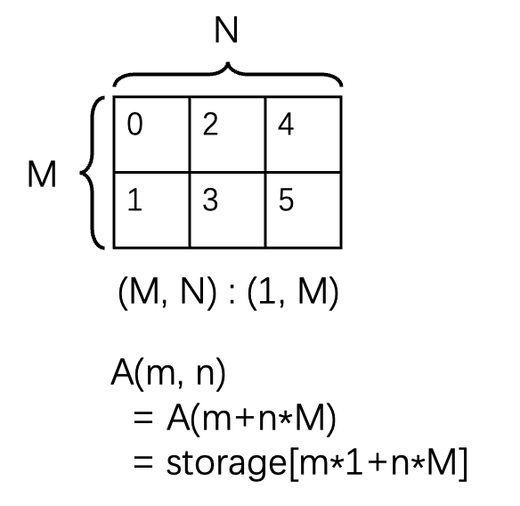
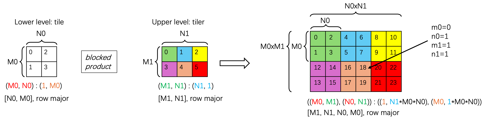
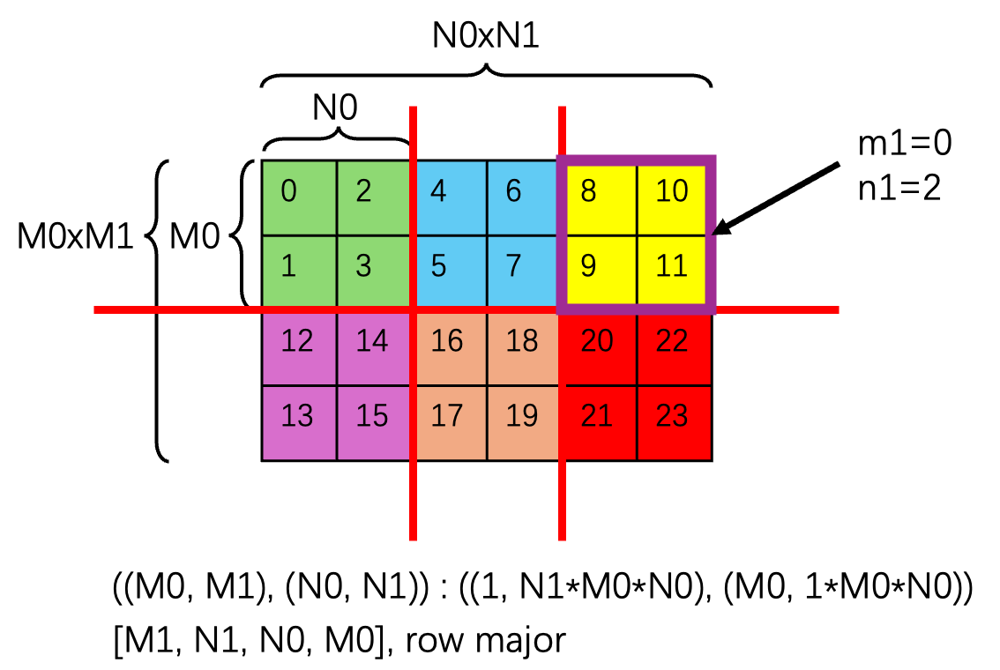

# CuTe Layout and Tensor

*Disclaimer: The content of this blog reflects my personal experiences and opinions while learning GPU programming in my own time. All information presented is publicly available and does not represent the views or positions of NVIDIA Corporation or any of its affiliates.*

## 0. Introduction

In this blog, I will introduce my understanding/interpretation of CuTe layout and tensor.
It assumes some basic understanding of CuTe layout and tensor.
You can refer to [the additional references in Sec. 9](#9-additional-references) for the basic introduction of CuTe layout and tensor.
The demo code of the operations mentioned in this blog can be found [here](https://github.com/Yang-YiFan/Yang-YiFan.github.io/tree/main/blogs/cute_layout/code).

A CuTe layout is a mapping from tensor coordinate to physical index/address in memory.
A CuTe layout consists of 2 parts: `Shape` and `Stride`. Dimension is called `mode` in CuTe. Number of dimensions is called `rank`.

## 1. Shape and Stride

Shape is the shape of the tensor in the coordinate space. `Shape<I>` means the number of elements in the `I`-th dimension. `Stride<I>` at dimension `I` means if I increment the coordinate from `i` to `i + 1`, how much I need to increment the physical index in memory.

Default stride is `LayoutLeft` i.e. column major, this means `stride[0] = 1`, and subsequet `stride` is the prefix product of the shape from left to right. `LayoutRight`, i.e. row major, means `stride[-1] = 1`, and `stride` is the prefix product of the shape from right to left.

```bash
Shape : (M, N, K)
# LayoutLeft, column major
  Stride: (1, M, M * N)
# LayoutRight, row major
  Stride: (N * K, K, 1)
```

The shorthand representation of a layout is `Shape : Stride`, e.g. `(M, N, K) : (1, M, M * N)` is a column major layout.

### 1.1 Example Layout

`A` is the logical tensor view with (natural) coordinates in the coordinate space, `storage` is the physical 1D memory layout

```bash
# This describes a 4x2 row major matrix
Shape :  (4, 2)
Stride:  (2, 1)
m = [0, 4)
n = [0, 2)
A(m, n) # natural coordinate of tensor
  = storage[m * 2 + n * 1] # physical index in memory
```



```bash
# Symbolically, this describes a MxN column major matrix
Shape:  (M, N)
Stride: (1, M)
m = [0, M)
n = [0, N)
A(m, n) # natural coordinate of tensor
  = storage[m * 1 + n * M] # physical index in memory
```

```bash
# This can still represent a 4x2 matrix
Shape:  ((2, 2), 2)
Stride: ((4, 1), 2)
m = [0, 2)
n = [0, 2)
k = [0, 2)
A((m, n), k) # natural coordinate of tensor
  = storage[m * 4 + n * 1 + k * 2] # physical index in memory
```

Natural coordinate has the same coordinate space as shape. this means if the shape is `(M, N, K)`, then we have 3 natural coordinates, `(m, n, k)`. If the shape is `(M, (N, K, L))`, then we have 4 natural coordinates, `(m, (n, k, l))`.

## 2. Coordinate Conversion

Natural coordinate is not the only way to index into a tensor. Equivalently, we can use 1D coordinate to index into a tensor. The conversion from natural coordinate to 1D coordinate is done by assigning a `LayoutLeft` to the natural coordinate shape.

```bash
Shape : (M, N, K)
Natural Coordinate Stride: (1, M, M * N)
Natural Coordinate: (m, n, k)
 = 1D Coordinate: (m + n * M + k * M * N)
```

Then you can access the tensor by using either the natural coordinate or the 1D coordinate.

```bash
# This describes a row major matrix
Shape :  (4, 2)
Stride:  (2, 1)
m = [0, 4)
n = [0, 2)
A(m, n) # natural coordinate of tensor
  = A (m + n * 4) # 1D coordinate of tensor
  = storage[m * 2 + n * 1] # physical index in memory
```

Knowing that, every CuTe layout can be viewed in 2 equivalent ways:
1. A mapping between natural coordinates (Int, Int, Int, ...) to physical index (Int) in memory.
2. A mapping between 1d coordinate (Int) to physical index (Int) in memory. We call the 1d coordinate `domain`, and the physical index `co-domain`.

### 2.1 Size and Cosize

`Size` is just the number of elements in the `domain` (i.e. 1d coordinate). `Cosize` is the number of elements in the `co-domain` (i.e. physical index).

You can also get the `Shape`, `Stride`, `Size`, `Cosize` of a specific dimension (i.e. dimension `I`) of a layout by using `shape<I>`, `stride<I>`, `size<I>`, `cosize<I>` function.

Note that the difference between `Size` and `Shape` is that a `Shape` can be a tuple (multi-dimensional), but `Size` is a single integer counting the number of elements in the multi-dimensional shape.

## 3. Coalesce (a.k.a. dimension flattening)

In certain cases, a 2d layout is equivalent to a 1d layout. In the sense that every layout is `Int->Int`, the 2d layout has the same int to int mapping as the 1d layout.

One example would be `(M, N) : (1: M)` is equivalent to `M * N : 1`. Below is the proof:

```bash
# 2d layout
Shape : (M, N)
Stride: (1, M)
m = [0, M)
n = [0, N)
A(m, n) 
  = A(m + n * M)
  = storage[m + n * M]

# 1d layout
# substitute k = m + n * M
Shape : (M * N)
Stride: (1)
k = [0, M * N)
A(k)
  = A(k)
  = storage[k]
```

So if we have a layout `(M, N) : (1, M)`, we can [coalesce](https://github.com/NVIDIA/cutlass/blob/dc4817921edda44a549197ff3a9dcf5df0636e7b/include/cute/layout.hpp#L867) (a.k.a. dimension flattening) it to `M * N : 1` by replacing the 2d coordinate `(m, n)` with `k = m + n * M`. Note that `M * N : 1` is just a 1d identity mapping between natural coordinate (Int) and physical index (Int) in memory.

According to CuTe document, there are 3 cases where we can coalesce:
1. `(s0, _1) : (d0, d1) => s0:d0`. Ignore modes with size static-1.
2. `(_1, s1) : (d0, d1) => s1:d1`. Ignore modes with size static-1.
3. `(s0, s1) : (d0, s0 * d0) => s0 * s1 : d0`. If the second mode's stride is the product of the first mode's size and stride, then they can be combined.

### 3.1 By-mode coalesce

Sometimes, you just want to coalesce a sub-layout of a layout. In this case, you should use [by-mode coalesce](https://github.com/NVIDIA/cutlass/blob/dc4817921edda44a549197ff3a9dcf5df0636e7b/include/cute/layout.hpp#L880) to preserve the original (higher level) shape of the layout.

For instance, if we have a layout `((M, N), K, L) : ((1, M), M * N, M * N * K)`, and we want to coalesce the sub-layout `(M, N) : (1, M)`, we should use `by-mode coalesce` to preserve the original 3d shape of the layout. In code what we do is `coalesce(layout, Step<_1, _1, _1>{});`. `Step<_1, _1, _1>` here means we want the resulting layout to have rank 3, because `Step<_1, _1, _1>` has rank 3. CuTe will apply coalesce to each mode separately. The value inside `Step<>` doesn't matter, only the rank of the `Step<>` matters. Then the result is `(M * N, K, L) : (1, M * N, M * N * K)`.

## 4. Blocked Product

Sometimes we want a quite complex layout, an example of that is shown below:



We have a 2d tile `(M0, N0) : (1, M0)` and we want to repeat it first along the `N` dimension `N1` times and then along the `M` dimension `M1` times to get the whole tensor on the right. And we call the layout that describes this repeat the `tiler` layout (`(M1, N1) : (N1, 1)`). As you can see from the layout, this `tiler` is row major, which means we repeat the tile along the `N` dimension first and then along the `M` dimension.

This operation is formally called [blocked product](https://github.com/NVIDIA/cutlass/blob/dc4817921edda44a549197ff3a9dcf5df0636e7b/include/cute/layout.hpp#L1750) in CuTe. The final "stacked" layout is:
```
2d tile layout: (M0, N0) : (1, M0)
tiler layout: (M1, N1) : (N1, 1)
blocked_product(2d tile, tiler)
 = (M0, N0) : (1, M0) * (M1, N1) : (N1, 1)
 = ((M0, M1), (N0, N1)) : ((1, N1*M0*N0), (M0, 1*M0*N0))
```
It's kind of intuitive to see why this is the case. Intuitively this is a 4d tensor with shape `[M1, N1, N0, M0], row major` (by doing the blocked product of `[N0, M0], row major` with `[M1, N1], row major`). But we still want to keep the illusion that this is a 2d tensor that can be indexed by `(m, n)` coordinate. So we rearrange the shape of the final layout to `((M0, M1), (N0, N1))`.

Next I will describe how we arrive at the stride of the final layout. The inner tile of `(M0, N0)` will just have stride `1` at `M0` dimension and stride `M0` at `N0` dimension, the same as the original tile layout before stacking. Then what happens to the layout of dimension `M1` and `N1`? Their strides simply get inflated by the size of the tile. We can focus on the top left element of the tile (value 0, 4, 8, 12, 16, 20 in the figure). Think about the `N1` dimension, before it was `1`, now with the tile repeat at a interval/size of `N0`, the interval between two consecutive coordinates in the `N1` dimension is `N0`. The stride for `M1` dimension is a little different, because we have to repeat the `M0 * N0` tile at the `N` dimension `N1` times first, then arrive at a new `M1`. So the interval between two consecutive coordinates in the `M1` dimension is `N1 * N0 * M0`. In this way we calculate the stride of the final layout.

More concretely what this final layout describes is:
```bash
Shape : ((M0, M1), (N0, N1))
Stride: ((1, N1*M0*N0), (M0, 1*M0*N0))
m0 = [0, M0)
m1 = [0, M1)
n0 = [0, N0)
n1 = [0, N1)
A((m0, m1), (n0, n1)) # natural/4d coordinate of tensor
  = A(m0+m1*M0, n0+n1*N0) # 2d coordinate of tensor
  = storage[m0*1+m1*N1*M0*N0+n0*M0+n1*M0*N0] # physical index in memory
```

So you can kinda view it as a 4d tensor with index `(m0, m1, n0, n1)`. But you can also view it as a 2d tensor (as shown in the figure) with index `(m, n)`, where `m` is the 1d coordinate along the `M` dimension and `n` is the 1d coordinate along the `N` dimension.

The example element pointed by the arrow in the figure is:
```bash
M0 = 2, M1 = 2, N0 = 2, N1 = 3
m0 = 0, m1 = 1, n0 = 1, n1 = 1
A((m0, m1), (n0, n1)) = A((0, 1), (1, 1)) # natural/4d coordinate of tensor
  = A(m0+m1*M0, n0+n1*N0) = A(2, 3) # 2d coordinate of tensor
  = storage[m0*1+m1*N1*M0*N0+n0*M0+n1*M0*N0] = storage[18] # physical index in memory
```

There is one final piece of the story, above is not the most succinct way to describe the final layout, i.e. the `N` dimension can be further coalesced. It's better explained by the following equation:
```bash
Shape : ((M0, M1), N0 * N1)
Stride: ((1, N1*M0*N0), M0)
m0 = [0, M0)
m1 = [0, M1)
n0 = [0, N0)
n1 = [0, N1)
# do the following substitution
n = [0, N0 * N1)
n = n0 + n1 * N0

A((m0, m1), (n0, n1)) # natural/4d coordinate of tensor
  = A((m0, m1), n) # substitute with n
  = A(m0+m1*M0, n0+n1*N0) # 2d coordinate of tensor
  = A(m0+m1*M0, n) # substitute with n
  = storage[m0*1+m1*N1*M0*N0+n0*M0+n1*M0*N0] # physical index in memory
  = storage[m0*1+m1*N1*M0*N0+n*M0] # substitute with n
```
So the final coalesced layout is `((M0, M1), N0 * N1) : ((1, N1*M0*N0), M0)`. Another way to represent this tensor is a 3d tensor with shape `[M1, N0 * N1, M0]`, row major.

### 4.1 Logical Product

[Logical product](https://github.com/NVIDIA/cutlass/blob/dc4817921edda44a549197ff3a9dcf5df0636e7b/include/cute/layout.hpp#L1669) is the primitive blocked product calls when constructing the blocked product layout. You can think of the 1d logical product as the blocked product example above but with 1d tile and tiler. This means I just want to repeat the tile along the `N` dimension `N1` times in my 1d logical product.

In theory, the blocked product we show above is just two 1d logical product that applied to `M` and `N` dimension *separately*. Because we just want to repeat `N0` `N1` times along the `N` dimension and `M0` `M1` times along the `M` dimension. But there are nuances to it. As we see above, to get the stride of `M1`, we actually need to know the size of `N0` and `N1`, which means we can't do two logical product on the two dimensions *separately* and stitch them together. Logical product in `M` dimension needs information from `N` dimension and vice versa.

So here comes the blocked product which is a special form of 2 1d logical product that takes into account the stride dependency between `M` and `N` dimension. More specifically, it takes the `M` dimension logical product first and then use the result to do the `N` dimension logical product.

## 5. Local Tile (a.k.a. Inner Partitioning/Slicing)

Often times, we want to tile/partition a tensor into smaller sub-tiles and each sub-tile is processed by a parallel agent (e.g. CTA). The most common way form of tiling is to use the [local_tile](https://github.com/NVIDIA/cutlass/blob/dc4817921edda44a549197ff3a9dcf5df0636e7b/include/cute/tensor_impl.hpp#L1031) function ([inner_partition](https://github.com/NVIDIA/cutlass/blob/dc4817921edda44a549197ff3a9dcf5df0636e7b/include/cute/tensor_impl.hpp#L978) is the official/equivalent CuTe layout algebra function).

Suppose we want to re-partition the final layout (in the blocked product example above) `((M0, M1), (N0, N1)) : ((1, N1*M0*N0), (M0, 1*M0*N0))` into many 2d sub-tiles, with each sub-tile of shape `(M0, N0)`. The figure below shows this partitioning scheme. 



After partitioning, we end up with `M1 * N1` sub-tiles (also organized in a 2d grid), with each CTA processing a sub-tile for instance. And we would want to get the sub-tile at coordinate `(m1, n1)`. The purple box in the figure shows the sub-tile at coordinate `(0, 2)`. 

The `local_tile` function first does the partitioning and then does the indexing to get the 2d sub-tile (of shape `(M0, N0)`) at coordinate `(m1, n1)`.

```bash
final_layout: ((M0, M1), (N0, N1)) : ((1, N1*M0*N0), (M0, 1*M0*N0))
tiler: Shape(M0, N0)
# A's layout is final_layout
local_tile(A, tiler, (m1, n1))
  = A[m1*M0 : (m1+1)*M0, n1*N0 : (n1+1)*N0]
  # and it maps to some address range in memory according to the layout of sub-tile
```

Two subtle things to note:
- The tiler here is not a layout but a mere tuple of shapes (i.e. `(M0, N0)`). This is because we are applying the partition to the two dimensions independently, they don't interact with each other. Hence the tiler is just a tuple of shapes.
- This `local_tile` is not necessarily the reverse process of `blocked_product`. I can partition the tensor A differently from how I compose them in `blocked_product`, meaning `M0, N0` are not necessarily the same in `local_tile` as in `blocked_product`.

## 6. Static vs Dynamic Integer

In CuTe, there are two types of integer: static integer (like `_1{}` or `cute::Int<2>{}`) and dynamic integer (like `3`). Static integer is a compile time constant and dynamic integer is a runtime variable. The more the compile time constant, the better the compiler can reason about the code and optimize it.

Normally dynamic integer is interchangeable with static integer, with two "exceptions":
1. Use static integers whenever possible, it is an optimization and enables other portions of code to analyze and prove their sections better. For example, the entire TMA descriptor, partitioning, certain TMA invariants due to arch, etc. can only takes certain shape of tensor tile. So it's good to have those shape to be static/compile tile so compiler can reason about whether it can be implemented on the target arch or not. MMA is similar.
2. Rule of thumb: RMEM/SMEM/TMEM is always a static layout.

## 7. PyTorch Tensor Layout in CuTe Terminology

Dealing with tensor layout is one of the most nasty things in PyTorch. But thanks to CuTe, all the PyTorch tensor can be unambiguously/cleanly represented.

### 7.1 Tensor Creation

By default, if you create a new multi-dimensional tensor in PyTorch, it will be a `RowMajor` layout in PyTorch terminology. This means the tensor will have a `LayoutRight` stride, meaning the last dimension is the fastest changing/contiguous dimension. And the first dimension is the slowest changing dimension.

```python
A = torch.randn(M, N, K)
# layout of A is (M, N, K) : (K * N, K, 1)
```

### 7.2 Transpose/Permute

Transpose/Permute only changes the `Shape` of the tensor, it doesn't change the underlying storage, which means the `Stride` of each mode remains unchanged. Another way to put it is it changes the coordinate space of the tensor, it's still the same tensor but you index into it differently.

```python
A = torch.randn(M, N)
# layout of A is (M, N) : (N, 1), i.e. row major
# i.e. A(m, n) = storage[m * N + n]
B = A.T
# layout of B is (N, M) : (1, N), i.e. column major
# i.e. B(n, m) = storage[n + m * N]
```

### 7.3 Contiguous

Contiguous changes the storage of the tensor, it forces the current tensor to be `LayoutRight`. This means if the current tensor doesn't have `LayoutRight`, there will be a new tensor created with the same `Shape` but with `LayoutRight` stride. It involves copying the data from the original tensor to the new tensor.

```python
A = torch.randn(M, N)
# layout of A is (M, N) : (1, M), i.e. column major
# i.e. A(m, n) = storage[m + n * M]
B = A.contiguous()
# layout of B is (M, N) : (N, 1), i.e. row major
# i.e. B(m, n) = new_storage[m * N + n]
```

## 8. Summary

In this blog, we covered the basics of CuTe layout and some common operations on CuTe tensor:
- A layout consists of `Shape` and `Stride`.
- Layout is a mapping between natural coordinate and physical index in memory.
- A layout can be potentially coalesced/flattened.
- Blocked product stacks a tensor along multiple dimensions.
- Local tile is a way to partition a tensor into smaller sub-tiles.
- Static integer is a compile time constant and dynamic integer is a runtime variable.
- How various PyTorch tensor operations are represented in CuTe terminology.

We will explore more advanced topics such as composition, TV layout, swizzle, etc. in future blogs.

## 9. Additional References

- [CuTe doc 01_layout](https://github.com/NVIDIA/cutlass/blob/main/media/docs/cpp/cute/01_layout.md)
- [CuTe doc 02_layout_algebra](https://github.com/NVIDIA/cutlass/blob/main/media/docs/cpp/cute/02_layout_algebra.md)
- [CuTe doc 03_tensor](https://github.com/NVIDIA/cutlass/blob/main/media/docs/cpp/cute/03_tensor.md)
- [Cris's GPU mode lecture](https://www.youtube.com/watch?v=vzUhbDO_0qk)
- [Reed's CuTe layout](https://zhuanlan.zhihu.com/p/661182311?share_code=13uvWcueISjqE&utm_psn=1913616166766752233)
- [Reed's CuTe layout algebra](https://zhuanlan.zhihu.com/p/662089556?share_code=gel76ytGUPlR&utm_psn=1913616314892787996)
- [Reed's CuTe tensor](https://zhuanlan.zhihu.com/p/663093816?share_code=14HT1EdQkRomY&utm_psn=1913616468853121482)