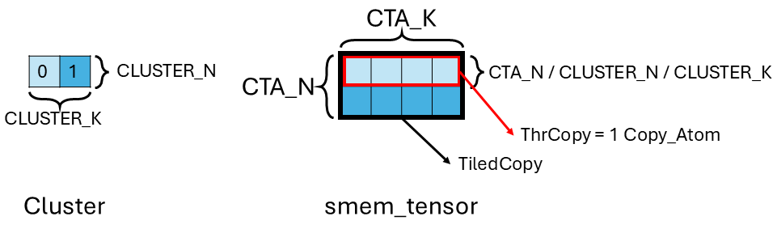
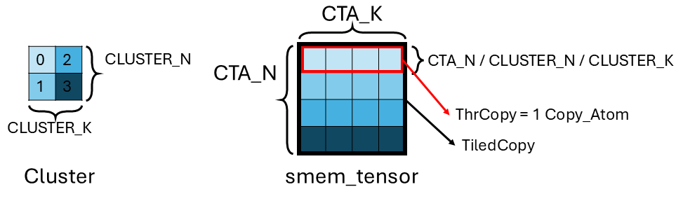

# Using TMA Load, Prefetch, and Multicast Load in Cute

*Disclaimer: The content of this blog reflects my personal experiences and opinions while learning GPU programming in my own time. All information presented is publicly available and does not represent the views or positions of NVIDIA Corporation or any of its affiliates.*

In this blog, I will show how to [load (Sec. 3)](#3-tma-load), [prefetch (Sec. 4)](#4-tma-prefetch) and [multicast load (Sec. 5)](#5-tma-multicast-load) a tensor using TMA in Cute. All the code in this blog can be found [here](https://github.com/Yang-YiFan/Yang-YiFan.github.io/tree/main/blogs/cute_tma/code).

**[UPDATE]** The new [cute_dsl](https://docs.nvidia.com/cutlass/media/docs/pythonDSL/cute_dsl.html) comes out. I wrote a simple [tma copy kernel](https://github.com/Yang-YiFan/Yang-YiFan.github.io/tree/main/blogs/cute_tma/code/cute_tma.py) example in cute dsl since there is still no simple example available online. It uses the newer [`tma_partition`](https://github.com/NVIDIA/cutlass/blob/dc4817921edda44a549197ff3a9dcf5df0636e7b/include/cute/atom/copy_traits_sm90_tma.hpp#L1354) API as opposed to the older one introduced in this blog. But they are functionally equivalent. I annotated the cute dsl code to explain the usage of the new API.

The [Tensor Memory Accelerator (TMA)](https://developer.nvidia.com/blog/nvidia-hopper-architecture-in-depth/) is a hardware unit introduced in the NVIDIA Hopper architecture to accelerate tensor data movement. To formally motivate TMA, we need to wind the clock back a bit to Volta.

## 1. Why TMA?

As the tensor core goes faster, it needs enough data to keep it busy. Using little's law: $\text{throughput} = \frac{\text{buffer\_size}}{\text{latency}}$, if we increase the (tensor core) throughput and keep the latency equal, we'd need more staging buffer capacity. 


The figure above shows the sequence of operation when feeding the data to the tensor core. In Volta, the load sequence is `DRAM->L2->L1->RF->shared memory(smem)->RF->tensor core`. The RF/smem/L1/L2 all serve as staging buffer area when feeding the data to the tensor core. While the L2 and smem hold the loaded data tiles, the RF and L1 purely serve the role of staging buffer. Increasing tensor core throughput adds significant staging buffer (RF/L1) usage. So Ampere introduces [asyn memory copy](https://developer.nvidia.com/blog/nvidia-ampere-architecture-in-depth/) to eliminate the extra staging buffer usage in RF/L1. As shown in the figure above, load completely bypasses RF/L1 such that the new sequence becomes `DRAM->L2->shared memory(smem)->RF->tensor core`. This frees up RF/L1 so that they can be used for other computation.

At this point, it seems like we solve the bandwidth and capacity issue in the memory subsystem. We can make the tensor core go even faster. However, the throughput of other stages need to keep up with the tensor core. At a high level, the computation of a typical gemm kernel can roughly be described as `address generation->load->tensor core (MMA)->epilog (e.g. ReLU, softmax)->address generation->store`. Now let's try to make the kernel run faster. We bump up the tensor core throughput, the MMA stage becomes faster. We bump up the memory bandwidth along with the async memory copy optimization, the load/store stage becomes faster. The throughput of all the stages need to match. Therefore, we need to bump up the throughput of the *address generation* and *epilog* stage. Notice that these two stages both use the *CUDA core* and its throughput stays largely the same. Then we hit a problem, the throughput of the CUDA cores limits the overall throughput of the kernel. This is where TMA comes in. TMA offloads the address generation from the CUDA core. It by itself can generate addresses at a high throughput, matching the throughput of the rest of the stages. With this offloading, the entire CUDA core can be dedicated to the epilog stage, achieving higher throughput of the epilog stage. With the introduction of the TMA, now every stage of the gemm kernel can run at a high throughput.

## 2. What are the ways to use TMA?

Using the TMA can be tricky, there are several options:
1. one can directly use the [CUDA APIs](https://docs.nvidia.com/cuda/cuda-c-programming-guide/index.html#tensor-memory-access) but it's low level and error-prone. 
2. [Triton](https://pytorch.org/blog/hopper-tma-unit/) adds experimental support for TMA but if you care about squeezing the last percentage of performance (I do :)), you might want to have finer grain control of the kernel.
3. [Cute](https://github.com/NVIDIA/cutlass/tree/main/media/docs/cute) fortunately offers a high-level abstraction to use TMA with enough lower level control.  

In this blog, I will show how to [load (Sec. 3)](#3-tma-load), [prefetch (Sec. 4)](#4-tma-prefetch) and [multicast load (Sec. 5)](#5-tma-multicast-load) a tensor using TMA in Cute. Some basic understanding of Cute is required. We leave the more advanced topics like store, reduction, and swizzle for future blogs.

## 3. TMA Load

### 3.1 Walkthrough Example

We will walk through an example on how to use TMA to [load](https://docs.nvidia.com/cuda/parallel-thread-execution/#data-movement-and-conversion-instructions-cp-async-bulk-tensor) a matrix (2d tensor) from global memory (gmem) to shared memory (smem). The figure below shows the shape and layout of the matrix `gmem_tensor`. It's `[N, K]` (`[6, 8] in the example`) and `rowMajor`. A common thing one would want to do is for one CTA (aka threadblock) to load a tile of the matrix. In out example, we want to tile the `gmem_tensor` into tiles of shape `[CTA_N, CTA_K]` (`[2, 4]`) and `rowMajor`. And each CTA loads a tile into smem. Then we need `[N/CTA_N, K/CTA_K]=[gridDim.x, gridDim.y]` (`[6/2, 8/4]=[3,2]`) CTA to achieve this. 

In the example figure below, we have CTA at `(1,1)` in the grid to load the blue tile in `gmem_tensor` to smem.

You can totally imagine the tile to CTA mapping to be different for different applications/implementations. For example, CTA0 loads tile `(0, 0), (2, 1)`, CTA1 loads tile `(0, 1), (2, 0)`, CTA2 loads tile `(1, 0), (1, 1)`. Here we just showcase one example mapping and it's straightforward to modify the code for other mappings.


### 3.2 Host Code

Now we have all the information we need to construct the host side code.

```c++
template <typename T, int CTA_N, int CTA_K>
void cute_host_load(T* data, int N, int K) {
    using namespace cute;

    // 1. create the gmem tensor, row major
    auto gmem_layout = make_layout(make_shape(N, K), make_stride(K, 1));
    auto gmem_tensor = make_tensor(make_gmem_ptr(data), gmem_layout);

    // 2. create the smem layout, row major
    // smem_layout need to use static integer
    // use dynamic integer will cause compilation error
    auto smem_layout = make_layout(make_shape(Int<CTA_N>{}, Int<CTA_K>{}), make_stride(Int<CTA_K>{}, _1{}));

    // 3. create the TMA object
    auto tma_load = make_tma_copy(SM90_TMA_LOAD{}, gmem_tensor, smem_layout);

    // 4. invoke the kernel
    cute_tma_load_kernel<T, CTA_N, CTA_K>
                    <<<dim3{N / CTA_N, K / CTA_K, 1}, 32>>>
                    (tma_load, gmem_tensor, smem_layout);
}
```

Let's break it down:
1. We first create the `gmem_tensor` with shape `[N, K]` and stride `[K, 1]` (i.e. `rowMajor`).
2. Then we create the `smem_layout` with shape `[CTA_N, CTA_K]` and stride `[CTA_K, 1]` (i.e. `rowMajor`). The only thing to note here is the smem related object should use static integer like `cute::_1{}` to avoid compilation error.
3. Using the `gmem_tensor` pointer and layout along with the `smem_layout`, we create a TMA `Copy_Atom` using [make_tma_copy()](https://github.com/NVIDIA/cutlass/blob/b0e09d7cd371eded41f7c1e057caf1593c27ba55/include/cute/atom/copy_traits_sm90_tma.hpp#L1290). Underneath, it creates the TMA descriptor (which the user can also use lower level [CUDA APIs](https://docs.nvidia.com/cuda/cuda-c-programming-guide/index.html#tensor-memory-access) to create). The type of TMA operation (e.g. load/store/prefetch) is specified by the `CopyOp` [SM90_TMA_LOAD](https://github.com/NVIDIA/cutlass/blob/b0e09d7cd371eded41f7c1e057caf1593c27ba55/include/cute/arch/copy_sm90_tma.hpp#L277). The name is pretty straightforward, it's a load that uses TMA on SM90 (i.e. hopper). We will discuss the TMA `Copy_Atom` construction process in detail in [Sec. 3.4.1](#341-copy_atom-construction).
4. Finally, we invoke the kernel by passing the various object we initialized in the host function to the kernel. We also specifies the `gridDim` (`dim3{N / CTA_N, K / CTA_K, 1}`) and `blockDim` (`32` since TMA only needs 1 thread to drive).

### 3.3 Device Code


```c++
// assume load a [N, K] row major weight matrix
template <typename T, int CTA_N, int CTA_K, class TmaLoad, class GmemTensor, class SmemLayout>
__global__ void cute_tma_load_kernel(__grid_constant__ const TmaLoad tma_load, GmemTensor gmem_tensor, SmemLayout smem_layout) {
    using namespace cute;
    constexpr int tma_transaction_bytes = CTA_N * CTA_K * sizeof(T);

    // 1. allocate smem for the tile and memory barrier
    __shared__ T smem_data[CTA_N * CTA_K];
    __shared__ uint64_t tma_load_mbar;

    // 2. create the smem tensor
    auto smem_tensor = make_tensor(make_smem_ptr(smem_data), smem_layout); // [CTA_N, CTA_K]

    // 3. only need 1 thread to drive TMA
    if (threadIdx.x == 0) {
        // 4. initialize the barrier
        initialize_barrier(tma_load_mbar, /* arrival count */ 1);
        set_barrier_transaction_bytes(tma_load_mbar, tma_transaction_bytes);

        // 5. gets the coordinate of the smem tile in gmem tensor
        auto gmem_tensor_coord = tma_load.get_tma_tensor(shape(gmem_tensor));
        auto gmem_tensor_coord_cta = local_tile( // [CTA_N, CTA_K]
            gmem_tensor_coord,
            Tile<Int<CTA_N>, Int<CTA_K>>{},
            make_coord(blockIdx.x, blockIdx.y));

        // 6. get the slice of TMA work assigned to this CTA in a threadblock cluster 
        auto tma_load_per_cta = tma_load.get_slice(0);
        // 7. issue TMA load
        copy(tma_load.with(tma_load_mbar),
            tma_load_per_cta.partition_S(gmem_tensor_coord_cta), // [[ATOM_N, ATOM_K], CTA_N/ATOM_N, CTA_K/ATOM_K]
            tma_load_per_cta.partition_D(smem_tensor)); // [[ATOM_N, ATOM_K], CTA_N/ATOM_N, CTA_K/ATOM_K]
    }
    // 8. wait for TMA to finish
    __syncthreads();
    wait_barrier(tma_load_mbar, /* phase */ 0);

    // 9. after this line, the TMA load is finished
    if (threadIdx.x == 0) {
        printf("block: (%d, %d), value: %f, %f\n", blockIdx.x, blockIdx.y, float(smem_tensor(make_coord(0, 0))), float(smem_tensor(make_coord(0, 1))));
    }
}
```

Note that the `tma_load` needs to be `__grid_constant__` since the TMA descriptor is created on the host and pass to the device. It can't be modified on device.

Let's break the code down with the help of the figure above:
1. We first allocate the smem space for the tile to be loaded (`smem_data`) and the [mbarrier](https://docs.nvidia.com/cuda/parallel-thread-execution/#parallel-synchronization-and-communication-instructions-mbarrier) `tma_load_mbar`.
2. Then we create the `smem_tensor` using the smem pointer and layout.
3. Only 1 thread is needed to drive the TMA load.
4. Here we initialize the barrier. Because the TMA is an async unit, the CTA needs a way to get notified when the data transfer is done. We do this through [mbarrier](https://docs.nvidia.com/cuda/parallel-thread-execution/#parallel-synchronization-and-communication-instructions-mbarrier) (refer to the PTX doc to learn more about mbarrier). We first call [initialize_barrier()](https://github.com/NVIDIA/cutlass/blob/b0e09d7cd371eded41f7c1e057caf1593c27ba55/include/cute/arch/copy_sm90_desc.hpp#L64) with expected arrive count 1. Because we will have 1 thread (e.g. the same thread) to arrive on the barrier and set the barrier transaction count for the TMA in [set_barrier_transaction_bytes()](https://github.com/NVIDIA/cutlass/blob/b0e09d7cd371eded41f7c1e057caf1593c27ba55/include/cute/arch/copy_sm90_desc.hpp#L78).
5. Now we obtain the `gmem_tensor_coord` through [get_tma_tensor()](https://github.com/NVIDIA/cutlass/blob/b0e09d7cd371eded41f7c1e057caf1593c27ba55/include/cute/atom/copy_traits_sm90_tma.hpp#L153). This will give us a tensor with the same layout as `gmem_tensor`. But each entry, instead of the value, is the *coordinate* in the tensor as shown in the figure above. Then [local_tile()](https://github.com/NVIDIA/cutlass/blob/b0e09d7cd371eded41f7c1e057caf1593c27ba55/include/cute/tensor_impl.hpp#L1016) tiles `gmem_tensor_coord` and returns us a tile `gmem_tensor_coord_cta` (e.g. blue tile) that the CTA wants to load from. The second argument specifies the tile size (i.e. `[CTA_N, CTA_K]`) we want to tile the big tensor with. The third argument specifies which tile we want to get. It does that by passing the coordinate (`[blockIdx.x, blockIdx.y]`) of the tile in the tile space to `local_tile()`. The numpy way to write it would be `gmem_tensor_coord[CTA_N * blockIdx.x : CTA_N * (blockIdx.x + 1), CTA_K * blockIdx.y : CTA_K * (blockIdx.y + 1)]`. To be more concrete, to get the blue tile in the figure, we do `local_tile(gmem_tensor_coord, Tile<Int<2>, Int<4>>{}, make_coord(1, 1))`. We tile `gmem_tensor_coord` by `[2, 4]` tile size and wants to get the tile at coordinate `(1, 1)`. 
6. Now we get a slice ([ThrCopy](https://github.com/NVIDIA/cutlass/blob/b0e09d7cd371eded41f7c1e057caf1593c27ba55/include/cute/atom/copy_atom.hpp#L338)) of the TMA `Copy_Atom` (using function [get_slice()](https://github.com/NVIDIA/cutlass/blob/b0e09d7cd371eded41f7c1e057caf1593c27ba55/include/cute/atom/copy_atom.hpp#L322)) that is assigned to this CTA. This is only relevant if you are in a [threadblock cluster](https://docs.nvidia.com/cuda/cuda-c-programming-guide/#thread-block-clusters) and the TMA `Copy_Atom` is responsible for the load of entire cluster (with multicasting). Here we only have 1 CTA for the TMA and no threadblock cluster so there is just 1 slice. This is similar to how you get a thread slice of MMA from a TiledMMA (and set the fragment etc.). Here we are getting a CTA slice of the TMA from a tiled TMA in a threadblock cluster. We describe this hierarchy in more details in [Sec. 3.4.1](#341-copy_atom-construction).
7. The [copy()](https://github.com/NVIDIA/cutlass/blob/b0e09d7cd371eded41f7c1e057caf1593c27ba55/include/cute/algorithm/copy.hpp#L240) function issues the TMA load. It is one of the [Cute built-in algorithms](https://github.com/NVIDIA/cutlass/blob/main/media/docs/cute/04_algorithms.md) that operates on tensors (other examples are MMA and prefetch). At a high level, `with()` passes the mbarrier to the TMA `Copy_Atom`. `partition_S` and `partition_D` reshapes the smem and gmem tile into the shape the copy function expects. We will have a detailed discussion of how each argument is constructed in [Sec. 3.4.2](#342-the-arguments-of-the-copy-function).
8. Now that we issued the TMA load, we will wait for it to finish. To do this, we first `__syncthreads();` so that every thread arrives at the wait point. Then all the threads [wait_barrier()](https://github.com/NVIDIA/cutlass/blob/b0e09d7cd371eded41f7c1e057caf1593c27ba55/include/cute/arch/copy_sm90_desc.hpp#L92) on the `tma_load_mbar`. The wait is completed when the [phase](https://docs.nvidia.com/cuda/parallel-thread-execution/#parallel-synchronization-and-communication-instructions-mbarrier-phase) of the barrier flips. The initial phase is 0 during [initialization](https://docs.nvidia.com/cuda/parallel-thread-execution/#parallel-synchronization-and-communication-instructions-mbarrier-init). The second argument of `wait_barrier()` is the current phase bit the barrier waiting to flip. We are waiting for phase 0 to flip, hence 0 is passed in. The TMA unit would decrement the transaction count of the barrier once the loads come back until it reaches 0, meaning all load finishes. Then the barrier flips, all threads' wait is done. We resume execution.
9. At this point, the TMA load is done and load result is in smem and fully visible to all threads. Here we simply print some elements out.

### 3.4 The Life of the Copy Function

For the curious minds, this entire section is dedicated to explain how the copy function works underneath. You can skip to the [harness code (Sec. 3.5)](#35-harness-code) if you are only interested in how to use TMA.

The [copy()](https://github.com/NVIDIA/cutlass/blob/b0e09d7cd371eded41f7c1e057caf1593c27ba55/include/cute/algorithm/copy.hpp#L240) function is one of the [Cute built-in algorithms](https://github.com/NVIDIA/cutlass/blob/main/media/docs/cute/04_algorithms.md) that copies a tensor from the source location to destination location. We are using the three input argument variant where we specify a `Copy_Atom`, the `src` tensor and `dst` tensor. By specifying the `Copy_Atom`, we call tell the compiler explicitly which type of copy we want (e.g. Ampere `cp.async`, Hopper TMA, etc.). There is also a [two input copy variant](https://github.com/NVIDIA/cutlass/blob/b0e09d7cd371eded41f7c1e057caf1593c27ba55/include/cute/algorithm/copy.hpp#L290) where only the source and destination tensor are passed in so that the copy operation falls back to the default algorithm.

#### 3.4.1 `Copy_Atom` Construction

[make_tma_copy()](https://github.com/NVIDIA/cutlass/blob/b0e09d7cd371eded41f7c1e057caf1593c27ba55/include/cute/atom/copy_traits_sm90_tma.hpp#L1290) constructs the `Copy_Atom`. The sequence of operation is similar to creating a [TiledMMA](https://github.com/NVIDIA/cutlass/blob/b0e09d7cd371eded41f7c1e057caf1593c27ba55/media/docs/cute/0t_mma_atom.md), i.e. from bottom up `CopyOp->Copy_Traits->Copy_Atom->TiledCopy`. The `CopyOp`, `Copy_Traits`, `Copy_Atom` are all warpers over a PTX copy operation but gradually embed more meta data information in the struct (`CopyOp` has the least and `Copy_Atom` is the most complete). And then [TiledCopy](https://github.com/NVIDIA/cutlass/blob/b0e09d7cd371eded41f7c1e057caf1593c27ba55/include/cute/atom/copy_atom.hpp#L138) (which confusingly is a derived class of `Copy_Atom`) stacks multiple [Copy_Atom](https://github.com/NVIDIA/cutlass/blob/b0e09d7cd371eded41f7c1e057caf1593c27ba55/include/cute/atom/copy_atom.hpp#L52) together to create a larger macro-operation. In the particular case of TMA, a `Copy_Atom` is responsible for the TMA operation of a CTA (in a [threadblock cluster](https://docs.nvidia.com/cuda/cuda-c-programming-guide/#thread-block-clusters)), and a `TiledCopy` is responsible for all TMA operations of the entire threadblock cluster. In our simple example, since there is only 1 CTA in a threadblock cluster, the `Copy_Atom` size (`[CTA_N, CTA_K]`) should be identical to the `TiledCopy` size.

The actual call stack is shown below:
- [make_tma_copy()](https://github.com/NVIDIA/cutlass/blob/b0e09d7cd371eded41f7c1e057caf1593c27ba55/include/cute/atom/copy_traits_sm90_tma.hpp#L1290), because in our example we don't use [TMA multicast load](https://github.com/NVIDIA/cutlass/blob/b0e09d7cd371eded41f7c1e057caf1593c27ba55/include/cute/arch/copy_sm90_tma.hpp#L706), we use the initialization function with threadblock cluster size 1.
  - [make_tma_copy()](https://github.com/NVIDIA/cutlass/blob/b0e09d7cd371eded41f7c1e057caf1593c27ba55/include/cute/atom/copy_traits_sm90_tma.hpp#L1260) is the underlying implementation where we create a [TiledCopy](https://github.com/NVIDIA/cutlass/blob/b0e09d7cd371eded41f7c1e057caf1593c27ba55/include/cute/atom/copy_atom.hpp#L138) object. 
    - [make_tma_copy_tiled()](https://github.com/NVIDIA/cutlass/blob/b0e09d7cd371eded41f7c1e057caf1593c27ba55/include/cute/atom/copy_traits_sm90_tma.hpp#L1136) is broadly broken down into two steps:
      - [make_tma_copy_atom()](https://github.com/NVIDIA/cutlass/blob/b0e09d7cd371eded41f7c1e057caf1593c27ba55/include/cute/atom/copy_traits_sm90_tma.hpp#L1081) that creates the [Copy_Atom](https://github.com/NVIDIA/cutlass/blob/b0e09d7cd371eded41f7c1e057caf1593c27ba55/include/cute/atom/copy_atom.hpp#L52) for a CTA. In it we first define the [Copy_Traits](https://github.com/NVIDIA/cutlass/blob/b0e09d7cd371eded41f7c1e057caf1593c27ba55/include/cute/atom/copy_traits_sm90_tma.hpp#L1110) from the `CopyOp` (i.e. [SM90_TMA_LOAD](https://github.com/NVIDIA/cutlass/blob/b0e09d7cd371eded41f7c1e057caf1593c27ba55/include/cute/arch/copy_sm90_tma.hpp#L277)). Then we construct the `Copy_Atom` from `Copy_Traits`.
      - [TiledCopy()](https://github.com/NVIDIA/cutlass/blob/b0e09d7cd371eded41f7c1e057caf1593c27ba55/include/cute/atom/copy_atom.hpp#L138) that stacks `Copy_Atom` of each CTA into a `TiledCopy` for the entire threadblock cluster.


#### 3.4.2 The Arguments of the Copy Function

As we presented above, the [copy()](https://github.com/NVIDIA/cutlass/blob/b0e09d7cd371eded41f7c1e057caf1593c27ba55/include/cute/algorithm/copy.hpp#L240) function takes three arguments: the `Copy_Atom`, the `src` tensor and `dst` tensor. However, we can't pass what we currently have to the copy function, there are some nuances that we explain below.

1. `Copy_Atom`: Remember the TMA unit needs the [mbarrier](https://docs.nvidia.com/cuda/parallel-thread-execution/#parallel-synchronization-and-communication-instructions-mbarrier) to synchronize with the CTA, we have never passed the mbarrier handle to the TMA `Copy_Atom` yet! It is called an *non-executable* `Copy_Atom`. This is where `tma_load.with(tma_load_mbar)` comes into play. The [with](https://github.com/NVIDIA/cutlass/blob/b0e09d7cd371eded41f7c1e057caf1593c27ba55/include/cute/atom/copy_atom.hpp#L80) (which eventually got dispatched [here](https://github.com/NVIDIA/cutlass/blob/b0e09d7cd371eded41f7c1e057caf1593c27ba55/include/cute/atom/copy_traits_sm90_tma.hpp#L129)) embeds the mbarrier information into the `Copy_Traits` and therefore creates an *executable* `Copy_Atom`. As you can see from the function definition, you can also embed information like L2 cache hint to the `Copy_Atom`.
2. `src` tensor: We do a *source partition* of the tensor (i.e. [partition_S()](https://github.com/NVIDIA/cutlass/blob/b0e09d7cd371eded41f7c1e057caf1593c27ba55/include/cute/atom/copy_atom.hpp#L348)). This means we reshape the source tensor layout from `[CTA_N, CTA_K]` to `[[ATOM_N, ATOM_K], CTA_N/ATOM_N, CTA_K/ATOM_K]`. This layout is what the `copy()` function expects. `[ATOM_N, ATOM_K]` is the TMA `Copy_Atom` size (also commonly referred to as `[TMA]` in the code comment, and `[CTA_N/ATOM_N, CTA_K/ATOM_K]` is referred as `[TMA_N, TMA_K]` in the code comment). So in theory, the copy is broken down into `CTA_N/ATOM_N*CTA_K/ATOM_K` number of steps with each step copying `[ATOM_N, ATOM_K]`. In practice, the `Copy_Atom` size is the entire tile, i.e. `[TMA_N, TMA_K]=[CTA_N, CTA_K]`, so there is only 1 atom/step in the copy, i.e. the src tensor has been reshaped to `[[ATOM_N, ATOM_K], 1, 1]`. You can also verify this by printing out the partitioned src tensor using `cute::print()`.
3. `dst` tensor: We do a *destination partition* of the tensor (i.e. [partition_D()](https://github.com/NVIDIA/cutlass/blob/b0e09d7cd371eded41f7c1e057caf1593c27ba55/include/cute/atom/copy_atom.hpp#L358)) similar to src tensor. This means we reshape the destination tensor layout from `[CTA_N, CTA_K]` to `[[ATOM_N, ATOM_K], CTA_N/ATOM_N, CTA_K/ATOM_K]`.

#### 3.4.3 Dispatch Sequence of the Copy Function

1. [copy()](https://github.com/NVIDIA/cutlass/blob/b0e09d7cd371eded41f7c1e057caf1593c27ba55/include/cute/algorithm/copy.hpp#L240) is the top level interface.
2. [copy_if()](https://github.com/NVIDIA/cutlass/blob/b0e09d7cd371eded41f7c1e057caf1593c27ba55/include/cute/algorithm/copy.hpp#L158) is the predicated version of the copy function. [This](https://github.com/NVIDIA/cutlass/blob/b0e09d7cd371eded41f7c1e057caf1593c27ba55/include/cute/algorithm/copy.hpp#L171) is where we loop around `CTA_N/ATOM_N*CTA_K/ATOM_K` steps with each step finishing 1 `Copy_Atom` size work.
3. [copy_atom.call()](https://github.com/NVIDIA/cutlass/blob/b0e09d7cd371eded41f7c1e057caf1593c27ba55/include/cute/atom/copy_atom.hpp#L94) calls the actual `Copy_Atom`.
4. [copy_unpack()](https://github.com/NVIDIA/cutlass/blob/b0e09d7cd371eded41f7c1e057caf1593c27ba55/include/cute/atom/copy_traits_sm90_tma.hpp#L68) unpacks the `Copy_Traits` and pass some additional traits into the copy function.
5. [CallCOPY()](https://github.com/NVIDIA/cutlass/blob/b0e09d7cd371eded41f7c1e057caf1593c27ba55/include/cute/arch/util.hpp#L154) calls the actual `CopyOp::copy` using [explode()](https://github.com/NVIDIA/cutlass/blob/b0e09d7cd371eded41f7c1e057caf1593c27ba55/include/cute/arch/util.hpp#L181) for passing in additional arguments.
6. [SM90_TMA_LOAD::copy()](https://github.com/NVIDIA/cutlass/blob/b0e09d7cd371eded41f7c1e057caf1593c27ba55/include/cute/arch/copy_sm90_tma.hpp#L287) function of CopyOp [SM90_TMA_LOAD](https://github.com/NVIDIA/cutlass/blob/b0e09d7cd371eded41f7c1e057caf1593c27ba55/include/cute/arch/copy_sm90_tma.hpp#L277C8-L277C21) is called because we are copying a 2D tensor and provides 2 coordinates, which are the coordinates of the top left corner of the blue tile in `gmem_tensor` coordinate space, `[2, 4]` in the figure.
7. [SM90_TMA_LOAD_2D::copy()](https://github.com/NVIDIA/cutlass/blob/b0e09d7cd371eded41f7c1e057caf1593c27ba55/include/cute/arch/copy_sm90_tma.hpp#L96), finally the 2D variants of the [TMA Load PTX instruction](https://docs.nvidia.com/cuda/parallel-thread-execution/#data-movement-and-conversion-instructions-cp-async-bulk-tensor) is called.

#### 3.4.4 How Are All the Arguments Passed to the PTX Instruction?

Take [SM90_TMA_LOAD_2D::copy()](https://github.com/NVIDIA/cutlass/blob/b0e09d7cd371eded41f7c1e057caf1593c27ba55/include/cute/arch/copy_sm90_tma.hpp#L96) for example, it takes in TMA descriptor, membar, etc. as arguments, which are unpacked in [copy_unpack()](https://github.com/NVIDIA/cutlass/blob/b0e09d7cd371eded41f7c1e057caf1593c27ba55/include/cute/atom/copy_traits_sm90_tma.hpp#L68). Here we only focus on explaining how the [crd](https://github.com/NVIDIA/cutlass/blob/b0e09d7cd371eded41f7c1e057caf1593c27ba55/include/cute/arch/copy_sm90_tma.hpp#L98) are unpacked and leave the rest as an exercise to the reader.

The coordinate of the TMA tile is obtained from [src.data().coord_](https://github.com/NVIDIA/cutlass/blob/b0e09d7cd371eded41f7c1e057caf1593c27ba55/include/cute/atom/copy_traits_sm90_tma.hpp#L72) and [explode()](https://github.com/NVIDIA/cutlass/blob/b0e09d7cd371eded41f7c1e057caf1593c27ba55/include/cute/arch/util.hpp#L181) eventually unpacks it as `(..., int32_t const& crd0, int32_t const& crd1)`. Remember the src tensor is `gmem_tensor_coord` which holds all the coordinates of the smem tile in gmem. It is an `ArithTuple` and the [Cute doc](https://github.com/NVIDIA/cutlass/blob/b0e09d7cd371eded41f7c1e057caf1593c27ba55/media/docs/cute/0z_tma_tensors.md) explains it in greater details. 

Basically `gmem_tensor_coord` is a tensor purely for getting the coordinates of the TMA tile (e.g. the blue tile) and pass it to the TMA instruction. In our Cute code, we might want to reshape (i.e. `partition_D()`) or tile the `smem_tensor`. It is very error-prone to manually updating the gmem coordinate to keep track of the `smem_tensor` manipulation. So we simply creates gmem coordinate tensor and manipulate it in exactly the same way. Then the eventual coordinate will always be in sync with `smem_tensor`. We never materialize the coordinate tensor in gmem though, we only manipulate it (reshape/tile, etc.), hence the prefix `Arith`. 

### 3.5 Harness Code

```c++
// 1. Define TMA load tile size
static constexpr int TILE_N = 64;
static constexpr int TILE_K = 128;

int main() {
    // 2. Define problem size and tensors
    int N = 256;
    int K = 256;

    // we assume this is a [N, K] row major matrix
    cutlass::HostTensor<cutlass::float_e4m3_t, cutlass::layout::RowMajor> B({N, K});

    // 3. init some value on host for B tensor and copy it to GPU memory
    // ...

    B.sync_device();

    // 4. do TMA load to smem
    cute_host_load<cutlass::float_e4m3_t, TILE_N, TILE_K>(B.device_data(), N, K);

    // 5. wait for kernel to complete
    cudaDeviceSynchronize();

    return 0;
}
```

The harness function is pretty straightforward:
1. We first define the tile size (i.e. `CTA_N` and `CTA_K`) we want for each CTA's TMA load
2. Then we define the `gmem_tensor` layout. Here we use the slightly older [HostTensor](https://github.com/NVIDIA/cutlass/blob/b0e09d7cd371eded41f7c1e057caf1593c27ba55/tools/util/include/cutlass/util/host_tensor.h#L65) API ([tutorial here](https://github.com/NVIDIA/cutlass/blob/b0e09d7cd371eded41f7c1e057caf1593c27ba55/examples/01_cutlass_utilities/cutlass_utilities.cu)) to define a FP8 (e4m3) row major matrix with shape `[N, K]`.
3. We do some initialization of the tensor on the host. Then we use the HostTensor utility [sync_device()](https://github.com/NVIDIA/cutlass/blob/b0e09d7cd371eded41f7c1e057caf1593c27ba55/tools/util/include/cutlass/util/host_tensor.h#L403) to copy the initialized tensor from host to device.
4. Now we call the TMA host function `cute_host_load` to launch the kernel.
5. Finally we use `cudaDeviceSynchronize()` to wait for the kernel to complete.


## 4. TMA Prefetch

TMA unit can also [prefetch](https://docs.nvidia.com/cuda/parallel-thread-execution/#data-movement-and-conversion-instructions-cp-async-bulk-prefetch-tensor) the same tile from gmem to L2 cache (instead of loading the tile into smem). This can be useful in cases where the data loading latency is exposed.

The code only needs to be slightly tweaked to conduct prefetching instead of loading of the same example described in [Sec. 3.1](#31-walkthrough-example).

### 4.1 Host Code

```c++
template <typename T, int CTA_N, int CTA_K>
void cute_host_prefetch(T* data, int N, int K) {
    using namespace cute;

    // 1. create the gmem tensor, row major
    auto gmem_layout = make_layout(make_shape(N, K), make_stride(K, 1));
    auto gmem_tensor = make_tensor(make_gmem_ptr(data), gmem_layout);

    // 2. create the smem layout, row major
    // smem_layout need to use static integer
    // use dynamic integer will cause compilation error
    auto smem_layout = make_layout(make_shape(Int<CTA_N>{}, Int<CTA_K>{}), make_stride(Int<CTA_K>{}, _1{}));

    // 3. create the TMA object
    auto tma_load = make_tma_copy(SM90_TMA_LOAD{}, gmem_tensor, smem_layout);

    // 4. invoke the kernel
    cute_tma_prefetch_kernel<T, CTA_N, CTA_K>
                    <<<dim3{N / CTA_N, K / CTA_K, 1}, 32>>>
                    (tma_load, gmem_tensor, smem_layout);
}
```

You can see the host side code is exactly the same as [TMA load (Sec. 3.2)](#32-host-code) (other than function names)! This is the power of the Cute abstraction. The tensor layout obviously is the same. Even the TMA `Copy_Atom` is constructed the same. We specify whether we want to do load or prefetch on the device side, the TMA `Copy_Atom` will get dispatched into corresponding PTX instruction for load or prefetch. 

### 4.2 Device Code

```c++
// assume load a [N, K] row major weight matrix
template <typename T, int CTA_N, int CTA_K, class TmaLoad, class GmemTensor, class SmemLayout>
__global__ void cute_tma_prefetch_kernel(__grid_constant__ const TmaLoad tma_load, GmemTensor gmem_tensor, SmemLayout smem_layout) {
    using namespace cute;

    // 1. only need 1 thread to drive TMA
    if (threadIdx.x == 0) {
        // 2. gets the coordinate of the smem tile in gmem tensor
        auto gmem_tensor_coord = tma_load.get_tma_tensor(shape(gmem_tensor));
        auto gmem_tensor_coord_cta = local_tile(
            gmem_tensor_coord,
            Tile<Int<CTA_N>, Int<CTA_K>>{},
            make_coord(blockIdx.x, blockIdx.y));

        // 3. get the slice of TMA work assigned to this CTA in a threadblock cluster 
        auto tma_load_per_cta = tma_load.get_slice(0);
        // 4. issue TMA load
        prefetch(tma_load,
                 tma_load_per_cta.partition_S(gmem_tensor_coord_cta)); // [[ATOM_N, ATOM_K], CTA_N/ATOM_N, CTA_K/ATOM_K]
    }
    // 5. no need to wait for prefetch, just make sure all threads converge
    __syncthreads();

    // 6. after this line, the TMA prefetch is finished
}
```

The code is a subset of the TMA load code, here we only highlight the difference:
1. We don't need any `smem_tensor` because we only prefetch to L2, no smem is involved. 
2. We don't need any `mbarrier`. There isn't hardware support for prefetch arrival signaling to CTA according to the [PTX doc](https://docs.nvidia.com/cuda/parallel-thread-execution/#data-movement-and-conversion-instructions-cp-async-bulk-prefetch-tensor). Prefetch is non blocking and runs behind the scene for most applications, so there is no need to synchronize the prefetch arrival with the CTA. Then when the prefetch is done, we simply `__syncthreads();` to eliminate thread divergence.
3. Instead of `copy()` function, we substitute it with the [prefetch()](https://github.com/NVIDIA/cutlass/blob/b0e09d7cd371eded41f7c1e057caf1593c27ba55/include/cute/algorithm/prefetch.hpp#L97) function (another [Cute built-in algorithms](https://github.com/NVIDIA/cutlass/blob/main/media/docs/cute/04_algorithms.md)) to issue TMA prefetch. We still need to reshape the `gmem_tensor_coord_cta` into `[[ATOM_N, ATOM_K], CTA_N/ATOM_N, CTA_K/ATOM_K]` shape, but there is no need for a smem tensor reshape.

### 4.3 The Life of the Prefetch Function

The underlying mechanism to support prefetching in Cute is quite similar to TMA load and they share most of the infrastructure.

#### 4.3.1 `Copy_Atom` Construction

When defining the `CopyOp` (e.g. [SM90_TMA_LOAD_2D](https://github.com/NVIDIA/cutlass/blob/b0e09d7cd371eded41f7c1e057caf1593c27ba55/include/cute/arch/copy_sm90_tma.hpp#L93C8-L93C24)), Cute defines a variant called [PREFETCH](https://github.com/NVIDIA/cutlass/blob/b0e09d7cd371eded41f7c1e057caf1593c27ba55/include/cute/arch/copy_sm90_tma.hpp#L117). The rest of the `Copy_Traits`, `Copy_Atom`, `TiledCopy` definition are unchanged. We always define the same load `CopyOp` to `SM90_TMA_LOAD_2D` in the host code. Cute just substitute the `CopyOp` from `SM90_TMA_LOAD_2D` to `SM90_TMA_LOAD_2D::PREFETCH` underneath if we want to use prefetch.

#### 4.3.2 Dispatch Sequence of the Copy Function

1. [prefetch()](https://github.com/NVIDIA/cutlass/blob/b0e09d7cd371eded41f7c1e057caf1593c27ba55/include/cute/algorithm/prefetch.hpp#L97) does the `CopyOp` substitution. If the `CopyOp` [has a prefetch variant](https://github.com/NVIDIA/cutlass/blob/b0e09d7cd371eded41f7c1e057caf1593c27ba55/include/cute/algorithm/prefetch.hpp#L100), we substitute it to the prefetch variant and call `copy()` to start reusing the same infra.
2. [copy()](https://github.com/NVIDIA/cutlass/blob/b0e09d7cd371eded41f7c1e057caf1593c27ba55/include/cute/algorithm/copy.hpp#L240) same as TMA load.
3. [copy_if()](https://github.com/NVIDIA/cutlass/blob/b0e09d7cd371eded41f7c1e057caf1593c27ba55/include/cute/algorithm/copy.hpp#L158) same as TMA load.
4. [copy_atom.call()](https://github.com/NVIDIA/cutlass/blob/b0e09d7cd371eded41f7c1e057caf1593c27ba55/include/cute/atom/copy_atom.hpp#L94) same as TMA load.
5. [copy_unpack()](https://github.com/NVIDIA/cutlass/blob/b0e09d7cd371eded41f7c1e057caf1593c27ba55/include/cute/atom/copy_traits_sm90_tma.hpp#L68) does a similar unpack to TMA load. But it [throws away](https://github.com/NVIDIA/cutlass/blob/b0e09d7cd371eded41f7c1e057caf1593c27ba55/include/cute/atom/copy_traits_sm90_tma.hpp#L74) the `dst` tensor pointer since it's not needed in prefetch.
6. [CallCOPY()](https://github.com/NVIDIA/cutlass/blob/b0e09d7cd371eded41f7c1e057caf1593c27ba55/include/cute/arch/util.hpp#L154) same as TMA load.
7. [SM90_TMA_LOAD::PREFETCH::copy()](https://github.com/NVIDIA/cutlass/blob/b0e09d7cd371eded41f7c1e057caf1593c27ba55/include/cute/arch/copy_sm90_tma.hpp#L324) uses the `PREFETCH` variant of the copy function.
8. [SM90_TMA_LOAD_2D::PREFETCH::copy()](https://github.com/NVIDIA/cutlass/blob/b0e09d7cd371eded41f7c1e057caf1593c27ba55/include/cute/arch/copy_sm90_tma.hpp#L120), uses the `PREFETCH` variant of the copy function and lowers to the 2D variants of the [TMA Prefetch PTX instruction](https://docs.nvidia.com/cuda/parallel-thread-execution/#data-movement-and-conversion-instructions-cp-async-bulk-prefetch-tensor) is called.


## 5. TMA Multicast Load

### 5.1 Walkthrough Example

We still use the example in [Sec. 3.1](#31-walkthrough-example). But instead of a single CTA loads a tile of `gmem_tensor`, we have an entire [threadblock cluster](https://docs.nvidia.com/cuda/cuda-c-programming-guide/#thread-block-clusters) (that contains multiple CTAs) loads the same tile of data. This means each CTA in the threadblock cluster will get a *copy* of the data tile in smem. We only load the data tile once from gmem/L2, and the tile got multicasted to all CTAs in the cluster from the L2. Multicasting saves L2 bandwidth and energy.


The figure above shows this new scenario. We have a grid of `[3, 4]` CTA and a `clusterDim` of `1x2`. Therefore, the grid contains `[3, 2]` clusters. We have 2 CTAs of the same cluster (in blue) trying to load the *same* blue tile into their own smem.

### 5.2 Host Code

```c++
template <typename T, int CTA_N, int CTA_K, int CLUSTER_N, int CLUSTER_K>
void cute_host_multicast(T* data, int N, int K) {
    using namespace cute;

    // 1. create the GMEM tensor, row major
    auto gmem_layout = make_layout(make_shape(N, K), make_stride(K, 1));
    auto gmem_tensor = make_tensor(make_gmem_ptr(data), gmem_layout);

    // 2. create the SMEM layout, row major
    // smem_layout need to use static integer
    // use dynamic integer will cause compilation error
    auto smem_layout = make_layout(make_shape(Int<CTA_N>{}, Int<CTA_K>{}), make_stride(Int<CTA_K>{}, _1{}));

    // 3. create the TMA object
    auto tma_load = make_tma_copy(SM90_TMA_LOAD_MULTICAST{}, gmem_tensor, smem_layout, Int<CLUSTER_N * CLUSTER_K>{});

    // 4. invoke the kernel using extensible launch interface
    cudaLaunchConfig_t config;
    cudaLaunchAttribute attrs[1];
    config.gridDim = dim3{N / CTA_N * CLUSTER_N, K / CTA_K * CLUSTER_K, 1};
    config.blockDim = 32;
    config.dynamicSmemBytes = 0;
    config.stream = 0x0;
    config.numAttrs = 1;
    attrs[0].id = cudaLaunchAttributeClusterDimension;
    attrs[0].val.clusterDim.x = CLUSTER_N;
    attrs[0].val.clusterDim.y = CLUSTER_K;
    attrs[0].val.clusterDim.z = 1;
    config.attrs = attrs;

    auto* kernel = &cute_tma_multicast_kernel<T, CTA_N, CTA_K, decltype(tma_load), decltype(gmem_tensor), decltype(smem_layout)>;

    gpuErrChk(cudaLaunchKernelEx(&config, kernel, tma_load, gmem_tensor, smem_layout));
}
```

The host code is almost the same as normal TMA load, here we only highlight two differences:
1. The TMA `Copy_Atom` now has the `CopyOp` of [SM90_TMA_LOAD_MULTICAST{}](https://github.com/NVIDIA/cutlass/blob/b0e09d7cd371eded41f7c1e057caf1593c27ba55/include/cute/arch/copy_sm90_tma.hpp#L706) to denote this is a TMA multicast load. And we pass in the additional argument of cluster size (i.e. `CLUSTER_N * CLUSTER_K`) to [make_tma_copy()](https://github.com/NVIDIA/cutlass/blob/b0e09d7cd371eded41f7c1e057caf1593c27ba55/include/cute/atom/copy_traits_sm90_tma.hpp#L1304). This allows Cute to devide up the TMA load work among CTAs in a threadblock cluster (more details in [Sec 5.3](#53-device-code)).
2. Because we are launching threadblock clusters, we have to use something called *extensible launch interface* with [cudaLaunchKernelEx()](https://docs.nvidia.com/cuda/cuda-runtime-api/group__CUDART__HIGHLEVEL.html#group__CUDART__HIGHLEVEL_1g98d60efe48c3400a1c17a1edb698e530). As you can see from the code, it allows us to specify more configs like dynamic smem size, stream, cluster size, etc during runtime than the clasical `<<<...>>>` interface.

### 5.3 Device Code

```c++
// assume load a [N, K] row major weight matrix
template <typename T, int CTA_N, int CTA_K, class TmaLoad, class GmemTensor, class SmemLayout>
__global__ void cute_tma_multicast_kernel(__grid_constant__ const TmaLoad tma_load, GmemTensor gmem_tensor, SmemLayout smem_layout) {
    using namespace cute;
    constexpr int tma_transaction_bytes = CTA_N * CTA_K * sizeof(T);

    // 1. allocate smem for the tile and memory barrier
    __shared__ T smem_data[CTA_N * CTA_K];
    __shared__ uint64_t tma_load_mbar;

    // 2. create the smem tensor
    auto smem_tensor = make_tensor(make_smem_ptr(smem_data), smem_layout); // [CTA_N, CTA_K]

    // 3. only need 1 thread to drive TMA
    if (threadIdx.x == 0) {
        // 4. initialize the barrier
        initialize_barrier(tma_load_mbar, /* arrival count */ 1);
        set_barrier_transaction_bytes(tma_load_mbar, tma_transaction_bytes);
    }

    // 5. synchronize to make all barrier init in a cluster are done
    __syncthreads();
    cluster_sync();
    cutlass::arch::fence_barrier_init();

    if (threadIdx.x == 0) {
        // 6. gets the coordinate of the smem tile in gmem tensor
        auto gmem_tensor_coord = tma_load.get_tma_tensor(shape(gmem_tensor));
        dim3 clusterIdx = cluster_id_in_grid();
        auto gmem_tensor_coord_cluster = local_tile( // [CTA_N, CTA_K]
            gmem_tensor_coord,
            Tile<Int<CTA_N>, Int<CTA_K>>{},
            make_coord(clusterIdx.x, clusterIdx.y));

        // 7. get the cluster related meta data
        uint32_t _block_rank_in_cluster = block_rank_in_cluster();
        dim3 clusterDim = cluster_shape();
        int cluster_size = clusterDim.x * clusterDim.y * clusterDim.z;
        uint16_t tma_mcast_mask = (uint16_t(1) << cluster_size) - 1;

        // 8. get the slice of TMA work assigned to this CTA in a threadblock cluster 
        auto tma_load_per_cta = tma_load.get_slice(_block_rank_in_cluster);
        // 9. issue TMA multicast
        copy(tma_load.with(tma_load_mbar, tma_mcast_mask),
            tma_load_per_cta.partition_S(gmem_tensor_coord_cluster), // [[ATOM_N, ATOM_K], CTA_N/ATOM_N, CTA_K/ATOM_K]
            tma_load_per_cta.partition_D(smem_tensor)); // [[ATOM_N, ATOM_K], CTA_N/ATOM_N, CTA_K/ATOM_K]
    }
    // 10. wait for TMA to finish
    __syncthreads();
    wait_barrier(tma_load_mbar, /* phase */ 0);

    // 11. after this line, the TMA multicast is finished
    if (threadIdx.x == 0) {
        printf("block: (%d, %d), value: %f, %f\n", blockIdx.x, blockIdx.y, float(smem_tensor(make_coord(0, 0))), float(smem_tensor(make_coord(0, 1))));
    }
}
```



The device code is largely the same as TMA load code with a few additions related to cluster and multicast:
1. Same as TMA load.
2. Same as TMA load.
3. Same as TMA load.
4. Same as TMA load.
5. Here we add some additional synchronization ([cluster_sync()](https://github.com/NVIDIA/cutlass/blob/b0e09d7cd371eded41f7c1e057caf1593c27ba55/include/cute/arch/cluster_sm90.hpp#L74) and [fence_barrier_init()](https://github.com/NVIDIA/cutlass/blob/b0e09d7cd371eded41f7c1e057caf1593c27ba55/include/cutlass/arch/barrier.h#L581)) to make sure the barrier initilization of each CTA is visible to other CTAs in the same cluster. Because later on, out all CTAs in the same cluster is gonna cooperatively load the tile.
6. Now we obtain the `gmem_tensor_coord_cluster` (the blue tile) for the entire cluster (instead of CTA in the TMA load example). The only difference is we index the tiles by `clusterIdx` rather than `blockIdx` in `local_tile()`.
7. Here we setup some cluster related meta data. [block_rank_in_cluster()](https://github.com/NVIDIA/cutlass/blob/b0e09d7cd371eded41f7c1e057caf1593c27ba55/include/cute/arch/cluster_sm90.hpp#L153) gets you the 1D (relative) CTA id in a cluster. In this example we have 2 CTAs in the cluster, so we have CTA id of 0 and 1. `tma_mcast_mask` specifies which CTA participates in this TMA multicast. In this example, all CTAs (`CLUSTER_K * CLUSTER_N` or 2) in a cluster. It's a one hot vector with bit 1 specifying participation and bit 0 specifying non-participation. For our 2 CTA example, it's 2'b11. If you set the mask to 2'b01 for instance, the multicast load result is only written to CTA 0.
8. At a high level, in a multicast load, Cute further tiles the `smem_tensor` into smaller chunks and let each CTA multicast load each chunk. We show this in the figure above. The entire cluster is responsible for loading the `[2, 4]`-shaped `smem_tensor` (this is a `TiledCopy` amount of work). We have 2 CTA in the cluster, so each CTA is responsible for multicast loading a single row (`[1, 4]`) of `smem_tensor`. This means CTA 0 issues multicast load of row 0 (light blue) and the data comes back multicasting to smem of both CTA 0 and 1. And CTA 1 issues multicast load of row 1 (dark blue) and the data comes back multicasting to smem of both CTA 0 and 1. This divide of work makes sure we utilize TMA of all CTAs so that we are not TMA issue bound (alternatively, you can imagine having CTA 0 being the leader CTA and issue multicast load of the entire `[2, 4]` tensor, but then only TMA unit in CTA 0 is used, we might be TMA issue throughput bound). To achieve this divide of work, here we [slice](https://github.com/NVIDIA/cutlass/blob/b0e09d7cd371eded41f7c1e057caf1593c27ba55/include/cute/atom/copy_atom.hpp#L322) the [TiledCopy](https://github.com/NVIDIA/cutlass/blob/b0e09d7cd371eded41f7c1e057caf1593c27ba55/include/cute/atom/copy_atom.hpp#L138) object for the whole cluster into [ThrCopy](https://github.com/NVIDIA/cutlass/blob/b0e09d7cd371eded41f7c1e057caf1593c27ba55/include/cute/atom/copy_atom.hpp#L338) object for each CTA using the index `_block_rank_in_cluster`. `ThrCopy` encapsulates the amount of work needed to be done per CTA (i.e. a row or a [Copy_Atom](https://github.com/NVIDIA/cutlass/blob/b0e09d7cd371eded41f7c1e057caf1593c27ba55/include/cute/atom/copy_atom.hpp#L52)).
9. Once we get a CTA worth of work, it's almost identical to TMA load by calling the [copy()](https://github.com/NVIDIA/cutlass/blob/b0e09d7cd371eded41f7c1e057caf1593c27ba55/include/cute/algorithm/copy.hpp#L240) function. We reshape the smem and gmem tile into the shape the copy function expects using `partition_S` and `partition_D`. And we embed the barrier and multicast mask information into the `Copy_Atom` using the `with()` function.
10. Same as TMA load. The TMA multicast load of the entire `smem_tensor` tile is done when the CTA *local* barrier phase flips. We don't need a `cluster_sync()` to wait for other CTA's barrier to flip. This is because although we break the `smem_tensor` load into 2 `CopyAtom` and let each CTA works on its own share, when the data arrives, TMA updates the transaction_bytes of both barriers in the cluster. This means each barrier independenly tracks whether TMA of the *entire* `smem_tensor` is done, not only it's own share. 
11. Same as TMA load.


### 5.4 The Life of the Copy Function

TMA multicast load largely follows the same dispatch path as TMA load. In this section we only focus on the difference which is how is the load work devided among CTAs in multicast.

#### 5.4.1 `TiledCopy` Construction



To illustrate better, here we use a more complex example. We have a `2x2` (`CLUSTER_N x CLUSTER_K`) cluster multicast loading a `[4, 4]`-shaped (`[CTA_N, CTA_K]`) row-major `smem_tensor`. 

As we briefly touched upon in [Sec. 5.3 step 8](#53-device-code), the amount of multicast load work of a cluster is evenly devided among all CTAs in the cluster. In our example, each CTA should be responsible for multicast load `4*4/4=4` (`CTA_N * CTA_K / CLUSTER_N / CLUSTER_K`) elements of `smem_tensor`. But which dimension does Cute slice `smem_tensor`? The answer is the *slowest moving* dimension. Since `smem_tensor` is row-major, the `CTA_N` dimension is the slowest moving. Hence, for 4 (`CLUSTER_N x CLUSTER_K`) CTAs, Cute slices `smem_tensor` into 4 (`CTA_N * CTA_K / CLUSTER_N`) rows. Each CTA multicast loads a row. The reason why Cute slices the slowest moving dimension is because after the slice, each chunk of data is still contiguous in memory which is TMA load friendly. (If you slice the fastest moving dimension, each chunk would have strided access which is bad for memory coalescing).

Some side notes:
1. What if the slowest moving dimension is not big enough for us to slice? We fully slice the slowest moving dimension first. And then we move onto the second slowest moving dimension and slice it, until each CTA gets a slice of `smem_tensor`.
2. In Cute layout algebra term, this is called slicing the inverse of `smem_tensor` layout. [tma_partition()](https://github.com/NVIDIA/cutlass/blob/b0e09d7cd371eded41f7c1e057caf1593c27ba55/include/cute/atom/copy_traits_sm90_tma.hpp#L1355) contains the logic.

Putting it all together, a `TiledCopy` object is responsible for multicast loading the entire `smem_tensor` for the cluster. It can be further sliced into multiple `ThrCopy`. Each CTA gets a `ThrCopy` amount of work which is multicast loading a row of `smem_tensor`. For the purpose of TMA, a `ThrCopy` consists of a single TMA `Copy_Atom`.

## 6. Summary

- TMA offloads address generation from the CUDA core, freeing up resources for other computation (e.g. epilog).
- Cute offers a clean and flexible abstraction to use TMA in CUDA programs.
- We illustrate how to load/prefetch/multicast load a matrix using TMA in Cute.
- We explain the dispatch sequence from the Cute code to the PTX instruction for TMA load/prefetch/multicast load.
- All the code in this blog can be found [here](https://github.com/Yang-YiFan/Yang-YiFan.github.io/tree/main/blogs/cute_tma/code).

## 7. Additional references
- [CUTLASS Tutorial: Mastering the NVIDIA Tensor Memory Accelerator (TMA)](https://research.colfax-intl.com/tutorial-hopper-tma/)
- [Nvidia A100 GPU hot chips 2020](https://hc32.hotchips.org/assets/program/conference/day1/HotChips2020_GPU_NVIDIA_Choquette_v01.pdf)
- [Nvidia H100 GPU hot chips 2022](https://hc34.hotchips.org/assets/program/conference/day1/GPU%20HPC/HC2022.NVIDIA.Choquette.vfinal01.pdf)