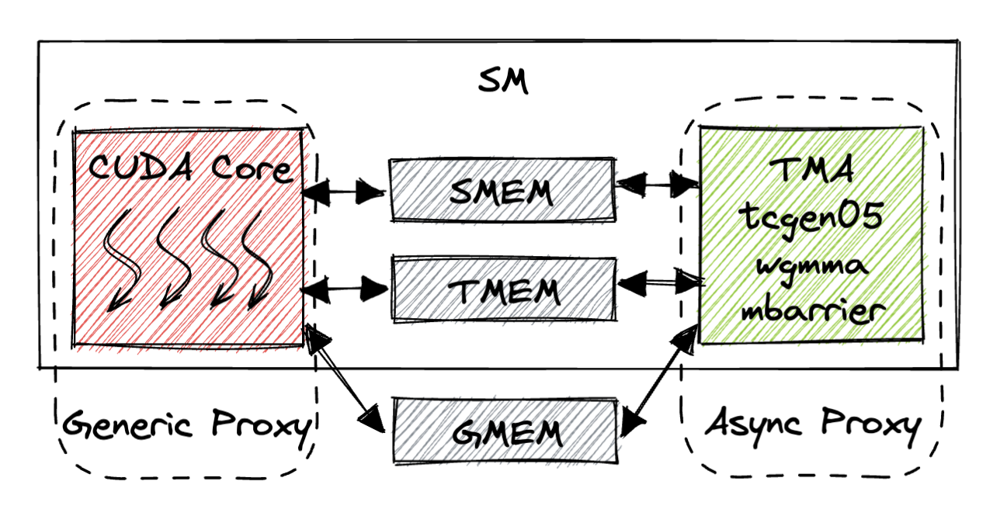

# GPU Memory Consistency Model

*Disclaimer: The content of this blog reflects my personal experiences and opinions while learning GPU programming in my own time. All information presented is publicly available and does not represent the views or positions of NVIDIA Corporation or any of its affiliates.*

*Disclaimer2: The content of this blog may be incorrect. It just represents my own understanding of the memory consistency model. And I am being intentionally wrong sometimes (on TMEM in particular) for better clarity and simplicity. The [ptx doc](https://docs.nvidia.com/cuda/parallel-thread-execution/index.html#memory-consistency-model) is the ground truth.*

## 0. Introduction

I wish I never think about the memory model.
And for a while this does seem to be the case. 
You load your data from GMEM to SMEM and then you do a [`__syncthreads()`](https://docs.nvidia.com/cuda/cuda-c-programming-guide/index.html#synchronization-functions).
Then the data is visible to all threads in the CTA.
Life is good.

However, as the GPU architecture becomes more complex, more co-processors are introduced (e.g. TMA/Tensor Cores), and more sophisticated kernel programming techniques are introduced (e.g. warp specialization, kernel fusion).
Suddenly, you have to think about the memory model in order to just write a *functionally correct* kernel.

Even though the [ptx doc](https://docs.nvidia.com/cuda/parallel-thread-execution/index.html#memory-consistency-model) describes the memory consistency model in a formal way, the lack of examples makes it hard to understand and use in practice.
In this blog, I attempt to provide concrete examples on how to do synchronization that adheres to the memory consistency model on many common use cases in kernel programming.
All of the examples are based on [ptx doc 9.0](https://docs.nvidia.com/cuda/parallel-thread-execution/index.html) and things may change in future versions.

## 1. Background

Unfortunately we need to define some terminologies first.
Please bear with me as I guarantee you they are actually useful.

### 1.1. What is Memory Consistency Model?

The memory consistency model roughly describes when the memory operation performed by one thread is visible to other threads.

This is important because many times we want to establish a producer-consumer relationship in a kernel, where the producer threads produces some data, and the consumer threads (could be a different set of threads) consume the data.
Then how to ensure the producer's output is visible to the consumer is a memory consistency problem.

### 1.2. Execution Order Does Not Guarantee Memory Order

Instruction execution of two threads can be ordered, meaning with some synchronization mechanism (e.g. `mbarrier.arrive+try_wait`) we can ensure thread B will executes `ld.shared` after thread A issues `st.shared`.

```python
thread A:
    st.shared addr, val
    mbarrier.arrive.relaxed
thread B:
    mbarrier.try_wait.relaxed
    ld.shared reg, addr
```

But this execution order does not guarantee any memory order at all!
(I intentionally use the `relaxed` semantic here just to order execution not memory).
Thread B may not see the newly written value in addr by `ld.shared`.
A totally valid hardware implementation of this would be while the stored value `val` is still in some LSU (load store unit), the load from thread B will read out the old value from memory.
In order for this producer-consumer relationship to be correct, we need to use proper fences to guarantee the memory order on top of the execution order, i.e. ensure thread A's memory operation is visible to thread B.


### 1.3. [Scope](https://docs.nvidia.com/cuda/parallel-thread-execution/#scope)

Since memory model cares about the memory order between a set of threads, as you can imagine, the scope where these threads are all belong to may be different.
Sometimes you just want threads within a CTA to be synchronized, sometimes you want threads within a GPU to be synchronized.
We call this the `scope` and this often manifests as a `.xxx` suffix in the ptx instruction.

`.cta` means we care about the memory order between threads within a CTA, `.cluster` means we care about the memory order between threads within a cluster, `.gpu` means we care about the memory order between threads within a GPU.
Note that there isn't a `.grid` scope.

The larger the scope, the more costly the synchronization is.

The figure below also illustrates this hierarchy.
The curly boxes represent different scopes.


### 1.4. [State Space](https://docs.nvidia.com/cuda/parallel-thread-execution/#memory-consistency-state-spaces)

An orthogonal thing to `scope` is the `state space` of the memory operation, meaning we care about the memory operation on which storage (SMEM/GMEM/DSMEM/etc.) idiom.
The figure above also shows the state space hierarchy.
The square boxes represent different state spaces.
In ptx, this often manifests as a `.xxx::yyy` suffix in the ptx instruction.

`.shared::cta` means we care about the memory operation order on SMEM (shared memory), `shared::cluster` means we care about the memory operation order on DSMEM (distributed shared memory), `.global` means we care about the memory operation order on GMEM (global memory).

The larger/farther away the state space, the more costly the synchronization is.

**Confusingly, state space in CUDA normally means something else. It just means in what storage idiom this object resides in. For instance, `ld/st` could load/store from/to SMEM/DSMEM/GMEM. They are different state spaces of the `ld/st` instruction. `mbarrier` state space means where the `mbarrier` object is located (whether that's a CTA local mbarrier or a mbarrier in a different CTA but in the same cluster). But in memory model land, state space means at which storage idiom we want to order the memory operations. I don't want to mix up the two concepts. In this blog, I will use `state space` to mean at which storage idiom we want to order the memory operations. I will just use the word `location` to refer to where an object resides in.**

### 1.5. [Generic vs Async Proxy](https://docs.nvidia.com/cuda/parallel-thread-execution/#proxies)

So far the thread we've been talking about is thread running on the CUDA core.
Modern Nvidia GPUs introduces many asynchronous co-processors (e.g. TMA/Tensor Cores) that can be viewed as an asynchronous thread other than the normal threads running on the CUDA core.
We call threads running on the CUDA cores the `generic proxy` and threads running on the asynchronous co-processors (TMA/Tensor Cores, etc.) the `async proxy`.

The memory order between the generic proxy and the async proxy needs to be specially handled.
In other words, memory order operations that guarantee memory order within the generic proxy doesn't not by default extend to the async proxy.

The figure below shows the generic proxy and async proxy on an SM.



The async proxy includes the TMA unit, the Hopper ([`wgmma`](https://docs.nvidia.com/cuda/parallel-thread-execution/#asynchronous-warpgroup-level-matrix-instructions))/Blackwell ([`tcgen05`](https://docs.nvidia.com/cuda/parallel-thread-execution/#tensorcore-5th-generation-instructions)) Tensor Cores, the [mbarrier](https://docs.nvidia.com/cuda/parallel-thread-execution/#parallel-synchronization-and-communication-instructions-mbarrier) unit.
The async proxy primarily communicates with the generic proxy through different storage idiom (SMEM/TMEM/GMEM). 
Unfortunately, each unit has a different way to synchronize the memory order.
So in [Sec. 2](#2-common-memory-ordering-patterns) we will cover all the common patterns.

### 1.6. Synchronization Mechanisms

There are several ways to enforce execution order and memory order on Nvidia GPUs.
The table below lists the most common ones which are the ones we will cover in this blog.

| Mechanism | Example ptx | Enforces Execution Order | Enforces Memory Order | Scope | State Space | Proxy |
|-----------|-------------|--------------------------|------------------------|-------|-------------|-------|
| [`__syncthreads()`](https://docs.nvidia.com/cuda/cuda-c-programming-guide/index.html#synchronization-functions), [Named Barriers](https://github.com/NVIDIA/cutlass/blob/8afb19d9047afc26816a046059afe66763e68aa5/include/cutlass/arch/barrier.h#L159) | [`bar.sync`](https://docs.nvidia.com/cuda/parallel-thread-execution/#parallel-synchronization-and-communication-instructions-bar) | Yes | Yes | .cta | SMEM/GMEM | Generic |
| [mbarrier](https://docs.nvidia.com/cuda/parallel-thread-execution/#parallel-synchronization-and-communication-instructions-mbarrier) | [`mbarrier.arrive`](https://docs.nvidia.com/cuda/parallel-thread-execution/#parallel-synchronization-and-communication-instructions-mbarrier-arrive), [`mbarrier.try_wait`](https://docs.nvidia.com/cuda/parallel-thread-execution/#parallel-synchronization-and-communication-instructions-mbarrier-test-wait-try-wait) | Yes | Optional | .cta/.cluster | SMEM/DSMEM/GMEM | Generic/Async |
| Cluster barrier | [`barrier.cluster.arrive`](https://docs.nvidia.com/cuda/parallel-thread-execution/#parallel-synchronization-and-communication-instructions-barrier-cluster), [`barrier.cluster.wait`](https://docs.nvidia.com/cuda/parallel-thread-execution/#parallel-synchronization-and-communication-instructions-barrier-cluster) | Yes | Optional | .cluster | SMEM/DSMEM/GMEM | Generic |
| Generic fence | [`fence.cta`, `fence.cluster`, `fence.gpu`](https://docs.nvidia.com/cuda/parallel-thread-execution/#parallel-synchronization-and-communication-instructions-membar) | No | Yes | .cta/.cluster/.gpu | SMEM/DSMEM/GMEM | Generic |
| Async fence | [`fence.proxy.async`](https://docs.nvidia.com/cuda/parallel-thread-execution/#parallel-synchronization-and-communication-instructions-membar) | No | Yes | .cta/.cluster | SMEM/DSMEM/GMEM | Generic->Async |
| `tcgen05` fence | [`tcgen05.wait::ld`, `tcgen05.wait::st`](https://docs.nvidia.com/cuda/parallel-thread-execution/#tcgen05-instructions-tcgen05-wait) | No | Yes | .cta | TMEM | Generic<->Async |

### 1.7. [Memory Ordering Semantics](https://docs.nvidia.com/cuda/parallel-thread-execution/#release-acquire-patterns)

Often we append a synchronization instruction (e.g. [mbarrier](https://docs.nvidia.com/cuda/parallel-thread-execution/#parallel-synchronization-and-communication-instructions-mbarrier)) with a memory ordering semantic to enforce the memory order on top of the execution order.
The few notable ones are:

- `release`: The release pattern makes prior memory operations (before `release`) from the current thread visible to other threads.
- `acquire`: The acquire pattern makes prior (`before acquire`) memory operations from other threads visible to the current thread.
- `acq_rel`: The acq_rel pattern makes prior (`before acq_rel`) memory operations from other threads visible to the current thread and makes the current thread's prior (`before acq_rel`) memory operations visible to other threads.
- `relaxed`: No memory order is enforced.

Note that the memory ordering is kinda meaningless by itself without a proper execution order synchronization.
Because then it's hard to define the term `prior`.
It's totally possible thread B executes `acquire` way earlier than thread A executes `release` (in terms of time), there is no way thread A's value is visible to thread B.
It has to be accompanied by a proper execution order synchronization.

## 2. Common Memory Ordering Patterns

In this section, we will enumerate all the common memory ordering patterns occurred in kernel programming.
We focus on the **producer-consumer** pattern as it's the most common technique and the usual place where the memory model is needed.
Based on the proxy of the producer and consumer threads, we can categorize the memory ordering patterns into 4 categories:

| producer \ consumer | Generic Proxy | Async Proxy |
|-----------|---------------|--------------|
| Generic Proxy | [Intra-CTA (Sec. 2.1.1)](#211-intra-cta-producer-consumer)<br>[Intra-Cluster (Sec. 2.1.2)](#212-intra-cluster-producer-consumer)<br>[Intra-GPU (Sec. 2.1.3)](#213-intra-gpu-producer-consumer) | [CUDA Core -> TMA (Sec. 2.2.1)](#221-cuda-core---tma)<br>[CUDA Core -> tcgen05 (Sec. 2.2.2)](#222-cuda-core---tcgen05) |
| Async Proxy | [TMA -> CUDA Core (Sec. 2.3.1)](#231-tma---cuda-core)<br>[tcgen05 -> CUDA Core (Sec. 2.3.2)](#232-tcgen05---cuda-core) | [TMA -> tcgen05 (Sec. 2.4.1)](#241-tma---tcgen05) |

In this blog for the Tensor Core part we focus on the Blackwell tensor core (`tcgen05`) but Hopper Tensor Core should be spiritually the same.

### 2.1. Generic Proxy -> Generic Proxy

Traditional CUDA SIMT programming (no TMA, no Tensor Core) would just involve threads within the generic proxy synchronizing with each other in a producer-consumer relationship.
The table below lists some of the ways to enforce memory order between threads within the generic proxy.

| State Space \ Scope | .cta | .cluster | .gpu |
|---------------------|------|----------|------|
| SMEM/DSMEM | [`fence.cta`](https://docs.nvidia.com/cuda/parallel-thread-execution/#parallel-synchronization-and-communication-instructions-membar) / [`__syncthreads()`](https://docs.nvidia.com/cuda/cuda-c-programming-guide/index.html#synchronization-functions) / [`__threadfence_block()`](https://docs.nvidia.com/cuda/cuda-c-programming-guide/index.html#memory-fence-functions) / [`mbarrier.arrive+try_wait`](https://docs.nvidia.com/cuda/parallel-thread-execution/#parallel-synchronization-and-communication-instructions-mbarrier) | [`fence.cluster` / `fence.gpu`](https://docs.nvidia.com/cuda/parallel-thread-execution/#parallel-synchronization-and-communication-instructions-membar) / [`__threadfence()`](https://docs.nvidia.com/cuda/cuda-c-programming-guide/index.html#memory-fence-functions) / [`barrier.cluster.arrive+wait`](https://docs.nvidia.com/cuda/parallel-thread-execution/#parallel-synchronization-and-communication-instructions-barrier-cluster) / `mbarrier.arrive+try_wait` | N/A |
| GMEM | same as above | same as above | `fence.gpu` / `__threadfence()` |
| Effective SASS | `MEMBAR.CTA` | `MEMBAR.GPU` | `MEMBAR.GPU` |

#### 2.1.1. Intra-CTA Producer-Consumer

This means the producer and consumer threads are within the same CTA.
Irrespective of the synchronization mechanism, the equivalent SASS instruction that guarantees memory order is `MEMBAR.CTA`.
It's either built implicitly into the instruction or manually inserted by the compiler when lowering from ptx to SASS.

Two use cases come into mind:
1. Producer threads read from GMEM and write to SMEM. Then consumer threads (can be the same set of threads) read from SMEM and do some computation.
2. In [Algorithm 1 of Flash Attention v1](https://arxiv.org/pdf/2205.14135), The partial result $O_i$ of the previous iteration is written to GMEM by producer threads and then reload back into SMEM for the next iteration by consumer threads.

##### 2.1.1.1. `__syncthreads()` and `Named Barriers`

The most popular way is to use [`__syncthreads()`](https://docs.nvidia.com/cuda/cuda-c-programming-guide/index.html#synchronization-functions) to guarantee memory order.
`__syncthreads()` implicitly carry the `acq-rel` semantic meaning the threads after `__syncthreads()` can see the memory operations' effects (on *both* SMEM and GMEM) before `__syncthreads()`.
Needless to say, `__syncthreads()` guarantees execution order too, meaning the instructions after `__syncthreads()` will be executed after all the threads in the CTA have arrived at the `__syncthreads()` point.
Combined, this ensures when the consumer threads get unblocked by `__syncthreads()`, the producer threads' finish the memory operations before `__syncthreads()` and the effects are visible.

```python
Producer threads:
    ld.global reg, gaddr
    st.shared addr, reg
    __syncthreads()
Consumer threads:
    __syncthreads()
    ld.shared reg, addr
    ...
```

[Named Barriers](https://github.com/NVIDIA/cutlass/blob/8afb19d9047afc26816a046059afe66763e68aa5/include/cutlass/arch/barrier.h#L159) has the exact same effect as `__syncthreads()` but can be applied to a subset of threads within the CTA while `__syncthreads()` is applied to all threads in the CTA.

##### 2.1.1.2. `mbarrier.arrive+try_wait`

Alternatively, we can use [mbarrier](https://docs.nvidia.com/cuda/parallel-thread-execution/#parallel-synchronization-and-communication-instructions-mbarrier) to guarantee execution order and memory order.
The *default* semantic of [`mbarrier.arrive`](https://docs.nvidia.com/cuda/parallel-thread-execution/#parallel-synchronization-and-communication-instructions-mbarrier-arrive) is `release` and the *default* semantic of [`mbarrier.try_wait`](https://docs.nvidia.com/cuda/parallel-thread-execution/#parallel-synchronization-and-communication-instructions-mbarrier-test-wait-try-wait) is `acquire`.
This means when the consumer threads finish waiting on the mbarrier, the producer threads finish executing their memory operations before `mbarrier.arrive`.
And the producer threads' memory operations' effects are visible to the consumer threads.
Similar to `__syncthreads()`, the state space is also SMEM/DSMEM/GMEM.

```python
# initialize mbarrier arrive count to num producer threads
Producer threads:
    ld.global reg, gaddr
    st.shared addr, reg
    mbarrier.arrive.release.cta
Consumer threads:
    mbarrier.try_wait.acquire.cta
    ld.shared reg, addr
    ...
```

##### 2.1.1.3. `mbarrier.relaxed.arrive+try_wait` + `fence.cta`

If you don't want to use the `acquire/release` semantic built into the mbarrier but still want to guarantee memory order, you can use [explicit fences](https://docs.nvidia.com/cuda/parallel-thread-execution/#parallel-synchronization-and-communication-instructions-membar) + execution order synchronization (achieved by `__syncthreads()` or `mbarrier.relaxed`) to achieve the same effect.

```python
# initialize mbarrier arrive count to num producer threads
Producer threads:
    ld.global reg, gaddr
    st.shared addr, reg
    fence.release.cta
    mbarrier.relaxed.arrive
Consumer threads:
    mbarrier.relaxed.try_wait
    fence.acquire.cta
    ld.shared reg, addr
    ...
```

Here we use `relaxed` version of the mbarrier to only guarantee execution order.
But we insert explicit memory fences to guarantee memory order.
When the consumer threads get unblocked by `mbarrier.relaxed.try_wait`, this means all the producer threads have finished executing [`fence.release.cta`](https://docs.nvidia.com/cuda/parallel-thread-execution/#parallel-synchronization-and-communication-instructions-membar).
Then after the consumer threads execute [`fence.acquire.cta`](https://docs.nvidia.com/cuda/parallel-thread-execution/#parallel-synchronization-and-communication-instructions-membar), the memory operation by the producer threads are visible to the consumer threads.

Additionally, `fence.cta` guarantees memory order on SMEM/DSMEM/GMEM similar to `__syncthreads()` and `mbarrier` with `acq_rel` semantic.
[`__threadfence_block()`](https://docs.nvidia.com/cuda/cuda-c-programming-guide/index.html#memory-fence-functions) is equivalent to `fence.cta` and both emit `MEMBAR.CTA` in SASS.

The execution order here is also necessary to make this producer-consumer relationship correct.
Imagine not having the `mbarrier` synchronization, how would the consumer threads know when the producer threads have finished executing `fence.release.cta`?
There is no way to know.


#### 2.1.2. Intra-Cluster Producer-Consumer

This means the producer and consumer threads are within the same cluster but not necessarily the same CTA.

The most notable use case is cluster-level split-k GEMM, where each CTA in the cluster generates a partial result and write to DSMEM (distributed shared memory), and then the cluster collectively reduces the partial results from local SMEM into the final result.
So the producer CTAs write to DSMEM and the consumer CTAs (could be the same set of CTAs) read from local SMEM for reduction.
This is also referred to as `push`.

Most implementations would emit `fence.cluster`-equivalent fences (which translates to `MEMBAR.GPU` in SASS).
As you can imagine, this is slightly costly as we don't need a GPU scope fence.
So in [Sec. 2.1.2.5](#2125-st-async-mbarriertry_wait) and [Sec. 2.1.2.6](#2126-st-async-mbarrierrelaxedtry_wait-fencesync_restrict) we will cover a more efficient way to do cluster-level reduction without emitting `MEMBAR.GPU` by leveraging `st.async`.

##### 2.1.2.1. `barrier.cluster.arrive+wait`

[`barrier.cluster.arrive+wait`](https://docs.nvidia.com/cuda/parallel-thread-execution/#parallel-synchronization-and-communication-instructions-barrier-cluster) is the `__syncthreads()` equivalent for cluster-level execution+memory order synchronization.

```python
Producer threads:
    ld.global reg, gaddr
    st.shared::cluster addr, reg
    barrier.cluster.arrive
Consumer threads:
    barrier.cluster.wait
    ld.shared::cta reg, addr
    ...
```

Here we have the producer threads write to DSMEM (via `st.shared::cluster`) and the consumer threads read from local SMEM (via `ld.shared::cta`).
And we will continue using this pattern in this entire sub-section.

The *default* semantic of [`barrier.cluster.arrive`](https://docs.nvidia.com/cuda/parallel-thread-execution/#parallel-synchronization-and-communication-instructions-barrier-cluster) is `release` and the *default* semantic of [`barrier.cluster.wait`](https://docs.nvidia.com/cuda/parallel-thread-execution/#parallel-synchronization-and-communication-instructions-barrier-cluster) is `acquire`.
This means `barrier.cluster.arrive_wait` guarantees execution order and memory order between the producer and consumer threads.
The `ld.shared::cta` instruction in the consumer threads can see the memory operations' effects (on *both* DSMEM and GMEM) of the producer threads (since the state space of `barrier.cluster` is DSMEM/GMEM).

Putting the code in [goldbolt](https://godbolt.org/), we can see indeed this pattern emits `MEMBAR.GPU` in SASS.

##### 2.1.2.2. `mbarrier.cluster.arrive+try_wait`

Similarly, `mbarrier` can also be used to guarantee execution and memory order between the producer and consumer threads within a cluster and the state space is also SMEM/DSMEM/GMEM.

```python
Producer threads:
    ld.global reg, gaddr
    st.shared::cluster addr, reg
    mbarrier.cluster.arrive.release.shared::cluster
Consumer threads:
    mbarrier.cluster.try_wait.acquire.shared::cta
    ld.shared::cta reg, addr
    ...
```

Since the producer and consumer threads are within the same cluster, the scope is `.cluster` instead of the default `.cta`.
The producer writes to `mbarrier` in other CTAs in the cluster, so the location of the `mbarrier` object is `.shared::cluster` in `mbarrier.cluster.arrive`.
The consumer only waits on its local `mbarrier` object, so the location of the `mbarrier` object is `.shared::cta` in `mbarrier.cluster.try_wait`.
And obviously `acquire/release` semantic guarantees the data visibility.

If you inspect the SASS code, you can see in fact this pattern emits `MEMBAR.GPU`, which suggests in practice this pattern can guarantee memory order on GMEM as well.
But since the ptx doc doesn't explicitly state this, this seems to be an implementation dependent behavior and are not guaranteed for future generations of GPUs.

##### 2.1.2.3. `barrier.relaxed.cluster.arrive+wait` + `fence.cluster`

Similarly to the intra-CTA case, we can also use the `relaxed` version of `barrier.cluster` with explicit fences to guarantee memory order.
Since the scope is `.cluster`, the fences are `fence.cluster`.
And the state space is SMEM/DSMEM/GMEM.

```python
Producer threads:
    ld.global reg, gaddr
    st.shared::cluster addr, reg
    fence.release.cluster
    barrier.cluster.arrive.relaxed
Consumer threads:
    barrier.cluster.wait
    ld.shared::cluster reg, addr
    ...
```

The `mbarrier.relaxed.cluster` guarantees execution order and the `fence.cluster` guarantees memory order.
One small note is that the *default* semantic of `barrier.cluster.wait` is `acquire` so we don't need an extra `fence.acquire.cluster` after it.

Inspecting the SASS code, we get `MEMBAR.GPU` in SASS again.
Because on current architecture, `fence.cluster` lowers to `MEMBAR.GPU`.

##### 2.1.2.4. `mbarrier.cluster.relaxed.arrive+try_wait` + `fence.cluster`

Same deal as [Sec. 2.1.2.3](#2123-barrierrelaxedclusterarrivewait-fencecluster), but with `mbarrier.relaxed` for execution order synchronization and explicit `fence.cluster` for memory order.

```python
Producer threads:
    ld.global reg, gaddr
    st.shared::cluster addr, reg
    fence.release.cluster
    mbarrier.cluster.arrive.relaxed.shared::cluster
Consumer threads:
    mbarrier.cluster.try_wait.relaxed.shared::cta
    fence.acquire.cluster
    ld.shared::cta reg, addr
    ...
```

The state space is still SMEM/DSMEM/GMEM.
The SASS code is also `MEMBAR.GPU`.

##### 2.1.2.5. `st.async` + `mbarrier.acquire.try_wait`

Is there a way to avoid the costly `fence.cluster`/`MEMBAR.GPU`?
Yes! [`st.async`](https://docs.nvidia.com/cuda/parallel-thread-execution/#data-movement-and-conversion-instructions-st-async) is exactly designed for this purpose.
Recall that the state space of `fence.cluster` is DSMEM and GMEM.
But for our use case here, we only want to apply memory order on DSMEM.
The `mbarrier` memory semantic embedded in `st.async` only applies to DSMEM not GMEM.
Note that, `shared::cluster` just means the *location* of the `mbarrier` object this `st.async` arrives on is in the DSMEM of the cluster, it doesn't refelect the memory model state space of the `st.async`.

```python
Producer threads:
    ld.global reg, gaddr
    st.async.cluster.shared::cluster addr, reg
Consumer threads:
    mbarrier.cluster.try_wait.acquire.shared::cta
    ld.shared::cta reg, addr
    ...
```

According to the ptx doc, `st.async` inherently has `release` semantic at the `cluster` scope and DSMEM state space.
And it also arrives on a `mbarrier` object during completion.
So it handles both execution order and memory order for us on the producer side.
And on the consumer side, we simply do a `acquire` wait on the barrier to ensure execution order and memory order.

Inspecting the SASS code, we no longer emit `MEMBAR.GPU` which is good for performance.
To reiterate, the key to avoid `MEMBAR.GPU` is the memory model state space is DSMEM and doesn't include GMEM.

##### 2.1.2.6. `st.async` + `mbarrier.relaxed.try_wait` + `fence.sync_restrict`

Alternatively, if you don't want to use the `acquire` in `mbarrier.try_wait`, you can use the `relaxed` version of `mbarrier` and explicit fences to guarantee memory order.

```python
Producer threads:
    ld.global reg, gaddr
    st.async.cluster.shared::cluster addr, reg
Consumer threads:
    mbarrier.cluster.try_wait.relaxed.shared::cta
    fence.acquire.sync_restrict::shared::cluster.cluster
    ld.shared::cta reg, addr
    ...
```

Here `sync_restrict` in `fence` specifies the state space of the fence to be DSMEM (not including GMEM).
And it obviously has `acquire` semantic and `cluster` scope.
So equivalently, this pattern guarantees execution order and memory order on DSMEM and avoids emitting `MEMBAR.GPU`.

##### 2.1.2.7. Bonus: `pull` variant

So far we've only talked about the `push` variant of cluster-level reduction.
You can also implement this with the `pull` variant, meaning the producer CTAs write partial results to local SMEM and the consumer CTAs read from remote SMEM for reduction.

We skip all the intermediate implementations and only list the SOL (speed of light) implementation here that avoids emitting `MEMBAR.GPU`.

```python
Producer threads:
    ld.global reg, gaddr
    st.shared::cta addr, reg
    fence.release.sync_restrict::shared::cta.cluster
    mbarrier.cluster.arrive.relaxed.shared::cluster
Consumer threads:
    mbarrier.cluster.try_wait.relaxed.shared::cta
    fence.acquire.sync_restrict::shared::cluster.cluster
    ld.shared::cluster reg, addr
    ...
```

Because we want the memory model state space to be DSMEM (not including GMEM), we need to use `relaxed` version of `mbarrier` such that it only guarantees execution order.
Note that the `release` and `acquire` fence has `sync_restrict` semantic which specifies the state space of the memory order to be DSMEM (not including GMEM).


#### 2.1.3. Intra-GPU Producer-Consumer

This means the producer and consumer threads are within the same GPU but not necessarily the same grid.

The common pattern here is producer-consumer subgrid in a megakernel.
The producer subgrid executes a layer of the LLM model and produces intermediate activations in GMEM.
Then the consumer subgrid is the subsequent layer that consumes the intermediate activations in GMEM.
And we put both layer in a single megakernel.
[ThunderKitten](https://hazyresearch.stanford.edu/blog/2025-05-27-no-bubbles) and [Mirage Persistent Kernel](https://zhihaojia.medium.com/compiling-llms-into-a-megakernel-a-path-to-low-latency-inference-cf7840913c17) are two examples of megakernel.

Now the scope we are synchronizing the producer and consumer threads is `gpu` and the state space is GMEM.
We can continue using the `release` and `acquire` semantics to guarantee memory order.
But we can't use `mbarrier` or `__syncthreads()` to establish execution order because they are only effective within a CTA/cluster.
We will have to use an explicit flag to achieve execution order synchronization.
The code below shows one way of how this can be done.

```python
Producer threads:
    ld.global reg, gaddr
    st.global.relaxed addr, reg
    __syncthreads()
    if thread0:
        atom.global.gpu.release.inc flag
Consumer threads:
    if thread0:
        while not flag:
            ld.global.gpu.relaxed flag
        fence.acquire.gpu
    __syncthreads()
    ld.global.relaxed reg, addr
    ...
```

On the producer subgrid side, the output activation is stored to GMEM with `st.global.relaxed`.
`relaxed` semantic is sufficient here (for better performance) because we will guarantee `release` semantic with the flag.
Then we `__syncthreads()` to ensure all producer threads have finished executing `st.global.relaxed` and the results are visible to other producer threads in the same CTA (recall that `__syncthreads()` has an implicit `fence.cta`).
Now we elect one thread (thread 0) to signal the consumer subgrid using the flag in GMEM.
Because of the `__syncthreads()`, all the producer threads' GMEM writes are visible to thread 0 before the `atom`.
We atomically increment the flag by 1 with `release` semantic.
Thread 0 can issue a single atomic increment with `gpu` scope and `release` semantic, which makes sure all the producer threads' GMEM writes are visible to other threads in the `gpu` scope.

On the consumer subgrid side, thread 0 spins on the flag in GMEM with `relaxed` semantic and `gpu` scope.
We don't want it to repeatedly `aquire` load the flag for better performance and will use an explicit fence to guarantee memory order.
The moment it gets unblocked, thread 0 issues a `fence.acquire.gpu` to guarantee memory order on the consumer side.
Now all the producer threads' GMEM writes are visible to thread 0 only.
Then we call `__syncthreads()` to establish execution order and make the data visible to the entire consumer threads (in `cta` scope).
The implicit `fence.acquire.cta` in `__syncthreads()` makes sure all consumer threads (in `cta` scope) can see the producer threads' GMEM writes.
Then it's safe to consume the output activation in GMEM with `relaxed` semantic.

Inspecting the SASS code, we get `MEMBAR.GPU` in SASS which is expected for `gpu` scope memory order.

**Important Note:**
This synchronization pattern leverages the *composibility* property of the `release-acquire` pattern, meaning for the following sequence of events:
- Thread A releases in cta scope
- Thread B acquires in cta scope
- Thread B releases in gpu scope
- Thread C acquires in gpu scope

There will be a gpu scope `release-acquire` pattern between Thread A and Thread C.
Another way to put it is, for *whatever scope*, if there is a `release-acquire` pattern between Thread A and Thread B, and a `release-acquire` pattern between Thread B and Thread C, then the memory model guarantees there is a `release-acquire` pattern between Thread A and Thread C.

Putting this in our specific example, on the consumer side, after thread 0's `gpu` scope `acquire` fence, there is a `gpu` scope `release-acquire` pattern between all producer threads and consumer thread 0.
Then `__syncthreads()` establishes `cta` scope `release-acquire` pattern between consumer thread 0 and all other consumer threads.
The two `release-acquire` patterns composes to a `gpu` scope `release-acquire` pattern between all producer threads and all consumer threads.
You can make the same argument for the producer side, we leave it as an exercise to the reader.

Formally, this is described as [causality order](https://docs.nvidia.com/cuda/parallel-thread-execution/#causality-order) in the ptx doc.
Base causality order 3c describes the composition property of the `release-acquire` pattern.


### 2.2. Generic Proxy -> Async Proxy

Sometimes the CUDA core (generic proxy) will produce data that kicks off the asynchronous co-processor's (async proxy) execution.
We can't use the nromal fence that applies in the generic proxy (e.g. `fence.cta`) to guarantee memory order.
We have to use the [`fence.proxy.async`](https://docs.nvidia.com/cuda/parallel-thread-execution/#parallel-synchronization-and-communication-instructions-membar) to guarantee memory order between the generic proxy and the async proxy.

#### 2.2.1. CUDA Core -> TMA

During GEMM epilog, we calculate the final output using the CUDA core and we want to use TMA to store the output to GMEM.
The CUDA cores (producer) first write the output from RF to SMEM, waiting for the TMA (consumer) to consume it.
After the CUDA core producer writes, the SMEM data is not visible to either the generic proxy (consumer threads on CUDA core) or the async proxy (TMA unit).
We have to use `fence.cta` to guarantee the memory visibility to the generic proxy and `fence.proxy.async` to guarantee the memory visibility to the async proxy.

```python
Producer threads:
    ld.global reg, gaddr
    st.shared addr, reg
    fence.proxy.async.shared::cta
    mbarrier.arrive
Consumer threads:
    mbarrier.try_wait
    # tma store
    if thread0:
        cp.async.bulk.tensor.3d.global.shared::cta
    ...
```

Here the execution order is guaranteed by `mbarrier`.
And the memory order from generic proxy to async proxy is guaranteed by `fence.proxy.async.shared::cta`.
`shared::cta` in `fence.proxy.async` means the state space of the fence is SMEM.
Hence when the consumer threads get unblocked by `mbarrier.try_wait`, it means all the producer threads have executed the `st.shared` and `fence.proxy.async` such that the SMEM data is visible to the consumer threads in the async proxy.

Inspecting the SASS code, `fence.proxy.async.shared::cta` lowers to `FENCE.VIEW.ASYNC.S` in SASS.

Note that it's also correct to use the `relaxed` version of `mbarrier` to guarantee async proxy visibility since we don't care about whether the consumer threads (generic proxy) can see the SMEM data or not.
As long as the TMA unit can see the SMEM data, it's good enough.
This would also avoid an extra `MEMBAR.CTA` in SASS but in practice it's not worth the extra mental burden and the performance overhead is negligible.

#### 2.2.2. CUDA Core -> tcgen05

In Flash Attention, there are two places where the CUDA core (generic proxy) needs to feed data to the tensor core (async proxy):
1. Softmax (running on CUDA core) produces `P` matrix and it got stored to SMEM, for tensor core (async proxy) to consume in BMM2 (i.e. `V * P`).
2. BMM2's accumulator `Acc2` needs to be corrected (`Acc2 = Acc2 * alpha`) before being accumulated with `V * P`. CUDA core loads the original `Acc2` from TMEM, does the correction, and stores the corrected `Acc2` back to TMEM, for tensor core (async proxy) to consume in BMM2.

Case 1 is identical to [Sec. 2.2.1](#221-cuda-core---tma) except the async unit is `tcgen05` instead of TMA.
So keeping using `fence.proxy.async.shared::cta` would yield correct memory order.

For case 2, now the state space is TMEM which requires a different fence.
[`tcgen05.wait::st`](https://docs.nvidia.com/cuda/parallel-thread-execution/#tcgen05-instructions-tcgen05-wait) is the equivalent of `fence.proxy.async.shared::cta` for TMEM.
It makes TMEM from generic proxy visible to async proxy visible.

```python
Producer threads:
    ld.global reg, gaddr
    tcgen05.st addr, reg
    tcgen05.wait::st
    mbarrier.arrive
Consumer threads:
    mbarrier.try_wait
    if thread0:
        tcgen05.mma addr, A, B, C
    ...
```

Same deal, `mbarrier` guarantees execution order and `tcgen05.wait::st` guarantees memory order from generic proxy to async proxy.
When the consumer threads get unblocked by `mbarrier.try_wait`, it means all the producer threads have executed the `tcgen05.st` and `tcgen05.wait::st` such that the TMEM data is visible to the consumer threads in the async proxy.

Inspecting the SASS code, `tcgen05.wait::st` lowers to `FENCE.VIEW.ASYNC.T` in SASS.

### 2.3. Async Proxy -> Generic Proxy

Other times the async proxy (e.g. TMA/Tensor Core) will produce data that kicks off the CUDA core's (generic proxy) execution.
Naturally we would need a fence to make the async proxy's data visible to the generic proxy.
Luckily, this fence is mostly implicitly built into various hardware instructions.
We will cover the most common ones here.

#### 2.3.1. TMA -> CUDA Core

Often times we use TMA (async proxy) to copy data from GMEM to SMEM, and then the CUDA core (generic proxy) will consume it from SMEM for further processing.

```python
Producer threads:
    if thread0:
        cp.async.bulk.tensor.3d.shared::cta.global addr
Consumer threads:
    mbarrier.try_wait
    ld.shared reg, addr
    ...
```

TMA's completion implicitly does two things:
1. It arrives on the `mbarrier`
2. It issues a async proxy fence to make the SMEM data visible to the generic proxy.

Then on the consumer side, when the consumer threads get unblocked by `mbarrier.try_wait`, it means the TMA has completed and the SMEM data is visible to the generic proxy.


#### 2.3.2. tcgen05 -> CUDA Core

`tcgen05` tensor core (async proxy) produces data for the CUDA core (generic proxy) to execute the epilog on.
The only difference is the storage idiom for the data communication is TMEM instead of SMEM.

```python
Producer threads:
    if thread0:
        tcgen05.mma addr, A, B, C
        tcgen05.commit
Consumer threads:
    mbarrier.try_wait
    tcgen05.ld reg, addr
    add reg, reg, 1
    ...
```

It's more or less the same as [Sec. 2.3.1](#231-tma---cuda-core) except the MMA completion is being explicitly tracked by `tcgen05.commit`.
And similarly it does two things:
1. It arrives on the `mbarrier`
2. It issues a async proxy fence to make the TMEM data visible to the generic proxy.

Then on the consumer side, when the consumer threads get unblocked by `mbarrier.try_wait`, it means the `tcgen05` has completed and the TMEM data is visible to the generic proxy.

Inspecting the SASS code, `tcgen05.commit` lowers to `UTCBAR` in SASS.

**When do I need `tcgen05.wait::ld`?**

In the above example, for the `tcgen05.ld` (producer) to RF (register file) to `add` (consumer) relationship, we don't need `tcgen05.wait::ld` because it's the same thread and dependency/memory order is tracked by register dependency.
However, for the following sequence of events you would need `tcgen05.wait::ld`:

```python
tcgen05.ld reg, addr
tcgen05.wait::ld
tcgen05.st addr, reg
```
In this case,mwe are loading data from TMEM and a later `tcgen05.st` will overwrite the same TMEM address.
We want to protect the write after read dependency. 
So `tcgen05.wait::ld` is inserted after the `tcgen05.ld` to guarantee the load is done and it's safe to overwrite TMEM.
This is because there isn't HW TMEM dependency tracking (same is true for SMEM) so we have to manually enforce the memory order.


### 2.4. Async Proxy -> Async Proxy

#### 2.4.1. TMA -> tcgen05

mbarrier

## Summary

I still wish I never think about the memory model.


