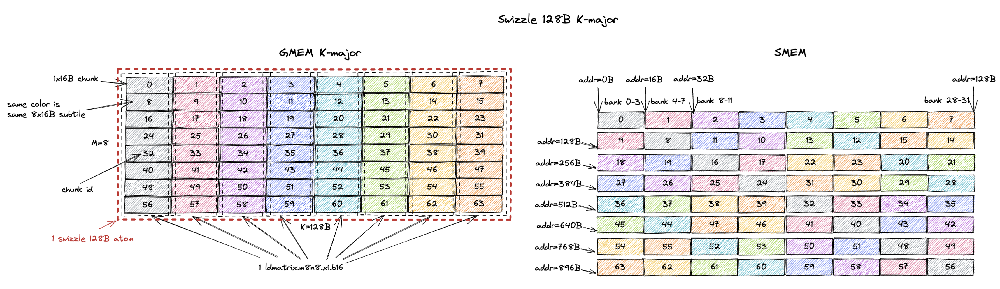
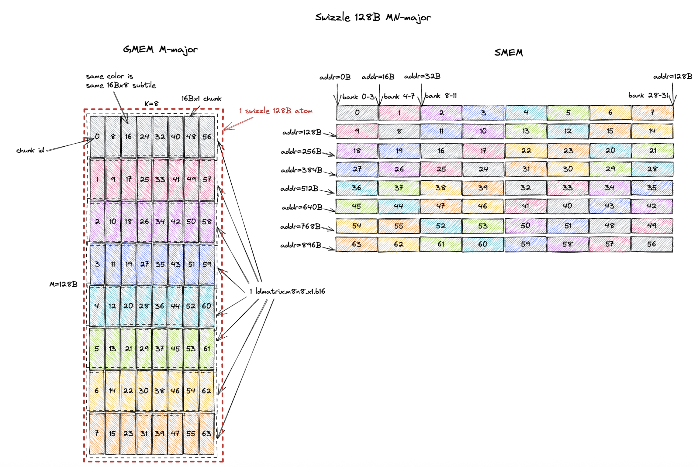
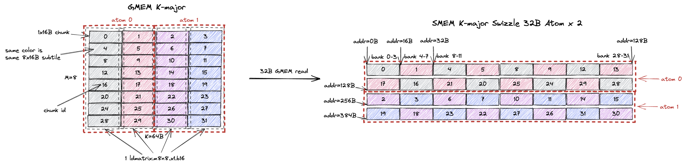
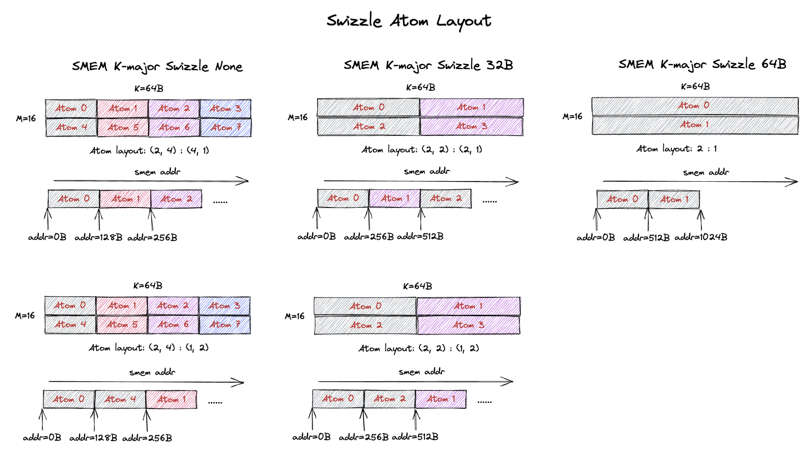

# Tensor Core MMA Swizzle Layout

*Disclaimer: The content of this blog reflects my personal experiences and opinions while learning GPU programming in my own time. All information presented is publicly available and does not represent the views or positions of NVIDIA Corporation or any of its affiliates.*

## 0. Introduction

The tensor cores in Nvidia GPUs accelerate matrix multiplication operations. 
However, the tensor core has particular layout requirement on its input matrices in shared memory (smem). 
You can't just feed a row-major or column-major matrix to the tensor core. 
It requires the input matrices to follow a specific set of `Swizzle Layout`.

In this blog, I'll focus on what these `swizzle layout` are and how the input matrices are represented in these `swizzle layout` formats in smem.
This is a pre-requisite of even writing a functional MMA kernel using tensor cores. Later in the blog, I'll touch upon the motivation and performance implications of these `swizzle layout`.

The logical flow of this blog is a bit different from my other blogs as I try to explain to you how to use the `swizzle layout` first and then why we need them.
Because I believe being able to write a functional kernel is way more important than the philosophical discussions.

## 1. Why do I Need to Care about All These?

Isn't [Triton](https://github.com/triton-lang/triton)/[ThunderKitten](https://github.com/HazyResearch/ThunderKittens)/[Cutlass](https://github.com/NVIDIA/cutlass) already taking care of this complex layout scheme for us? Why would you ever want to manually write/understand it?

That is a very good question and the answer depends on who you are. 
If you are developer of Triton/ThunderKitten/Cutlass, of course you need to understand this because you are doing the heavy lifting such that the DSL users don't need to care about swizzle layout. 

I belong to the second category where these DSLs don't perform well on the cases I care about. 
I write kernels for ultra low latency LLM inference which means we run things at very low batch size.
This makes the GEMM/Attention problem size to be rather unconventional and many of these DSLs don't perform well on these problem sizes. 
Rather than fixing the DSL compiler, it's much faster to just manually write the kernel tailored for these problem sizes.
But this requires understanding the low level details of how to drive the tensor core and the swizzle layout is one of the key things to understand.

## 2. Background

Different generations of the tensor core source input matrices from different storage idioms:
- Ampere tensor core (ptx is `mma`) source both input A and B matrix from RF.
- Hopper tensor core (ptx is `wgmma`) source input A matrix from RF/smem and input B matrix from smem.
- Blackwell tensor core (ptx is `tcgen05.mma`) source input A matrix from smem/tmem ([Tensor Memory](https://docs.nvidia.com/cuda/parallel-thread-execution/#tensor-memory)) and input B matrix from smem.

However, even if some input source are from RF/tmem, the data are still firstly staged into smem (most of the time), and then loaded into RF/tmem.
And the tensor core has layout requirement on the data in smem, i.e. `swizzle layout`.

### 2.1. Motivating Example: Ampere MMA

To make our life easier, in this blog we focus on how to write a correct MMA kernel for Ampere tensor core (using `mma` ptx instructions).
The general idea and specification of the swizzle layout should be the same for hopper and Blackwell tensor cores too.

The mma instruction we pick is [`mma.sync.aligned.m16n8k8.row.col.f32.bf16.bf16.f32`](https://docs.nvidia.com/cuda/parallel-thread-execution/#warp-level-matrix-instructions-mma) which does `D = A * B + C` where `A` is bf16 `[M, K]` (row major) and `B` is bf16 `[K, N]` (column major) and `C/D` is f32 `[M, N]` and `M = 16, N = 8, K = 8`.
The mma instruction expects both the input and output in the RF (rmem). 
We call the per thread register storing the input/output matrix `fragment`.
Below is the matrix A fragment ([Figure 71 of PTX 9.0 doc](https://docs.nvidia.com/cuda/parallel-thread-execution/#mma-1688-a-f16)) of this mma instruction.


The A tile is `[16, 8]` and stored in 32 threads, each thread stores 4 elements of the A tile.
The way we load the bf16 A tile from smem into RF is via the [`ldmatrix.m8n8.x1.b16`](https://docs.nvidia.com/cuda/parallel-thread-execution/#warp-level-matrix-instructions-ldmatrix) instruction.
Each call to `ldmatrix` will load a `[8, 8]` (or a `8x16B`) subtile from smem into RF.
So the grey color denotes the `8x16B` data loaded by the first `ldmatrix` instruction (2 elements per thread) and the red color denotes the data loaded by the second `ldmatrix` instruction (2 elements per thread).
[Figure 104 of PTX 9.0 doc](https://docs.nvidia.com/cuda/parallel-thread-execution/#mma-ldmatrix-fragments) describes the data layout in the RF after the `ldmatrix` instruction, which is exactly what we draw above for the grey and red subtile.

**This suggests that for whatever layout the A tile is stored in smem, it has to support the `8x16B` subtile load pattern of `ldmatrix.m8n8` at full smem read bandwidth (128B/cycle).
The `swizzle layout` is the exact solution to this requirement.
And we will show below how each and every one of the `swizzle layout` satisfies this requirement.**

#### 2.1.1. Above Example But in CuTe Terminology

Ultimately we will use the mma instruction through CuTe, so it might be good to understand the above layout in CuTe terminology.

The mma atom of `mma.sync.aligned.m16n8k8.row.col.f32.bf16.bf16.f32` is [`SM80_16x8x8_F32BF16BF16F32_TN`](https://github.com/NVIDIA/cutlass/blob/c6aeb9179c5f74a0fcdbd28527bf4b6ba8c60752/include/cute/arch/mma_sm80.hpp#L191).
We can draw the fragment layout by using [`print_svg`](https://github.com/NVIDIA/cutlass/blob/c6aeb9179c5f74a0fcdbd28527bf4b6ba8c60752/include/cute/util/print_svg.hpp#L230) function and will get the following figure.


A matrix fragment layout is on the bottom left of the figure.
B matrix is top right and C matrix is bottom right.
We can see the A matrix fragment layout exactly matches the one we manually drew above.

In CuTe, this A matrix fragment layout is called the `inverse TV-layout`, meaning it represents the coordinate mapping between `(M, K)` to `(T, V)`. 
`T` stands for thread id and `V` stands for value id. 
`T1V2` means the third value in thread 1.
The formula below shows how we derive the stride of the inverse TV-layout.

```bash
# inverse TV-layout: (M, K) -> (T, V)
Shape: ((8, 2), (2, 4))
Stride: ((4, 64), (32, 1))
m0 = [0, 8)
m1 = [0, 2)
n0 = [0, 2)
n1 = [0, 4)
A((m0, m1), (n0, n1)) # natural coordinate of tensor
  = TV(m0 * 4 + n1, m1 * 2 + n0) # 2d coordinate of TV layout
  = TV((m0 * 4 + n1) * 1 + (m1 * 2 + n0) * 32) # 1d coordinate of TV layout
  = TV(m0 * 4 + m1 * 64 + n0 * 32 + n1)
```

The actual `TV-layout` for A matrix fragment can be retrieved by inspecting the `ALayout` member of the [`MMA_Traits`](https://github.com/NVIDIA/cutlass/blob/c6aeb9179c5f74a0fcdbd28527bf4b6ba8c60752/include/cute/atom/mma_traits_sm80.hpp#L123) of the mma atom.
In this particular case, the A TV-layout is [`SM80_16x8_Row`](https://github.com/NVIDIA/cutlass/blob/c6aeb9179c5f74a0fcdbd28527bf4b6ba8c60752/include/cute/atom/mma_traits_sm80.hpp#L53).
The formula below shows how we validate the `TV-layout` is correct.

```bash
# TV layout: (T, V) -> (M, K)
Shape: ((4, 8), (2, 2))
Stride: ((32, 1), (16, 8))
t0 = [0, 4)
t1 = [0, 8)
v0 = [0, 2)
v1 = [0, 2)
TV((t0, t1), (v0, v1)) # natural coordinate of tensor
  = A(t0 * 32 + t1 + v0 * 16 + v1 * 8) # 1d coordinate of A layout
  = A((t1 + v1 * 8) * 1 + (t0 * 2 + v0) * 16) # 1d coordinate of A layout
  = A(t1 + v1 * 8, t0 * 2 + v0) # 2d coordinate of A layout
```

Note that the above two layouts are inverse of each other, i.e. the inverse of `TV-layout` is the `inverse TV-layout`.
We can validate this easily with the following CuTe-DSL code by taking the `right_inverse` of the TV-layout and will get the `inverse TV-layout`.

```python
import cutlass
import cutlass.cute as cute

@cute.jit
def test():
    TV = cute.make_layout(((4, 8), (2, 2)), stride=((32, 1), (16, 8))) # (T, V) -> (M, K)
    cute.printf("TV: {}\n", TV)
    A = cute.right_inverse(TV) # (M, K) -> (T, V)
    cute.printf("A: {}\n", A)

if __name__ == "__main__":
    test()
```

## 3. MMA Swizzle Layout

I basically redraw all the figures from [9.7.16.10.6. Shared Memory Layout and Swizzling in PTX 9.0 doc](https://docs.nvidia.com/cuda/parallel-thread-execution/#tcgen05-shared-memory-layout-swizzling) with more details and annotations of what's going on.

### 3.1. K-Major Swizzle Layout

#### 3.1.1. K-Major Swizzle None


#### 3.1.2. K-Major Swizzle 32B


#### 3.1.3. K-Major Swizzle 64B


#### 3.1.4. K-Major Swizzle 128B



### 3.2. MN-Major Swizzle Layout

#### 3.2.1. MN-Major Swizzle None


#### 3.2.2. MN-Major Swizzle 32B


#### 3.2.3. MN-Major Swizzle 64B


#### 3.2.4. MN-Major Swizzle 128B



## 4. Why Swizzle?


## 5. Which Swizzle Atom to Choose?





## 6. How Transposed Input is Handled?


## 7. Swizzle Atom Layout



## 8. Summary

## 9. Additional References