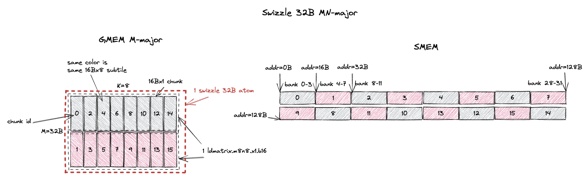

# Tensor Core MMA Swizzle Layout

*Disclaimer: The content of this blog reflects my personal experiences and opinions while learning GPU programming in my own time. All information presented is publicly available and does not represent the views or positions of NVIDIA Corporation or any of its affiliates.*

## 0. Introduction

The tensor cores in Nvidia GPUs accelerate matrix multiplication operations. 
However, the tensor core has particular layout requirement on its input matrices in shared memory (smem). 
You can't just feed a row-major or column-major matrix to the tensor core. 
It requires the input matrices to follow a specific set of `Swizzle Layout`.

In this blog, I'll focus on what these `swizzle layout` are and how the input matrices are represented in these `swizzle layout` formats in smem.
This is a pre-requisite of even writing a functional MMA kernel using tensor cores. Later in the blog, I'll touch upon the motivation and performance implications of these `swizzle layout`.

The logical flow of this blog is a bit different from my other blogs as I try to explain to you how to use the `swizzle layout` first and then why we need them.
Because I believe being able to write a functional kernel is way more important than the philosophical discussions.

## 1. Background

Different generations of the tensor core source input matrices from different storage idioms:
- Ampere tensor core (ptx is `mma`) source both input A and B matrix from RF.
- Hopper tensor core (ptx is `wgmma`) source input A matrix from RF/smem and input B matrix from smem.
- Blackwell tensor core (ptx is `tcgen05.mma`) source input A matrix from smem/tmem ([Tensor Memory](https://docs.nvidia.com/cuda/parallel-thread-execution/#tensor-memory)) and input B matrix from smem.

However, even if some input source are from RF/tmem, the data are still firstly staged into smem (most of the time), and then loaded into RF/tmem.
And the tensor core has layout requirement on the data in smem, i.e. `swizzle layout`.

### 1.1. Motivating Example: Ampere MMA

To make our life easier, in this blog we focus on how to write a correct MMA kernel for Ampere tensor core (using `mma` ptx instructions).
The general idea and specification of the swizzle layout should be the same for hopper and Blackwell tensor cores too.

TODO: explain the mma instruction and ldmatrix instruction.

## 2. MMA Swizzle Layout

I basically redraw all the figures from [9.7.16.10.6. Shared Memory Layout and Swizzling in PTX 9.0 doc](https://docs.nvidia.com/cuda/parallel-thread-execution/#tcgen05-shared-memory-layout-swizzling) with more details and annotations of what's going on.

### 2.1. K-Major Swizzle Layout

#### 2.1.1. K-Major Swizzle None

#### 2.1.2. K-Major Swizzle 32B

#### 2.1.3. K-Major Swizzle 64B

#### 2.1.4. K-Major Swizzle 128B

### 2.2. MN-Major Swizzle Layout

#### 2.2.1. MN-Major Swizzle None

#### 2.2.2. MN-Major Swizzle 32B

#### 2.2.3. MN-Major Swizzle 64B

#### 2.2.4. MN-Major Swizzle 128B

## 3. Why Swizzle?

## 4. Which Swizzle Atom to Choose?

## 5. How Transposed Input is Handled?

## 6. Swizzle Atom Layout

## 7. Summary

## 8. Additional References