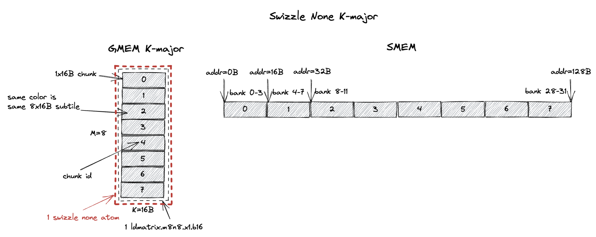
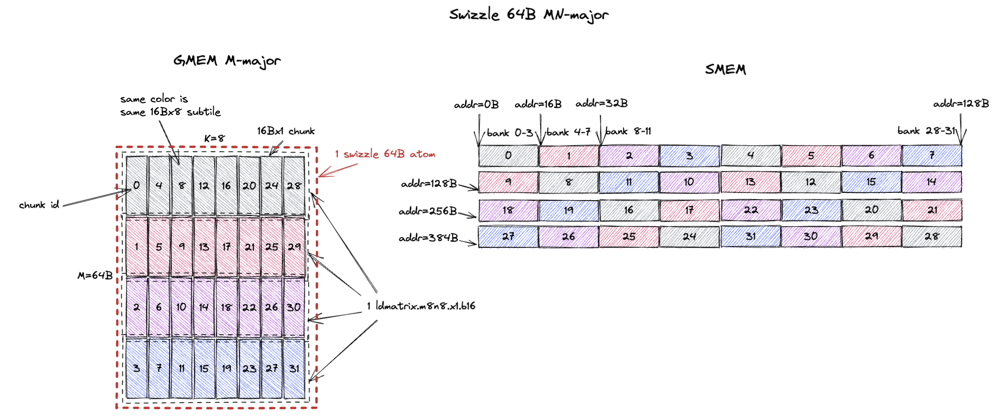
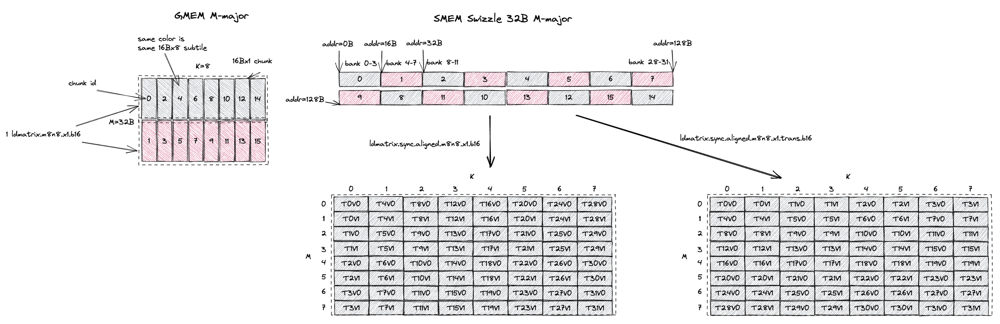

# Tensor Core MMA Swizzle Layout

*Disclaimer: The content of this blog reflects my personal experiences and opinions while learning GPU programming in my own time. All information presented is publicly available and does not represent the views or positions of NVIDIA Corporation or any of its affiliates.*

## 0. Introduction

The tensor cores in Nvidia GPUs accelerate matrix multiplication operations. 
However, the tensor core has particular layout requirement on its input matrices in shared memory (smem). 
You can't just feed a row-major or column-major matrix to the tensor core. 
It requires the input matrices to follow a specific set of `Swizzle Layout`.

In this blog, I'll focus on what these `swizzle layout` are and how the input matrices are represented in these `swizzle layout` formats in smem.
This is a pre-requisite of even writing a functional MMA kernel using tensor cores. Later in the blog, I'll touch upon the motivation and performance implications of these `swizzle layout`.

The logical flow of this blog is a bit different from my other blogs as I try to explain to you how to use the `swizzle layout` first and then why we need them.
Because I believe being able to write a functional kernel is way more important than the philosophical discussions.

## 1. Why do I Need to Care about All These?

Isn't [Triton](https://github.com/triton-lang/triton)/[ThunderKitten](https://github.com/HazyResearch/ThunderKittens)/[Cutlass](https://github.com/NVIDIA/cutlass) already taking care of this complex layout scheme for us? Why would you ever want to manually write/understand it?

That is a very good question and the answer depends on who you are. 
If you are developer of Triton/ThunderKitten/Cutlass, of course you need to understand this because you are doing the heavy lifting such that the DSL users don't need to care about swizzle layout. 

I belong to the second category where these DSLs don't perform well on the cases I care about. 
I write kernels for ultra low latency LLM inference which means we run things at very low batch size.
This makes the GEMM/Attention problem size to be rather unconventional and many of these DSLs don't perform well on these problem sizes. 
Rather than fixing the DSL compiler, it's much faster to just manually write the kernel tailored for these problem sizes.
But this requires understanding the low level details of how to drive the tensor core and the swizzle layout is one of the key things to understand.

## 2. Background

Different generations of the tensor core source input matrices from different storage idioms:
- Ampere tensor core (ptx is `mma`) source both input A and B matrix from RF.
- Hopper tensor core (ptx is `wgmma`) source input A matrix from RF/smem and input B matrix from smem.
- Blackwell tensor core (ptx is `tcgen05.mma`) source input A matrix from smem/tmem ([Tensor Memory](https://docs.nvidia.com/cuda/parallel-thread-execution/#tensor-memory)) and input B matrix from smem.

However, even if some input source are from RF/tmem, the data are still firstly staged into smem (most of the time), and then loaded into RF/tmem.
And the tensor core has layout requirement on the data in smem, i.e. `swizzle layout`.

### 2.1. Motivating Example: Ampere MMA

To make our life easier, in this blog we focus on how to write a correct MMA kernel for Ampere tensor core (using `mma` ptx instructions).
The general idea and specification of the swizzle layout should be the same for hopper and Blackwell tensor cores too.

The mma instruction we pick is [mma.sync.aligned.m16n8k8.row.col.f32.bf16.bf16.f32](https://docs.nvidia.com/cuda/parallel-thread-execution/#warp-level-matrix-instructions-mma) which does `D = A * B + C` where `A` is bf16 `[M, K]` (row major) and `B` is bf16 `[K, N]` (column major) and `C/D` is f32 `[M, N]` and `M = 16, N = 8, K = 8`.
The mma instruction expects both the input and output in the RF (rmem). 
We call the per thread register storing the input/output matrix `fragment`.
Below is the matrix A fragment ([Figure 71 of PTX 9.0 doc](https://docs.nvidia.com/cuda/parallel-thread-execution/#mma-1688-a-f16)) of this mma instruction.


The A tile is `[16, 8]` and stored in 32 threads, each thread stores 4 elements of the A tile.
The way we load the bf16 A tile from smem into RF is via the [ldmatrix.m8n8.x1.b16](https://docs.nvidia.com/cuda/parallel-thread-execution/#warp-level-matrix-instructions-ldmatrix) instruction.
Each call to `ldmatrix` will load a `M=8, K=8` (or a `8x16B`) subtile from smem into RF.
So the grey color denotes the `8x16B` data loaded by the first `ldmatrix` instruction (2 elements per thread) and the red color denotes the data loaded by the second `ldmatrix` instruction (2 elements per thread).
[Figure 104 of PTX 9.0 doc](https://docs.nvidia.com/cuda/parallel-thread-execution/#mma-ldmatrix-fragments) describes the data layout in the RF after the `ldmatrix` instruction, which is exactly what we draw above for the grey and red subtile.

**This suggests that for whatever layout the A tile is stored in smem, it has to support the `8x16B` subtile load pattern of `ldmatrix.m8n8` at full smem read bandwidth (128B/cycle).
The `swizzle layout` is the exact solution to this requirement.
And we will show below how each and every one of the `swizzle layout` satisfies this requirement.**

#### 2.1.1. Above Example But in CuTe Terminology

Ultimately we will use the mma instruction through CuTe, so it might be good to understand the above layout in CuTe terminology.

The mma atom of `mma.sync.aligned.m16n8k8.row.col.f32.bf16.bf16.f32` is [SM80_16x8x8_F32BF16BF16F32_TN](https://github.com/NVIDIA/cutlass/blob/c6aeb9179c5f74a0fcdbd28527bf4b6ba8c60752/include/cute/arch/mma_sm80.hpp#L191).
We can draw the fragment layout by using [print_svg](https://github.com/NVIDIA/cutlass/blob/c6aeb9179c5f74a0fcdbd28527bf4b6ba8c60752/include/cute/util/print_svg.hpp#L230) function and will get the following figure.


A matrix fragment layout is on the bottom left of the figure.
B matrix is top right and C matrix is bottom right.
We can see the A matrix fragment layout exactly matches the one we manually drew above.

In CuTe, this A matrix fragment layout is called the `inverse TV-layout`, meaning it represents the coordinate mapping between `(M, K)` to `(T, V)`. 
`T` stands for thread id and `V` stands for value id. 
`T1V2` means the third value in thread 1.
The formula below shows how we derive the stride of the inverse TV-layout.

```bash
# inverse TV-layout: (M, K) -> (T, V)
Shape: ((8, 2), (2, 4))
Stride: ((4, 64), (32, 1))
m0 = [0, 8)
m1 = [0, 2)
n0 = [0, 2)
n1 = [0, 4)
A((m0, m1), (n0, n1)) # natural coordinate of tensor
  = TV(m0 * 4 + n1, m1 * 2 + n0) # 2d coordinate of TV layout
  = TV((m0 * 4 + n1) * 1 + (m1 * 2 + n0) * 32) # 1d coordinate of TV layout
  = TV(m0 * 4 + m1 * 64 + n0 * 32 + n1)
```

The actual `TV-layout` (mapping from `(T, V)` to `(M, K)`) for A matrix fragment can be retrieved by inspecting the `ALayout` member of the [MMA_Traits](https://github.com/NVIDIA/cutlass/blob/c6aeb9179c5f74a0fcdbd28527bf4b6ba8c60752/include/cute/atom/mma_traits_sm80.hpp#L123) of the mma atom.
In this particular case, the A TV-layout is [SM80_16x8_Row](https://github.com/NVIDIA/cutlass/blob/c6aeb9179c5f74a0fcdbd28527bf4b6ba8c60752/include/cute/atom/mma_traits_sm80.hpp#L53).
The formula below shows how we validate the `TV-layout` is correct.

```bash
# TV layout: (T, V) -> (M, K)
Shape: ((4, 8), (2, 2))
Stride: ((32, 1), (16, 8))
t0 = [0, 4)
t1 = [0, 8)
v0 = [0, 2)
v1 = [0, 2)
TV((t0, t1), (v0, v1)) # natural coordinate of tensor
  = A(t0 * 32 + t1 + v0 * 16 + v1 * 8) # 1d coordinate of A layout
  = A((t1 + v1 * 8) * 1 + (t0 * 2 + v0) * 16) # 1d coordinate of A layout
  = A(t1 + v1 * 8, t0 * 2 + v0) # 2d coordinate of A layout
```

Note that the above two layouts are inverse of each other, i.e. the inverse of `TV-layout` is the `inverse TV-layout`.
We can validate this easily with the following CuTe-DSL code by taking the `right_inverse` of the TV-layout and will get the `inverse TV-layout`.

```python
import cutlass
import cutlass.cute as cute

@cute.jit
def test():
    TV = cute.make_layout(((4, 8), (2, 2)), stride=((32, 1), (16, 8))) # (T, V) -> (M, K)
    cute.printf("TV: {}\n", TV)
    A = cute.right_inverse(TV) # (M, K) -> (T, V)
    cute.printf("A: {}\n", A)

if __name__ == "__main__":
    test()
```

## 3. MMA Swizzle Layout

There are roughly 8 legal smem `swizzle layout` that the `ldmatrix`/tensor core understands:
- K-Major Swizzle None ([Sec. 3.1.1](#311-k-major-swizzle-none)) ([CuTe definition](https://github.com/NVIDIA/cutlass/blob/c6aeb9179c5f74a0fcdbd28527bf4b6ba8c60752/include/cute/atom/mma_traits_sm90_gmma.hpp#L98))
- K-Major Swizzle 32B ([Sec. 3.1.2](#312-k-major-swizzle-32b)) ([CuTe definition](https://github.com/NVIDIA/cutlass/blob/c6aeb9179c5f74a0fcdbd28527bf4b6ba8c60752/include/cute/atom/mma_traits_sm90_gmma.hpp#L100))
- K-Major Swizzle 64B ([Sec. 3.1.3](#313-k-major-swizzle-64b)) ([CuTe definition](https://github.com/NVIDIA/cutlass/blob/c6aeb9179c5f74a0fcdbd28527bf4b6ba8c60752/include/cute/atom/mma_traits_sm90_gmma.hpp#L102))
- K-Major Swizzle 128B ([Sec. 3.1.4](#314-k-major-swizzle-128b)) ([CuTe definition](https://github.com/NVIDIA/cutlass/blob/c6aeb9179c5f74a0fcdbd28527bf4b6ba8c60752/include/cute/atom/mma_traits_sm90_gmma.hpp#L104))
- MN-Major Swizzle None ([Sec. 3.2.1](#321-mn-major-swizzle-none)) ([CuTe definition](https://github.com/NVIDIA/cutlass/blob/c6aeb9179c5f74a0fcdbd28527bf4b6ba8c60752/include/cute/atom/mma_traits_sm90_gmma.hpp#L88))
- MN-Major Swizzle 32B ([Sec. 3.2.2](#322-mn-major-swizzle-32b)) ([CuTe definition](https://github.com/NVIDIA/cutlass/blob/c6aeb9179c5f74a0fcdbd28527bf4b6ba8c60752/include/cute/atom/mma_traits_sm90_gmma.hpp#L90))
- MN-Major Swizzle 64B ([Sec. 3.2.3](#323-mn-major-swizzle-64b)) ([CuTe definition](https://github.com/NVIDIA/cutlass/blob/c6aeb9179c5f74a0fcdbd28527bf4b6ba8c60752/include/cute/atom/mma_traits_sm90_gmma.hpp#L92))
- MN-Major Swizzle 128B ([Sec. 3.2.4](#324-mn-major-swizzle-128b)) ([CuTe definition](https://github.com/NVIDIA/cutlass/blob/c6aeb9179c5f74a0fcdbd28527bf4b6ba8c60752/include/cute/atom/mma_traits_sm90_gmma.hpp#L94))

Importantly, **swizzling doesn't change the major-ness of the input tile**, i.e. if the tile in gmem is K-major (K dimension is the contiguous dimension), the smem tile will still be *roughly* K-major after swizzling.
No transpose happens during gmem to smem copy.
Transpose happens during smem to RF copy (i.e. `ldmatrix`) (more about this in [Sec. 6](#6-how-transposed-input-is-handled)).
So if the gmem tile is MN-major, you should choose the MN-major swizzle layout for smem.

[Section 9.7.16.10.6. Shared Memory Layout and Swizzling of PTX 9.0 doc](https://docs.nvidia.com/cuda/parallel-thread-execution/#tcgen05-shared-memory-layout-swizzling) best describes all these swizzle layout.
I basically redraw all the figures with more details and annotations of what's going on.

### 3.1. K-Major Swizzle Layout

If the gmem tile is K-major, you should choose the K-major swizzle layout for smem.

#### 3.1.1. K-Major Swizzle None

The first legal layout is called `Swizzle None` as illustrated below.
CuTe calls it `swizzle interleaved` which is probably more accurate, but we follow the naming convention in the [PTX 9.0 doc](https://docs.nvidia.com/cuda/parallel-thread-execution/#tensor-swizzling-modes) and call it `swizzle none`.



A tile of `8x16B` (`M=8`, `K=16B` or `K=8` assuming bf16 input) in gmem is shown on the left with each row being a 16B chunk.
In the figure, each grey block is a `1x16B` chunk (containing 8 K values) and the `8x16B` tile contains 8 chunks from chunk 0 to chunk 7.
These 8 chunks (`8x16B`) forms what we call the `swizzle none atom`.

The `swizzle none` layout specifies that the `swizzle none atom` is stored contiguously in smem with the chunk order shown on the right of the figure.
In this case, chunk 0 is stored at the first 16B in smem, chunk 1 is stored at the second 16B in smem, and so on.
Note that 8 chunks occupies 128B in smem which happens to match the 32 bank (4B/bank) organization of smem.
This means chunk 0 resides in bank 0-3, chunk 1 resides in bank 4-7, and so on.

Recall that the swizzle layout should serve the `8x16B` load pattern of `ldmatrix.m8n8` at full smem read bandwidth (128B/cycle).
The `swizzle none` layout satisfies this requirement.
It happens so that the `8x16B` subtile the `ldmatrix.m8n8` instruction loads is exactly 1 `swizzle none atom`.
Since all 8 chunks are stored contiguously in smem, the `ldmatrix.m8n8` instruction can load all 8 chunks in 1 cycle without bank conflicts.
And the `8x16B` subtile is K-major.

Confusingly, `swizzle none` is not the intuitive linear smem layout you would expect because it mandates the `M=8, K=8 K major` subtile to be stored contiguously in smem.
We will explain this more with a concrete example in [Sec. 4](#4-why-swizzle).

#### 3.1.2. K-Major Swizzle 32B

The swizzle atom becomes bigger with `swizzle 32B` layout.
It now becomes a `8x32B` tile (`M=8`, `K=32B` or `K=16` assuming bf16 input).
So now you can see the naming convention, `K-Major Swizzle 32B` implies the swizzle atom is a `8x32B` K-major tile.


This swizzle 32B atom now contains 16 `1x16B` chunks or 2 `8x16B` (required by `ldmatrix.m8n8`) subtiles.
The `swizzle 32B` layout specifies that the 16 `1x16B` chunks in the atom are stored contiguously in smem with the chunk order shown on the right of the figure.

Running the same `ldmatrix.m8n8` instruction on this swizzle 32B layout, we want to load a subtile of `8x16B` at full smem read bandwidth (128B/cycle).
The swizzle 32B layout contains 2 such subtiles, colored in grey and red.
The grey subtile contains chunk 0, 2, 4, 6, 8, 10, 12, 14 and the red subtile contains chunk 1, 3, 5, 7, 9, 11, 13, 15.
Because chunks are organized in that particular swizzle order in smem, from the figure we can see that loading the grey subtile from smem can be done in 1 cycle without bank conflicts.
The same is true for the red subtile.
So the `ldmatrix.m8n8` instruction can load both the grey and red subtiles in 1 cycle without bank conflicts.

Finally, we introduce a new concept called `16B atomicity`.
This is saying for a 16B chunk that is contiguous in gmem, it's also contiguous in smem after swizzling.
Our `16B` chunk organization is exactly that. 
Even though the chunk orders are swizzled in smem, the data within each chunk still remains contiguous.
All swizzle layout by default uses `16B atomicity`.
There are exceptions with `swizzle 128B` layout which could allow 32B/64B atomicity (i.e. chunk size is 32B/64B instead of 16B).
But for simplicity we ignore them in this blog.

Now you can kinda see why I stated earlier *swizzle doesn't change the major-ness of the input tile* because of this `16B atomicity` property.
If the tile in gmem is K-major (K dimension is the contiguous dimension), the 16B chunk represents 8 K values are contiguous in both gmem and smem after swizzling.
Similarly, if the tile in gmem is M-major (M dimension is the contiguous dimension), the 16B chunk represents 8 M values are contiguous in both gmem and smem after swizzling.
Swizzle preserves atomicity and it only orders *at the 16B chunk granularity*.

#### 3.1.3. K-Major Swizzle 64B

Same deal except this time the swizzle atom becomes a `8x64B` tile (`M=8`, `K=64B` or `K=32` assuming bf16 input).
The swizzle 64B atom now contains 32 `1x16B` chunks or 4 `8x16B` (required by `ldmatrix.m8n8`) subtiles (colored in grey, red, purple, and blue).
The chunk order shown on the right makes sure `ldmatrix.m8n8` can read each colored `8x16B` subtile in 1 cycle without bank conflicts.


#### 3.1.4. K-Major Swizzle 128B

Swizzle 128B is the most commonly used swizzle layout and we will explain the reason in [Sec. 5](#5-which-swizzle-atom-to-choose).

Same deal again, the swizzle atom becomes a `8x128B` tile (`M=8`, `K=128B` or `K=64` assuming bf16 input).
And each `8x16B` subtile can be loaded from smem in 1 cycle without bank conflicts.


### 3.2. MN-Major Swizzle Layout

If the gmem tile is M/N-major, you should choose the MN-major swizzle layout for smem.

#### 3.2.1. MN-Major Swizzle None

The swizzle atom for MN-major layout is `16Bx8` (`M=16B` or `M=8` assuming bf16 input, `K=8`).
And each `16Bx1` chunk now contains 8 M values that are contiguous in both gmem and smem after swizzling.
But the 1 cycle/chunk property is not changed.
`ldmatrix.m8n8` can still load each `16Bx8` subtile in 1 cycle without bank conflicts, except this time the subtile is MN-major rather than K-major.


#### 3.2.2. MN-Major Swizzle 32B

Similarly, the swizzle atom becomes `32Bx8` (`M=32B` or `M=16` assuming bf16 input, `K=8`).
And it contains 16 `16Bx1` chunks or 2 `16Bx8` subtiles (colored in grey and red).
The swizzle 32B layout ensures that `ldmatrix.m8n8` can load each colored `16Bx8` subtile in 1 cycle without bank conflicts.


#### 3.2.3. MN-Major Swizzle 64B

For swizzle 64B, the swizzle atom becomes `64Bx8` (`M=64B` or `M=32` assuming bf16 input, `K=8`).
And it contains 32 `16Bx1` chunks or 4 `16Bx8` subtiles (colored in grey, red, purple, and blue).
The swizzle 64B layout ensures that `ldmatrix.m8n8` can load each colored `16Bx8` subtile in 1 cycle without bank conflicts.



#### 3.2.4. MN-Major Swizzle 128B

Swizzle 128B is the most commonly used swizzle layout and we will explain the reason in [Sec. 5](#5-which-swizzle-atom-to-choose).

Same deal again, the swizzle atom becomes a `128Bx8` tile (`M=128B` or `M=64` assuming bf16 input, `K=8`).
And each `16Bx8` subtile can be loaded from smem in 1 cycle without bank conflicts.


## 4. Why Swizzle?

Now that we know what the swizzle layout is, let's answer the question why we need to swizzle.
You can already kinda see the reason: it allows the `ldmatrix.m8n8` instruction to load a `8x16B`/`16Bx8` subtile (within a larger tile) in 1 cycle without smem bank conflicts.

Below we explain this with a concrete example.
Here I want to stage a `M=8, K=32B` (or K=16 assuming bf16 input) K-major tile in gmem to smem.
In gmem, chunk 0, 1 are contiguous and chunk 2, 3 are contiguous, etc.

So a natural smem layout is to follow the contiguity of the chunks in gmem for better copy vectorization.
Each gmem to smem copy consists of 2 chunks (32B) instead of 1 chunk (16B).
We call this the `smem linear layout`.
As shown on the top right of the figure, I just store chunk 0, 1, 2, 3, ... contiguously in smem.
But you can immediately see the problem of this layout: the `ldmatrix.m8n8` instruction cannot load a `8x16B` subtile in 1 cycle without smem bank conflicts.
If I load the grey subtile, it will load chunk 0, 2, 4, 6, 8, 10, 12, 14, they are all stored in half of the smem banks.
This will cause 2-way bank conflicts.

Now let's see what will happen if we use the `swizzle 32B` layout.
The `M=8, K=32B` is exactly the size of 1 `swizzle 32B` atom.
And when we access the grey subtile, it will load chunk 0, 2, 4, 6, 8, 10, 12, 14, they are all stored in different smem banks.
The same is true for the red subtile.
So the `ldmatrix.m8n8` instruction can load both the grey and red subtiles in 1 cycle without bank conflicts.
**Swizzling avoids bank conflicts when `ldmatrix.m8n8` loads a `8x16B` subtile.**


The `swizzle none` layout can also avoid bank conflicts when `ldmatrix.m8n8` loads a `8x16B` subtile.
But it requires the `M=8, K=8 K major` subtile to be stored contiguously in smem.
*Confusingly*, this is different from the `smem linear layout` we mentioned above.
Even though it's called `swizzle none`, it's not the intuitive linear smem layout you would expect.

## 5. Which Swizzle Atom to Choose?

From the example of [Sec. 4](#4-why-swizzle), we can see that both `swizzle none` and `swizzle 32B` layouts can avoid bank conflicts when `ldmatrix.m8n8` loads a `8x16B` subtile.
But why would I choose one over the other?
It's because there will have different *gmem access efficiency*.

Below we give an example to show the performance difference between different swizzle layouts.
The tile we are trying to load into smem is `M=8, K=64B` (or K=32 assuming bf16 input) K-major tile.
We compare 3 swizzle layouts: `K-major swizzle none`, `K-major swizzle 32B`, and `K-major swizzle 64B` shown on the right.


The `8x64B` tile contains 32 `1x16B` chunks or 4 `8x16B` subtiles (colored in grey, red, purple, and blue).
It will also be constructed from 4 `swizzle none` atoms, 2 `swizzle 32B` atoms, or 1 `swizzle 64B` atom.

The gmem to smem copy can be done in many ways:
- `ld.global`: gmem->RF, `st.shared`: RF->smem
- TMA load: gmem->smem

We focus on the `ld.global + st.shared` path since TMA really just hardens that flow in hardware.

When using `swizzle none` layout, we want `st.shared` to not have any bank conflicts to maximize the smem write bandwidth.
So each thread will store 4B to different banks in smem and all 32 threads will work on 128B contiguous data in smem, i.e. chunk 0, 4, 8, ..., 28.
Then these 32 threads needs to load chunk 0, 4, 8, ..., 28 from gmem to RF.
But because the gmem tile is K-major, only a single 16B chunk is contiguous in gmem.
When reading chunk 0, 4, 8, ..., 28 out, we will have 16B gmem read requests.
The same is true for other 128B rows of the smem, the gmem read granularity will be 16B.

When using `swizzle 32B` layout, similarly we want to avoid bank conflicts in `st.shared`.
So all 32 threads will work on chunk 0, 1, 4, 5, 8, 9, 12, 13.
The gmem load can now happen 2 chunk at a time, i.e. 32B gmem read requests.
For the other 128B rows of the smem, the gmem read granularity will be 32B.

You can already see the trend, when using `swizzle 64B` layout, the 32 threads will read chunk 0, 1, 2, 3, 4, 5, 6, 7 from gmem.
The gmem load granularity is 64B.
Similarly, for row 2, chunk 9, 8, 11, 10, 13, 12, 15, 14 will be read from gmem with the same 64B request granularity.

GPU has 128B cacheline size, so reading contiguous 128B of data best utilize the gmem bandwidth.
As we can see from the above example:
- `swizzle none` layout generates 16B gmem read requests
- `swizzle 32B` layout generates 32B gmem read requests
- `swizzle 64B` layout generates 64B gmem read requests

So in this example, `K-major swizzle 64B` layout can achieve the best gmem access efficiency. 
And obviously `swizzle 128B` generates 128B gmem read requests. 
But we can't use it because the tile size we want is only 64B on the K dimension.
If we want a `8x128B` tile, `swizzle 128B` is the best choice.
So you should always try to use `swizzle 128B` layout if possible.

The goal of choosing the swizzle layout is to maximize the gmem read efficiency.
That is, given a tile size, one should use the largest possible swizzle atom that can fit the tile:
- If the tile size is `K=16B` K-major, `K-major swizzle none` is the best choice. And will generate 16B gmem read requests.
- If the tile size is `K=32B` K-major, `K-major swizzle 32B` is the best choice. And will generate 32B gmem read requests.
- If the tile size is `K=64B` K-major, `K-major swizzle 64B` is the best choice. And will generate 64B gmem read requests.
- If the tile size is `K>=128B` K-major, `K-major swizzle 128B` is the best choice. And will generate 128B gmem read requests.
- If the tile size is `M/N=16B` MN-major, `MN-major swizzle none` is the best choice. And will generate 16B gmem read requests.
- If the tile size is `M/N=32B` MN-major, `MN-major swizzle 32B` is the best choice. And will generate 32B gmem read requests.
- If the tile size is `M/N=64B` MN-major, `MN-major swizzle 64B` is the best choice. And will generate 64B gmem read requests.
- If the tile size is `M/N>=128B` MN-major, `MN-major swizzle 128B` is the best choice. And will generate 128B gmem read requests.

The above rule is exactly what's implemented in Cutlass [sm100_smem_selector](https://github.com/NVIDIA/cutlass/blob/c6aeb9179c5f74a0fcdbd28527bf4b6ba8c60752/include/cutlass/gemm/collective/builders/sm100_common.inl#L82) to select the best smem swizzle layout.

## 6. How Transposed Input is Handled?

According to the [ptx specification](https://docs.nvidia.com/cuda/parallel-thread-execution/#warp-level-matrix-instructions-mma) of `mma.sync.aligned.m16n8k8.row.col.f32.bf16.bf16.f32` instruction, the A matrix (`[M, K]`) is row major (K-major) and the B matrix (`[K, N]`) is column major (K-major).
What will happen if my A matrix is M-major in gmem?
Where does the transpose of A happen before being fed into the tensor core?
The answer is that `ldmatrix` will do the optional transpose (i.e. the `trans` suffix) of A before feeding it into the tensor core, the swizzling layout is irrelevant here.

Let's first understand how non-transposed (K-major) A matrix is handled.
The input tile size for the bf16 `mma.m16n8k8` is `M=16, K=8 or K=16B` as shown on the left.
Because tile K is only 16B, we use `K-major swizzle none` layout for smem and this tile contains 2 `swizzle none` atoms.
Each `ldmatrix.m8n8` instruction will load a `8x16B` subtile from smem into RF.
The first load is to the grey chunks 0, 1, 2, 3, 4, 5, 6, 7 and the register fragment value is shown at the bottom right.
For example, thread 0 (T0) will hold `M0K0, M0K1, M0K2, M0K3`. 
T22 will hold `M5K4, M5K5, M5K6, M5K7`.
This is exactly what the mma instruction expects the input fragment layout to be (as draw in [Sec. 2.1](#21-motivating-example-ampere-mma)).


Now let's see how M-major A matrix is handled.
The input tile size for the bf16 `mma.m16n8k8` is still `M=32B or M=16, K=8` as shown on the left.
Because tile M is 32B, we use `M-major swizzle 32B` layout for smem and this tile contains 1 `swizzle 32B` atoms.
If we do nothing, each `ldmatrix.m8n8` instruction will load a `16Bx8` subtile from smem into RF.
The first load is to the grey chunks 0, 2, 4, 6, 8, 10, 12, 14 and the register fragment value is shown at the bottom left.
Then T0 holds `M0K0, M1K0, M2K0, M3K0`.
T22 holds `M4K5, M5K5, M6K5, M7K5`.
This is not what the mma instruction expects the input fragment layout to be, it's the transpose of the required layout.



So here comes `ldmatrix.m8n8.trans` that transposes the `16Bx8` tile during smem->RF copy.
If we use the transpose version of `ldmatrix`, the first load is still going to be the grey chunks 0, 2, 4, 6, 8, 10, 12, 14 and the register fragment value is shown at the bottom right.
Now T0 holds `M0K0, M1K0, M2K0, M3K0`.
T22 holds `M4K5, M5K5, M6K5, M7K5`.
This is exactly what the mma instruction expects the input fragment layout to be.

To summarize, if the input is MN-major in smem/gmem, `ldmatrix` will do the optional transpose (i.e. the `trans` suffix) of input such that the input values in RF are in the required K-major layout.

### 6.1. Difference with Bank Conflict Free Matrix Transpose

Again very *confusingly*, you may hear before one can use swizzling to do bank conflict free matrix transpose.
But here I tell you the transpose happens during the smem->RF copy of `ldmatrix` and has nothing to do with smem swizzle layout.
Unfortunately both statements are true (that's why it's so confusing!).

The mma swizzle layout has 16B atomicity (32B/64B atomicity in corner cases we won't cover).
The swizzle layout required to do bank conflict free matrix transpose is normally 4B atomicity (assuming fp32 input).
So they are both swizzle layout but with different atomicity/configuration.

But the spirit is the same, take `K-major swizzle 64B` as an example, it allows bank conflict free access to both `2x64B` (needed for `st.shared` during gmem->smem copy) and `8x16B` (needed for `ldmatrix.m8n8` during smem->RF copy) subtiles of a larger `8x64B` tile/atom.
For matrix transpose, the swizzle layout allows bank conflict free access to a row (`1x128B`) or a column (`32x4B`) of the input matrix tile.
Swizzle layout allows bank conflict free access to subtiles of two different shapes.

You can read more about bank conflict free matrix transpose in [Lei Mao's blog](https://leimao.github.io/article/CuTe-Matrix-Transpose/) or [Colfax research's blog](https://research.colfax-intl.com/tutorial-matrix-transpose-in-cutlass/).


## 7. Swizzle Atom Layout

So far we've mostly looked at small tile sizes that contains only 1 or a few swizzle atoms.
The natural next question is what's the layout of the swizzle atom when the tile size is larger than the swizzle atom size?
Below we show an example of a `M=16, K=64B` (or K=32 assuming bf16 input) K-major tile and how different swizzle atoms can be laid out to form the tile.


The `16x64B` tile contains 8 `swizzle none` atoms.
These atoms are laid out in a 2x4 grid as shown on the left.
But the atom layout can be row-major (top) or column-major (bottom).
For row-major atom layout, the atoms in the same row are contiguous in smem (e.g. atom 0, 1, 2, 3).
For the column-major atom layout, the atoms in the same column are contiguous in smem (e.g. atom 0, 4).

Similarly, the `16x64B` tile contains 4 `swizzle 32B` atoms.
You can also lay out the atoms in a 2x2 grid in both row-major and column-major layout (middle of the figure).
That renders different atom contiguity patterns in smem.

As a kernel author, you should be able to use any of the swizzle atom layout and get the correct result.
CuTe should abstract away the different address calculation for different swizzle atom layouts.

### 8. What about Hopper and Blackwell?

So far we've only talked about Ampere mma and hopefully I convinced you the combination of swizzle layout and `ldmatrix` feeds the correct data to the Ampere tensor core.

Hopper and Blackwell mma can source input directly from smem with no `ldmatrix` involved.
How do they understand the different swizzle atom and swizzle atom layouts?
These information is encoded in the smem matrix descriptor (that CuTe can build for you automatically too).
You can refer to [Hopper mma matrix descriptor](https://docs.nvidia.com/cuda/parallel-thread-execution/#asynchronous-warpgroup-level-matrix-shared-memory-layout-matrix-descriptor) and [Blackwell mma matrix descriptor](https://docs.nvidia.com/cuda/parallel-thread-execution/#tcgen05-matrix-descriptors) for more details.
Soon I'll cover the blackwell part in more details in a separate blog using a [low-latency optimized blackwell GEMM kernel](https://github.com/flashinfer-ai/flashinfer/blob/main/include/flashinfer/gemm/tgv_gemm.cuh) I wrote and open sourced in FlashInfer.
Stay tuned :)

## 9. Summary

In this blog I covered mostly what you need to know about mma swizzle layout:
- The 8 legal mma swizzle layouts and their specifications
- Swizzle layout makes sure when the tile is copied from gmem to smem and read out from smem (`8x16B` or `16x8B`), there is no smem bank conflicts
- Swizzling doesn't change the major-ness of the input tile when loading from gmem to smem, it only changes how the 16B chunk are laid out in smem
- Maximizing swizzle atom size improves gmem access efficiency (longer contiguous loads)
- Transpose happens during smem->RF copy of `ldmatrix` and is not handled by swizzle layout
- Swizzle atom layout in smem can be arbitrary and should always yield the correct result

