# Tensor Core MMA Swizzle Layout 中文版

*免责声明：本博客的内容反映的是我个人在业余时间学习 GPU 编程时的经验与观点。所有信息均来自公开资料，不代表 NVIDIA Corporation 或其任何关联公司的观点或立场。*

*本篇是英文版 [Tensor Core MMA Swizzle Layout](./mma_swizzle.md) 原文的中文翻译。*

## 0. 引言

Nvidia GPU 中的 tensor core 用来加速矩阵乘法运算（MMA）。
而 tensor core 对其位于共享内存（shared memory，即 SMEM）中的输入矩阵有着特定的 layout 要求。
你不能直接把一个 row-major 或 column-major 的矩阵喂给 tensor core。
它要求输入矩阵遵循一组特定的 `Swizzle Layout`。

在本博客中，我会解释这些 `swizzle layout` 是什么，以及输入矩阵在 SMEM 中是如何以这些 `swizzle layout` 格式表示的。
这是写出一个能跑通的使用 tensor core 的 kernel 的前提条件。在博客的后半部分，我会谈到为什么我们会需要这些 `swizzle layout`，以及它们对性能的影响。

本博客的逻辑顺序与我其他博客有点不同，因为我会先尝试解释如何使用 `swizzle layout`，然后再讲为什么需要它们。
因为能写出一个正确的 kernel 才是第一要义。

## 1. 我为什么需要关心这些？

难道 [Triton](https://github.com/triton-lang/triton)/[ThunderKitten](https://github.com/HazyResearch/ThunderKittens)/[Cutlass](https://github.com/NVIDIA/cutlass) 不是已经帮我们处理好这些 layout 了吗？为什么会想要手动写/理解它呢？

这是一个非常好的问题，答案取决于你的出发点。
如果你是 Triton/ThunderKitten/Cutlass 的开发者，那你当然需要理解这些，因为正是在编程语言或者编译器中抽象了这些繁琐的 layout，才使得 DSL 用户无需关心 swizzle layout。

我属于第二类人——这些 DSL 在我关心的场景上表现不好。
我写的是针对小 batch size 的 LLM 推理的 kernel，这使得 GEMM/Attention 的 shape 相当非主流，而许多这些 DSL 在这类问题规模上表现不好。
与其花时间去修复 DSL 编译器，不如直接手写一个针对这些问题规模量身定制的 kernel，这样要快得多。
但这要求理解 tensor core 的底层细节，而 swizzle layout 正是其中需要理解的关键之一。

## 2. 背景

不同代的 tensor core 从不同的存储介质中获取输入矩阵：
- Ampere tensor core（ptx 为 `mma`）从 register file（RF）中获取输入 A 和 B 矩阵。
- Hopper tensor core（ptx 为 `wgmma`）从 RF/SMEM 中获取输入 A 矩阵，从 SMEM 中获取输入 B 矩阵。
- Blackwell tensor core（ptx 为 `tcgen05.mma`）从 SMEM/TMEM（[Tensor Memory](https://docs.nvidia.com/cuda/parallel-thread-execution/#tensor-memory)）中获取输入 A 矩阵，从 SMEM 中获取输入 B 矩阵。

然而，即便某些输入源自 RF/TMEM，数据（在大多数情况下）仍然是先暂存进 SMEM，然后再加载到 RF/TMEM。
而 tensor core 对 SMEM 中的数据有 layout 要求，即 `swizzle layout`。

### 2.1. 举例：Ampere MMA

为了简便，在本博客中我们聚焦于如何为 Ampere tensor core 写出一个正确的 MMA kernel（使用 `mma` ptx 指令）。
swizzle layout 的总体思路和规范，对 Hopper 和 Blackwell tensor core 来说也是一样的。

我们选取的 mma 指令是 [mma.sync.aligned.m16n8k8.row.col.f32.bf16.bf16.f32](https://docs.nvidia.com/cuda/parallel-thread-execution/#warp-level-matrix-instructions-mma)，它执行 `D = A * B + C`，其中 `A` 是 bf16 `[M, K]`（row major），`B` 是 bf16 `[K, N]`（column major），`C/D` 是 f32 `[M, N]`，且 `M = 16, N = 8, K = 8`。
mma 指令要求输入和输出都在 RF（rmem）中。
我们把每个线程中存储输入/输出矩阵的寄存器称为 `fragment`。
下面是这条 mma 指令的矩阵 A fragment（[PTX 9.0 文档图 71](https://docs.nvidia.com/cuda/parallel-thread-execution/#mma-1688-a-f16)）。

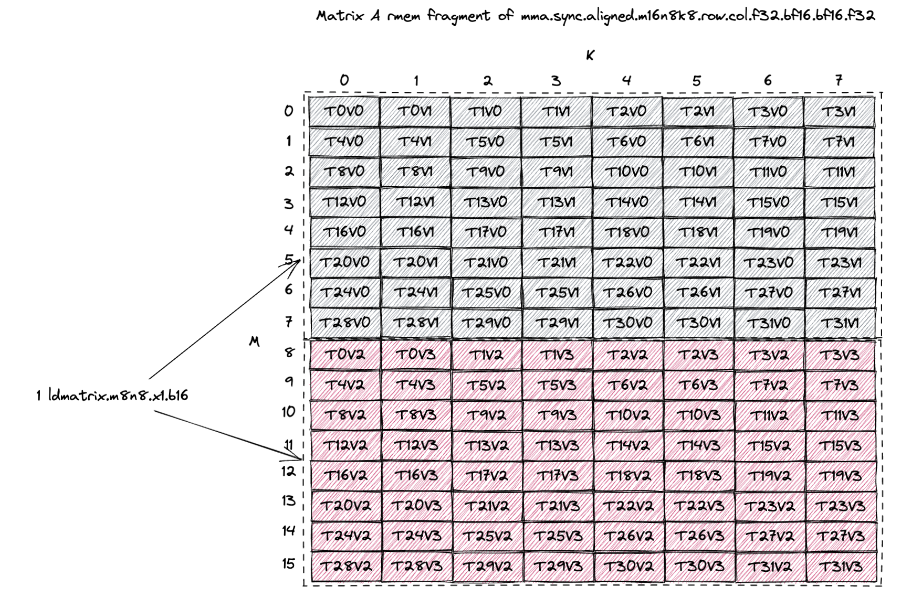

A tile 是 `[16, 8]`，存储在 32 个线程中，每个线程存储 A tile 的 4 个元素。
我们通过 [ldmatrix.m8n8.x1.b16](https://docs.nvidia.com/cuda/parallel-thread-execution/#warp-level-matrix-instructions-ldmatrix) 指令把 bf16 A tile 从 SMEM 加载到 RF。
每次调用 `ldmatrix` 都会把一个 `M=8, K=8`（即一个 `8x16B`）的 subtile 从 SMEM 加载到 RF。
所以灰色表示第一条 `ldmatrix` 指令加载的 `8x16B` 数据（每线程 2 个元素），红色表示第二条 `ldmatrix` 指令加载的数据（每线程 2 个元素）。
[PTX 9.0 文档图 104](https://docs.nvidia.com/cuda/parallel-thread-execution/#mma-ldmatrix-fragments)描述了 `ldmatrix` 指令之后 RF 中的数据 layout，这正是我们上面灰色和红色 subtile 的 layout。

**这表明，无论 A tile 在 SMEM 中以何种 layout 存储，`ldmatrix.m8n8` 的 `8x16B` subtile 加载模式必须要打满 SMEM 读带宽（128B/cycle）。
`swizzle layout` 正是满足这一要求的解决方案。
下面我们将展示每一种 `swizzle layout` 是如何满足这一要求的。**

#### 2.1.1. 用 CuTe 术语描述上面的示例

最终我们会通过 CuTe 来使用 mma 指令，所以我们用 CuTe 的术语重新描述一下上面的例子。

`mma.sync.aligned.m16n8k8.row.col.f32.bf16.bf16.f32` 的 mma atom 是 [SM80_16x8x8_F32BF16BF16F32_TN](https://github.com/NVIDIA/cutlass/blob/c6aeb9179c5f74a0fcdbd28527bf4b6ba8c60752/include/cute/arch/mma_sm80.hpp#L191)。
我们可以用 [print_svg](https://github.com/NVIDIA/cutlass/blob/c6aeb9179c5f74a0fcdbd28527bf4b6ba8c60752/include/cute/util/print_svg.hpp#L230) 函数画出 fragment layout，将得到下面这张图。

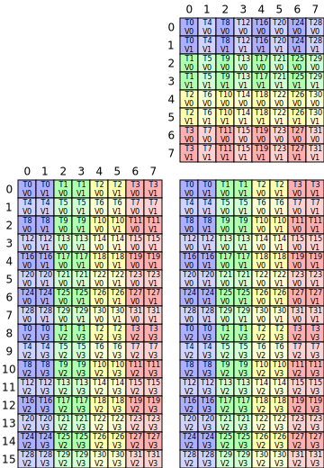

A 矩阵的 fragment layout 在图的左下方。
B 矩阵在右上方，C 矩阵在右下方。
我们可以看到 A 矩阵的 fragment layout 与我们上面手动画的完全一致。

在 CuTe 中，这个 A 矩阵 fragment layout 称为 `inverse TV-layout`，意思是它表示 `(M, K)` 到 `(T, V)` 之间的坐标映射。
`T` 代表线程 id，`V` 代表 value id。
`T1V2` 表示线程 1 中的第三个 value（元素）。
下面的公式展示了我们如何推导 inverse TV-layout 的 stride。

```bash
# inverse TV-layout: (M, K) -> (T, V)
Shape: ((8, 2), (2, 4))
Stride: ((4, 64), (32, 1))
m0 = [0, 8)
m1 = [0, 2)
n0 = [0, 2)
n1 = [0, 4)
A((m0, m1), (n0, n1)) # tensor 的自然坐标
  = TV(m0 * 4 + n1, m1 * 2 + n0) # TV layout 的 2d 坐标
  = TV((m0 * 4 + n1) * 1 + (m1 * 2 + n0) * 32) # TV layout 的 1d 坐标
  = TV(m0 * 4 + m1 * 64 + n0 * 32 + n1)
```

A 矩阵 fragment 实际的 `TV-layout`（从 `(T, V)` 到 `(M, K)` 的映射）可以通过检查 mma atom 的 [MMA_Traits](https://github.com/NVIDIA/cutlass/blob/c6aeb9179c5f74a0fcdbd28527bf4b6ba8c60752/include/cute/atom/mma_traits_sm80.hpp#L123) 的 `ALayout` 成员来获取。
在这个例子中，A 的 TV-layout 是 [SM80_16x8_Row](https://github.com/NVIDIA/cutlass/blob/c6aeb9179c5f74a0fcdbd28527bf4b6ba8c60752/include/cute/atom/mma_traits_sm80.hpp#L53)。
下面的公式展示了我们如何验证这个 `TV-layout` 是正确的。

```bash
# TV layout: (T, V) -> (M, K)
Shape: ((4, 8), (2, 2))
Stride: ((32, 1), (16, 8))
t0 = [0, 4)
t1 = [0, 8)
v0 = [0, 2)
v1 = [0, 2)
TV((t0, t1), (v0, v1)) # tensor 的自然坐标
  = A(t0 * 32 + t1 + v0 * 16 + v1 * 8) # A layout 的 1d 坐标
  = A((t1 + v1 * 8) * 1 + (t0 * 2 + v0) * 16) # A layout 的 1d 坐标
  = A(t1 + v1 * 8, t0 * 2 + v0) # A layout 的 2d 坐标
```

注意上面这两个 layout 互为逆，即 `TV-layout` 的逆就是 `inverse TV-layout`。
我们可以用下面的 CuTe-DSL 代码很容易地验证这一点——对 TV-layout 取 `right_inverse`，就会得到 `inverse TV-layout`。
CuTe C++ 代码在[这里](https://github.com/Yang-YiFan/Yang-YiFan.github.io/tree/main/blogs/mma_swizzle/code/mma_swizzle.cpp)。

```python
import cutlass
import cutlass.cute as cute

@cute.jit
def test():
    TV = cute.make_layout(((4, 8), (2, 2)), stride=((32, 1), (16, 8))) # (T, V) -> (M, K)
    cute.printf("TV: {}\n", TV)
    A = cute.right_inverse(TV) # (M, K) -> (T, V)
    cute.printf("A: {}\n", A)

if __name__ == "__main__":
    test()
```

## 3. MMA Swizzle Layout

Tensor Core 接受 8 种合法的 SMEM `swizzle layout`（Blackwell 引入了 2 种新的，但为了简化这里我们略去不表）：
- K-Major Swizzle None（[第 3.1.1 节](#311-k-major-swizzle-none)）（[CuTe 定义](https://github.com/NVIDIA/cutlass/blob/c6aeb9179c5f74a0fcdbd28527bf4b6ba8c60752/include/cute/atom/mma_traits_sm90_gmma.hpp#L98)）
- K-Major Swizzle 32B（[第 3.1.2 节](#312-k-major-swizzle-32b)）（[CuTe 定义](https://github.com/NVIDIA/cutlass/blob/c6aeb9179c5f74a0fcdbd28527bf4b6ba8c60752/include/cute/atom/mma_traits_sm90_gmma.hpp#L100)）
- K-Major Swizzle 64B（[第 3.1.3 节](#313-k-major-swizzle-64b)）（[CuTe 定义](https://github.com/NVIDIA/cutlass/blob/c6aeb9179c5f74a0fcdbd28527bf4b6ba8c60752/include/cute/atom/mma_traits_sm90_gmma.hpp#L102)）
- K-Major Swizzle 128B（[第 3.1.4 节](#314-k-major-swizzle-128b)）（[CuTe 定义](https://github.com/NVIDIA/cutlass/blob/c6aeb9179c5f74a0fcdbd28527bf4b6ba8c60752/include/cute/atom/mma_traits_sm90_gmma.hpp#L104)）
- MN-Major Swizzle None（[第 3.2.1 节](#321-mn-major-swizzle-none)）（[CuTe 定义](https://github.com/NVIDIA/cutlass/blob/c6aeb9179c5f74a0fcdbd28527bf4b6ba8c60752/include/cute/atom/mma_traits_sm90_gmma.hpp#L88)）
- MN-Major Swizzle 32B（[第 3.2.2 节](#322-mn-major-swizzle-32b)）（[CuTe 定义](https://github.com/NVIDIA/cutlass/blob/c6aeb9179c5f74a0fcdbd28527bf4b6ba8c60752/include/cute/atom/mma_traits_sm90_gmma.hpp#L90)）
- MN-Major Swizzle 64B（[第 3.2.3 节](#323-mn-major-swizzle-64b)）（[CuTe 定义](https://github.com/NVIDIA/cutlass/blob/c6aeb9179c5f74a0fcdbd28527bf4b6ba8c60752/include/cute/atom/mma_traits_sm90_gmma.hpp#L92)）
- MN-Major Swizzle 128B（[第 3.2.4 节](#324-mn-major-swizzle-128b)）（[CuTe 定义](https://github.com/NVIDIA/cutlass/blob/c6aeb9179c5f74a0fcdbd28527bf4b6ba8c60752/include/cute/atom/mma_traits_sm90_gmma.hpp#L94)）

重要的是，**swizzle 不会改变输入 tile 的 major（连续） 属性**，即如果 GMEM 中的 tile 是 K-major（K 维度是连续维度），那么 swizzle 之后 SMEM tile 仍然是 K-major 的。
GMEM 到 SMEM 的拷贝过程中不发生转置（transpose）。
转置发生在 SMEM 到 RF 的拷贝过程中（即 `ldmatrix`）（关于这点更多内容见[第 6 节](#6-转置的输入是如何处理的)）。
所以如果 GMEM tile 是 MN-major（M/N 维度连续），你应该为 SMEM 选择 MN-major 的 swizzle layout。

[PTX 9.0 文档第 9.7.16.10.6 节 Shared Memory Layout and Swizzling](https://docs.nvidia.com/cuda/parallel-thread-execution/#tcgen05-shared-memory-layout-swizzling) 描述了所有这些 swizzle layout。
我基本上是重新绘制了所有的图，并加上了更多细节和注释。

### 3.1. K-Major Swizzle Layout

如果 GMEM tile 是 K-major（K 维度连续），你应该为 SMEM 选择 K-major swizzle layout。

#### 3.1.1. K-Major Swizzle None

第一个合法 layout 称为 `Swizzle None`，如下图所示。
CuTe 把它称为 `swizzle interleaved`，这个叫法可能更准确，但我们遵循 [PTX 9.0 文档](https://docs.nvidia.com/cuda/parallel-thread-execution/#tensor-swizzling-modes)的命名约定，把它称为 `swizzle none`。

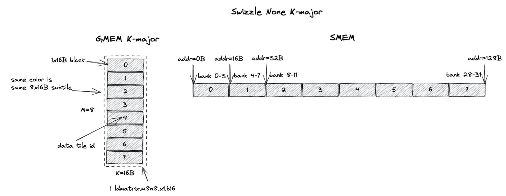

图左侧显示的是 GMEM 中一个 `8x16B`（`M=8`，`K=16B`，如果是 bf16 输入时 `K=8`）的 tile，每一行是一个 16B chunk。
图中每个灰色块是一个 `1x16B` chunk（包含 8 个 K 值），而这个 `8x16B` tile 包含从 chunk 0 到 chunk 7 的 8 个 chunk。
这 8 个 chunk（`8x16B`）构成了我们所说的 `swizzle none atom`。

`swizzle none` layout 规定，`swizzle none atom` 在 SMEM 中按图右侧所示的 chunk 顺序连续存储。
在这种情况下，chunk 0 存在 SMEM 的前 16B，chunk 1 存在 SMEM 的第二个 16B，依此类推。
注意，8 个 chunk 在 SMEM 中占 128B，这恰好匹配 SMEM 的 32 个 bank（4B/bank）的组织方式。
这意味着 chunk 0 位于 bank 0-3，chunk 1 位于 bank 4-7，依此类推。

回想一下，在使用 `ldmatrix.m8n8` 的 `8x16B` 加载模式时，swizzle layout 应当打满 SMEM 读带宽（128B/cycle）。
`swizzle none` layout 满足这一要求。
恰好，`ldmatrix.m8n8` 指令加载的 `8x16B` subtile 正好就是 1 个 `swizzle none atom`。
由于所有 8 个 chunk 在 SMEM 中连续存储，`ldmatrix.m8n8` 指令可以在 1 个 cycle 内无 bank conflict 地加载全部 8 个 chunk。
而且这个 `8x16B` subtile 是 K-major 的。

极其让人困惑的是，`swizzle none` 并不是你所期望的那种直观的线性 SMEM layout，因为它强制要求 `M=8, K=8 K major` subtile 在 SMEM 中连续存储。
我们将在[第 4 节](#4-为什么要-swizzle)中用一个具体的例子进一步解释这一点。
我们也会在[第 9.1 节](#91-tma-swizzle-none)中详细解释 TMA 和 MMA 的 `Swizzle None` 模式之间的差异。

#### 3.1.2. K-Major Swizzle 32B

在 `swizzle 32B` layout 下，swizzle atom 变得更大了。
它现在变成了一个 `8x32B` 的 tile（`M=8`，`K=32B`，假设 bf16 输入时 `K=16`）。
所以 `K-Major Swizzle 32B` 意味着 swizzle atom 是一个 `8x32B` 的 K-major tile。

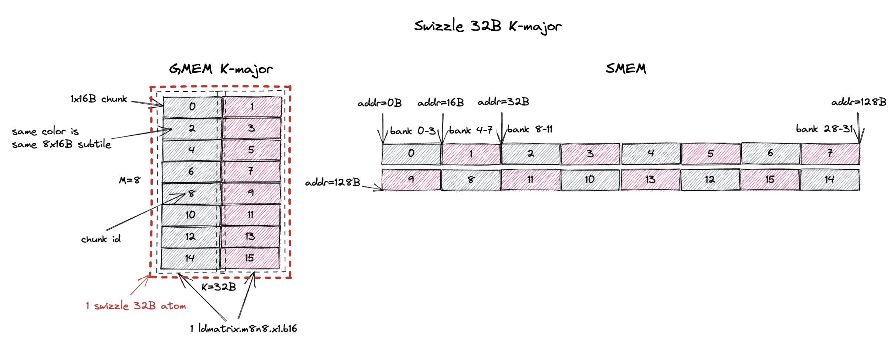

这个 swizzle 32B atom 现在包含 16 个 `1x16B` chunk，或者说 2 个 `8x16B`（一个 `ldmatrix.m8n8` 加载的）subtile。
`swizzle 32B` layout 规定，atom 中的 16 个 `1x16B` chunk 在 SMEM 中按图右侧所示的 chunk 顺序连续存储。

在这个 swizzle 32B layout 上运行同样的 `ldmatrix.m8n8` 指令加载一个 `8x16B` 的 subtile，我们想打满 SMEM 读带宽（128B/cycle）。
swizzle 32B layout 包含 2 个这样的 subtile，分别用灰色和红色标注。
灰色 subtile 包含 chunk 0, 2, 4, 6, 8, 10, 12, 14，红色 subtile 包含 chunk 1, 3, 5, 7, 9, 11, 13, 15。
因为 chunk 在 SMEM 中按特定的 swizzle 顺序组织，从图中我们可以看出，从 SMEM 加载灰色 subtile 可以在 1 个 cycle 内无 bank conflict 地完成。
红色 subtile 同理。
所以 `ldmatrix.m8n8` 指令可以在 1 个 cycle 内无 bank conflict 地加载灰色和红色两个 subtile。

最后，我们引入一个叫做 `16B atomicity`（16B 原子性）的新概念。
它的意思是：对于一个在 GMEM 中连续的 16B chunk，它在 swizzle 之后在 SMEM 中也是连续的。
我们的 `16B` chunk 组织方式正是如此。
即便 chunk 的顺序在 SMEM 中被 swizzle 了，每个 chunk 内部的数据仍然保持连续。
所有 swizzle layout 默认都使用 `16B atomicity`。
`swizzle 128B` layout 有例外，它可以允许 32B/64B atomicity（即 chunk 大小为 32B/64B 而非 16B）。
但为了简化，本博客中我们忽略它们。

现在你大概能看出，为什么我前面说 *swizzle 不会改变输入 tile 的 major（连续） 属性*——正是因为这个 `16B atomicity` 性质。
如果 GMEM 中的 tile 是 K-major（K 维度是连续维度），那么代表 8 个 K 值的 16B chunk 在 swizzle 之后在 GMEM 和 SMEM 中都是连续的。
类似地，如果 GMEM 中的 tile 是 M-major（M 维度是连续维度），那么代表 8 个 M 值的 16B chunk 在 swizzle 之后在 GMEM 和 SMEM 中都是连续的。
Swizzle 保持原子性，它只在 *16B chunk 粒度上* 进行重排序。

#### 3.1.3. K-Major Swizzle 64B

道理一样，只不过这次 swizzle atom 变成了一个 `8x64B` tile（`M=8`，`K=64B`，或假设 bf16 输入时 `K=32`）。
swizzle 64B atom 现在包含 32 个 `1x16B` chunk，或者说 4 个 `8x16B`（`ldmatrix.m8n8` 所要求的）subtile（用灰、红、紫、蓝标注）。
图右侧所示的 chunk 顺序确保 `ldmatrix.m8n8` 可以在 1 个 cycle 内无 bank conflict 地读取每个带颜色的 `8x16B` subtile。

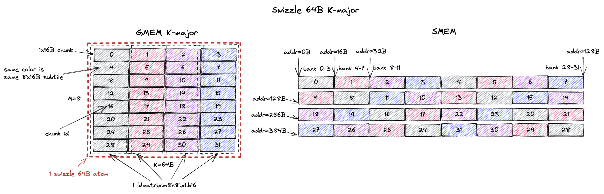

#### 3.1.4. K-Major Swizzle 128B

Swizzle 128B 是最常用的 swizzle layout，我们将在[第 5 节](#5-该选择哪个-swizzle-atom)中解释原因。

类似的，swizzle atom 变成了一个 `8x128B` tile（`M=8`，`K=128B`，假设 bf16 输入时 `K=64`）。
而且每个 `8x16B` subtile 都可以在 1 个 cycle 内无 bank conflict 地从 SMEM 加载出来。

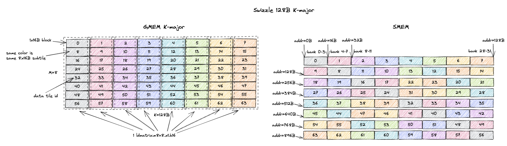

### 3.2. MN-Major Swizzle Layout

如果 GMEM tile 是 M/N-major（M/N 维度连续），你应该为 SMEM 选择 MN-major swizzle layout。

#### 3.2.1. MN-Major Swizzle None

MN-major layout 的 swizzle atom 是 `16Bx8`（`M=16B`，假设 bf16 输入时 `M=8`；`K=8`）。
现在每个 `16Bx1` chunk 包含 8 个 M 值，它们在 swizzle 之后在 GMEM 和 SMEM 中都是连续的。
但 1 cycle/chunk 的性质没有改变。
`ldmatrix.m8n8` 仍然可以在 1 个 cycle 内无 bank conflict 地加载每个 `16Bx8` subtile，只不过这次 subtile 是 MN-major 而非 K-major。

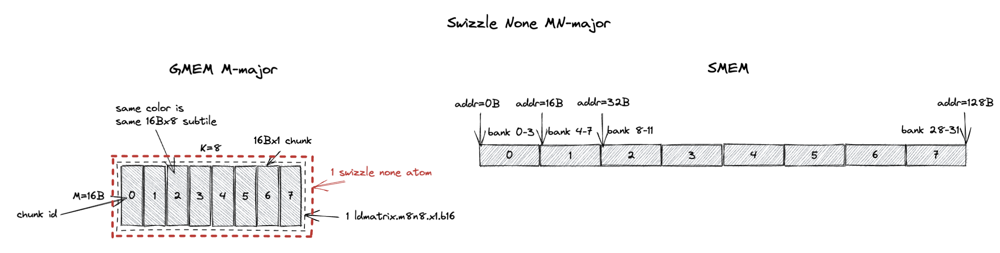

#### 3.2.2. MN-Major Swizzle 32B

类似地，swizzle atom 变成 `32Bx8`（`M=32B`，假设 bf16 输入时 `M=16`；`K=8`）。
它包含 16 个 `16Bx1` chunk，或者说 2 个 `16Bx8` subtile（用灰色和红色标注）。
swizzle 32B layout 确保 `ldmatrix.m8n8` 可以在 1 个 cycle 内无 bank conflict 地加载每个颜色的 `16Bx8` subtile。

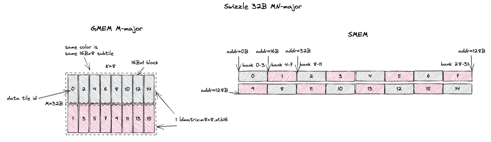

#### 3.2.3. MN-Major Swizzle 64B

对于 swizzle 64B，swizzle atom 变成 `64Bx8`（`M=64B`，假设 bf16 输入时 `M=32`；`K=8`）。
它包含 32 个 `16Bx1` chunk，或者说 4 个 `16Bx8` subtile（用灰、红、紫、蓝标注）。
swizzle 64B layout 确保 `ldmatrix.m8n8` 可以在 1 个 cycle 内无 bank conflict 地加载每个颜色的 `16Bx8` subtile。

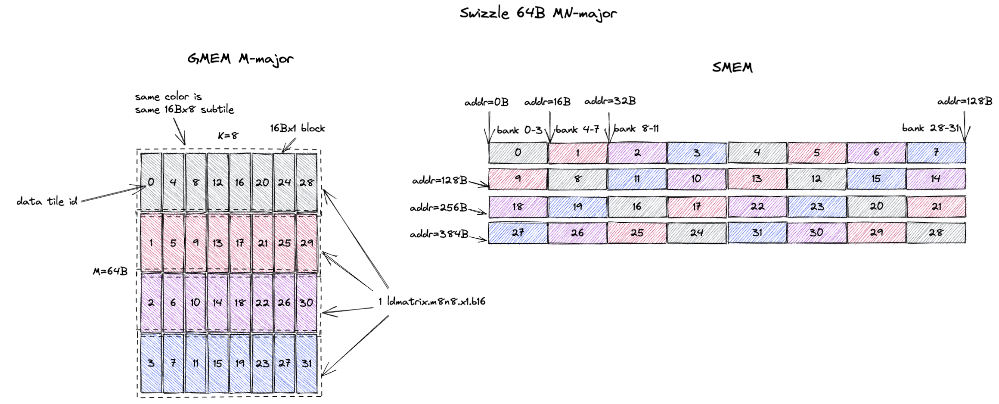

#### 3.2.4. MN-Major Swizzle 128B

Swizzle 128B 是最常用的 swizzle layout，我们将在[第 5 节](#5-该选择哪个-swizzle-atom)中解释原因。

道理一样，swizzle atom 变成了一个 `128Bx8` tile（`M=128B`，假设 bf16 输入时 `M=64`；`K=8`）。
而且每个 `16Bx8` subtile 都可以在 1 个 cycle 内无 bank conflict 地从 SMEM 加载。

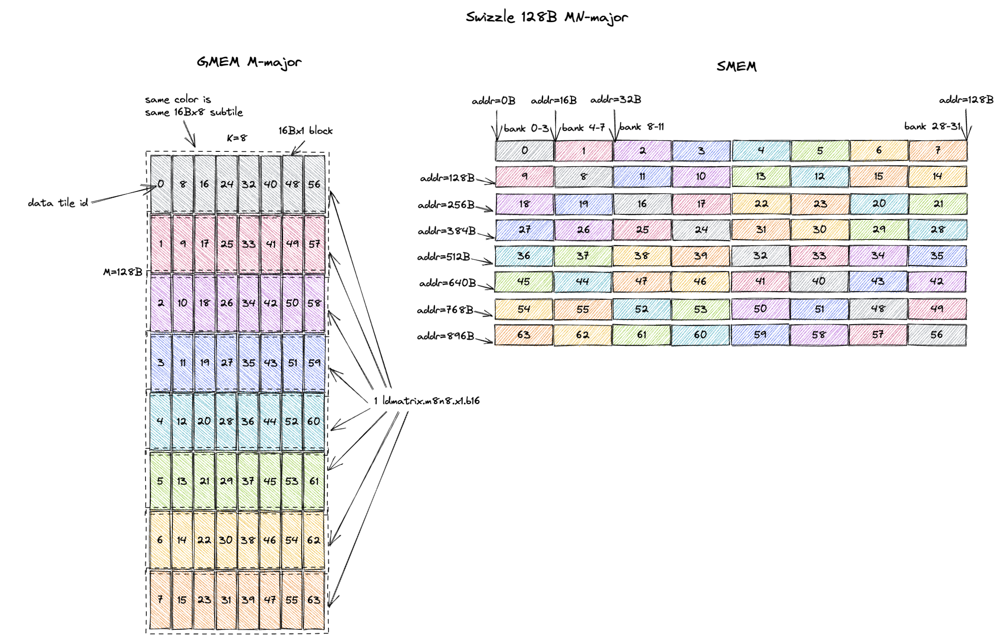

## 4. 为什么要 Swizzle？

既然我们已经知道了 swizzle layout 是什么，那就来回答为什么需要 swizzle 这个问题。
你大概已经能猜出原因了：它让 `ldmatrix.m8n8` 指令能够在 1 个 cycle 内无 SMEM bank conflict 地加载一个大 tile 内的 `8x16B`/`16Bx8` 的 subtile。

下面我们用一个具体的例子来解释。
这里我想把 GMEM 中一个 `M=8, K=32B`（假设 bf16 输入时 K=16）的 K-major tile 存储到 SMEM。
在 GMEM 中，chunk 0、1 是连续的，chunk 2、3 是连续的，依此类推。

所以一个自然的 SMEM layout 是遵循 chunk 在 GMEM 中的连续性，以获得更好的拷贝向量化（vectorization）。
每次 GMEM 到 SMEM 的拷贝由 2 个 chunk（32B）组成，而不是 1 个 chunk（16B）。
我们把这称为 `SMEM linear layout`。
如图右上方所示，我只是把 chunk 0, 1, 2, 3, ... 连续地存到 SMEM 中。
但你立刻就能看出这种 layout 的问题：`ldmatrix.m8n8` 指令无法在 1 个 cycle 内无 SMEM bank conflict 地加载一个 `8x16B` subtile。
如果我加载灰色 subtile，它会加载 chunk 0, 2, 4, 6, 8, 10, 12, 14，而它们都存在 SMEM 一半的 bank 中。
这会导致 2-way bank conflict。

现在让我们看看如果使用 `swizzle 32B` layout 会发生什么。
`M=8, K=32B` 恰好就是 1 个 `swizzle 32B` atom 的大小。
当我们访问灰色 subtile 时，它会加载 chunk 0, 2, 4, 6, 8, 10, 12, 14，而它们都存在不同的 SMEM bank 中。
红色 subtile 同理。
所以 `ldmatrix.m8n8` 指令可以在 1 个 cycle 内无 bank conflict 地加载灰色和红色两个 subtile。
**当 `ldmatrix.m8n8` 加载一个 `8x16B` subtile 时，Swizzle 避免了 bank conflict。**

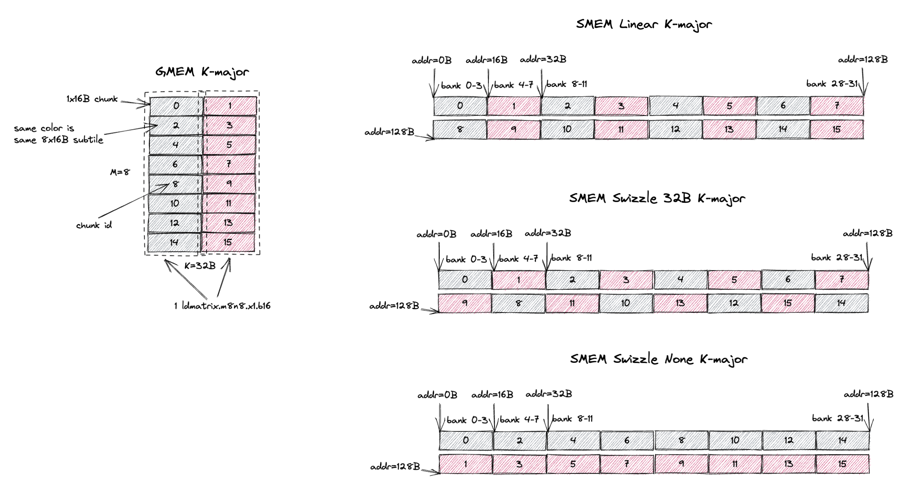

`swizzle none` layout 也能在 `ldmatrix.m8n8` 加载一个 `8x16B` subtile 时避免 bank conflict。
但它要求 `M=8, K=8 K major` subtile 在 SMEM 中连续存储。
*容易让人困惑的是*，这与我们上面提到的 `SMEM linear layout` 不同。
尽管它叫 `swizzle none`，但它并不是你所期望的那种直观的线性 SMEM layout。

## 5. 该选择哪个 Swizzle Atom？

从[第 4 节](#4-为什么要-swizzle)的例子中，我们可以看到 `swizzle none` 和 `swizzle 32B` layout 都能在 `ldmatrix.m8n8` 加载一个 `8x16B` subtile 时避免 bank conflict。
但我要选择哪一个 swizzle atom 呢？
不同的 swizzle atom 会导致不同的 *GMEM 内存访问效率*。

下面我们给出一个例子，展示不同 swizzle layout 之间的性能差异。
我们试图加载到 SMEM 的 tile 是 `M=8, K=64B`（假设 bf16 输入时 K=32）的 K-major tile。
我们比较 3 种 swizzle layout：`K-major swizzle none`、`K-major swizzle 32B` 和 `K-major swizzle 64B`，如下图所示。

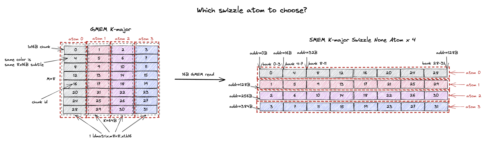

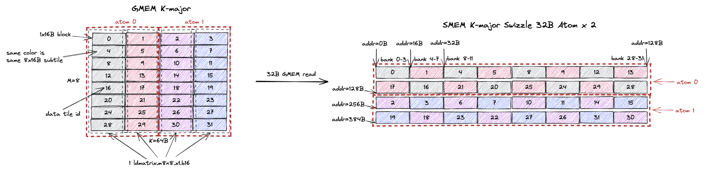

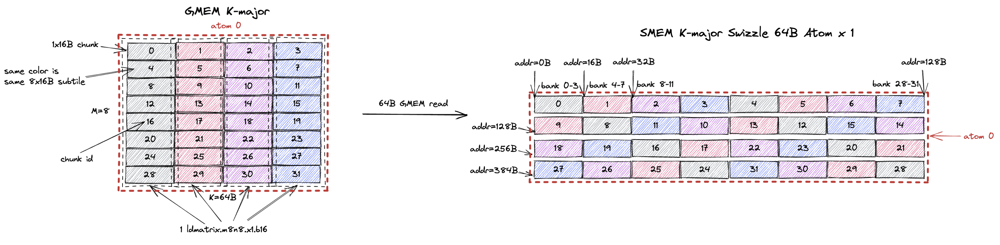

这个 `8x64B` tile 包含 32 个 `1x16B` chunk，或者说 4 个 `8x16B` subtile（用灰、红、紫、蓝标注）。
它也可以由 4 个 `swizzle none` atom、2 个 `swizzle 32B` atom，或 1 个 `swizzle 64B` atom 构成。

GMEM 到 SMEM 的拷贝可以有很多种方式：
- `ld.global`：GMEM->RF，`st.shared`：RF->SMEM
- TMA load：GMEM->SMEM

我们聚焦于 `ld.global + st.shared` 这条路径，因为 TMA 本质上只是把这个流程在硬件中固化了。

当使用 `swizzle none` layout 时，我们希望 `st.shared` 没有任何 bank conflict，以最大化 SMEM 写带宽。
所以每个线程会向 SMEM 中不同的 bank 存储 4B，而全部 32 个线程会处理 SMEM 中 128B 连续的数据，即 chunk 0, 4, 8, ..., 28。
然后这 32 个线程需要把 chunk 0, 4, 8, ..., 28 从 GMEM 加载到 RF。
但因为 GMEM tile 是 K-major 的，GMEM 中只有单个 16B chunk 是连续的。
当从 GMEM 中读出 chunk 0, 4, 8, ..., 28 时，我们会产生 16B 的 GMEM 读请求。
SMEM 的其他 128B 行也是如此，GMEM 读粒度将是 16B。

当使用 `swizzle 32B` layout 时，类似地，我们希望在 `st.shared` 中避免 bank conflict。
所以全部 32 个线程会处理 chunk 0, 1, 4, 5, 8, 9, 12, 13。
现在 GMEM load 可以一次连续读 2 个 chunk，即 32B 的 GMEM 读请求。
对于 SMEM 的其他 128B 行也是如此，GMEM 读粒度将是 32B。

你已经能看出趋势了：当使用 `swizzle 64B` layout 时，32 个线程会从 GMEM 读取 chunk 0, 1, 2, 3, 4, 5, 6, 7。
GMEM load 粒度是 64B。
类似地，对于第 2 行，chunk 9, 8, 11, 10, 13, 12, 15, 14 会以同样的 64B 请求粒度从 GMEM 读取。

GPU 的 cacheline 大小是 128B，所以读取连续的 128B 数据能最好地利用 GMEM 带宽。
正如我们从上面的例子中看到的：
- `swizzle none` layout 产生 16B 的 GMEM 读请求
- `swizzle 32B` layout 产生 32B 的 GMEM 读请求
- `swizzle 64B` layout 产生 64B 的 GMEM 读请求

所以在这个例子中，`K-major swizzle 64B` layout 能达到最好的 GMEM 内存访问效率。
显然 `swizzle 128B` 会产生 128B 的 GMEM 读请求。
但在这个例子中我们不能用它，因为我们想要的 tile 在 K 维度上只有 64B，而不是 128B。
如果我们想要一个 `8x128B` 的 tile，那 `swizzle 128B` 就是最佳选择。
所以只要 tile size 允许，你应该总是尝试使用 `swizzle 128B` layout。

选择 swizzle layout 的目标是最大化 GMEM 读效率。
也就是说，给定一个 tile 大小，应该使用能容纳该 tile 的尽可能大的 swizzle atom：
- 如果 tile 大小是 `K=16B` K-major，`K-major swizzle none` 是最佳选择。会产生 16B 的 GMEM 读请求。
- 如果 tile 大小是 `K=32B` K-major，`K-major swizzle 32B` 是最佳选择。会产生 32B 的 GMEM 读请求。
- 如果 tile 大小是 `K=64B` K-major，`K-major swizzle 64B` 是最佳选择。会产生 64B 的 GMEM 读请求。
- 如果 tile 大小是 `K>=128B` K-major，`K-major swizzle 128B` 是最佳选择。会产生 128B 的 GMEM 读请求。
- 如果 tile 大小是 `M/N=16B` MN-major，`MN-major swizzle none` 是最佳选择。会产生 16B 的 GMEM 读请求。
- 如果 tile 大小是 `M/N=32B` MN-major，`MN-major swizzle 32B` 是最佳选择。会产生 32B 的 GMEM 读请求。
- 如果 tile 大小是 `M/N=64B` MN-major，`MN-major swizzle 64B` 是最佳选择。会产生 64B 的 GMEM 读请求。
- 如果 tile 大小是 `M/N>=128B` MN-major，`MN-major swizzle 128B` 是最佳选择。会产生 128B 的 GMEM 读请求。

上面这条规则正是 Cutlass 的 [sm100_smem_selector](https://github.com/NVIDIA/cutlass/blob/c6aeb9179c5f74a0fcdbd28527bf4b6ba8c60752/include/cutlass/gemm/collective/builders/sm100_common.inl#L82) 中所实现的，用来根据 tile size 选择最佳的 SMEM swizzle layout。

## 6. 转置的输入是如何处理的？

根据 `mma.sync.aligned.m16n8k8.row.col.f32.bf16.bf16.f32` 指令的 [ptx 定义](https://docs.nvidia.com/cuda/parallel-thread-execution/#warp-level-matrix-instructions-mma)，A 矩阵（`[M, K]`）是 row major（K-major），B 矩阵（`[K, N]`）是 column major（K-major）。
如果我的 A 矩阵在 GMEM 中是 M-major 会怎样？
在被喂给 tensor core 之前，A 的转置发生在哪里？
答案是：`ldmatrix` 会在把 A 喂给 tensor core 之前对它做可选的转置（如果指令有 `trans` 后缀的话）。

我们先来理解非转置（K-major）的 A 矩阵是如何被处理的。
bf16 `mma.m16n8k8` 的输入 tile 大小是 `M=16, K=8 或 K=16B`，如左图所示。
因为 tile K 只有 16B，我们为 SMEM 使用 `K-major swizzle none` layout，这个 tile 包含 2 个 `swizzle none` atom。
每条 `ldmatrix.m8n8` 指令会把一个 `8x16B` subtile 从 SMEM 加载到 RF。
第一次加载的是灰色的 chunk 0, 1, 2, 3, 4, 5, 6, 7，寄存器 fragment 的值显示在右下方。
例如，线程 0（T0）会持有 `M0K0, M0K1, M0K2, M0K3`。
T22 会持有 `M5K4, M5K5, M5K6, M5K7`。
这正是 mma 指令所期望的输入 fragment layout（如[第 2.1 节](#21-举例ampere-mma)所画）。

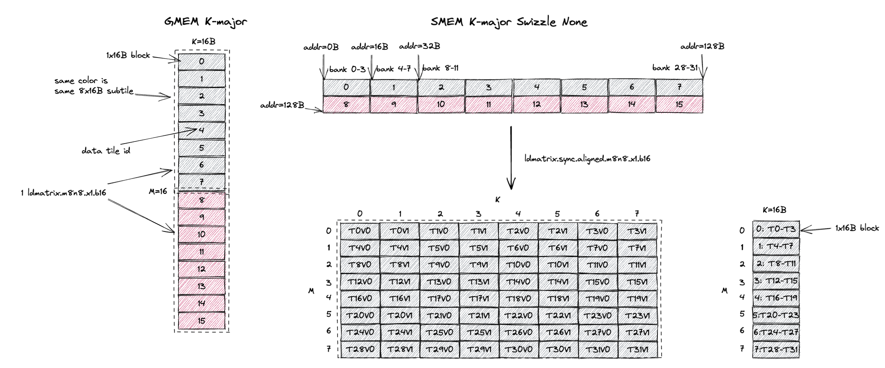

现在我们来看 M-major 的 A 矩阵是如何被处理的。
bf16 `mma.m16n8k8` 的输入 tile 大小仍然是 `M=32B 或 M=16, K=8`，如左图所示。
因为 tile M 是 32B，我们为 SMEM 使用 `M-major swizzle 32B` layout，这个 tile 包含 1 个 `swizzle 32B` atom。
如果我们什么都不做，每条 `ldmatrix.m8n8` 指令会把一个 `16Bx8` subtile 从 SMEM 加载到 RF。
第一次加载的是灰色的 chunk 0, 2, 4, 6, 8, 10, 12, 14，寄存器 fragment 的值显示在左下方。
那么 T0 持有 `M0K0, M1K0, M2K0, M3K0`。
T22 持有 `M4K5, M5K5, M6K5, M7K5`。
这不是 mma 指令所期望的输入 fragment layout，它是所需 layout 的转置。

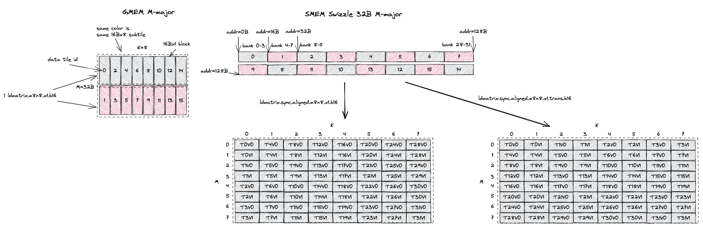

所以我们需要 `ldmatrix.m8n8.trans`，它在 SMEM->RF 拷贝过程中转置这个 `16Bx8` tile。
如果我们使用 `ldmatrix` 的转置版本，第一次加载的仍然是灰色的 chunk 0, 2, 4, 6, 8, 10, 12, 14，寄存器 fragment 的值显示在右下方。
现在 T0 持有 `M0K0, M1K0, M2K0, M3K0`。
T22 持有 `M4K5, M5K5, M6K5, M7K5`。
这正是 mma 指令所期望的输入 fragment layout。

总结一下，如果输入在 SMEM/GMEM 中是 MN-major，`ldmatrix` 会对输入做可选的转置（即加上 `trans` 后缀），使得 RF 中的输入值变成 Tensor Core 所需的 K-major layout。

### 6.1. 与无 Bank Conflict 矩阵转置的区别

同样非常*让人困惑*的是，你之前可能听说过可以用 swizzle 来做无 bank conflict 的矩阵转置。
但根据我们前面的描述，转置发生在 `ldmatrix` 的 SMEM->RF 拷贝过程中，与 SMEM swizzle layout 毫无关系。
实际上，这两种说法都是没错（所以非常让人迷惑）。

mma swizzle layout 有 16B atomicity（忽略 32B/64B atomicity 的特殊情况）。
做无 bank conflict 矩阵转置所需的 swizzle layout 通常是 4B atomicity（假设 fp32 输入）。
所以它们都是 swizzle layout，但具有不同的 atomicity。

但精神是一样的，以 `K-major swizzle 64B` 为例，它让我们可以对一个大的 `8x64B` tile/atom 的两种形状的 subtile 进行无 bank conflict 访问：`2x64B`（这个是 GMEM->SMEM 拷贝时 `st.shared` 所需要的形状）和 `8x16B`（这个是 SMEM->RF 拷贝时 `ldmatrix.m8n8` 所需要的形状）。
对于矩阵转置，swizzle layout 允许对输入矩阵 tile 的一行（`1x128B`）或一列（`32x4B`）进行无 bank conflict 访问。
**Swizzle layout 允许对两种不同形状的 subtile 进行无 bank conflict 访问。**

你可以在 [Lei Mao 的博客](https://leimao.github.io/article/CuTe-Matrix-Transpose/)或 [Colfax research 的博客](https://research.colfax-intl.com/tutorial-matrix-transpose-in-cutlass/)中读到更多关于无 bank conflict 矩阵转置的内容。


## 7. Swizzle Atom Layout

到目前为止，我们大多看的是只包含 1 个或几个 swizzle atom 的小 tile 尺寸。
自然的下一个问题是：当 tile 尺寸大于 swizzle atom 尺寸时，swizzle atom 之间的 layout 是怎样的？
下面我们展示一个 `M=16, K=64B`（假设 bf16 输入时 K=32）的 K-major tile 的例子，以及不同的 swizzle atom 是如何排布以构成这个 tile 的。

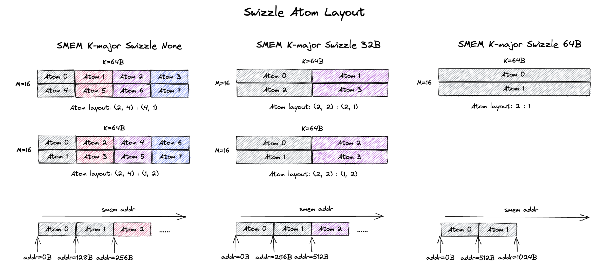

这个 `16x64B` tile 包含 8 个 `swizzle none` atom。
这些 atom 排成一个 2x4 网格，如左图所示。
但 atom layout 可以是 row-major（上）或 column-major（下）。
对于 row-major 的 atom layout，同一行的 atom 在 SMEM 中是连续的（例如 atom 0, 1, 2, 3）。
对于 column-major 的 atom layout，同一列的 atom 在 SMEM 中是连续的（例如 atom 0, 4）。

类似地，这个 `16x64B` tile 包含 4 个 `swizzle 32B` atom。
你也可以把 atom 以 row-major 和 column-major 两种 layout 排成一个 2x2 网格（图中部）。
这两种情况下哪些 atom 在 SMEM 中是连续的是不同的。

作为一个 kernel 作者，你应该能够使用任意一种 swizzle atom layout 并得到正确的结果。
CuTe 对于任意的 swizzle atom layout 抽象掉了地址计算。

## 8. 那 Hopper 和 Blackwell 呢？

到目前为止我们只谈了 Ampere mma，希望你已经理解了：swizzle layout 与 `ldmatrix` 的组合能给 Ampere tensor core 喂入正确的数据。

Hopper 和 Blackwell mma 可以直接从 SMEM 获取输入，无需 `ldmatrix` 参与。
它们是如何理解不同的 swizzle atom 和 swizzle atom layout 的呢？
这些信息被编码在 SMEM matrix descriptor 中（CuTe 也可以自动为你构建它）。
你可以参考 [Hopper mma matrix descriptor](https://docs.nvidia.com/cuda/parallel-thread-execution/#asynchronous-warpgroup-level-matrix-shared-memory-layout-matrix-descriptor) 和 [Blackwell mma matrix descriptor](https://docs.nvidia.com/cuda/parallel-thread-execution/#tcgen05-matrix-descriptors) 了解更多细节。
不久之后，我会在另一篇单独的博客中，用我写的并在 FlashInfer 中开源的[一个针对小 batch size 优化的 Blackwell GEMM kernel](https://github.com/flashinfer-ai/flashinfer/blob/main/include/flashinfer/gemm/tgv_gemm.cuh)，更详细地介绍 Blackwell 的部分。
敬请期待 :)

**[更新]** 我写了一篇关于 [Blackwell MMA SMEM Descriptor](../smem_descriptor/smem_descriptor.md) 的博客，介绍了如何为 Blackwell MMA 构建 SMEM descriptor。

## 9. 与 TMA 的兼容性

Hopper 引入了 [Tensor Memory Accelerator (TMA)](https://developer.nvidia.com/blog/nvidia-hopper-architecture-in-depth/)，以加速 GMEM 和 SMEM 之间的数据搬运。
TMA 支持以 MMA 所期望的 swizzle 方式把 tile 加载到 SMEM。
所以在本节中，我们将解释如何使用 TMA 来加载可以被 Tensor Core 直接读取的 swizzle layout。

原理上，CuTe 使用一些魔法为你正确处理这一切。
但如果有的时候你想绕过 CuTe ，那我们还是要理解底层发生了。

如果你想检查给定一个 tile 尺寸和 swizzle layout 后，CuTe 会为你创建的 TMA box 尺寸是多少，你可以使用这个 [test_tma](https://github.com/Yang-YiFan/Yang-YiFan.github.io/tree/main/blogs/mma_swizzle/code/test_tma.cu) 代码，并在[这里](https://github.com/NVIDIA/cutlass/blob/8debf77437753beca676eb3c6bf97b56a5f9fd68/include/cute/atom/copy_traits_sm90_tma.hpp#L1067)添加一些代码来打印出创建的 TMA descriptor。

### 9.1. TMA Swizzle None

TMA 所支持的 swizzle layout 与我们上面描述的 mma swizzle layout*大致*兼容。
但有一些细微差别。
而最重要的区别是：`Swizzle None` layout 对 TMA 和 MMA 来说代表着不同的 layout。

下图解释了这一区别，以及如何在 TMA 中使用 `Swizzle None` 模式来正确地把数据喂给 Tensor Core。
我们从 GMEM 中一个 K-major `8x64B` tile 的例子开始，它将是 `mma.sync.aligned.m16n8k8.row.col.f32.bf16.bf16.f32` 指令的 A 操作数。
这里我们明确地想为 MMA 使用 `K-major Swizzle None` SMEM layout。
下图的第一行描述了实际的 SMEM layout。
这个 `8x64B` tile 被分解为 4 个 `8x16B` 的 `Swizzle None` atom。
每个 atom（128B）在 SMEM 中连续存储。
我们可以直接用一个简单的 `ld.global` 来发出 16B 的 GMEM 读请求，把整个 tile 加载到 SMEM。
然后后续的 MMA 会用 `ldmatrix.m8n8` 指令正确地读取 SMEM 中的 tile。

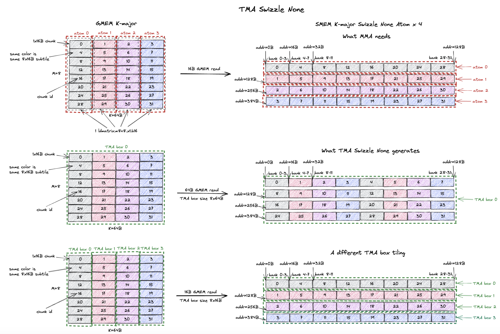

现在假设我想用 TMA 而非 `ld.global` 来把 tile 加载到 SMEM。
我们可以利用 TMA 的 `Swizzle None` 模式。
这就是图的第二行所展示的。
我们声明一个大小为 `8x64B` 的 TMA box（即整个 tile），并设置 `Swizzle None` 模式。
TMA 会做的是：
1. 从 GMEM 加载 box 的第一行（64B）（即 chunk 0, 1, 2, 3），并把它们连续地存到 SMEM。
2. 从 GMEM 加载 box 的第二行（64B）（即 chunk 4, 5, 6, 7），并把它们连续地存到 SMEM。
3. 从 GMEM 加载 box 的第三行（64B）（即 chunk 8, 9, 10, 11），并把它们连续地存到 SMEM。
4. ……直到 box 的最后一行（64B）被加载完。

这产生了 64B GMEM 读请求，GMEM 读取效率很高。
然而，正如我们在右侧看到的，这个 SMEM layout 并不是 `ldmatrix.m8n8` 所期望的！
tensor core 期望 SMEM layout 是 chunk 0, 4, 8, 12, 16, 20, 24, 28...，但用 8x64B 的 TMA box 尺寸，我们得到的 SMEM layout 是 chunk 0, 1, 2, 3, 4, 5, 6, 7...。
TMA 产生的 `Swizzle None` SMEM layout 与 tensor core 期望的 `Swizzle None` SMEM layout 不兼容。

这个问题是可以解决的，即我们可以创建一个特定的 TMA box 尺寸，使得 TMA 和 MMA 的 `Swizzle None` 模式相互兼容。
**关键在于：TMA box 的宽度（即你做 swizzle 的那个维度，也就是 major/连续维度）应该恰好与 1 个 swizzle atom 的宽度相同。你可以随意扩展 TMA box 的高度（只要是 8 的倍数就行）。**

换句话说，如果是 K major layout，你可以把许多 swizzle atom 在竖直方向上（M 维度）一个叠一个地堆叠起来来构成一个 TMA box。
但你不能在水平方向上（K 维度）堆叠超过 1 个 swizzle atom来构成一个 TMA box。
如果 M major layout，你可以把许多 swizzle atom 在K 维度一个叠一个地堆叠起来来构成一个 TMA box。
但你不能在M 维度堆叠超过 1 个 swizzle atom来构成一个 TMA box。

图的最后一行展示了使 TMA 和 MMA 的 `Swizzle None` 模式相互兼容的正确 TMA box 尺寸。
基本上我们创建一个大小为 `8x16B` 的 TMA box（恰好是 1 个 `Swizzle None` atom）。
如果 tile 更高（例如 `16x64B`），我们可以竖直堆叠 2 个 `Swizzle None` atom 来构成一个 `16x16B` 的 TMA box。
但同样，你不能构成一个 `8x32B` 的 TMA box，因为这个 box 宽度大于 1 个 `Swizzle None` atom 的宽度（16B），会产生不兼容的 SMEM layout。
正如你在图中看到的，TMA 一行一行地拷贝 box 中的数据，并把每个 box 行连续地放到 SMEM 中。
所以 TMA box 0 会把 chunk 0, 4, 8, 12... 连续地拷贝到 SMEM。
整个 `8x64B` tile 会被分解为 4 个 `8x16B` 的 TMA box，我们一个 box 一个 box 地把它拷贝到 SMEM。
最终的 SMEM layout 与 tensor core 期望的 `Swizzle None` SMEM layout 完全相同，也等价于 `ld.global` 的情况。
但你能看出这里的低效之处：每次 TMA 传输只会做 16B 的 GMEM 读请求。


### 9.2. TMA Swizzle

我们使用同样的 `8x64B` tile 的例子，但这次我们想为 MMA 使用 `K-major Swizzle 32B` layout，因为我们想改进 GMEM 访存效率。
`Swizzle None` 的情况下我们只产生 16B 的 GMEM 读请求。
下图的第一行展示了基本的 `ld.global` 实现。
这个 tile 被分解为 2 个 `8x32B` 的 `Swizzle 32B` atom，我们一个 atom 一个 atom 地把它拷贝到 SMEM。
GMEM 读效率改进到了 32B 的 GMEM 读请求。

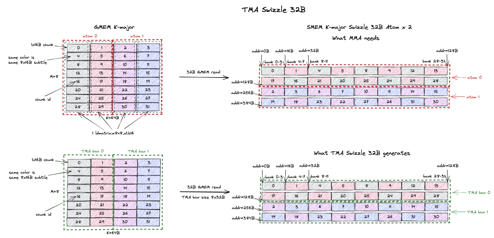

类似地，只要 TMA box 宽度恰好与 1 个 `Swizzle 32B` atom 的宽度（32B）相同，我们就可以用 TMA 来实现这一点。
图的第二行正是展示了这个情况。
我们有一个大小为 `8x32B` 的 TMA box（恰好是 1 个 `Swizzle 32B` atom），而这个 tile 由 2 个 `8x32B` 的 TMA box 组成。
TMA 会从 GMEM 读取 box 0，并把 box 0 的各行连续地放到 SMEM 中（即 chunk 0, 1, 4, 5, 8, 9...）。
把 TMA swizzle 模式设置为 `Swizzle 32B`，它还会对这些 16B 数据 chunk 应用适当的 swizzle。
右侧最终得到的 SMEM layout 与 `ld.global` 的情况完全相同。
所以我们为 MMA 得到了正确的 swizzle layout，而且现在 GMEM 访问效率改进到了 32B 的 GMEM 读请求。

再次强调这一点：TMA box 可以任意高（例如 `16x32B` 或 `32x32B`），但 TMA box 的宽度应该恰好与 1 个 swizzle atom 的宽度相同。
其他 swizzle layout（64B 和 128B）遵循完全相同的使用模式。

这正是为什么如果你有一个 `64x256B` 的 tile，并使用 `Swizzle 128B` layout，检查 ptx/SASS 指令时你会看到 2 条 TMA load 指令而不是 1 条。
因为 CuTe 会根据 tile 的大小和选择的 swizzle layout 创建最大的 TMA box 尺寸 `64x128B`，并把这个 tile 分解为 2 个 TMA box。
然后我们发出 2 条 TMA load 指令，把这个 tile 以 MMA 兼容的 swizzle layout 加载到 SMEM。

### 9.3. 具体的例子

既然我们已经理解了如何创建一个 MMA 兼容的 TMA box，那就把它应用到 Blackwell 上一个真实的问题规模上。
Blackwell Tensor Core（`tcgen05.mma`）要求 `M=64` 或 `M=128`，且每条指令处理 `K=32B`。
给定一个 K-major `64x64B` 的 tile，我们想用 TMA 把它加载到 SMEM 以喂给 Tensor Core。
下图展示了这个例子。
这个 `64x64B` tile 将被 2 条 `tcgen05.mma` 指令处理（图中灰色和粉色的 subtile）。
作为一个例子，我们想为 SMEM 使用 `K-major Swizzle 32B` layout（显然我们也可以使用其他 swizzle layout）。

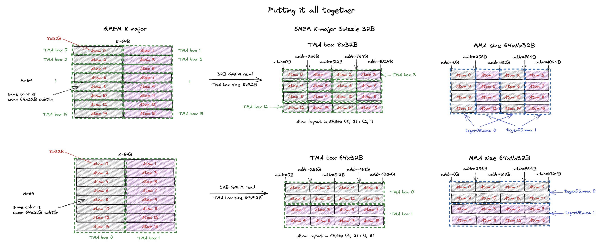

正如我们在[第 7 节](#7-swizzle-atom-layout)中所解释的，我们可以以 row-major 或 column-major layout 堆叠这些 `Swizzle 32B` atom，来构成这个 tile 最终的 SMEM layout。
第一个例子展示了 row-major 堆叠，即 atom 0, 1, 2, 3 在 SMEM 中是连续的。
我们想用 TMA 来填充 SMEM。
注意，我们能用的最大 TMA box 只是 `8x32B`（单个 `Swizzle 32B` atom）。
因为 TMA 把同一个 TMA box 中的 atom 连续地放在 SMEM 中。
鉴于我们想要的最终 SMEM layout，我们不能用一个更高的 TMA box（例如我们用了 `16x32B`，这样的话 atom 0 和 2 会在同一个 TMA box 中，从而在 SMEM 中连续，但我们期望的 SMEM layout 中我们不想让 atom 0 和 2 连续）。
我们也不能用一个更宽的 TMA box，因为那样 layout 会与 tensor core 期望的不兼容。
因此对于这个 `64x64B` tile 我们有 16 个 TMA box，并产生 32B 的 GMEM 读请求。
右上角的蓝框 展示了单条 `tcgen05.mma` 指令所需的 swizzle atom。
MMA 0 需要 atom 0, 2, 4, 6...（所有的灰色 atom），而 MMA 1 需要 atom 1, 3, 5, 7...（所有的粉色 atom）。
MMA 0 的输入操作数（atom 0, 2, 4, 6...（`64x32B` subtile））的 layout 可以被描述为一个 [Blackwell mma matrix descriptor](https://docs.nvidia.com/cuda/parallel-thread-execution/#tcgen05-matrix-descriptors)，CuTe 可以自动为你构建它。
在我的 [Blackwell MMA SMEM Descriptor 博客](../smem_descriptor/smem_descriptor.md)中，我们更详细地介绍了 CuTe 是如何为 Blackwell MMA 构建 SMEM descriptor。

如果我们以 column-major layout 堆叠 swizzle atom（即 atom 0, 2, 4, 6... 在 SMEM 中连续），我们就可以用一个大得多的 TMA box。
图的底部展示了 column-major 堆叠。
我们可以用一个 `64x32B` 的 TMA box 尺寸（它包含 atom 0, 2, 4, 6, 8, 10, 12, 14）。
TMA 传输之后，atom 0, 2, 4, 6, 8, 10, 12, 14 将在 SMEM 中连续，正是我们所需要的！
现在这个 `64x64B` tile 就只包含 2 个 `64x32B` 的 TMA box，我们只需发出 2 条（而不是 row-major 情况下的 16 条）TMA load 指令，就能以 32B 的 GMEM 读请求把这个 tile 加载到 SMEM。
右下角的蓝色 box 展示了单条 `tcgen05.mma` 指令所需的 swizzle atom。
MMA 0 需要 atom 0, 2, 4, 6...（所有的灰色 atom），而 MMA 1 需要 atom 1, 3, 5, 7...（所有的粉色 atom）。
MMA 0 的输入操作数（atom 0, 2, 4, 6...（`64x32B` subtile））的 layout 同样可以被描述为一个 [Blackwell mma matrix descriptor](https://docs.nvidia.com/cuda/parallel-thread-execution/#tcgen05-matrix-descriptors)。
注意，这两个 subtile layout 上唯一的区别是两个 swizzle atom 之间的 stride，而这正是 [Stride Dimension Byte Offset](https://docs.nvidia.com/cuda/parallel-thread-execution/#tcgen05-stride-dimension-byte-offset) 所指定的。

总结一下，不同的 swizzle atom layout 可能会发出不同数量的 TMA 指令来把 tile 加载到 SMEM。
但两种 layout 都会产生正确的结果。

## 10. 总结

在本博客中，我介绍了关于 mma swizzle layout 你需要知道的内容：
- 8 种支持的 mma swizzle layout 及其定义。
- swizzle layout 确保当 tile 从 GMEM 拷贝到 SMEM 以及从 SMEM 读出（`8x16B` 或 `16x8B`）时，不存在 SMEM bank conflict。
- Swizzle layout 允许对一个大 tile 中的两种不同形状的 subtile 进行无 bank conflict 访问。
- 在从 GMEM 加载到 SMEM 时，swizzle 不会改变输入 tile 的 major（连续） 属性，它只改变 16B chunk 在 SMEM 中的排布方式。
- 最大化 swizzle atom 尺寸能提升 GMEM 访问效率（每条 load 读取更多的数据）。
- 转置发生在 `ldmatrix` 的 SMEM->RF 拷贝过程中，不由 swizzle layout 处理。
- SMEM 中的 swizzle atom layout 可以是任意的，并且应当总是得到正确的结果，但某些 layout 比其他 layout 更高效。
- TMA 支持加载可以被 Tensor Core 直接读取的 swizzle layout，但前提是 TMA box 的宽度应该恰好与 1 个 swizzle atom 的宽度相同。
