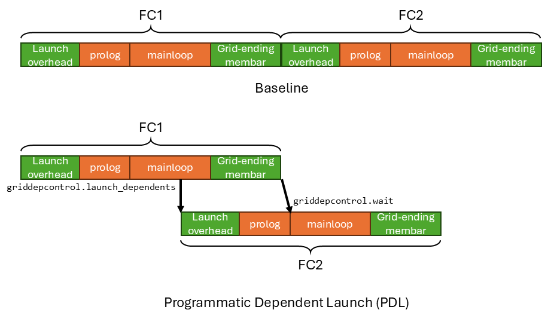

# Using Programmatic Dependent Launch (PDL) to Reduce End-to-End Latency

*Disclaimer: The content of this blog reflects my personal experiences and opinions while learning GPU programming in my own time. All information presented is publicly available and does not represent the views or positions of NVIDIA Corporation or any of its affiliates.*

## 0. Introduction

There are many ways to reduce the end-to-end latency of neural network computation (training/inference/etc.). Some of the notable ones are:

- **Kernel Optimizations** which reduces the latency of individual kernels.
- **[CUDA Graphs](https://docs.nvidia.com/cuda/cuda-c-programming-guide/index.html#cuda-graphs)** which eliminates the CPU launch overhead by offloading the kernel launch to the GPU.
- **[Multi-Stream](https://docs.nvidia.com/cuda/cuda-c-programming-guide/index.html#streams)** which allows multiple *independent* kernels to be executed in parallel in different streams.
- **[Programmatic Dependent Launch (PDL)](https://docs.nvidia.com/cuda/cuda-c-programming-guide/index.html#programmatic-dependent-launch-and-synchronization)** which overlaps the execution of two *dependent* kernels in the same stream.
- **Megakernel (e.g. [Hazy research](https://hazyresearch.stanford.edu/blog/2025-05-27-no-bubbles), [Mirage Persistent Kernel](https://zhihaojia.medium.com/compiling-llms-into-a-megakernel-a-path-to-low-latency-inference-cf7840913c17))** which reduces kernel launch overhead by fusing every layer into a single kernel.

In this blog, we focus on introducing the lesser known PDL, which is a relatively light weight optimization that gives you some extra latency reduction.
Importantly, it works on a stream of **dependent** kernels, which is a common pattern in neural network training and inference.
If the kernels are independent, you should use multi-stream instead.

## 1. What is PDL?

**[Programmatic Dependent Launch (PDL)](https://docs.nvidia.com/cuda/cuda-c-programming-guide/index.html#programmatic-dependent-launch-and-synchronization)** is a hardware feature that is introduced in the Hopper architecture.
It allows dependent kernels in the same stream to overlap with each other.
The figure below shows an example where PDL is beneficial in reducing the end-to-end latency.



Suppose we have two dependent fully connected layers, FC1 and FC2. And the output activation of FC1 (`y`) is the input activation of FC2 (`z`). We run them in the same stream.

```python
y = W1 * x # FC1
z = W2 * y # FC2
```

Each FC layer is basically a gemm kernel. The latency of a gemm threadblock can be broadly divided into four parts:
- Threadblock Launch Overhead: The GPU hardware takes some time to launch the threadblock.
- Prolog: The kernel does some initialization work such as constant loading, barrier initialization, tmem allocation, etc. **Importantly, the prolog doesn't depend on the previous kernel's output.**
- Mainloop: The kernel loads the weights and activations and performs the gemm computation. And then it stores the output activation to global memory. **Importantly, the mainloop depends on the previous kernel's output.**
- Grid-ending membar: A global memory barrier (membar) is issued at the end of the threadblock to make sure that the threadblock's output is visible globally (i.e. committed to global memory). Therefore, the next dependent kernel can read the correct data.

The prolog/mainloop (in orange) are what the user write in a kernel. The threadblock launch overhead and grid-ending membar (in green) are the associated hardware overhead when executing every kernel.

Without PDL, the latency of running FC1+FC2 is `FC1 launch overhead + FC1 prolog + FC1 mainloop + FC1 grid-ending membar + FC2 launch overhead + FC2 prolog + FC2 mainloop + FC2 grid-ending membar`. FC2 is only launched after FC1's grid-ending membar completes, meaning FC1's output is visible in global memory, as well as to FC2.

But notice that FC2's launch overhead and prolog are not *dependent* on the result of FC1. Only the execution of FC2's mainloop is dependent on the result of FC1. Therefore, the critical path latency is `FC1 launch overhead + FC1 prolog + FC1 mainloop + FC1 grid-ending membar + FC2 mainloop + FC2 grid-ending membar`. FC2's mainloop can start executing as soon as FC1's grid-ending membar completes, meaning FC1's output is visible in global memory, as well as to FC2.

The critical path latency shaves off `FC2 launch overhead` and `FC2 prolog` from the baseline latency. 
And PDL enables you reach the critical path latency by overlapping the execution of FC1's mainloop and grid-ending membar with FC2's launch time and prolog.

### 1.1 PDL's ISA and Hardware Support

Two [ptx instructions](https://docs.nvidia.com/cuda/parallel-thread-execution/#parallel-synchronization-and-communication-instructions-griddepcontrol) are exposed to make PDL work:

- `griddepcontrol.launch_dependents` to specify when to launch the next kernel.
- `griddepcontrol.wait` to block the current kernel until the previous kernel's output is ready.

Let's walkthrough the timeline to see how the two instructions enable PDL. FC1 executes normally until it hits the `griddepcontrol.launch_dependents` instruction in the middle of its mainloop. Then `griddepcontrol.launch_dependents` notifies the hardware to launch FC2. FC2's prolog starts to execute, overlapping with FC1's mainloop and grid-ending membar. 

Because FC2's mainloop is dependent on FC1's output, there needs to be a synchronization mechanism to notify FC2 that FC1's output is ready/visible in global memory. 
Since FC2 is already launched, it may read FC1's stale output from global memory.
This is where `griddepcontrol.wait` comes in. 
It ensures proper synchronization between FC1 and FC2.
After FC2's prolog finishes, it hits the `griddepcontrol.wait` instruction at the start of FC2's mainloop. The hardware will block on this instruction until FC1's grid-ending membar completes, meaning FC1's output is visible in global memory.
It's safe for FC2's mainloop to read it.
Then FC2's mainloop executes until the end of the kernel.

One final thing to note is that each threadblock in FC1 will issue a `griddepcontrol.launch_dependents` instruction.
Only after the `griddepcontrol.launch_dependents` of the **last** threadblock in FC1 is issued, the hardware will launch FC2.

### 1.2 What if I `griddepcontrol.launch_dependents` the next kernel too late/too early in FC1?

Basically by inserting `griddepcontrol.launch_dependents` and `griddepcontrol.wait` manually in the kernel, the user controls the overlapping ratio between the two kernels.
And the user also is responsible for handling the data synchronization between the two kernels by placing `griddepcontrol.wait` correctly.

The figure below shows the cases where the user places `griddepcontrol.launch_dependents` too late and too early in FC1 separately.


If you place `griddepcontrol.launch_dependents` too late (the most extreme case is at the end of FC1), then there isn't too much overlapping happening with FC2's prolog.
The PDL benefits are reduced.

If you place `griddepcontrol.launch_dependents` too early (the most extreme case is at the start of FC1), then FC2's prolog will finish very early. And it's mainloop will be blocked by `griddepcontrol.wait` because FC1 has not yet finished its execution to produce the output. The other concern would be FC2's prolog will interfere with FC1's mainloop execution, potentially slowing it down.

## 2. How to use PDL?

Many important programming languages and frameworks already support PDL:

- [CUTLASS](https://docs.nvidia.com/cutlass/media/docs/cpp/dependent_kernel_launch.html) refers to PDL as [Grid Dependency Control (GDC)](https://github.com/NVIDIA/cutlass/blob/main/include/cutlass/arch/grid_dependency_control.h). [Most gemm kernels](https://github.com/NVIDIA/cutlass/blob/main/include/cutlass/gemm/kernel/sm100_gemm_tma_warpspecialized.hpp) in CUTLASS are equipped with PDL.
- Triton added PDL support via [triton.language.extra.cuda](https://triton-lang.org/main/python-api/triton.language.extra.cuda.html) and [tutorial 11](https://github.com/triton-lang/triton/blob/2c59df5b2606256842fde97934007cfb7fdbd542/python/tutorials/11-programmatic-dependent-launch.py) shows its usage.
- [TensorRT-LLM](https://github.com/NVIDIA/TensorRT-LLM/tree/main) uses PDL to [accelerate DeepSeek R1 low latency inference](https://github.com/NVIDIA/TensorRT-LLM/blob/main/docs/source/blogs/tech_blog/blog1_Pushing_Latency_Boundaries_Optimizing_DeepSeek-R1_Performance_on_NVIDIA_B200_GPUs.md#key-optimizations). I made it happen :).

Here I'll illustrate how to enable PDL in plain CUDA C++ kernel. In order to make a kernel PDL enabled, you only need to change three things:
1. Add `griddepcontrol.wait` ptx to synchronize with the previous kernel.
2. Add `griddepcontrol.launch_dependents` ptx to launch the next kernel.
3. Set the `PDL` flag in the kernel launch configuration so that it will be launched with PDL. The new extensible launch API ([cudaLaunchKernelEx](https://docs.nvidia.com/cuda/cuda-runtime-api/group__CUDART__HIGHLEVEL.html#group__CUDART__HIGHLEVEL_1g81f2b11c6726c7b2f3fc54fc718eaf1c)) is needed to set the extra launch config.

Below shows a code snippet of a PDL enabled kernel.

```c++
__global__ void pdl_kernel(...) {
    prolog(...); // doesn't depend on the previous kernel's output
    asm volatile("griddepcontrol.wait;"); // block until the previous kernel's output is ready
    mainloop1(...); // depends on the previous kernel's output
    asm volatile("griddepcontrol.launch_dependents;"); // launch the next kernel here
    mainloop2(...); // rest of the computation, will be overlapped with the next kernel's prolog
}

int main() {
    // enable pdl in kernel launch attributes
    cudaLaunchAttribute attrs[1];
    attrs[0].id = cudaLaunchAttributeProgrammaticStreamSerialization;
    attrs[0].val.programmaticStreamSerializationAllowed = 1;

    // set kernel launch configuration
    cudaLaunchConfig_t config;
    config.gridDim = ...;
    config.blockDim = ...;
    config.dynamicSmemBytes = ...;
    config.stream = ...;
    config.attrs = attrs;
    config.numAttrs = 1;

    // launch the kernel
    cudaLaunchKernelEx(&config, pdl_kernel, ...);
}
```

### 2.1 Conditions for PDL to be Functional

In order for the PDL kernel overlap to be functional, the following conditions need to be met:
1. The current kernel has `griddepcontrol.wait` correctly placed to ensure correct synchronization with the previous kernel. (If the current kernel doesn't have data dependency with the previous kernel, you can just remove the `griddepcontrol.wait`).
2. The current kernel is launched with the PDL attribute set using `cudaLaunchKernelEx`.
3. The SM has enough resources to run both kernels concurrently. For instance, the combined smem usage of the two kernels should be less than the SM's smem capacity. Similar resource constraints apply to register, number of threads, number of warps, tmem, etc. If this condition is not met, the two kernels will just be executed serially.
4. (Optionally but recommended) The previous kernel has `griddepcontrol.launch_dependents` placed in the middle of the kernel to allow overlapping with the current kernel's prolog. Even if there is no `griddepcontrol.launch_dependents` in the previous kernel, as long as the first three conditions are met, the PDL overlap will still happen. PDL will assumes `griddepcontrol.launch_dependents` is inserted at the end of the previous kernel, so that the grid-ending membar of the previous kernel is still overlapped with the current kernel's launch time and prolog.

Therefore, the placement of `griddepcontrol.wait` affects both performance and correctness.
The placement of `griddepcontrol.launch_dependents` affects only the performance.

## 3. Distinctions with Megakernel

Megakernel experts may ask this sounds so much similar to megakernel where you can programmatically control when each sub-kernel is launched to overlap with each other.
Yes, indeed it's similar on that aspect.
But the most important distinction in my opinion is how the two dependent kernels synchronize with each other. 

- Baseline single stream launch without PDL: this is full hardware synchronization. The hardware issues grid-ending membar to make sure FC1's output is visible in global memory. And then the hardware launches FC2. The hardware blocks the launch of FC2 to ensure correctness.
- PDL: this is hardware-assisted software synchronization. The hardware still issues grid-ending membar to make sure FC1's output is visible in global memory. But now the software determines where in FC2 is blocked by placing `griddepcontrol.wait` correctly. The hardware unblocks `griddepcontrol.wait` in FC2 when FC1's grid-ending membar completes.
- Megakernel: this is software-only synchronization. I'll describe one plausible implementation. The software issues membar at the end of FC1. The software also blocks FC2's execution by doing wait on an L2 atomics. FC1 notifies FC2 that its output is ready (membar completed) by doing atomics on the same L2 atomics in software, to unblock FC2.

All these approaches are a trade-off between lower latency and flexibility. The hardware synchronization is the most efficient but least flexible. The software synchronization is the most flexible but least efficient. 

## 4. Summary

In this blog, we introduced PDL, a technique to reduce the end-to-end latency of neural network computation.
- PDL allows overlapped execution of dependent kernels in the same stream to eliminate unnecessary serialization.
- We explained the two ISA support (`griddepcontrol.launch_dependents` and `griddepcontrol.wait`) in PDL to make it work.
- We showed how to enable PDL in CUDA C++ kernel.
- We explained the performance and functional implication of using PDL.
- Finally, we compared PDL with megakernel, another technique to reduce the end-to-end latency.

