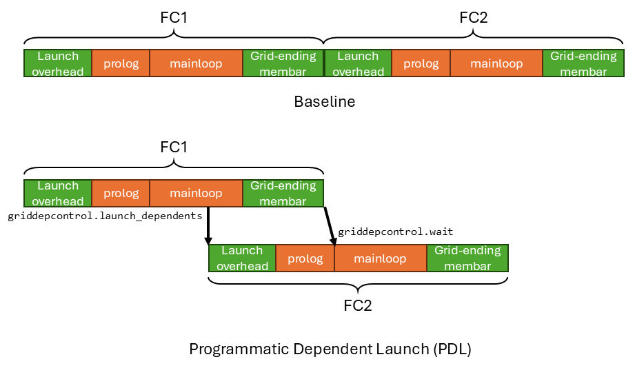
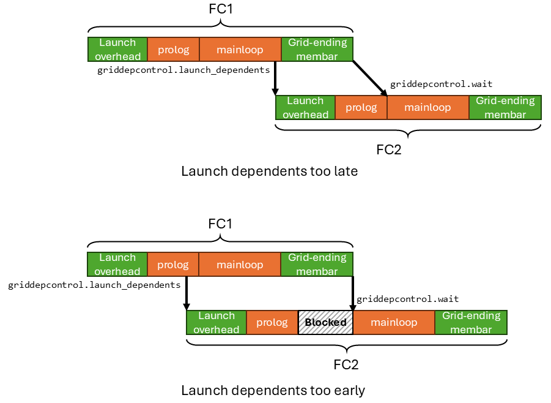
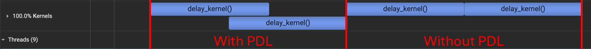

# 使用 Programmatic Dependent Launch (PDL) 降低端到端延迟 中文版

*免责声明：本博客的内容反映的是我个人在业余时间学习 GPU 编程时的经验与观点。所有信息均来自公开资料，不代表 NVIDIA Corporation 或其任何关联公司的观点或立场。*

*本篇是英文版 [Using Programmatic Dependent Launch (PDL) to Reduce End-to-End Latency](./pdl.md) 原文的中文翻译。*

## 0. 引言

有很多方法可以降低神经网络计算（训练/推理等）的端到端延迟。其中比较值得一提的有：

- **Kernel 优化**：降低单个 kernel 的延迟。
- **[CUDA Graphs](https://docs.nvidia.com/cuda/cuda-c-programming-guide/index.html#cuda-graphs)**：通过把 kernel launch 卸载到 GPU 上，消除 CPU 的 launch 开销。
- **[Multi-Stream](https://docs.nvidia.com/cuda/cuda-c-programming-guide/index.html#streams)**：允许多个*相互独立*的 kernel 在不同的 stream 中并行执行。
- **[Programmatic Dependent Launch (PDL)](https://docs.nvidia.com/cuda/cuda-c-programming-guide/index.html#programmatic-dependent-launch-and-synchronization)**：让同一个 stream 中两个*相互依赖*的 kernel 的执行相互重叠。
- **Megakernel（例如 [Hazy research](https://hazyresearch.stanford.edu/blog/2025-05-27-no-bubbles)、[Mirage Persistent Kernel](https://zhihaojia.medium.com/compiling-llms-into-a-megakernel-a-path-to-low-latency-inference-cf7840913c17)）**：通过把每一层都 fuse 进单个 kernel 来降低 kernel launch 开销。

在本博客中，我们重点介绍相对鲜为人知的 PDL。它是一种相对轻量的优化，能为你带来一些额外的延迟降低。
重要的是，它作用于一连串**相互依赖**的 kernel，而这正是神经网络训练和推理中很常见的模式。
如果这些 kernel 是相互独立的，那你应该无脑使用 multi-stream。

本博客中的所有代码都可以在[这里](https://github.com/Yang-YiFan/Yang-YiFan.github.io/tree/main/blogs/pdl/code)找到。

## 1. 什么是 PDL？

**[Programmatic Dependent Launch (PDL)](https://docs.nvidia.com/cuda/cuda-c-programming-guide/index.html#programmatic-dependent-launch-and-synchronization)** 是 Hopper 架构引入的一项硬件特性。
它允许同一个 stream 中相互依赖的 kernel 彼此重叠执行。
下图展示了一个 PDL 有助于降低端到端延迟的例子。



假设我们有两个相互依赖的全连接层 FC1 和 FC2。FC1 的输出（`y`）就是 FC2 的输入。我们把它们放在同一个 stream 中运行。

```python
y = W1 * x # FC1
z = W2 * y # FC2
```

每个 FC 层本质上就是一个 gemm kernel。一个 gemm threadblock 的延迟大致可以分为四个部分：
- Threadblock Launch 开销：GPU 硬件需要花一些时间来 launch 这个 threadblock。
- Prolog：kernel 做一些初始化工作，例如常量加载、barrier 初始化、tmem 分配等。**重要的是，prolog 不依赖前一个 kernel 的输出。**
- Mainloop：kernel 加载权重和输入，执行 gemm 计算，然后把输出存储到 global memory。**重要的是，mainloop 依赖前一个 kernel 的输出。**
- Grid-ending membar：在 threadblock 结束时会发射一个全局内存屏障（membar），以确保该 threadblock 的输出全局可见（即已 commit 到 global memory）。这样下一个依赖它的 kernel 才能读到正确的数据。

prolog/mainloop（橙色部分）是用户在 kernel 中编写的代码。而 threadblock launch 开销和 grid-ending membar（绿色部分）则是执行每个 kernel 时相伴的硬件开销。

在没有 PDL 的情况下，运行 FC1+FC2 的延迟是 `FC1 launch overhead + FC1 prolog + FC1 mainloop + FC1 grid-ending membar + FC2 launch overhead + FC2 prolog + FC2 mainloop + FC2 grid-ending membar`。FC2 只有在 FC1 的 grid-ending membar 完成之后才会被 launch，也就是说此时 FC1 的输出已经在 global memory 中可见，对 FC2 也可见。

但请注意，FC2 的 launch 开销和 prolog 并不*依赖*于 FC1 的结果。只有 FC2 的 mainloop 的执行才依赖于 FC1 的结果。因此，关键路径延迟是 `FC1 launch overhead + FC1 prolog + FC1 mainloop + FC1 grid-ending membar + FC2 mainloop + FC2 grid-ending membar`。一旦 FC1 的 grid-ending membar 完成（即 FC1 的输出在 global memory 中可见，对 FC2 也可见），FC2 的 mainloop 就可以开始执行。

相比 baseline 的延迟，关键路径延迟省去了 `FC2 launch overhead` 和 `FC2 prolog`。
而 PDL 让你能够达到这个关键路径延迟——它把 FC1 的 mainloop 和 grid-ending membar 的执行，与 FC2 的 launch 时间和 prolog 重叠起来。

### 1.1 PDL 的 ISA 与硬件支持

为了实现 PDL，暴露了两条 [ptx 指令](https://docs.nvidia.com/cuda/parallel-thread-execution/#parallel-synchronization-and-communication-instructions-griddepcontrol)：

- `griddepcontrol.launch_dependents`：指定何时 launch 下一个 kernel。
- `griddepcontrol.wait`：阻塞当前 kernel，直到前一个 kernel 的输出就绪。

让我们沿着时间线走一遍，看看这两条指令是如何实现 PDL 的。FC1 正常执行，直到它在 mainloop 中间碰到 `griddepcontrol.launch_dependents` 指令。然后 `griddepcontrol.launch_dependents` 通知硬件去 launch FC2。FC2 的 prolog 开始执行，与 FC1 的 mainloop 和 grid-ending membar 重叠。

由于 FC2 的 mainloop 依赖 FC1 的输出，因此需要一种同步机制来通知 FC2：FC1 的输出已经就绪 / 在 global memory 中可见。
由于 FC2 已经被 launch 了，它可能会从 global memory 中读到 FC1 过期的（stale）输出。
这就是 `griddepcontrol.wait` 发挥作用的地方。
它确保 FC1 和 FC2 之间正确地同步。
在 FC2 的 prolog 结束后，它会在 FC2 mainloop 的开头碰到 `griddepcontrol.wait` 指令。硬件会在这条指令上阻塞，直到 FC1 的 grid-ending membar 完成，也就是 FC1 的输出在 global memory 中可见。
此时 FC2 的 mainloop 读取它就是安全的了。
然后 FC2 的 mainloop 一直执行到 kernel 结束。

最后还有一点需要注意：FC1 中的每个 threadblock 都会发射一条 `griddepcontrol.launch_dependents` 指令。
只有当 FC1 中**最后一个** threadblock 的 `griddepcontrol.launch_dependents` 被发射之后，硬件才会去 launch FC2。

### 1.2 如果我在 FC1 中把下一个 kernel 的 `griddepcontrol.launch_dependents` 放得过晚/过早会怎样？

本质上，通过在 kernel 中手动插入 `griddepcontrol.launch_dependents` 和 `griddepcontrol.wait`，用户控制了两个 kernel 之间的重叠比例。
同时，用户也要负责通过正确放置 `griddepcontrol.wait` 来处理两个 kernel 之间的数据同步。

下图分别展示了用户在 FC1 中把 `griddepcontrol.launch_dependents` 放得过晚和过早的两种情况。



如果你把 `griddepcontrol.launch_dependents` 放得过晚（最极端的情况是放在 FC1 的末尾），那么和 FC2 的 prolog 之间就没有太多重叠发生，PDL 的收益就会减少。

如果你把 `griddepcontrol.launch_dependents` 放得过早（最极端的情况是放在 FC1 的开头），那么 FC2 的 prolog 会很早就完成。而它的 mainloop 会被 `griddepcontrol.wait` 阻塞，因为 FC1 还没有执行完、还没产生出输出。另一个隐患是 FC2 的 prolog 会干扰 FC1 mainloop 的执行，可能会拖慢它。

## 2. 如何使用 PDL？

许多重要的编程语言和框架已经支持 PDL：

- [CUTLASS](https://docs.nvidia.com/cutlass/media/docs/cpp/dependent_kernel_launch.html) 把 PDL 称为 [Grid Dependency Control (GDC)](https://github.com/NVIDIA/cutlass/blob/main/include/cutlass/arch/grid_dependency_control.h)。CUTLASS 中[大多数 gemm kernel](https://github.com/NVIDIA/cutlass/blob/main/include/cutlass/gemm/kernel/sm100_gemm_tma_warpspecialized.hpp) 都配备了 PDL。
- Triton 通过 [triton.language.extra.cuda](https://triton-lang.org/main/python-api/triton.language.extra.cuda.html) 添加了对 PDL 的支持，[tutorial 11](https://github.com/triton-lang/triton/blob/2c59df5b2606256842fde97934007cfb7fdbd542/python/tutorials/11-programmatic-dependent-launch.py) 展示了它的用法。
- [TensorRT-LLM](https://github.com/NVIDIA/TensorRT-LLM/tree/main) 使用 PDL 来[加速 DeepSeek R1 的低延迟推理](https://github.com/NVIDIA/TensorRT-LLM/blob/main/docs/source/blogs/tech_blog/blog1_Pushing_Latency_Boundaries_Optimizing_DeepSeek-R1_Performance_on_NVIDIA_B200_GPUs.md#key-optimizations)。这是我做的 :)。

这里我来演示如何在纯 CUDA C++ kernel 中启用 PDL。要让一个 kernel 启用 PDL，你只需要改三个地方：
1. 添加 `griddepcontrol.wait` ptx 指令，以便与前一个 kernel 同步。
2. 添加 `griddepcontrol.launch_dependents` ptx 指令，以便 launch 下一个 kernel。
3. 在 kernel launch 配置中设置 `PDL`，使其以 PDL 方式被 launch。设置这个额外的 launch 配置需要用到新的 extensible launch API（[cudaLaunchKernelEx](https://docs.nvidia.com/cuda/cuda-runtime-api/group__CUDART__HIGHLEVEL.html#group__CUDART__HIGHLEVEL_1g81f2b11c6726c7b2f3fc54fc718eaf1c)）。

下面是一个启用了 PDL 的 kernel 的代码片段。

```c++
__global__ void pdl_kernel(...) {
    prolog(...); // 不依赖前一个 kernel 的输出
    asm volatile("griddepcontrol.wait;"); // 阻塞，直到前一个 kernel 的输出就绪
    mainloop1(...); // 依赖前一个 kernel 的输出
    asm volatile("griddepcontrol.launch_dependents;"); // 在这里 launch 下一个 kernel
    mainloop2(...); // 剩余的计算，会与下一个 kernel 的 prolog 重叠
}

int main() {
    // 在 kernel launch 属性中启用 pdl
    cudaLaunchAttribute attrs[1];
    attrs[0].id = cudaLaunchAttributeProgrammaticStreamSerialization;
    attrs[0].val.programmaticStreamSerializationAllowed = 1;

    // 设置 kernel launch 配置
    cudaLaunchConfig_t config;
    config.gridDim = ...;
    config.blockDim = ...;
    config.dynamicSmemBytes = ...;
    config.stream = ...;
    config.attrs = attrs;
    config.numAttrs = 1;

    // launch kernel
    cudaLaunchKernelEx(&config, pdl_kernel, ...);
}
```

### 2.1 PDL 生效的条件

为了让 PDL 的 kernel 重叠真正生效，需要满足以下条件：
1. 当前 kernel 正确放置了 `griddepcontrol.wait`，以确保与前一个 kernel 的同步正确。（如果当前 kernel 与前一个 kernel 没有数据依赖，那你可以直接去掉 `griddepcontrol.wait`。）
2. 当前 kernel 使用 `cudaLaunchKernelEx` 并设置了 PDL 属性来 launch。
3. SM 有足够的资源同时运行两个 kernel。例如，两个 kernel 合起来的 smem 用量应该小于 SM 的 smem 容量。寄存器、线程数、warp 数、tmem 等也有类似的资源约束。如果这个条件不满足，两个 kernel 就只会被串行执行。
4. （可选但推荐）前一个 kernel 在 kernel 中间放置了 `griddepcontrol.launch_dependents`，以便与当前 kernel 的 prolog 重叠。即使前一个 kernel 中没有 `griddepcontrol.launch_dependents`，只要前三个条件满足，PDL 重叠仍然会发生。PDL 会假设 `griddepcontrol.launch_dependents` 被插入在前一个 kernel 的末尾，这样前一个 kernel 的 grid-ending membar 仍然能与当前 kernel 的 launch 时间和 prolog 重叠。

因此，**`griddepcontrol.wait` 的放置位置同时影响性能和正确性。**
而 **`griddepcontrol.launch_dependents` 的放置位置只影响性能。**

### 2.2 性能分析器（Profiler）支持

[NVIDIA Nsight Systems](https://docs.nvidia.com/nsight-systems/UserGuide/index.html#) 支持可视化 PDL 下的 kernel 重叠。



我用 nsys 运行了[这份 demo 代码](https://github.com/Yang-YiFan/Yang-YiFan.github.io/tree/main/blogs/pdl/code)，得到了上面这张图。
可以清楚地看到，启用 PDL 后，两个 kernel 发生了重叠。
而没有 PDL 时，两个 kernel 是串行执行的。

## 3. 与 Megakernel 的区别

熟悉 megakernel 的专家们可能会问：这听起来和 megakernel 太像了——在 megakernel 里你也可以通过编程来控制每个 sub-kernel 何时被 launch，从而让它们彼此重叠。
确实，在这一点上它们是相似的。
但在我看来，最重要的区别在于两个相互依赖的 kernel 之间是如何同步的。

- 不带 PDL 的 baseline 单 stream launch：这是完全的硬件同步。硬件发射 grid-ending membar 来确保 FC1 的输出在 global memory 中可见，然后硬件再 launch FC2。硬件通过阻塞 FC2 的 launch 来保证正确性。
- PDL：这是软件辅助的硬件同步。硬件仍然发射 grid-ending membar 来确保 FC1 的输出在 global memory 中可见。但现在由软件来决定在 FC2 的哪个位置进行阻塞——即正确放置 `griddepcontrol.wait`。当 FC1 的 grid-ending membar 完成时，硬件会解除 FC2 中 `griddepcontrol.wait` 的阻塞。
- Megakernel：这是纯软件同步。我来描述一种可能的实现方式。软件在 FC1 末尾发射 membar。软件同时通过在一个 L2 atomics 上做 wait 来阻塞 FC2 的执行。FC1 通过在软件中对同一个 L2 atomics 做 atomics 操作，来通知 FC2 它的输出已经就绪（membar 已完成），从而解除 FC2 的阻塞。

这些方式都是在更低延迟和灵活性之间做权衡。硬件同步最高效，但最不灵活。软件同步最灵活，但最不高效。

## 4. 总结

在本博客中，我们介绍了 PDL，一种降低神经网络计算端到端延迟的技术。
- PDL 允许同一个 stream 中相互依赖的 kernel 重叠执行，以消除不必要的串行化。
- 我们讲解了 PDL 中用来实现它的两条 ISA 支持（`griddepcontrol.launch_dependents` 和 `griddepcontrol.wait`）。
- 我们展示了如何在 CUDA C++ kernel 中启用 PDL。
- 我们解释了使用 PDL 在性能和功能上的影响。
- 最后，我们将 PDL 与 megakernel——另一种降低端到端延迟的技术——做了对比。
