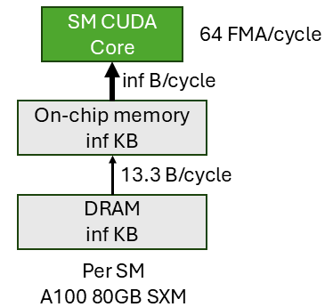
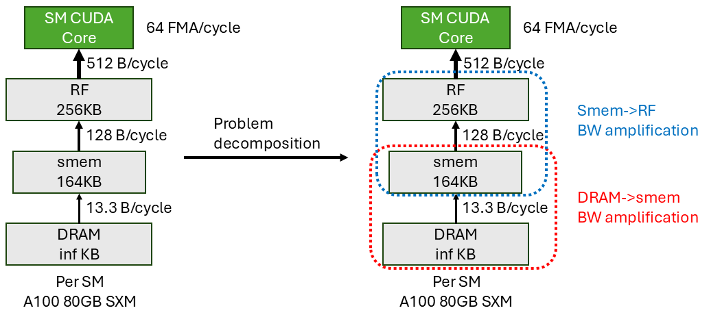
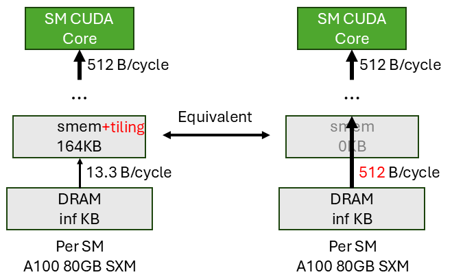
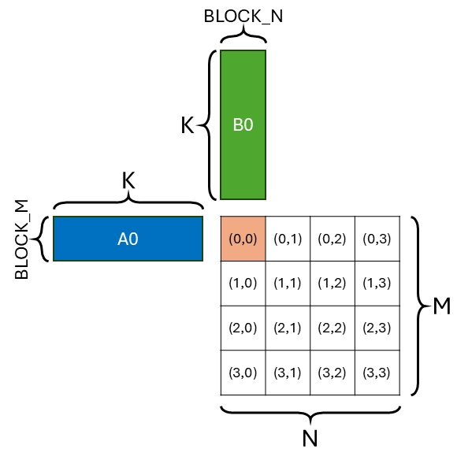
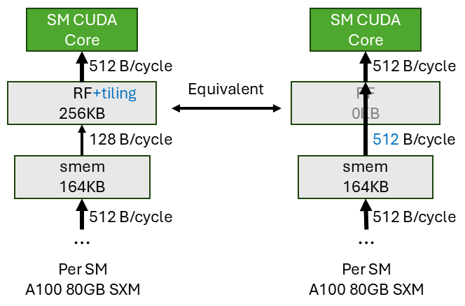
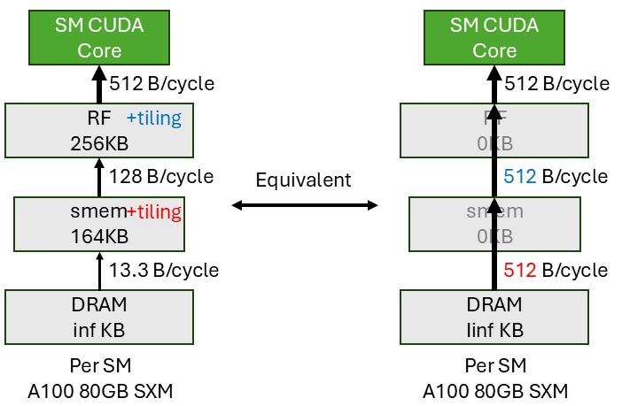
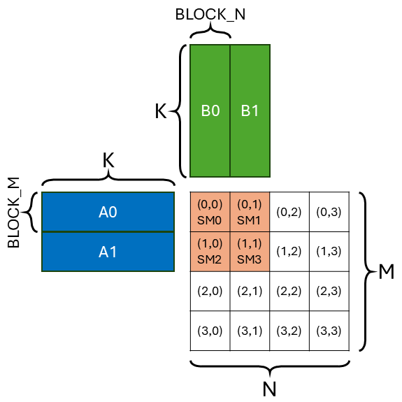
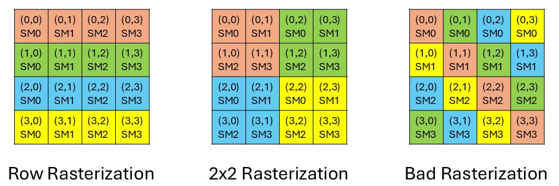

# How to Make a Compute-bound Problem Actually Compute-bound (WIP)

*Disclaimer: The content of this blog reflects my personal experiences and opinions while learning GPU programming in my own time. All information presented is publicly available and does not represent the views or positions of NVIDIA Corporation or any of its affiliates.*

One of the first thing when a computer architect would do when they want to accelerate an application is to determine whether the application is compute-bound or memory-bound. To do that, they often employ the [roofline model](https://en.wikipedia.org/wiki/Roofline_model).

If the application is deemed memory-bound, then the architect would focus on ways to 
- First achieve the peak memory bandwidth for baseline.
- Reduce memory traffic: such as quantization, sparsity, compression, operator fusion, etc.
- Increase memory bandwidth: such as putting more HBM sites, having more SRAM banks, etc.

It's not hard to achieve peak memory bandwidth for the baseline implementation as long as you maintain enough memory level parallelism (MLP). The memory system does reasonable things saturating itself. And there are numerous research proposals to alleviate the memory bottleneck.

If the application is deemed compute-bound, similarly the architect would focus on ways to
- First achieve the peak compute throughput for baseline.
- Reduce the amount of computation: such as sparsity, or using a more compute efficient algorithm, etc.
- Increase the compute throughput: such as increasing frequency, putting more cores, etc.

I argue **without careful thinking it's not easy to achieve the peak compute throughput for a compute-bound application especially on the GPUs**. Often times your can't even reach the compute roofline. The reason is that the simple machine model that we often use in the roofline model to reason about performance is not informative enough. It can't give us clear/systematic guidance on what optimizations we should do. With a more realistic machine model, we can reason about the various optimization we apply to achieve peak compute throughput from first principle.

In this blog, I'll use matrix multiplication on CUDA cores as an example to illustrate how to achieve theoretical peak compute throughput. **In short, the memory system needs to deliver operands to the compute units at a rate that matches the compute units' consumption rate, using careful tiling at every level of the memory hierarchy to achieve bandwidth amplification.** Then I'll briefly touch upon some alternative ways to achieve this bandwidth amplification.

This blog will be centered around **how to achieve throughput matching rather than latency hiding across pipeline stages for a SIMT program**. Even though the conventional GPU SIMT programming (non tensor core) education we receive (myself included) teaches us the goal is to achieve full (memory) latency hiding. I argue it's not the best way to think about it. Memory latency in particular is a function of memory throughput (i.e. $\text{latency} = \text{static\_latency} + \frac{\text{tile\_size}}{\text{memory\_BW}}$). So throughput is the first class citizen and latency is a by-product. Therefore the first priority is throughput matching.

## 1. Example Problem: Matrix Multiplication on CUDA Cores

### 1.1 Motivation

Many people have attempted to write a CUDA core fp32 gemm kernel that matches cuBLAS's performance. [Simon Boehm's blog](https://siboehm.com/articles/22/CUDA-MMM) is the one I followed. Though his blog is super informative, I feel like the most important optimization that gets you most of the way is buried behind lots of less important optimizations. I tried writing a CUDA core gemm on Nvidia V100 GPU myself and gets 88% of cuBLAS's performance with only two optimizations over naive implementation:
1. Shared memory (smem) tiling.
2. Register File (RF) tiling.

| Algorithm           | Throughput (TFLOPS) | % of cuBLAS         |
| ------------------- |:-------------------:|:-------------------:|
| Naive               | 1.9                 | 16%                 |
| smem tiling         | 3.7                 | 31%                 |
| RF tiling           | 10.7                | 88%                 |
| cuBLAS              | 12.1                | 100%                |

As you might notice, both optimizations has something to do with *tiling*, but on different levels of the memory hierarchy. Hopefully with the rest of the blog I can show you why tiling itself is enough to achieve (almost) peak compute throughput and how you should choose your tile size. All of my reasoning will be purely *analytical* without any silicon profiling and that's enough for us to achieve peak compute throughput.

### 1.2 Background

First, let's define the gemm problem and some terminologies. We have two matrices `A` and `B`, and we want to compute the product `C = A * B`. The matrices are of size `[M, K]` and `[K, N]`, and we want to compute the product C of size `[M, N]`. For simplicity, we use `M=N=K=4096` as an example problem size in this blog.

Because the GPU has many SMs (Streaming Multiprocessor), we need to somehow parallelize the gemm problem across all SMs. The way we parallel is part of the `dataflow` (or compute schedule, [ref1](https://people.csail.mit.edu/emer/media/papers/2016.06.isca.eyeriss_architecture.pdf), [ref2](https://csg.csail.mit.edu/6.5930/Lectures/L11.pdf), [ref3](https://yang-yifan.github.io/papers/isca24_trapezoid.pdf)). The most common dataflow people use in mapping gemm to SMs is called `output-stationary (OS) dataflow` (or inner-product (IP) dataflow). This means each SM is responsible for producing a disjoint tile of the output matrix. The tile of output is *stationary* in the SM. Output gets maximum reuse in SM.

The reason why people tend to use OS dataflow is because inter-SM communication is expensive. Suppose we don't use OS dataflow, meaning that multiple SMs are collaboratively producing 1 output tile. They have to communicate and synchronize through global memory (cached in L2) which is extremely slow. So using OS dataflow to avoid expensive inter-SM communication is a common practice. 

This tradeoff might change with the introduction of [distributed shared memory](https://developer.nvidia.com/blog/nvidia-hopper-architecture-in-depth/) in Hopper that offers faster inter-SM communication within a threadblock cluster. I will explore this in a future blog.

## 2. Simple Machine Model is not Informative

Now that I've defined the gemm problem, let's see how we analyze whether it's a compute-bound or a memory-bound problem on an Nvidia [A100 80GB SXM](https://www.nvidia.com/content/dam/en-zz/Solutions/Data-Center/a100/pdf/nvidia-a100-datasheet-us-nvidia-1758950-r4-web.pdf) GPU using the roofline model. 



The vanilla roofline model assumes a simple machine model where we have an off-chip memory (DRAM), an on-chip storage (SRAM) with *infinite* capacity, and the compute units (SM CUDA cores). The off-chip to on-chip memory has a limited bandwidth. On-chip memory to compute unit has infinite bandwidth. And the compute unit has a fixed throughput. Plug in the A100 number we have the simple machine model shown above. 

Note that this is a per-SM slice of the A100 GPU, meaning that the DRAM bandwidth is the bandwidth each SM (108 SMs) can get out of the total DRAM bandwidth (2039 GB/s). $\frac{2039GB/s}{108 \times 1.41GHz} = 13.3B/cycle$. And the compute unit throughput is for 1 SM (i.e. 64 FMA/cycle). Alternatively, you can create a machine model for the entire GPU by aggregating the throughput across all SMs. This is basically equivalent to multiply 108 (number of SMs) to all numbers in our machine model and it won't affect the roofline analysis at all.

Now we calculate the arithmetic intensity of the `4096x4096x4096` (M, N, K) gemm problem with the simple machine model. The compulsory traffic (i.e. infinite on-chip memory) is $4096 \times 4096 \times 3 = 48MB$. The number of FMA (fused multiply and add) is $4096 \times 4096 \times 4096 = 64G$. So the arithmetic intensity of the gemm problem is $\frac{64GFMA}{48MB} = 1365FMA/B$.

The arithmetic intensity of the A100 80GB SXM GPU is $\frac{64FMA/cycle}{13.3B/cycle} = 4.8FMA/B$. Since 1365 > 4.8, we can conclude that this gemm will be *compute-bound* when running on A100, i.e. the goal for the CUDA kernel is to saturate compute throughput. But remember, this conclusion is based on at least two idealized assumptions:
1. Infinite on-chip storage.
2. Infinite on-chip storage to compute unit bandwidth.

With the actual A100 spec that these two resources are not unlimited, are we still compute-bound? It appears so since cuBLAS reaches the compute roofline. Why is our naive implementation only 16\% the speed of cuBLAS? Not knowable. How should we write the kernel such that it fully utilizes compute units similar to cuBLAS? Not knowable. The simple machine model is not informative enough to guide us to write the most optimized kernel to achieve the compute-bound goal.

## 3. A More Realistic Machine Model

This is where the more realistic machine model comes into play. It strikes a balance between abstraction and detail. It models the GPU memory hierarchy faithfully and at the same time is high-level enough to not distract us from hardware implementation details. The more realistic machine model gives us clear guidance on how to write a high performance CUDA core gemm kernel that achieves full compute unit utilization.



On the left I show the more realistic machine model. Notice the differences with the simple model are:
1. I explicitly show the 3-level memory hierarchy (DRAM->smem->RF).
2. Each level has limited capacity (assume we can always fit everything in DRAM).
3. Each level has limited bandwidth to the next level.

Note that from RF to CUDA core, the bandwidth is 512 B/cycle. This is the minimum *input data* bandwidth needed to fully saturate the CUDA cores. We have 64 CUDA cores, each requires two 4B input per cycle. In total, the memory hierarchy needs to deliver $64 \times 2 \times 4B/cycle = 512B/cycle$ input data to the CUDA cores in order to fully saturate it. The actual RF to CUDA core bandwidth might be higher but we don't need more than 512 B/cycle input bandwidth. So we use the min of the two numbers.

Why do we only look at input data bandwidth requirement rather than both input and output? This is because we make an assumption of our kernel implementation that we use `output-stationary (OS) dataflow` at all levels of the memory hierarchy. The output only gets to write out to the next level once all the partial results are fully accumulated at the current level. It gets *full reuse*. This means the output bandwidth requirement is minimal and minute compare to input bandwidth requirement because we need to read the same input multiple times. So we can ignore output for simplicity. If we choose not to use OS everywhere, this assumption breaks. And we need to consider both input and output bandwidth requirement.

## 4. The Kernel Optimization Goal

With the more realistic machine model in mind, we have established that the CUDA cores need 512 B/cycle input data from the memory hierarchy to get full compute utilization, which is our ultimate goal. All the input data come from DRAM. Through our kernel optimization, we need to create an illusion that the CUDA cores directly read DRAM at 512 B/cycle bandwidth. 

From the realistic machine model, the input data delivery pipeline is `DRAM->smem->RF->CUDA core`. We want this pipeline throughput to be 512 B/cycle. This means every pipeline stage needs to be 512 B/cycle.

Unfortunately, without any optimization, the `DRAM->smem` bandwidth is only 13.3 B/cycle which limits the overall data delivery pipeline throughput. We need a way to amplify the bandwidth to match the data delivery throughput requirement of the whole pipeline. Similarly, the `smem->RF` is also not big enough (128 B/cycle) to match the overall pipeline throughput requirement (512 B/cycle). We need a way to amplify this bandwidth as well. **In summary, the overarching goal is to amplify the bandwidth between all stages to match the throughput requirement (i.e. CUDA core data delivery bandwidth).**

As I have already alluded, the bandwidth amplification problem of all the stages can be *decoupled*. In our example problem and machine, we can decompose the bandwidth amplification problem into two independent sub-problems:
1. `DRAM->smem` bandwidth amplification (red dotted box).
2. `smem->RF` bandwidth amplification (blue dotted box).

In each sub-problem, after bandwidth amplification, we want to deliver 512 B/cycle in each stage. If we succeed in both, we can then deliver 512 B/cycle of input data between all stages across the whole pipeline. Thus fully utilizing the CUDA core.

## 5. How to Achieve Bandwidth Amplification

There are many ways to achieve bandwidth amplification across the memory hierarchy. I will discuss two popular techniques [tiling (Sec. 5.1)](#51-tiling) and [multicasting (Sec. 5.2)](#52-multicasting). And briefly touch upon [other techniques (Sec. 5.3)](#53-other-techniques). These techniques should be agnostic to which levels of memory hierarchy we are at so that we can use different techniques at different levels. We can also combine multiple techniques together at the same level.

### 5.1 Tiling

The general premise of tiling is that **it exploits *data reuse* to achieve bandwidth amplification**. In this section, I'll show how to apply tiling at DRAM->smem stage (also called [smem tiling (Sec. 5.1.1)](#511-shared-memory-smem-tiling)) and smem->RF stage (also called [RF tiling (Sec. 5.1.2)](#512-register-file-rf-tiling)) to achieve bandwidth amplification. I'll also describe how to choose the tile size such that we have enough bandwidth amplification factor at each stage to achieve full compute utilization.

#### 5.1.1 Shared Memory (smem) Tiling

The shared memory (smem) tiling tries to achieve bandwidth amplification at the `DRAM->smem` stage. The figure below shows the scenario. For instance, on the left figure, we transfer a tile of input data from DRAM to smem. And we expect each element in the tile can be read twice *only* from smem (not touching DRAM) by the next stage. In other words, the input element has a *reuse* of 2. This is equivalent to reading the same element twice from DRAM (bypassing smem) by the next stage (as shown on the right figure). Therefore we effectively achieve a bandwidth amplification factor of 2.



Plugging in the real A100 numbers, we want the amplified bandwidth to be 512 B/cycle, and currently the `DRAM->smem` bandwidth is 13.3 B/cycle. So smem tiling should give us at least an amplification factor of $\frac{512}{13.3}=39$. This means, on average, each input element in smem should be reused at least 39 times. If we achieve this reuse factor of 39, then smem can give the CUDA core (and the whole pipeline) an illusion that it can supply 512 B/cycle from DRAM directly.

Now I'll explain how to tile the gemm such that each input element is reused 39 times. Again, we assume we use `output-stationary (OS) dataflow`. The figure below shows the computation performed by each threadblock (SM) in the kernel.



Now let's calculate the reuse factor of each input element. The total amount of computation is `BLOCK_M * BLOCK_N * K` FMA. And we read in tile A of size `BLOCK_M * K` from DRAM once and tile B of size `K * BLOCK_N` from DRAM once. Therefore, the reuse factor of each A element is $\frac{BLOCK\_M * BLOCK\_N * K}{BLOCK\_M * K} = BLOCK\_N$. And the reuse factor of each B element is $\frac{BLOCK\_M * BLOCK\_N * K}{K * BLOCK\_N} = BLOCK\_M$. We need the average input reuse factor to be 39. So `BLOCK_M = BLOCK_N = 39` would be sufficient to achieve full bandwidth amplification at the `DRAM->smem` stage. More realistically, a power of 2 tile size is more friendly to index calculation and memory system. So we choose `BLOCK_M = BLOCK_N = 64` for our smem tile size.


#### 5.1.2 Register File (RF) Tiling



Similarly the register file (RF) tiling tries to achieve bandwidth amplification at the `smem->RF` stage. The figure above shows the scenario. The RF can only read 128 B/cycle from smem but the CUDA core can consume 512 B/cycle from RF. So each cycles, the CUDA core needs 512B data, but smem can only supply 128B. This means each input element read from smem will be read 4 times by the CUDA core, i.e. a reuse factor of 4 at the `smem->RF` stage is needed.

How to achieve a reuse factor of 4 at the `smem->RF` stage? We use the same OS dataflow at the `smem->RF` stage, meaning the RF holds an A tile of size `BLOCK_M * K` and a B tile of size `K * BLOCK_N`. A input reuse factor of 4 means `BLOCK_M = BLOCK_N = 4` for RF tile size. Then the `smem->RF` stage also gives the CUDA core an illusion that it can supply 512 B/cycle from smem directly.

#### 5.1.3 Putting It All Together



Putting both smem and RF tiling together as shown above. The whole pipeline is `DRAM->smem->RF->CUDA core`:
- With smem tiling (tile size of 64), we can make sure the `DRAM->smem` stage supplies 512 B/cycle to the rest of the pipeline, i.e. with tiling it acts as if we can directly read DRAM at 512 B/cycle throughput. 
- With RF tiling (tile size of 4), we can make sure the `smem->RF` stage supplies 512 B/cycle to the pipeline, i.e. with tiling it acts as if we can directly read smem at 512 B/cycle throughput. 
  
Since we already know `RF->CUDA core` has enough throughput of 512 B/cycle. We can conclude that the whole pipeline has a throughput of 512 B/cycle to deliver the input data from DRAM to the CUDA core. Hence we have achieved full compute utilization.

Tiling enables data reuse which then enables bandwidth amplification. With sufficient bandwidth amplification, we will be able to achieve full compute utilization. This is why doing tiling alone gives us most of cuBLAS's performance because it's sufficient to achieve all bandwidth amplification requirements.


#### 5.1.4 Local vs Global Reuse Factor

Don't read this section if you don't want to be confused. If you are curious and have the same question as me, please continue.

There is a subtle point that I want to clarify, which originally confused me a lot when I was writing this blog. The question is, for `DRAM->smem` stage, why do we need to amplify the bandwidth to 512 B/cycle rather than 128 B/cycle? The smem consumer, i.e. RF, can only read 128 B/cycle from smem anyways. So why don't we just amplify the bandwidth to 128 B/cycle, i.e. we only need a input reuse factor of $\frac{128}{13.3}=9.6$ (e.g. tile size of 16 would be sufficient) at the `DRAM->smem` stage?

The answer is the number 16 is the local reuse factor at the `DRAM->smem` level. It doesn't mean the smem tile size is 16. The smem tile size can be larger (e.g. 64). This can be better explained with the actual loop nest of the gemm kernel.

```python
L1= 16 # DRAM->smem reuse factor
L2= 4 # smem->RF reuse factor
-----------------------------------------------------------
gA = [M, K]
gB = [K, N]
for m0 in range(M // L1 // L2):
  for n0 in range(N // L1 // L2):                   DRAM
-----------------------------------------------------------
    sA = gA[m0 * L1 * L2 : (m0 + 1) * L1 * L2, :] # [L1 * L2, K]
    sB = gB[:, n0 * L1 * L2 : (n0 + 1) * L1 * L2] # [K, L1 * L2]
    for m1 in range(L1):
      for n1 in range(L1):                          smem
-----------------------------------------------------------
        rA = sA[m1 * L2 : (m1 + 1) * L2, :] # [L2, K]
        rB = sB[:, n1 * L2 : (n1 + 1) * L2] # [K, L2]
        for m2 in range(L2):
          for n2 in range(L2):                        RF
-----------------------------------------------------------
            for k in range(K):
              idx_m = m0 * L1 * L2 + m1 * L2 + m2
              idx_n = n0 * L1 * L2 + n1 * L2 + n2
              C[idx_m, idx_n] += rA[m2, k] * rB[k, n2]
```

It's pretty clear from the loop nest that the number 16 is the local reuse factor at the `DRAM->smem` level, i.e. `L1 = 16`. It doesn't mean the smem tile size is 16. Because there can be further reuse at the `smem->RF` level, e.g. `L2 = 4`. So the global smem input reuse factor is `L1 * L2 = 64`, i.e. fetch an element into smem once, then it consumed 64 times by all the lower level in aggregate. Out of this 64 times, the RF will read the smem 16 (`L1`) times. Each read, will trigger a further 4 (`L2`) reads from the CUDA core. Hence, in order to achieve smem reuse factor of 64, we need a smem tile size of 64. So the number 16 here means at the `DRAM->smem` level, we reuse the *RF tile* by a factor of 16. But each element inthe RF tile has a reuse factor of 4 at a lower level. So for *each individual element*, it is reused `16 * 4 = 64` times. The smem tile size we often refers to is at individual element level. So the individual element tile size at smem level is 64.

Similarly at the RF level, the local reuse factor is `L2 = 4`. Since there is no further reuse below the RF, for each element, the global RF input reuse factor is indeed 4. To achieve this reuse factor of 4, we need a RF tile size of 4.

**TL DR:** I think this local/global reuse factor distinction really confused people and we shouldn't think about it. For simplicity, we should only think about the global reuse factor, i.e. we want to have bandwidth amplification at each stage to match the 512 B/cycle requirement of the whole pipeline. And the bandwidth amplification has a requirement of the (global) reuse factor of the input element at each stage. Then this reuse factor requirement will translate to a tile size requirement at each stage.


### 5.2 Multicasting

Tiling is not the only way to achieve bandwidth amplification. Another popular technique is multicasting. The way multicasting works is that if multiple units request the same data, the memory system only needs to generate 1 request and often get 1 response. When the response is closer to the unit in the memory system, it gets duplicated to all the units. In this way, the response bandwidth is higher than the request bandwidth, i.e. gets amplified.

In order for multicasting to work, it relies on the conditions that:
1. There are multiple compute units in the system.
2. They request the same input data.

How can we leverage leverage multicasting to achieve bandwidth amplification?  We will use `DRAM->smem` stage as an example and assumes there is some bandwidth amplification mechanism in the `DRAM->smem NoC`.

In the [above example](#511-shared-memory-smem-tiling), when we do smem tiling, we conclude that we need at least an input reuse factor of 39 to achieve full bandwidth amplification at the `DRAM->smem` stage, which translates into a minimum smem tile size of 39. Let's assume our smem is very small and can't hold a tile size of 39. It's only big enough to hold a tile size of 32. Looks like we can't achieve the full 512 B/cycle bandwidth requirement at the `DRAM->smem` stage. Are we doomed? No. We can still achieve full bandwidth requirement by leveraging multicasting to close the gap.



We show an example of 4 threadblocks (on 4 SMs) each with a `BLOCK_M=BLOCK_N=32` smem tile size with `OS dataflow`. According to the above analysis, tile size 32 is not enough to achieve full bandwidth amplification at the `DRAM->smem` stage. In total, the 4 SMs will read 4 A tiles (`4 * BLOCK_M * K`) and 4 B tiles (`4 * K * BLOCK_N`) from DRAM, which is `4 * (32 + 32) * K * 4B = 1024*K Byte`. Divide that by the 4 SMs DRAM BW (4 * 13.3 B/cycle), we need `19.2 * K` cycles to read all the data. And the CUDA cores will conduct `4 * BLOCK_M * BLOCK_N * K` FMA, consuming `4 * BLOCK_M * BLOCK_N * K * 2` elements of A and B (at a rate of 512 B/cycle). So the compute cycle is `4 * 32 * 32 * K * 2 / 512 = 16 * K` cycles. Since `19.2 * K > 16 * K`, we are `DRAM->smem` bandwidth limited. This just another way of saying why tile size of 32 is not enough.

But multicasting will solve this issue. Notice that the 4 SMs are not reading completely different data. In fact, they are only reading 2 distinct A tiles (`2 * BLOCK_M * K`) and 2 distinct B tiles (`2 * K * BLOCK_N`). And we know that there is a NoC magic that can multicast the 2 A tiles and 2 B tiles to all 4 SMs for free. So the number of cycles need to read all the data is `19.2 * K / 2 = 9.6 * K` cycles, half of the original `19.2 * K` cycles if no multicasting. And the compute cycle is `16 * K` cycles. So we are no longer `DRAM->smem` bandwidth limited, we are compute limited.

#### 5.2.1 One View of Multicasting

A way to think about this is that multicasting basically doubles the DRAM bandwidth, because there is a 2x request/response coalescing happening between the 4 SMs. Then the high-level message is that even if from a single SM's perspective, tile size 32 is not enough, multicasting across SMs can give another 2x bandwidth in the `DRAM->smem` stage. So the reuse factor requirement of 39 can be broken down into 2 parts:
- smem tile reuse within a SM (with reuse factor `L1=32` for example)
- Multicasting across SMs (with reuse factor `L2=2` for example)

As long as `L1 * L2 >= 39`, we can achieve full bandwidth amplification at the `DRAM->smem` stage.

#### 5.2.2 Another View of Multicasting

Another equivalent way to think about multicasting is that it effectively increase the smem tile size. If we package the 4 threadblocks (4 SMs) into a cluster (i.e. a [threadblock cluster](https://docs.nvidia.com/cuda/cuda-c-programming-guide/#thread-block-clusters)), then effectively for this cluster we have `BLOCK_M=BLOCK_N=64`. Therefore the input reuse factor is 64, higher than the 39 we need. So even though each SM has a smem tile size of only 32, the multicasting across SMs effectively gives us a smem tile size of 64.

This is exactly the use case of threadblock cluster. In more formal terms, here we create a `2x2` threadblock cluster with threadblock tile size of `BLOCK_M=BLOCK_N=32`. The cluster tile size is `BLOCK_M=BLOCK_N=64`. The benefit of this is that if for reasons (e.g. smem capacity limit) you can't have a large threadblock tile size and then you are `DRAM->smem` bandwidth limited, you can use threadblock cluster to effectively increase the smem tile size and achieve full bandwidth amplification.

#### 5.2.3 Threadblock Rasterization

Importantly, for multicasting to work, you need multiple SMs to request the same data. Often this is achieved by changing the dataflow/mapping of the kernel. This is also known as [threadblock rasterization](https://github.com/NVIDIA/cutlass/blob/main/media/docs/efficient_gemm.md#threadblock-rasterization). It is basically saying what's the order for the SMs to executes all the threadblocks.



Above we show three different rasterization orders with a 4x4 threadblock gemm and 4 SMs. Assume `BLOCK_M=BLOCK_N=32`. The left is a naive rasterization order where we execute the threadblocks in a row-wise order. As you can see, the amount of unique input data requested all 4 SMs in this row-wise order is `4 * BLOCK_M * K + 1 * K * BLOCK_N = 160 * K`. And the total amount of input data requested is `4 * (BLOCK_M * K + K * BLOCK_N) = 256 * K`. With this rasterization order, we have a multicasting factor of `256 / 160 = 1.6`.

The middle is the rasterization we used in the [above example](#52-multicasting) to leverage multicasting. The amount of unique input data requested all 4 SMs in this rasterization order is `2 * BLOCK_M * K + 2 * K * BLOCK_N = 128 * K`. And the total amount of input data requested is `2 * (BLOCK_M * K + K * BLOCK_N) = 256 * K`. With this rasterization order, we have a multicasting factor of `256 / 128 = 2`, better than the 1.6 of the row-wise order!

The right is a intentionally constructed bad rasterization order that will have no multicasting. As you can see, there is no input data sharing between the 4 SMs. So the multicasting factor is 1.

So by changing the rasterization order, we can improve the multicasting factor. This is often done in software by the user. Two examples would be the [cutlass gemm rasterization](https://github.com/NVIDIA/cutlass/blob/62750a2b75c802660e4894434dc55e839f322277/include/cutlass/gemm/kernel/sm90_tile_scheduler.hpp#L105) and the [triton gemm rasterization](https://triton-lang.org/main/getting-started/tutorials/03-matrix-multiplication.html#compute-kernel) (referred as L2 cache optimization in the tutorial).

#### 5.2.4 Multicasting in Hardware

As you might have imagined, multicasting requires some hardware support. There are at least 3 kinds of multicasting in Nvidia GPUs (Hopper+) across the memory hierarchy:
- **[Threadblock Cluster](https://docs.nvidia.com/cuda/cuda-c-programming-guide/#thread-block-clusters)**: The user specifies which set of threadblocks to form a cluster (e.g. `2x2` in the example above). And the hardware will take care of the multicasting within the cluster.
- **[L2 Request Coalescer (LRC)](https://docs.nvidia.com/nsight-compute/ProfilingGuide/index.html#metrics-decoder)**: The user doesn't specify which set of threadblocks group together. The hardware will opportunistically find the duplicated input requests and group them together for multicasting.
- **smem**: Within a warp, with no bank conflict, each cycle all 32 threads can read 128B data from smem. If each thread reads more than 4B (e.g. 8B using `LDS.64` and 16B using `LDS.128`) and all 32 threads read data from some overlapped address range, there is some multicasting happening from smem to the 32 threads, so that the effective smem bandwidth is higher than the 128B/cycle smem BW. Refer to my friend [Axel's blog](https://feldmann.nyc/blog/smem-microbenchmarks) for more details.

If you are in a situation where tiling is not enough to achieve full bandwidth amplification, you can use multicasting to close the gap by being smart about data sharing across multiple compute units.

### 5.3 Other Techniques

Higher Memory Bandwidth

compression/sparsity/fusion

## 6.From Theory to Practice

assume OS dataflow, timeloop

fix dataflow, search hw config

memory latency i.e. pipelining not considered

smem->rf bank conflict, axel's blog

can apply analysis to tc

## 7. Summary

## 8. Additional references

- [More about threadblock rasterization](https://research.colfax-intl.com/cutlass-tutorial-persistent-kernels-and-stream-k/)
- [GTC 2025 How to Ace a Finance Developer Interview: A Deep Dive into GPU Matrix Optimization [S73619]](https://register.nvidia.com/flow/nvidia/gtcs25/ap/page/catalog/session/1729878854303001ra7O)