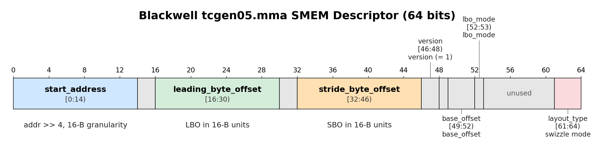
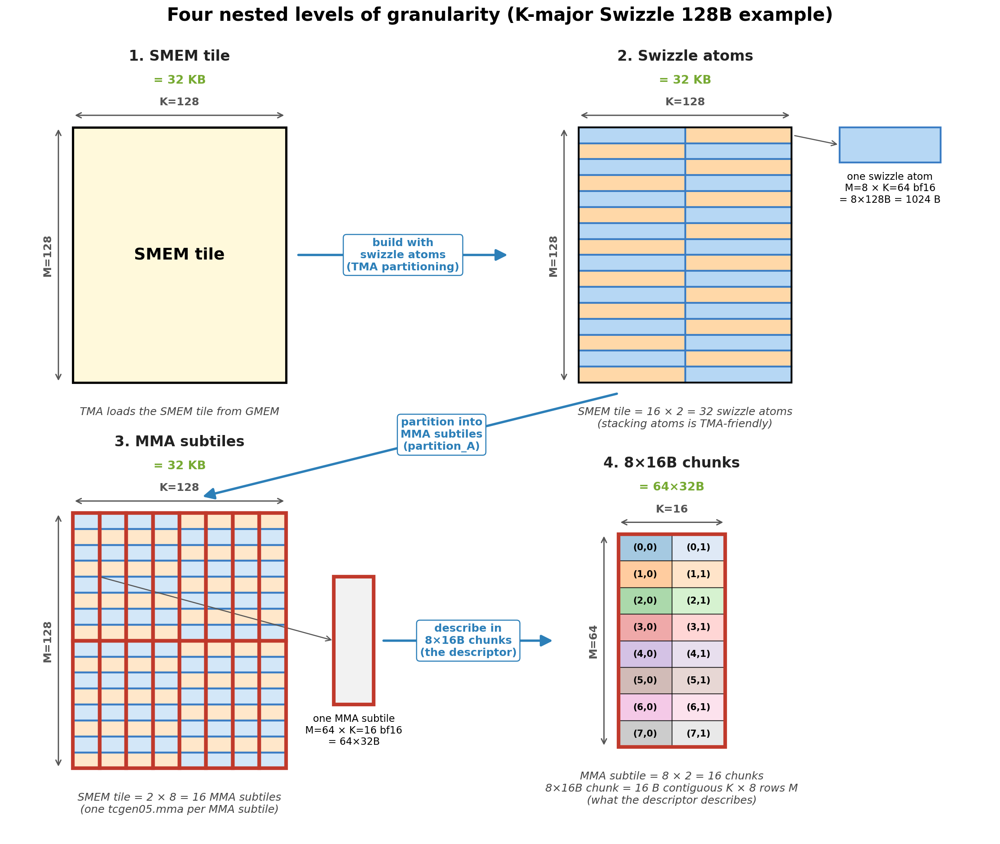
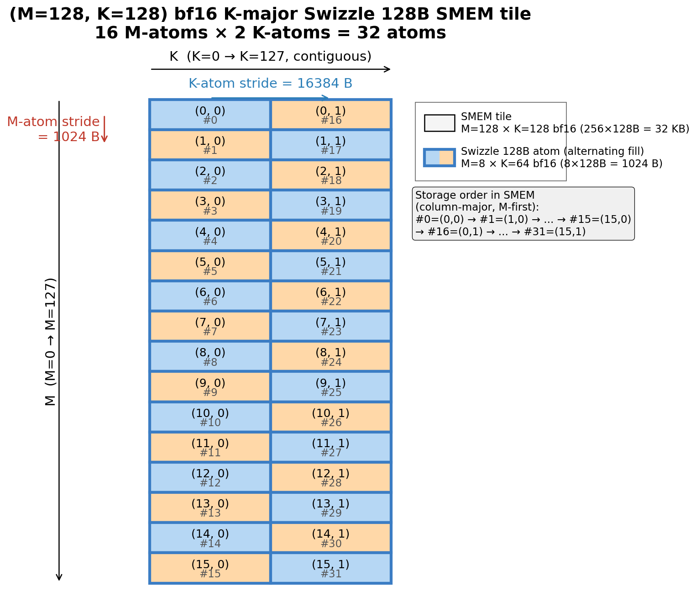
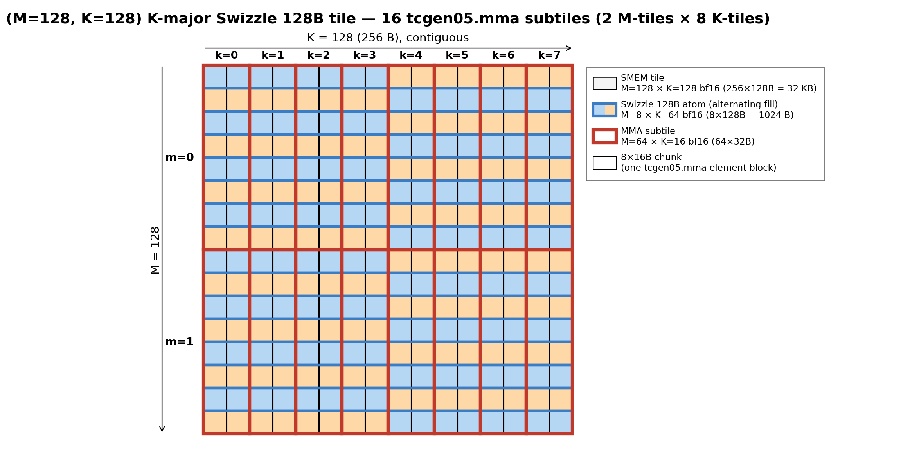
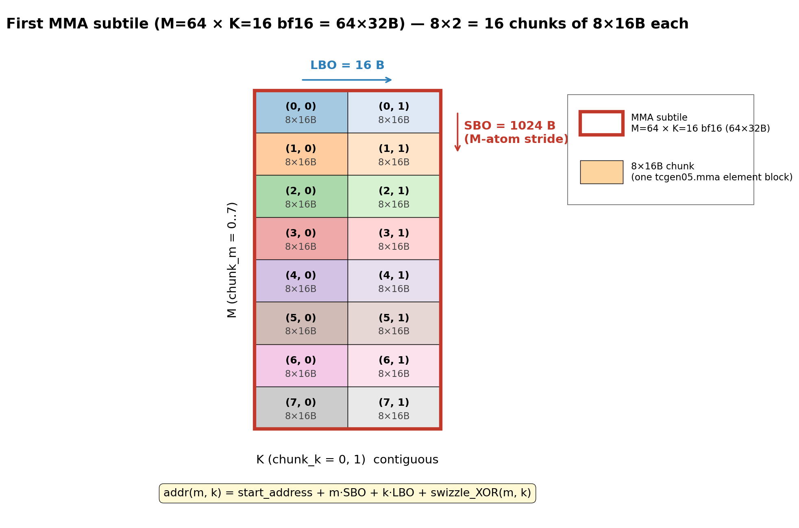
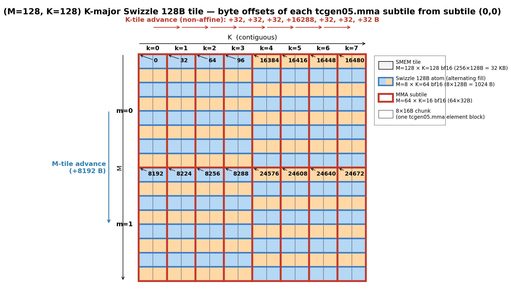
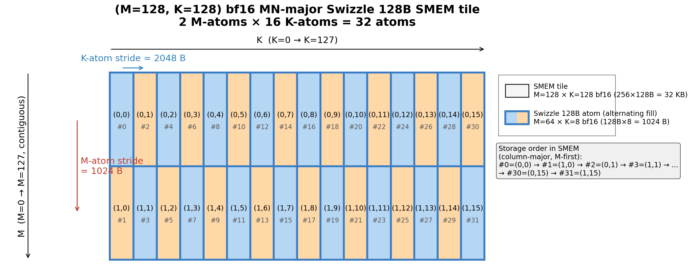
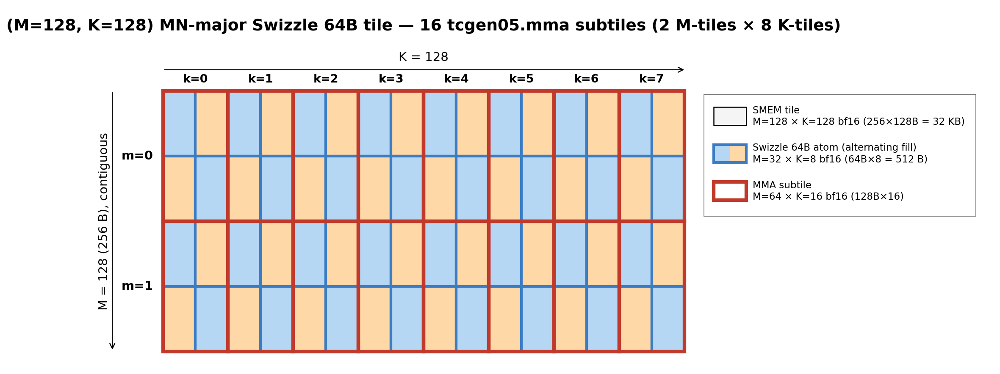
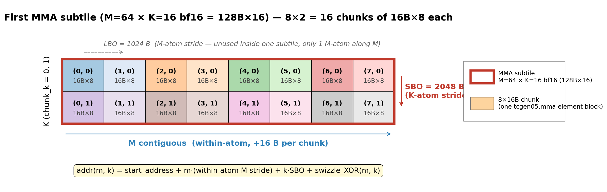
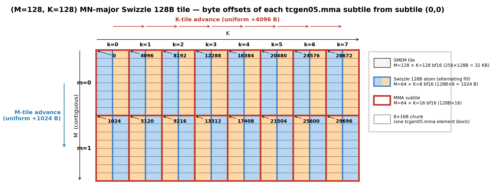

# Blackwell MMA SMEM Descriptor

*Disclaimer: The content of this blog reflects my personal experiences and opinions while learning GPU programming in my own time. All information presented is publicly available and does not represent the views or positions of NVIDIA Corporation or any of its affiliates.*

*Disclaimer2: This blog is written by Claude with heavy heavy human (me) supervision and editing. So the probability of this blog being AI slop is low.*

## 0. Introduction

In my previous blog ([MMA Swizzle Layout](../mma_swizzle/mma_swizzle.md)) I covered the SMEM swizzle layouts the Blackwell tensor core expects.
The natural follow-up question is: once the data is sitting in SMEM in the correct swizzled layout, **how does the tensor core understand the layout?**

Unlike Ampere's `mma` which sources operands from RF (via `ldmatrix`), Hopper's `wgmma` and Blackwell's `tcgen05.mma` source A/B directly from SMEM.
The hardware contract between the kernel and the tensor core is a 64-bit value called the **SMEM matrix descriptor**.
The descriptor tells the tensor core where the operand lives in SMEM and how to walk through it.
It is documented in [Sec. 9.7.16.4.1 of the PTX 9.2 doc](https://docs.nvidia.com/cuda/parallel-thread-execution/#tcgen05-matrix-descriptors).

I could not imagine how a human being (even LLM tbh) could understand how to correctly setup the SMEM descriptor by reading that section of the PTX doc.
If you do, by all means please write to me, I would love to learn from you on how to conquer the PTX doc.
Fortunately, CuTe / CUTLASS build and advance this descriptor for you "magically", which is what I rely on when I write Blackwell tensor core kernels.

You may ask, since CuTe abstracts the descriptor away from the user, why bother learning how it works?
Well firstly, it is always fun to understand how it works under the hood and what design choices CuTe made to abstract it away.
Plus one day, if you are doing some custom thing that is not supported by CuTe / CUTLASS, you will need to write the descriptor by hand.
Finally, in this agentic AI era, LLM would need some learning materials to understand how the SMEM descriptor works and I'm *confident* that the PTX doc along is insufficient.


In this blog I'll walk through how the SMEM descriptor is constructed and advanced (across MMA instructions) with two concrete worked examples — an `(M=128, K=128)` bf16 K-major SMEM tile, then the same tile but with MN-major layout, both with Swizzle 128B.
We will use the `M=64` variant of the bf16 `tcgen05.mma` instruction to demonstrate how the descriptor describes the input operand in SMEM needed by each `tcgen05.mma` instruction.

## 1. The SMEM Descriptor

The descriptor bit layout is shown below ([cute/arch/mma_sm100_desc.hpp](https://github.com/NVIDIA/cutlass/blob/c6aeb9179c5f74a0fcdbd28527bf4b6ba8c60752/include/cute/arch/mma_sm100_desc.hpp#L100)):



The fields that we'll care about in this blog are:

- **`layout_type`** (bits 61–63) — the swizzle mode: `SWIZZLE_NONE=0`, `SWIZZLE_128B=2`, `SWIZZLE_64B=4`, `SWIZZLE_32B=6`. This is the same set of 8 swizzle layouts from the [previous blog](../mma_swizzle/mma_swizzle.md#3-mma-swizzle-layout).
- **`start_address`** (bits 0–13) — the operand's starting byte address in SMEM, divided by 16. So the granularity is **16 B** (one `uint128`) and the field can address up to `2^14 * 16 = 256 KB` of SMEM, comfortably bigger than Blackwell's 232 KB.
- **`leading_byte_offset`** / **LBO** (bits 16–29) — one of the two strides the hardware uses to walk the operand. Also stored in 16-B units. It's the stride along the contiguous dimension (K for K-major, M for MN-major).
- **`stride_byte_offset`** / **SBO** (bits 32–45) — the other stride. Also in 16-B units. It's the stride along the non-contiguous dimension (M for K-major, K for MN-major).

The remaining fields (`base_offset`, `lbo_mode`, `version`) are configuration knobs that don't change across `tcgen05.mma` instructions of a single kernel; I'll leave them alone here.

`SBO` and `LBO` are strides *inside* one `tcgen05.mma` operand; `start_address` is what moves the descriptor *between* operands. To make that concrete we first need to name the four levels of granularity a SMEM tile can be represented as — which is the next section.

## 2. The Big Picture: Four Nested Levels of Granularity

Throughout this blog, four nested levels of "tile" keep showing up. 
They are primitive building blocks (with different sizes and purposes) that a SMEM tile can be represented as.
The table below uses the K-major `(M=128, K=128)` K-major SMEM tile as an example:


| Level | Shape (K-major bf16, Swizzle 128B) | What it is |
|---|---|---|
| **SMEM tile**       | `M=128 × K=128` (= `128 × 256 B`)    | The high-level SMEM region one TMA stages copies from GMEM. |
| **Swizzle atom**    | `8 × 128 B` (= `M=8 × K=64` bf16)    | The building block of the [`Swizzle 128B` layout](../mma_swizzle/mma_swizzle.md#314-k-major-swizzle-128b). **TMA-friendly**: Each TMA instruction loads multiple swizzle atoms at a time. |
| **MMA subtile**     | `M=64 × K=16` (= `64 × 32 B`)         | The A operand of one `tcgen05.mma` instruction. |
| **8×16B chunk**     | `8 × 16 B` (= 8 rows of one `uint128`) | The primitive unit the MMA hardware accesses. Each chunk lives entirely inside one swizzle atom. |

The figure below shows all four levels for a `(M=128, K=128)` K-major Swizzle 128B SMEM tile:



How the four levels interact:

1. The SMEM tile (`(M=128, K=128)`) is the high-level SMEM region one DMA stage copies from GMEM.
2. **Stacking swizzle atoms is how we construct the SMEM tile for TMA.** The SMEM tile is *literally* `tile_to_shape(Layout_K_SW128_Atom, (M=128, K=128))` — a 16×2 grid of `8x128B` swizzle atoms (blue or orange boxes in the figure). A single TMA instruction (box) loads multiple swizzle atoms (stacked along M) at a time.
3. **The MMA consumes the SMEM tile through MMA subtiles**, one `tcgen05.mma` instruction per MMA subtile (red boxes in the figure). For bf16, one `tcgen05.mma` instruction processes an `M=64, K=16` A subtile. And the entire SMEM tile is partitioned into 2x8=16 MMA subtiles. This is often referred to as the MMA partitioned layout `tCsA = ((MMA_M, MMA_K), Num_MMA_M, Num_MMA_K) = ((64, 16), 2, 8)`.
4. **Each MMA subtile is in turn a grid of 8×16B chunks.** The MMA hardware doesn't see swizzle atoms — it accesses SMEM in `8×16B` chunks. One swizzle atom holds 8 chunks; one MMA subtile holds 8x2=16 chunks.

> **The K-major SMEM descriptor (`layout_type`, `SBO`, and `LBO`) describes how the `8x16B` chunks are laid out within one MMA subtile in SMEM.**

> **The MN-major SMEM descriptor (`layout_type`, `SBO`, and `LBO`) describes how the swizzle atoms are laid out within one MMA subtile in SMEM.**

> **Each MMA subtile is described by one SMEM descriptor. Between different MMA subtiles, the `8x16B` chunks/swizzle atoms are laid out in the same way. The only difference is the `start_address` of the subtile. So SMEM descriptor update between MMA subtiles is `start_address` update in the descriptor.**

In the figures throughout the rest of the blog, the conventions are:

- **Swizzle atom**: light fill, thick blue border, with neighboring atoms alternating shades so the grid is visible at a glance. Always labeled with its shape.
- **MMA subtile**: thick red border (no fill) overlaid on top. Always labeled with its shape.
- **8×16B chunk**: thin black border, varied pastel fills.

For MN-major the absolute shapes flip — the swizzle atom is `M=64 × K=8` (`128B × 8`), and the MMA subtile is `M=64 × K=16` (`128B × 16`) — but the four-level structure is identical.

## 3. Worked Example — `(M=128, K=128)` bf16 K-major, Swizzle 128B

### 3.1. The SMEM tile and the swizzle atom

We start with a 32 KB **SMEM tile** of shape `(M=128, K=128)` in bf16, K-major, with K-major Swizzle 128B layout.
This is the high-level SMEM region one TMA stage copies from GMEM to SMEM in warp specialized pipeline.

For TMA copy, the SMEM tile is built out of **swizzle 128B atoms** stacked together (this is the TMA-friendly view from the [previous blog](../mma_swizzle/mma_swizzle.md#7-swizzle-atom-layout)).
The K-major Swizzle 128B atom is `M=8, K=128B` (or `M=8 × K=64` bf16) — an `8×128B = 1024 B` tile.
Our `(M=128, K=128)` SMEM tile therefore decomposes into **16 M-atoms × 2 K-atoms = 32 swizzle atoms**.
And we stack the swizzle atom along M first, then along K (i.e. stacking layout is `(16, 2) : (1, 16)`).
Stacking is done through `tile_to_shape` function in CuTe.
This allows maximal TMA box size as a single box can't go across two swizzle atoms along K.
So this tile will be broken down into 2 TMA boxes (`(M=128, K=64)` formed by stacking 16 swizzle atoms along M) and we will issue 2 TMA load instructions to load the tile into SMEM with MMA compatible swizzled layout.



Atom `(m, k)` sits at SMEM byte offset `m * 1024 + k * 16384` from the base of the tile.
So the swizzle atom starting address stride along M is 1024 B and along K is 16384 B.

### 3.2. The MMA subtile

This `(M=128, K=128)` SMEM tile participates in many MMA instructions.
For our specific `tcgen05.mma` instruction (bf16, `M=64`), the A operand size is `(M=64, K=16)`, we call this a MMA subtile (i.e. the tile size each MMA instruction consumes).

The full SMEM tile partitions into **2 M-tiles × 8 K-tiles = 16 MMA subtiles**.
So the SMEM tile can also be represented from a MMA subtile centric view (aka the MMA partitioned layout): `((MMA_M, MMA_K), Num_MMA_M, Num_MMA_K) = ((64, 16), 2, 8)`.
The MMA partitioned layout is often achieved through `tiled_mma.partition_A()` function in CuTe.
It transforms the SMEM tile layout from `(M, K) = (128, 128)` to `((MMA_M, MMA_K), Num_MMA_M, Num_MMA_K)`.



The figure above shows three of our four levels at once: the **SMEM tile** is the whole rectangle, the **swizzle atoms** are the small light-blue boxes (the TMA-friendly stacking), and the **MMA subtiles** are the red overlays (the MMA partitioning).
Each MMA subtile spans 8 swizzle 128B atoms along M.
But each MMA subtile doesn't consume the full swizzle atom along K, it only consumes 32B along K (1/4 of the swizzle 128B atom).
The descriptor will somehow describe how a MMA subtile consumes SMEM with this stacked swizzle atom layout.

### 3.3. The descriptor for the first MMA subtile

To describe the first MMA subtile (top left red box in the figure above) to the tensor core, we build a descriptor with the following fields:

```
layout_type   = 2          (SWIZZLE_128B)
start_address = &smem >> 4 (in 16-B units)
SBO           = 64 (in 16-B units) = 1024 B
LBO           =  1 (in 16-B units) =   16 B
```

How do `SBO` and `LBO` describe the layout of this MMA subtile?

The Tensor Core accesses SMEM in **8×16B chunks** ([Sec. 2.1 of the previous blog](../mma_swizzle/mma_swizzle.md#21-motivating-example-ampere-mma)).
For K-major, an 8×16B chunk is 8 rows along M × 16 B (= 8 bf16) along K.
With `M=64, K=16` K-major, our MMA subtile contains `8 (along M) × 2 (along K) = 16` 8×16B chunks arranged in an 8×2 grid as shown in the figure below.



The SMEM descriptor describes how the 16 8×16B chunks are laid out within one MMA subtile.
`LBO` describes the stride along K (leading dimension) between adjacent 8x16B chunks and is 16 B in this case.
`SBO` describes the stride along M (stride dimension) between adjacent 8x16B chunks and is 1024 B in this case.
Because the `LBO` and `SBO` field in the descriptor are in 16B units, so in this case `LBO = 1` and `SBO = 64`.
The 16B LBO denotes the stride between the first elements in two adjacent 8x16B chunks along K.
The 1024B SBO is easy to understand as the stride between two 8x16B atom along M is just the size of a swizzle 128B atom which is 8x128B=1024B.
As you can imagine with the `start_address` and the `SBO` and `LBO`, the Tensor Core should be able to walk through the `(M=64, K=16)` MMA subtile in SMEM by reading one 8x16B chunk at a time.

One final thing to note is the swizzle `layout_type` is also required for the Tensor Core to understand the actual SMEM layout of the MMA subtile.
Let's take the first 8x16B chunk in the MMA subtile as an example, because of swizzling, the stride between two consecutive rows in the chunk is not a uniform 128B (otherwise each row would map to the same SMEM bank, inducing bank conflicts).
16B rows are laid out in this zigzag pattern to avoid bank conflicts (refer to [Sec. 4.1 of the previous blog](../mma_swizzle/mma_swizzle.md#314-k-major-swizzle-128b)).
The Tensor Core hardware needs to understand this swizzle pattern to correctly load the 8x16B chunk.
SImilarly, for the 8x16B chunk at coordinate `(0, 1)` in the MMA subtile, as long as we know the address of the first element in the chunk and the swizzle `layout_type`, we should be able to retrieve the address of all the 16B rows in the chunk.

### 3.4. The descriptors for the other 15 MMA subtiles — advance via `start_address`

The other 15 MMA subtiles have **the same shape and the same `(SBO, LBO, layout_type)`**.
The only thing that changes is **where they start in SMEM** — i.e. only `start_address`.

So advancing the descriptor from one MMA subtile to the next is just: bump `start_address` by the byte offset between the two subtiles. The offsets from MMA subtile `(0, 0)` to MMA subtile `(m_subtile, k_subtile)` are:

| m_subtile \ k_subtile |  0 |   1 |   2 |   3 |     4 |     5 |     6 |     7 |
|---:|---:|---:|---:|---:|---:|---:|---:|---:|
| **0** |    0 |    32 |    64 |    96 | 16384 | 16416 | 16448 | 16480 |
| **1** | 8192 |  8224 |  8256 |  8288 | 24576 | 24608 | 24640 | 24672 |



Two patterns to notice:

- **Along K** (within a row of the table) the advance is non-uniform: four small `+32 B` steps within swizzle 128B atom 0, then a big `+16288 B` jump into swizzle 128B atom 1, then three more `+32 B` steps.
- **Along M** (going from m_subtile 0 to m_subtile 1) the advance is a clean `+8192 B` = 8 swizzle 128B atoms.

So we just update the `start_address` field in the descriptor by the offset between the two subtiles.

Similarly, even though 4 MMA subtiles read from the same swizzle 128B atom, they differentiate by their own `start_address` so the Tensor core knows which slice of the 128B atom it should load for each MMA subtile.
With the `layout_type` information, the Tensor Core should be able to figure out precisely which 16B chunk it should load from SMEM for each MMA subtile.

### 3.5. How CuTe Implements This

If you are familiar with [Sec. 9.7.17.3.3 Canonical Layouts](https://docs.nvidia.com/cuda/parallel-thread-execution/#tcgen05-canonical-layouts) of PTX doc, it states the CuTe interpretation of the SMEM descriptor (specifically how `LBO` and `SBO` are defined).
The SMEM tile `(M, K)` can be represented as a canonical layout form (aka layout template) of 
```bash
# for bf16 K-major swizzle 128B
# T = 128 / sizeof-elements-in-bits = 128 / 16 = 8
((8,m),(T,2k)):((8T,SBO),(1,T))
= ((8,m),(8,2k)):((64,SBO),(1,LBO))
```

As long as we can convert the SMEM tile layout `(M=128, K=128)` to the canonical layout form `((8,m),(8,2k)):((64,SBO),(1,LBO))`, we can get the `SBO` and `LBO` values from the canonical layout and populate the descriptor fields.
You can already see the interpretation of `SBO` and `LBO` in the canonical layout form.
If I rewrite it into `((8,m),(8,2k)):((64,SBO),(1,LBO)) = ((ChunkM,m),(ChunkK,2k)):((64,SBO),(1,LBO))`, then you can see `LBO` and `SBO` mean exactly the stride between 8x16B (`(ChunkM=8, ChunkK=8)`) chunks along K and M respectively (the same as what we introduced in [Sec. 3.3](#33-the-descriptor-for-the-first-mma-subtile)).

CuTe does this layout conversion to canonical form through a **`uint128` recast** and a **`logical_divide`**.


#### 3.5.1 Step 1: the original SMEM tile layout

`tile_to_shape(Layout_K_SW128_Atom<bf16>, Shape<_128,_128>)` produces this hierarchical layout (in **bf16 element** units):

```bash
# ((AtomM, RestM), (AtomK, RestK))
shape  ((8,  16),   (64, 2))
stride ((64, 1024), (1, 8192))
         ^^  ^^^^^   ^  ^^^^
         |     |     |    +-- Swizzle atom stride along K: 16 atoms × 512 elements = 8192 (= 16384 B)
         |     |     +-------- within-swizzle-atom K stride: 1 (K is contiguous)
         |     +--------------- Swizzle atom stride along M:   512 elements    = 1024 B
         +--------------------- within-swizzle-atom M stride: 64 elements      =  128 B (= one atom-row)
```

This is the plain `(M=128, K=128)` SMEM tile layout in bf16 element units.
As you can see from the layout, we essentially stack the K-major swizzle 128B atom (`(AtomM=8, AtomK=64)`) along M first, then along K.

#### 3.5.2 Step 2: MMA partition

Because we want to create a descriptor per MMA subtile, so we first need to convert the SMEM tile layout into the MMA centric view (i.e. the MMA partitioned layout).
Typically one can do this through `tiled_mma.partition_A/B/C()` function in CuTe.
What it basically does is it get the MMA subtile shape `(MMA_M, MMA_K)` from `tiled_mma` and then do a `zipped_divide` on the SMEM tile layout to get the MMA partitioned layout.

Concretely for our example, the MMA subtile shape is `(MMA_M=64, MMA_K=16)`.
So we can do a `zipped_divide` on the SMEM tile (`((AtomM, RestM), (AtomK, RestK))` = `((8, 16), (64, 2))`) layout to get the MMA partitioned layout:

```bash
# cute.zipped_divide(((AtomM, RestM), (AtomK, RestK)), (MMA_M, MMA_K))
# = ((MMA_M, MMA_K), Num_MMA_M, Num_MMA_K)
shape  ((64, 16), (2,    (4,  2)))
stride ((64,  1), (4096, (16, 8192)))
```

So now we already get the stride between MMA subtiles along M and K, which is the offset we advance the `start_address` field in the SMEM descriptor by when advancing to the next MMA subtile.

This is exactly the same as what we get in [Sec. 3.4](#34-the-descriptors-for-the-other-15-mma-subtiles--advance-via-start_address).
The stride along `Num_MMA_M` is 4096 bf16 elements = 8192B.
And for the first 4 MMA subtile along K, the stride is 16 bf16 elements = 32B.
Then there is a big jump to 8192 bf16 elements = 16384B to the next 4 MMA subtiles along K.

#### 3.5.3 Step 3: recast to `uint128_t`

A CuTe recast means we concatenate a few consecutive (narrow data type) elements together and reinterpret it as a single elements (with a wider data type).
For instance, recasting from `bf16` to `uint128` means we concatenate 8 consecutive `bf16` elements together and reinterpret it as a single `uint128` element.

Remember CuTe stride denotes the number of elements in that dimension.
A stride of 4 with a bf16 tensor means the stride is 4 * 2B = 8B.
Because SMEM descriptor every field is in 16B units (aka the bitwidth of uint128_t), so if we recast the SMEM tile to uint128_t, every stride will be in unit of 16B which is exactly what we want for the SMEM descriptor.
Then the stride value of the uint128_t layout can literally be used as SMEM descriptor's `start_address`, `SBO` and `LBO` fields without any further conversion.

```bash
# recast from bf16 to uint128
# cute.recast_layout(128, 16, ((MMA_M, MMA_K), Num_MMA_M, Num_MMA_K))
shape  ((64, 2), (2,   (4, 2)))
stride ((8,  1), (512, (2, 1024)))
```

The stride value of `Num_MMA_M` is 512 (=512*16B=8192B) is how much you would update the `start_address` field in the SMEM descriptor by when advancing to the next MMA subtile along M.
The stride value of `Num_MMA_K` is (2, 1024) = (2*16B, 1024*16B) = (32B, 16384B) is how much you would update the `start_address` field in the SMEM descriptor by when advancing to the next MMA subtile along K.

#### 3.5.4 Step 4: logical_divide to get the canonical layout

After the recast, the canonical layout becomes `((8,m),(1,2k)):((8,SBO),(1,LBO))`.
Now the canonical layout is fully data type and swizzle type agnostic, i.e. any data type and swizzle type follows the same canonical layout form after the recast.
We need to convert the recasted MMA subtile layout `(64, 2) : (8, 1)` to the canonical layout to extract the `SBO` and `LBO` values for the SMEM descriptor.

We do this layout conversion through `logical_divide` function in CuTe.
`LBO` and `SBO` represents the stride between 8x16B chunks (`(ChunkM=8, ChunkK=8)` in bf16 and `(ChunkM=8, ChunkK=1)` in uint128) along K and M respectively.
So if we `logical_divide` the MMA subtile layout `(MMA_M=64, MMA_K=2)` by `(ChunkM=8, ChunkK=1)`, we get the canonical layout.

```bash
# cute.logical_divide((MMA_M, MMA_K), (ChunkM, ChunkK))
# = ((ChunkM, RestM), (ChunkK, RestK)) : ((8, SBO), (1, LBO))
shape  ((8, 8),  (1, 2))
stride ((8, 64), (1, 1))
```

So the stride of `RestM` is `SBO=64=64*16B=1024B` (i.e. stride_01).
And the stride of `RestK` is `LBO=1=1*16B=16B` (i.e. stride_11).

One small note is that here our implementation is slightly different from the [CuTe C++ implementation](https://github.com/NVIDIA/cutlass/blob/2599f2975b06a67d5ee25e4a7292afeda1475c9b/include/cute/atom/mma_traits_sm100.hpp#L271) for more clarity.
CuTe C++ does `cute.logical_divide((MMA_M, MMA_K), (ChunkM, RestK)) = ((ChunkM, RestM), (RestK, ChunkK)) : ((8, SBO), (LBO, 1))`.
They flipped the `ChunkK` and `RestK` order so `LBO` becomes the stride_10 in the code.
Both implementations are functionally correct to extract the `SBO` and `LBO`.


#### 3.5.5 Step 5: the descriptor advance

At this point we already get all the fields for the SMEM descriptor: `layout_type`, `start_address`, `SBO` and `LBO`.
In theory we can construct one SMEM descriptor per MMA subtile but that just burns many registers.
We notice that the difference between each descriptor is just the `start_address` field.

So CuTe creates a base descriptor for the first MMA subtile and then just update the `start_address` field to get the other descriptors for other MMA subtiles.
Because the `start_address` is the first 14bit of the 64bit descriptor, if you literally do `desc + offset` you can get a descriptor with a new `start_address` value.
All you need to do is to figure out the correct offset to use between two consecutive MMA subtiles.

Luckily, this offset information is already calculated in [Sec. 3.5.3](#353-step-3-recast-to-uint128_t), i.e. the stride value of `Num_MMA_M` and `Num_MMA_K` (already in 16B units).
What CuTe does smartly is to create a 64bit CuTe tensor of shape `(Num_MMA_M, Num_MMA_K)` and each entry (a 64bit number) is the descriptor for the corresponding MMA subtile.
We use the existing stride extracted from the recasted MMA partitioned layout as the descriptor tensor stride.
So the offset between two MMA subtiles is the correct offset you should apply to `start_address` field in the descriptor.

```bash
# descriptor tensor (Num_MMA_M, Num_MMA_K)
shape  (2,   (4, 2))
stride (512, (2, 1024))
```

Very concretely, when updating the descriptor along the M dimension, you update the descriptor (a 64bit number) by the stride along M (i.e. 512 = 512*16B=8192B), which is the correct `start_address` offset to advance to the next MMA subtile along M.
Similarly, when updating the descriptor along the K dimension, you update the descriptor by the stride along K (i.e. 2 = 2*16B=32B), which is the correct `start_address` offset to advance to the next MMA subtile along K.
Obviously if you want to advance to the next group of MMA subtiles along K, you need to update the descriptor by the bigger stride along K (i.e. 1024 = 1024*16B=16384B), which is the correct `start_address` offset to advance to the next group of MMA subtiles along K.

In practice, CuTe does this through a [DescriptorIterator](https://github.com/NVIDIA/cutlass/blob/2599f2975b06a67d5ee25e4a7292afeda1475c9b/include/cute/atom/mma_traits_sm100.hpp#L314) class.
It overloads the `operator+` to return a new descriptor with a new `start_address` value.


## 4. Worked Example — `(M=128, K=128)` bf16 MN-major, Swizzle 128B

Now we'll repeat the exercise for the same `(M=128, K=128)` bf16 tile, but stored **MN-major** (M is the contiguous dimension).
Same four levels of granularity as Sec. 2 — **SMEM tile**, **swizzle atom**, **MMA subtile**, **8×16B chunk** — but the absolute shapes flip. (The K-major version was the worked example in Sec. 3.)

### 4.1. The SMEM tile and the swizzle atom

The MN-major Swizzle 128B atom is `M=128B, K=8` (or `M=64 × K=8` for bf16) — still an `8×128B = 1024 B` slab, but now M is the contiguous dimension within an atom ([Sec. 3.2.4 of the previous blog](../mma_swizzle/mma_swizzle.md#324-mn-major-swizzle-128b)).
Our `(M=128, K=128)` SMEM tile decomposes into **2 M-atoms × 16 K-atoms = 32 swizzle atoms**.

**Atom ordering matters here.** For MN-major, the *contiguous (swizzled)* dimension is M, so to maximize the TMA box we stack swizzle atoms **along K first, then along M** — i.e. the 16 K-atoms of one M-atom are laid out contiguously in SMEM, then the next M-atom. This is the opposite of the K-major case (Sec. 3.1), where we stacked along M first. The reason is the same in both cases: stacking atoms contiguously along the *non-swizzled* dimension lets a single TMA box span that whole dimension in one transfer (here, one TMA box can load a full `M=64 × K=128` M-atom slab). See [Sec. 9.3 of the previous blog](../mma_swizzle/mma_swizzle.md#93-putting-it-all-together) for why.



With K-first ordering, atom `(m, k)` sits at SMEM byte offset `m * 16384 + k * 1024` from the base (K-atom stride = 1024 B = one atom; M-atom stride = 16 K-atoms = 16384 B).

### 4.2. The MMA subtile

We feed this MN-major SMEM tile to `SM100_MMA_F16BF16_SS<M=64, N, K=16, MN-major, …>`.
The MMA subtile is again `M=64 × K=16` bf16 — `128B × 16` viewed MN-major (M=64 bf16 contiguous, K=16 strided).
The full SMEM tile partitions into **2 M-tiles × 8 K-tiles = 16 MMA subtiles**, the same count as the K-major case.

The key difference from Sec. 3: the MN-major swizzle atom only holds `M=64` along M and `K=8` along K. An MMA subtile (`M=64 × K=16`) fits exactly within one M-atom and **spans 2 K-atoms** of the SMEM tile:



So while a K-major MMA subtile straddled *8 M-atoms* in the SMEM tile (and stayed within 1 K-atom), an MN-major MMA subtile sits in *1 M-atom* but straddles 2 K-atoms.

### 4.3. The descriptor for the first MMA subtile

The descriptor for the first MMA subtile has these field values:

```
layout_type   = 2          (SWIZZLE_128B)
start_address = &smem >> 4
SBO           =  64 u128 = 1024 B
LBO           =   0 u128 =    0 B   (unused — see below)
```

For MN-major, an 8×16B chunk is 16 B (= 8 bf16) along the contiguous M direction × 8 rows along K.
With `M=64, K=16` MN-major, the MMA subtile contains `8 (along M) × 2 (along K) = 16` chunks arranged in an 8×2 grid:



The hardware addresses these chunks using two strides:

- **SBO = K-atom stride = 1024 B**. The MMA subtile spans 2 K-atoms of the SMEM tile; SBO is the distance between them. With K-first atom ordering those two K-atoms are *adjacent* in SMEM, so SBO is just one atom = 1024 B. **`SBO` is used *inside* one `tcgen05.mma` invocation** for MN-major — unlike the K-major case where SBO was the M-atom stride.
- **LBO = 0 (unused)**. `LBO` is the *leading*-dimension (MN) inter-atom stride. But the `M=64` MMA operand is **exactly one MN-atom wide** (the MN-major atom holds M=64), so there is no second MN-atom to step to — CuTe's canonical reshape produces `stride<0,1> = 0`. (Had the instruction been `M=128`, the operand would span 2 MN-atoms and `LBO` would be their stride.) The companion script reads this `0` straight out of the CuTe layout.

This is the key contrast with K-major. There, the subtile spanned **8** M-atoms, so `SBO` (the M-atom stride) was actively used inside each `tcgen05.mma`. Here the subtile is **1** MN-atom along the leading dimension, so `LBO` is dead weight — only `SBO` does any work inside one instruction.

Don't confuse `LBO` with the **M-tile advance**: moving from M-tile 0 to M-tile 1 still happens by bumping `start_address` (+16384 B, the SMEM M-atom stride), exactly like every other advance — *not* via the descriptor's `LBO` field.

**The roles of `SBO` and `LBO` would swap between Major::K and Major::MN.**
In Major::K, `SBO` is the M-atom stride and `LBO` is the 16-B intra-K step.
In Major::MN, `LBO` is the MN-atom stride (here 0/unused, since `M=64` = 1 MN-atom) and `SBO` is the K-atom stride.
The naming "stride" vs "leading" is anchored to the contiguous (= leading) dimension of the operand: `LBO` is the inter-atom stride along the leading direction, `SBO` along the strided direction.

As in Sec. 3.3, the absolute address of every chunk in the MMA subtile is fully determined by `start_address + a * SBO + b * LBO + swizzle_XOR`, plus the implicit within-atom layout encoded by `layout_type`.

### 4.4. The descriptors for the other 15 MMA subtiles — uniform advance this time

Each MMA subtile is offset from `(0, 0)` by `m_tile × M-tile-stride + k_tile × K-tile-stride`, with:

- K-tile-stride = `2 K-atoms = 2 × 1024 = 2048 B` (this is exactly `2 × SBO`).
- M-tile-stride = `1 M-atom = 16 K-atoms = 16384 B` (the SMEM M-atom stride, applied via `start_address`).

| m_tile \ k_tile |  0 |    1 |    2 |    3 |     4 |     5 |     6 |     7 |
|---:|---:|---:|---:|---:|---:|---:|---:|---:|
| **0** |    0 |  2048 |  4096 |  6144 |  8192 | 10240 | 12288 | 14336 |
| **1** | 16384 | 18432 | 20480 | 22528 | 24576 | 26624 | 28672 | 30720 |



Contrast this with the K-major case in Sec. 3.4. The K-major advance was non-affine along K because each MMA subtile only covered K=16 = 1/4 of one K-atom, so the K-tile-stride had to "wrap" 4 times before moving to the next K-atom. In MN-major each MMA subtile already covers exactly 2 K-atoms, so the K-tile-stride is one integer number of K-atoms — affine and uniform.

In fact, because `M-tile-stride = 8 × K-tile-stride` (16384 = 8 × 2048), the 16 MMA subtiles tile SMEM **completely contiguously**: subtile `(m_tile, k_tile)` is at byte offset `(m_tile · 8 + k_tile) · 2048`, i.e. one flat `+2048 B` step per `tcgen05.mma` as you walk the K-tiles of M-tile 0 and then M-tile 1. The descriptor advance reduces to a single constant immediate that can be hoisted into a uniform register.

### 4.5. How CuTe Implements This

Same recipe as Sec. 3.5 — `uint128` recast → `logical_divide` to a canonical shape → read SBO/LBO out of fixed stride slots, then advance via outer-mode strides. Let's walk through the concrete numbers for MN-major.

**Step 1: original layout.** `tile_to_shape(Layout_MN_SW128_Atom<bf16>, Shape<_128,_128>, K-first order)` produces (in bf16 element units):

```
shape  ((64, 2),   (8, 16))
stride ((1, 8192), (64, 512))
       ^   ^^^^    ^^   ^^^
       |   |       |     +-- K-atom stride: 1 atom = 512 elements         = 1024 B (K-atoms contiguous)
       |   |       +-------- within-atom K stride: 64 elements (one M-row) = 128 B
       |   +---------------- M-atom stride: 16 K-atoms × 512 = 8192 elem   = 16384 B
       +-------------------- within-atom M stride: 1 (M is contiguous now)
```

**Step 2: recast to `uint128_t`.** The contiguous direction is now M, so we divide M strides by 8:

```
shape  ((8, 2),   (8, 16))
stride ((1, 1024), (8, 64))      // u128 units
```

**Step 3: slice off the first MMA subtile** (`M=64 = 1 M-atom`, `K=16 = 2 K-atoms`), in u128:

```
shape  (8, 16)        // (M, K) in u128
stride (1, 8)
```

**Step 4: why `logical_divide`?** Same `(within-tile, rest)` split as Sec. 3.5, but tiling **both** modes by `8` (the atom is 8-wide in both M-as-u128 and K here). Symbolically, tiling `sub_u = (8, 16):(1, 8)` by tiler `(8, 8)` maps onto CuTe's template `((8, n), (8, k)):((1, LBO), (8, SBO))` — note SBO/LBO sit in *different* slots than Major::K:

```
                          split M by 8           split K by 8
  sub_u             =  (     8       ,                16       ) : ( 1, 8 )
  logical_divide →
  canonical (symbol)=  ( ( 8 , RestM ) ,        ( 8 , RestK ) ) : ( ( 1 , LBO ), ( 8 , SBO ) )
                           │     │                 │     │            │     │      │     │
  SwizzleAtomMN (8) ───────┘     │                 │     │            │     │      │     │
  RestM = #M-atoms in subtile ───┘                 │     │            │     │      │     │
  SwizzleAtomK (8) ────────────────────────────────┘     │            │     │      │     │
  RestK = #K-atoms in subtile ───────────────────────────┘            │     │      │     │
  within-atom M stride (implicit) ───────────────────────────────────┘     │      │     │
  LBO = M-atom stride = the M-"rest" stride = stride<0,1> ──────────────────┘      │     │
  within-atom K stride (= 8, implicit) ───────────────────────────────────────────┘     │
  SBO = K-atom stride = the K-"rest" stride = stride<1,1> ───────────────────────────────┘

  matches template ((8, n), (8, k)):((1, LBO), (8, SBO))   with  n = RestM, k = RestK
```

(As in Sec. 3.5 this is the **u128** form; CuTe's element-units form is `((T,8,m),(8,k)):((1,T,LBO),(8T,SBO))`, and the Step-2 recast divides the `T`s out.) Plugging in `RestM = 8/8 = 1`, `RestK = 16/8 = 2`:

```
  canonical (concrete) = ((8, 1), (8, 2)) : ((1, 0), (8, 64))
                                                  │         └ SBO = stride<1,1> = 64 u128
                                                  └ LBO = stride<0,1> = 0  (RestM=1 -> degenerate)
```

`RestM = 1` — exactly one MN-atom — is *why* `LBO` collapses to 0: there is no second MN-atom for its stride to point at.

| canonical slot | value (u128) | descriptor field | bytes |
|---|---:|---|---:|
| `stride<1,1>` | 64 | **SBO** (K-atom stride) | **1024 B** |
| `stride<0,1>` |  0 | **LBO** (MN-atom stride) |    **0 B** *(degenerate)* |

That's where `SBO = 1024 B` and `LBO = 0` from Sec. 4.3 come from. The `LBO = 0` is exactly the "M=64 is one MN-atom" degeneracy: after the split, the M-atom-count sub-mode has size 1, so its stride is 0.

**Step 5: descriptor advance.** The partitioned-tensor outer-mode strides (in u128):

```
MMA_M_tile mode : shape 2,    stride 1024      // 1 M-atom  = 1024 u128 = 16384 B
MMA_K_tile mode : shape 8,    stride  128      // 2 K-atoms =  128 u128 =  2048 B (= 2 × SBO)
```

Both flat affine this time (no hierarchical mode) — that's the "uniform advance" of Sec. 4.4: `+16384 B` per M-tile, `+2048 B` per K-tile, applied to `start_address` (independent of the `LBO=0` field). And since `16384 = 8 × 2048`, the two collapse into a single `+2048 B` step across all 16 subtiles.

**Materializing one descriptor, not 16.** Same as Sec. 3.5: `make_umma_desc` is called once for `(m=0, k=0)`. The `DescriptorIterator::operator+` produces all 15 other descriptors on demand via `base_desc + offset`, with `offset` lifted from the strides above at compile time. The kernel holds exactly one descriptor in a uniform register and bumps it by a small set of compile-time immediates as it walks through the MMA subtiles.

A runnable script for this MN-major case is at [`code/sw128_mnmajor.py`](./code/sw128_mnmajor.py) — it derives every number below with CuTe layout algebra and asserts them. Output:

```
=== MN-major Swizzle 128B, SMEM M=128 K=128 bf16, tcgen05.mma M=64 ===
  (all layouts produced by CuTe layout algebra; K-first atom order)

SMEM layout (bf16 elements): ((64,2),(8,16)):((1,8192),(64,512))
recast to u128            : ((8,2),(8,16)):((1,1024),(8,64))
per-MMA-subtile (bf16)    : (64,16):(1,64)
advance modes (bf16)      : (2,8):(8192,1024)  = (M-tile, K-tile)
canonical (u128)          : ((8,1),(8,2)):((1,0),(8,64))

descriptor for subtile (m_tile=0, k_tile=0):
  layout_type   = 2  (SWIZZLE_128B)
  start_address = 0x00000          (= 0 B from base)
  SBO = stride<1,1> =   64 u128 =  1024 B   (K-atom stride)
  LBO = stride<0,1> =    0 u128 =     0 B   (M-atom stride — 0/unused, M=64 is 1 MN-atom)

byte offsets from desc[0,0] (start_address advance):
        k=0      k=1      k=2      k=3      k=4      k=5      k=6      k=7
  m=0  0        2048     4096     6144     8192     10240    12288    14336
  m=1  16384    18432    20480    22528    24576    26624    28672    30720
```

## 5. Summary

The Blackwell SMEM matrix descriptor packs into 64 bits everything the tensor core needs to fetch one `tcgen05.mma` operand from SMEM.

Throughout this blog we worked with four nested levels of granularity, and each played a specific role in the descriptor story:

| Level | What it is | Where it shows up in the descriptor |
|---|---|---|
| **SMEM tile** (e.g. M=128 × K=128) | The high-level region one CTA stages from GMEM. | Not directly — but its CuTe layout is the input to `make_umma_desc`. |
| **Swizzle atom** (1024 B) | The TMA-friendly building block; the SMEM tile is a stack of swizzle atoms. | Determines `layout_type`; its size determines `SBO` and `LBO` numerically. |
| **MMA subtile** (M=64 × K=16) | What one `tcgen05.mma` instruction consumes. | One descriptor describes one MMA subtile. |
| **8×16B chunk** (16 B per row × 8 rows) | The primitive layout unit the MMA hardware addresses. | `SBO`/`LBO` are the strides *between chunks*; `start_address` anchors them; `layout_type` encodes the swizzle XOR within an atom. |

The four descriptor fields, mapped to which level they speak about:

- **`layout_type`** — picks the swizzle mode, which implicitly nails down the relative positions of all 8×16B chunks inside one swizzle atom. **Constant** for the whole kernel.
- **`SBO`** and **`LBO`** — the two inter-chunk strides *inside* one MMA subtile. CuTe reads them off the SMEM tensor by recasting to `uint128_t` and pulling specific `stride<i,j>` lookups out of a canonical hierarchical reshape. **Constant** across all `tcgen05.mma` invocations of the same shape.
- **`start_address`** — anchors *which* MMA subtile we're talking about. **This is the only field that changes** between `tcgen05.mma` invocations, and the change is a straight `uint64` add of a precomputed offset.

The role of `SBO` vs `LBO` flips between Major::K and Major::MN:

|              | Major::K, B128                       | Major::MN, B128             |
|--------------|---------------------------------------|-----------------------------|
| atom ordering | stack along M first (maximize TMA box) | stack along K first (maximize TMA box) |
| **SBO**      | M-atom stride (= 1024 B in our tile)  | K-atom stride (= 1024 B)    |
| **LBO**      | 16 B intra-K step (= 1 u128)          | MN-atom stride — **0/unused** (M=64 = 1 MN-atom) |
| Used **inside** one MMA subtile? | both — SBO steps 8 M-atoms, LBO steps 2 K-halves | only SBO (MMA subtile spans 2 K-atoms); LBO degenerate |
| Advance **between** MMA subtiles? | via `start_address` (K-tile non-affine, M-tile +8192 B) | via `start_address` (K-tile +2048 B, M-tile +16384 B) |

For our `(M=128, K=128)` bf16 B128 SMEM tile with the M=64 `tcgen05.mma`:

- **K-major**: the 16 MMA subtiles fan out in 2 (M-tiles) × 8 (K-tiles). K-tile advance is non-affine (`+32 +32 +32 +32 +16288 +32 +32 +32` bytes); M-tile advance is `+8192` bytes.
- **MN-major**: K-tile advance is uniform `+2048` bytes; M-tile advance is `+16384` bytes — and because the latter is exactly 8× the former, the 16 subtiles tile SMEM contiguously with one flat `+2048 B` step.

The non-affine K-major advance is not a special case in CuTe — it falls out of the hierarchical CuTe layout of the K-tile mode of the `uint128`-recasted tensor. The descriptor iterator's `operator+` is just `desc + uint64_t(offset)`. All the cleverness is in picking the canonical layout shape so the right strides pop out of `logical_divide` — once that's done, the descriptor's "advance" is the dumbest possible operation.
