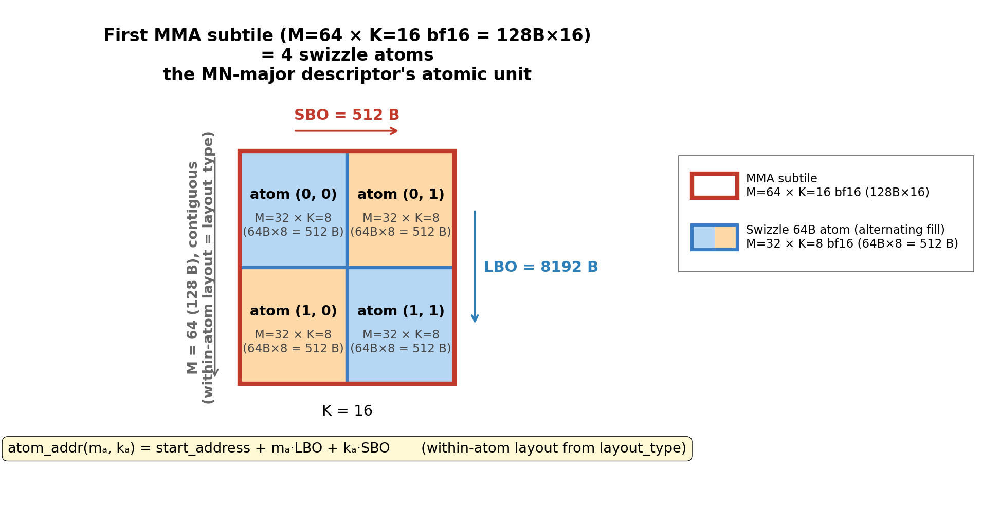

# Blackwell MMA SMEM Descriptor 中文版

*免责声明：本博客的内容反映的是我个人在业余时间学习 GPU 编程时的经验与观点。所有信息均来自公开资料，不代表 NVIDIA Corporation 或其任何关联公司的观点或立场。*

*免责声明 2：本博客是与 Claude 协作完成的。我对其中的每一个字都进行了审阅。所以本博客不是 AI 灌水。*

*本篇是英文版 [Blackwell MMA SMEM Descriptor](./smem_descriptor.md) 原文的中文翻译。*

## 0. 引言

在我上上篇博客（[MMA Swizzle Layout](../mma_swizzle/mma_swizzle.md)）中，我介绍了 Blackwell tensor core 所期望的 SMEM swizzle layout。
一个自然的后续问题是：当数据已经以正确的 swizzle layout 放在 SMEM 中之后，**tensor core 如何理解这个 layout ？**

不同于 Ampere 的 `mma`（它通过 `ldmatrix` 从 RF 中取操作数），Hopper 的 `wgmma` 和 Blackwell 的 `tcgen05.mma` 直接从 SMEM 中取 A/B 操作数。
kernel 与 tensor core 之间的硬件契约是一个 64 位的 **SMEM matrix descriptor**。
该 descriptor 告诉 tensor core 操作数在 SMEM 中的位置，以及如何遍历它。
它的文档见 [PTX 9.2 文档第 9.7.16.4.1 节](https://docs.nvidia.com/cuda/parallel-thread-execution/#tcgen05-matrix-descriptors)。

我无法想象一个人类（说实话即便是 LLM）能够通过阅读 PTX 文档的那一节，就理解如何正确地设置 SMEM descriptor。
如果你能做到，请务必写信告诉我，我很乐意向你学习如何攻克 PTX 文档。
幸运的是，CuTe / CUTLASS 会“神奇地”帮你构建并推进（advance）这个 descriptor，这也是我在写 Blackwell tensor core kernel 时所依赖的。

你可能会问，既然 CuTe 已经把 descriptor 从用户层面抽象掉了，为什么还要费心去学它的原理呢？
首先，理解它底层是如何工作的、以及 CuTe 为了把它抽象掉做了哪些设计选择，本身就是一件有趣的事。
另外有朝一日，如果你要做一些 CuTe / CUTLASS 不支持的自定义操作，你就需要手写这个 descriptor 了。
最后，在这个 agentic AI 的时代，LLM 也需要一些学习材料来理解 SMEM descriptor 是如何工作的，而我*确信*仅凭 PTX 文档是不够的。


在本博客中，我会通过两个具体的实例，带你走一遍 SMEM descriptor 是如何构建并（跨 MMA 指令）推进的——先是一个 `(M=128, K=128)` 的 bf16 K-major SMEM tile，采用 Swizzle 128B；然后是同一个 SMEM tile，但以 MN-major 存储，采用 Swizzle 64B。
我们会使用 bf16 `tcgen05.mma` 指令的 `M=64` 变体，来演示 descriptor 是如何描述每条 `tcgen05.mma` 指令所需的、位于 SMEM 中的输入操作数的。

## 1. SMEM Descriptor

descriptor 的 bit layout 如下所示（[cute/arch/mma_sm100_desc.hpp](https://github.com/NVIDIA/cutlass/blob/c6aeb9179c5f74a0fcdbd28527bf4b6ba8c60752/include/cute/arch/mma_sm100_desc.hpp#L100)）：


本博客中我们关心的字段有：

- **`layout_type`**（bit 61–63）—— swizzle 模式：`SWIZZLE_NONE=0`、`SWIZZLE_128B=2`、`SWIZZLE_64B=4`、`SWIZZLE_32B=6`。这与[上一篇博客](../mma_swizzle/mma_swizzle.md#3-mma-swizzle-layout)中介绍的那 8 种 swizzle layout 是同一套。
- **`start_address`**（bit 0–13）—— 操作数在 SMEM 中的起始字节地址，除以 16。因此其粒度为 **16 B**（即一个 `uint128`），该字段最多可寻址 `2^14 * 16 = 256 KB` 的 SMEM，远大于 Blackwell 的 232 KB。
- **`leading_byte_offset`** / **LBO**（bit 16–29）—— 硬件用于遍历操作数的两个 stride 之一。同样以 16 B 为单位存储。它是沿连续维度（K-major 时为 K，MN-major 时为 M）的 stride。
- **`stride_byte_offset`** / **SBO**（bit 32–45）—— 另一个 stride。同样以 16 B 为单位。它是沿非连续维度（K-major 时为 M，MN-major 时为 K）的 stride。

其余字段（`base_offset`、`lbo_mode`、`version`）是配置性的开关，在单个 kernel 的各条 `tcgen05.mma` 指令之间不会变化，这里我就不管它们了。

`SBO` 和 `LBO` 是*一个* `tcgen05.mma` 操作数*内部*的 stride；而 `start_address` 是在*多个操作数之间*移动 descriptor 的字段。为了把这一点讲清楚，我们首先需要给一个 SMEM tile 可以被表示成的四个粒度层级命名——这就是下一节的内容。

## 2. 全局视角：四个嵌套的粒度层级

贯穿本博客，有四个嵌套的“tile”层级反复出现。
它们是 SMEM tile 可以被表示成的原始构建块（building block，各自有不同的大小和用途）。
下表以 K-major 的 `(M=128, K=128)` K-major SMEM tile 为例：


| 层级 | 形状（K-major bf16, Swizzle 128B） | 它是什么 |
|---|---|---|
| **SMEM tile**       | `M=128 × K=128`（= `128 × 256 B`）    | 一个 TMA stage 从 GMEM 拷贝过来的高层 SMEM 区域。 |
| **Swizzle atom**    | `8 × 128 B`（= `M=8 × K=64` bf16）    | [`Swizzle 128B` layout](../mma_swizzle/mma_swizzle.md#314-k-major-swizzle-128b)的构建块。**对 TMA 友好**：每条 TMA 指令一次加载多个 swizzle atom。 |
| **MMA subtile**     | `M=64 × K=16`（= `64 × 32 B`）         | 一条 `tcgen05.mma` 指令的 A 操作数。 |
| **8×16B chunk**     | `8 × 16 B`（= 一个 `uint128` 的 8 行） | MMA 硬件访问的原始单元。每个 chunk 完整地位于一个 swizzle atom 内部。 |

下图展示了一个 `(M=128, K=128)` K-major Swizzle 128B SMEM tile 的全部四个层级：


这四个层级之间的相互关系：

1. SMEM tile（`(M=128, K=128)`）是一个 DMA stage 从 GMEM 拷贝过来的高层 SMEM 区域。
2. **堆叠 swizzle atom 就是我们为 TMA 构建 SMEM tile 的方式。** 这个 SMEM tile *就字面意义上*是 `tile_to_shape(Layout_K_SW128_Atom, (M=128, K=128))`——一个由 `8x128B` swizzle atom 组成的 16×2 网格（图中蓝色或橙色的方框）。单条 TMA 指令（方框）一次加载多个（沿 M 堆叠的）swizzle atom。
3. **MMA 通过 MMA subtile 来消费 SMEM tile**，每个 MMA subtile 对应一条 `tcgen05.mma` 指令（图中红色方框）。对于 bf16，一条 `tcgen05.mma` 指令处理一个 `M=64, K=16` 的 A subtile。整个 SMEM tile 被划分为 2x8=16 个 MMA subtile。这通常被称为 MMA 划分 layout（MMA partitioned layout）`tCsA = ((MMA_M, MMA_K), Num_MMA_M, Num_MMA_K) = ((64, 16), 2, 8)`。
4. **每个 MMA subtile 反过来又是一个 8×16B chunk 的网格。** MMA 硬件看不到 swizzle atom——它以 `8×16B` chunk 为单位访问 SMEM。一个 swizzle atom 包含 8 个 chunk；一个 MMA subtile 包含 8x2=16 个 chunk。

> **K-major SMEM descriptor（`layout_type`、`SBO` 和 `LBO`）描述的是：在 SMEM 中，`8x16B` chunk 在一个 MMA subtile 内部是如何排布的。**

> **MN-major SMEM descriptor（`layout_type`、`SBO` 和 `LBO`）描述的是：在 SMEM 中，swizzle atom 在一个 MMA subtile 内部是如何排布的。**

> **每个 MMA subtile 由一个 SMEM descriptor 描述。在不同的 MMA subtile 之间，`8x16B` chunk / swizzle atom 的排布方式是相同的。唯一的区别是 subtile 的 `start_address`。所以在 MMA subtile 之间更新 SMEM descriptor，就是更新 descriptor 里的 `start_address`。**

在本博客后续的图中，约定如下：

- **Swizzle atom**：浅色填充，粗蓝色边框，相邻 atom 用交替深浅以便一眼就能看出网格。总会标注其形状。
- **MMA subtile**：粗红色边框（无填充），叠加在上层。总会标注其形状。
- **8×16B chunk**：细黑色边框，多种柔和（pastel）填充色。

值得指出的是，上面展示的这四种 tile 都是 tile 的*逻辑视图（logical view）*，意思是在逻辑视图中 tile 是按 `(m, k)` 索引的。
由于 swizzle layout，tile 中相邻的 `(m, k)` 元素在 SMEM 中不一定相邻。

## 3. 实例一 —— `(M=128, K=128)` bf16 K-major, Swizzle 128B

### 3.1. SMEM tile 与 swizzle atom

我们从一个 32 KB 的 **SMEM tile** 开始，其形状为 `(M=128, K=128)`，bf16，K-major，采用 K-major Swizzle 128B layout。
在 warp specialized pipeline 中，这是一个 TMA stage 从 GMEM 拷贝到 SMEM 的高层 SMEM 区域。

对于 TMA 拷贝，SMEM tile 是由若干 `swizzle 128B atom` 堆叠而成的（这就是[上一篇博客](../mma_swizzle/mma_swizzle.md#7-swizzle-atom-layout)中的 TMA 友好视图）。
K-major Swizzle 128B atom 为 `M=8, K=128B`（即 `M=8 × K=64` bf16）——一个 `8×128B = 1024 B` 的 tile。
因此我们的 `(M=128, K=128)` SMEM tile 分解为 **16 个 M-atom × 2 个 K-atom = 32 个 swizzle atom**。
我们先沿 M 堆叠 swizzle atom，然后再沿 K 堆叠（即堆叠 layout 为 `(16, 2) : (1, 16)`）。
堆叠是通过 CuTe 中的 `tile_to_shape` 函数完成的。
这样做可以获得最大的 TMA box 尺寸，因为单个 box 不能沿 K 跨越两个 swizzle atom。
所以这个 tile 会被拆成 2 个 TMA box（每个 `(M=128, K=64)`，由沿 M 堆叠 16 个 swizzle atom 形成），我们会发出 2 条 TMA load 指令，把该 tile 以 MMA 兼容的 swizzle layout 加载到 SMEM 中。


atom `(m, k)` 位于相对 tile 起始处偏移 `m * 1024 + k * 16384` 字节的 SMEM 位置。
所以 swizzle atom 的起始地址沿 M 的 stride 是 1024 B，沿 K 的 stride 是 16384 B。

再次强调，这是 SMEM tile 的*逻辑视图*，意思是在逻辑视图中 tile 是按 `(m, k)` 索引的。
根据[上一篇博客](../mma_swizzle/mma_swizzle.md#314-k-major-swizzle-128b)，逻辑视图中一个 swizzle atom 内部相邻的 `(m, k)` 元素在 SMEM 中不一定相邻。
它们的物理 SMEM 地址由 `(m, k)` 坐标以及 swizzle layout 共同决定。

### 3.2. MMA subtile

这个 `(M=128, K=128)` SMEM tile 会参与许多 MMA 指令。
对于我们这条具体的 `tcgen05.mma` 指令（bf16，`M=64`），A 操作数大小为 `(M=64, K=16)`，我们称之为一个 MMA subtile（即每条 MMA 指令消费的 tile 大小）。

完整的 SMEM tile 划分为 **2 个 M-tile × 8 个 K-tile = 16 个 MMA subtile**。
所以这个 SMEM tile 也可以从一个以 MMA subtile 为中心的视图来表示（即 MMA 划分 layout）：`((MMA_M, MMA_K), Num_MMA_M, Num_MMA_K) = ((64, 16), 2, 8)`。
MMA 划分 layout 通常通过 CuTe 中的 `tiled_mma.partition_A()` 函数得到。
它把 SMEM tile layout 从 `(M, K) = (128, 128)` 变换为 `((MMA_M, MMA_K), Num_MMA_M, Num_MMA_K)`。


上图一次性展示了四个层级中的三个：**SMEM tile** 是整个大矩形，**swizzle atom** 是小的浅蓝色方框（TMA 友好的堆叠），**MMA subtile** 是红色叠加框（MMA 划分）。
每个 MMA subtile 沿 M 跨越 8 个 swizzle 128B atom。
但每个 MMA subtile 沿 K 并不消费完整的 swizzle atom，它沿 K 只消费 32B（即 swizzle 128B atom 的 1/4）。
descriptor 将会以某种方式描述：在这种堆叠的 swizzle atom layout 下，一个 MMA subtile 是如何消费 SMEM 的。

### 3.3. 第一个 MMA subtile 的 descriptor

为了向 tensor core 描述第一个 MMA subtile（上图中左上角的红框），我们构建一个具有如下字段的 descriptor：

```
layout_type   = 2          (SWIZZLE_128B)
start_address = &smem >> 4 (单位为 16 B)
SBO           = 64 (单位为 16 B) = 1024 B
LBO           =  1 (单位为 16 B) =   16 B
```

`SBO` 和 `LBO` 是如何描述这个 MMA subtile 的 layout 的？

Tensor Core 以 **8×16B chunk** 为单位访问 SMEM（[上一篇博客第 2.1 节](../mma_swizzle/mma_swizzle.md#21-motivating-example-ampere-mma)）。
对于 K-major，一个 8×16B chunk 是沿 M 的 8 行 × 沿 K 的 16 B（= 8 个 bf16）。
对于 `M=64, K=16` K-major，我们的 MMA subtile 包含 `8（沿 M）× 2（沿 K）= 16` 个 8×16B chunk，排成一个 8×2 网格，如下图所示。


SMEM descriptor 描述了这 16 个 8×16B chunk 在一个 MMA subtile 内部是如何排布的：
- **`LBO` 描述相邻 8x16B chunk 之间沿 K（leading 维度）的 stride，在本例中为 16 B。**
- **`SBO` 描述相邻 8x16B chunk 之间沿 M（stride 维度）的 stride，在本例中为 1024 B。**

由于 descriptor 中的 `LBO` 和 `SBO` 字段以 16B 为单位，所以本例中 `LBO = 1`、`SBO = 64`。
16B 的 LBO 表示沿 K 的两个相邻 8x16B chunk 中第一个元素之间的 stride。
1024B 的 SBO 很好理解，因为沿 M 的两个 8x16B atom 之间的 stride 正好就是一个 swizzle 128B atom 的大小，即 8x128B=1024B。
可以想象，有了 `start_address` 以及 `SBO` 和 `LBO`，Tensor Core 就应该能够通过每次读取一个 8x16B chunk，来遍历 SMEM 中的这个 `(M=64, K=16)` MMA subtile。

最后需要注意的一点是，swizzle `layout_type` 同样是 Tensor Core 理解 MMA subtile 在 SMEM 中实际 layout 所必需的。
我们以 MMA subtile 中的第一个 8x16B chunk 为例，由于 swizzle，chunk 中两个连续行之间的 stride 并不是统一的 128B（否则每一行都会映射到同一个 SMEM bank，导致 bank conflict）。
这些 16B 的行以这种锯齿（zigzag）模式排布以避免 bank conflict（参见[上一篇博客第 4.1 节](../mma_swizzle/mma_swizzle.md#314-k-major-swizzle-128b)）。
Tensor Core 硬件需要理解这种 swizzle 模式，才能正确地加载这个 8x16B chunk。
类似地，对于 MMA subtile 中坐标为 `(0, 1)` 的 8x16B chunk，只要我们知道 chunk 中第一个元素的地址以及 swizzle `layout_type`，就应该能够推算出 chunk 中所有 16B 行的地址。

### 3.4. 其余 15 个 MMA subtile 的 descriptor —— 通过 `start_address` 推进

其余 15 个 MMA subtile 具有**相同的形状以及相同的 `(SBO, LBO, layout_type)`**。
唯一变化的是**它们在 SMEM 中的起始位置**——也就是只有 `start_address`。

所以把 descriptor 从一个 MMA subtile 推进到下一个，只需要：把 `start_address` 加上两个 subtile 之间的字节偏移。从 MMA subtile `(0, 0)` 到 MMA subtile `(m_subtile, k_subtile)` 的偏移如下：

| m_subtile \ k_subtile |  0 |   1 |   2 |   3 |     4 |     5 |     6 |     7 |
|---:|---:|---:|---:|---:|---:|---:|---:|---:|
| **0** |    0 |    32 |    64 |    96 | 16384 | 16416 | 16448 | 16480 |
| **1** | 8192 |  8224 |  8256 |  8288 | 24576 | 24608 | 24640 | 24672 |


需要注意两个规律：

- **沿 K**（表中的一行内）推进是非均匀的：在 swizzle 128B atom 0 内部是四个小的 `+32 B` 步进，然后是一个大的 `+16288 B` 跳跃进入 swizzle 128B atom 1，接着又是三个 `+32 B` 步进。
- **沿 M**（从 m_subtile 0 到 m_subtile 1）推进是干净的 `+8192 B` = 8 个 swizzle 128B atom。

所以我们只需把 descriptor 中的 `start_address` 字段更新为两个 subtile 之间的偏移即可。

类似地，即便有 4 个 MMA subtile 读取自同一个 swizzle 128B atom，它们也通过各自的 `start_address` 来区分，从而让 Tensor core 知道每个 MMA subtile 应该加载这个 128B atom 中的哪一片。
有了 `layout_type` 信息，Tensor Core 就应该能够精确地推算出每个 MMA subtile 应该从 SMEM 中加载哪一个 16B chunk。

### 3.5. CuTe 是如何实现这一点的

如果你熟悉 PTX 文档的 [第 9.7.17.3.3 节 Canonical Layouts](https://docs.nvidia.com/cuda/parallel-thread-execution/#tcgen05-canonical-layouts)，它阐述了 CuTe 对 SMEM descriptor 的解释（具体来说就是 `LBO` 和 `SBO` 是如何定义的）。
SMEM tile `(M, K)` 可以被表示成一个规范 layout 形式（canonical layout form，又称 layout 模板）：
```bash
# 对于 bf16 K-major swizzle 128B
# T = 128 / sizeof-elements-in-bits = 128 / 16 = 8
((8,m),(T,2k)):((8T,SBO),(1,T))
= ((8,m),(8,2k)):((64,SBO),(1,LBO))
```

只要我们能把 SMEM tile layout `(M=128, K=128)` 转换成规范 layout 形式 `((8,m),(8,2k)):((64,SBO),(1,LBO))`，我们就能从规范 layout 中得到 `SBO` 和 `LBO` 的值，并填充 descriptor 字段。
你已经可以从规范 layout 形式中看出 `SBO` 和 `LBO` 的含义了。
如果我把它改写成 `((8,m),(8,2k)):((64,SBO),(1,LBO)) = ((ChunkM,m),(ChunkK,2k)):((64,SBO),(1,LBO))`，你就能看出 `LBO` 和 `SBO` 恰好就是 8x16B（`(ChunkM=8, ChunkK=8)`）chunk 之间沿 K 和沿 M 的 stride（与我们在[第 3.3 节](#33-第一个-mma-subtile-的-descriptor)中介绍的一致）。

CuTe 通过一次 **`uint128` recast** 和一次 **`logical_divide`** 来完成这个到规范形式的 layout 转换。
这个 K-major 案例的可运行脚本见 [`code/sw128_kmajor.py`](./code/sw128_kmajor.py)——它用 CuTe layout 代数推导出本节中的每一个数字并对它们做了断言。


#### 3.5.1 第一步：原始 SMEM tile layout

`tile_to_shape(Layout_K_SW128_Atom<bf16>, Shape<_128,_128>)` 生成如下分层 layout（以 **bf16 元素** 为单位）：

```bash
# ((AtomM, RestM), (AtomK, RestK))
shape  ((8,  16),  (64, 2))
stride ((64, 512), (1, 8192))
         ^^  ^^^    ^  ^^^^
         |    |     |    +---- 沿 K 的 swizzle atom stride：16 个 atom × 512 元素 = 8192（= 16384 B）
         |    |     +--------- swizzle atom 内部沿 K 的 stride：1（K 是连续的）
         |    +-------------- 沿 M 的 swizzle atom stride：512 元素 = 1024 B
         +------------------ swizzle atom 内部沿 M 的 stride：64 元素 = 128 B（= 一个 atom-row）
```

这就是以 bf16 元素为单位的、朴素的 `(M=128, K=128)` SMEM tile layout。
从 layout 中可以看出，我们本质上是先沿 M、再沿 K 堆叠 K-major swizzle 128B atom（`(AtomM=8, AtomK=64)`）。

#### 3.5.2 第二步：MMA 划分

因为我们想为每个 MMA subtile 创建一个 descriptor，所以首先需要把 SMEM tile layout 转换成以 MMA 为中心的视图（即 MMA 划分 layout）。
通常可以通过 CuTe 中的 `tiled_mma.partition_A/B/C()` 函数来做到这一点。
它所做的基本上就是从 `tiled_mma` 中取出 MMA subtile 形状 `(MMA_M, MMA_K)`，然后对 SMEM tile layout 做一次 `zipped_divide`，得到 MMA 划分 layout。

具体到我们的例子，MMA subtile 形状是 `(MMA_M=64, MMA_K=16)`。
所以我们可以对 SMEM tile layout（`((AtomM, RestM), (AtomK, RestK))` = `((8, 16), (64, 2))`）做一次 `zipped_divide`，得到 MMA 划分 layout：

```bash
# cute.zipped_divide(((AtomM, RestM), (AtomK, RestK)), (MMA_M, MMA_K))
# = ((MMA_M, MMA_K), Num_MMA_M, Num_MMA_K)
shape  ((64, 16), (2,    (4,  2)))
stride ((64,  1), (4096, (16, 8192)))
```

所以现在我们已经得到了 MMA subtile 之间沿 M 和 K 的 stride，这正是当我们推进到下一个 MMA subtile 时，需要给 SMEM descriptor 中 `start_address` 字段加上的偏移量。

这与我们在[第 3.4 节](#34-其余-15-个-mma-subtile-的-descriptor--通过-start_address-推进)中得到的完全一致。
沿 `Num_MMA_M` 的 stride 是 4096 个 bf16 元素 = 8192B。
而对于沿 K 的前 4 个 MMA subtile，stride 是 16 个 bf16 元素 = 32B。
然后到下一组 4 个沿 K 的 MMA subtile 时，有一个大跳跃到 8192 个 bf16 元素 = 16384B。

#### 3.5.3 第三步：recast 到 `uint128_t`

一次 CuTe recast 意味着我们把几个连续的（窄数据类型）元素拼接在一起，并把它重新解释为单个（更宽数据类型）元素。
例如，从 `bf16` recast 到 `uint128` 意味着我们把 8 个连续的 `bf16` 元素拼接在一起，并把它重新解释为单个 `uint128` 元素。

记住 CuTe 的 stride 表示的是该维度上的元素个数。
对于一个 bf16 tensor，stride 为 4 意味着 stride 是 4 * 2B = 8B。
由于 SMEM descriptor 的每个字段都以 16B 为单位（即 uint128_t 的位宽），所以如果我们把 SMEM tile recast 成 uint128_t，每个 stride 就都会以 16B 为单位，这正是我们想要的 SMEM descriptor 的形式。
于是 uint128_t layout 的 stride 值可以直接拿来用作 SMEM descriptor 的 `start_address`、`SBO` 和 `LBO` 字段，无需任何进一步转换。

```bash
# 从 bf16 recast 到 uint128
# cute.recast_layout(128, 16, ((MMA_M, MMA_K), Num_MMA_M, Num_MMA_K))
shape  ((64, 2), (2,   (4, 2)))
stride ((8,  1), (512, (2, 1024)))
```

`Num_MMA_M` 的 stride 值 512（=512*16B=8192B）就是当你沿 M 推进到下一个 MMA subtile 时需要给 SMEM descriptor 中 `start_address` 字段加上的量。
`Num_MMA_K` 的 stride 值 (2, 1024) = (2*16B, 1024*16B) = (32B, 16384B) 就是当你沿 K 推进到下一个 MMA subtile 时需要给 `start_address` 字段加上的量。

#### 3.5.4 第四步：logical_divide 得到规范 layout

recast 之后，规范 layout 变为 `((8,m),(1,2k)):((8,SBO),(1,LBO))`。
现在这个规范 layout 是完全与数据类型和 swizzle 类型无关的，即任何数据类型和 swizzle 类型在 recast 之后都遵循同样的规范 layout 形式。
我们需要把 recast 后的 MMA subtile layout `(64, 2) : (8, 1)` 转换成规范 layout，以提取出 SMEM descriptor 所需的 `SBO` 和 `LBO` 值。

我们通过 CuTe 中的 `logical_divide` 函数来完成这个 layout 转换。
`LBO` 和 `SBO` 表示 8x16B chunk（bf16 下为 `(ChunkM=8, ChunkK=8)`，uint128 下为 `(ChunkM=8, ChunkK=1)`）之间沿 K 和沿 M 的 stride。
所以如果我们用 `(ChunkM=8, ChunkK=1)` 对 MMA subtile layout `(MMA_M=64, MMA_K=2)` 做 `logical_divide`，就得到规范 layout。

```bash
# cute.logical_divide((MMA_M, MMA_K), (ChunkM, ChunkK))
# = ((ChunkM, RestM), (ChunkK, RestK)) : ((8, SBO), (·, LBO))
shape  ((8, 8),  (1, 2))
stride ((8, 64), (0, 1))
```

所以 `RestM` 的 stride 是 `SBO=64=64*16B=1024B`（即 stride_01）。
而 `RestK` 的 stride 是 `LBO=1=1*16B=16B`（即 stride_11）。
（`ChunkK` 子模式的 size 为 1，所以它的 stride——`stride_10`，图中显示为 `·`——是一个无关紧要的 don't-care 值，CuTe 把它输出为 `0`；它从不被索引，也不影响 `SBO`/`LBO`。）

一个小小的说明：这里我们的实现与 [CuTe C++ 实现](https://github.com/NVIDIA/cutlass/blob/2599f2975b06a67d5ee25e4a7292afeda1475c9b/include/cute/atom/mma_traits_sm100.hpp#L271)略有不同，为的是更清晰。
CuTe C++ 做的是 `cute.logical_divide((MMA_M, MMA_K), (ChunkM, RestK)) = ((ChunkM, RestM), (RestK, ChunkK)) : ((8, SBO), (LBO, ·))`。
它们交换了 `ChunkK` 和 `RestK` 的顺序，于是在代码里 `LBO` 变成了 stride_10（结尾的 `·` 同样是 size-1 的 `ChunkK` don't-care stride，即 `0`）。
两种实现在提取 `SBO` 和 `LBO` 上功能等价、都是正确的。


#### 3.5.5 第五步：descriptor 推进

到这一步，我们已经得到了 SMEM descriptor 的所有字段：`layout_type`、`start_address`、`SBO` 和 `LBO`。
理论上我们可以为每个 MMA subtile 构建一个 SMEM descriptor，但那样会消耗大量寄存器。
我们注意到每个 descriptor 之间的区别只是 `start_address` 字段。

所以 CuTe 为第一个 MMA subtile 创建一个基础 descriptor（base descriptor），然后只更新 `start_address` 字段来得到其余 MMA subtile 的 descriptor。
因为 `start_address` 是 64 位 descriptor 的最低 14 位，如果你直接做 `desc + offset`，就能得到一个具有新 `start_address` 值的 descriptor。
你需要做的就是搞清楚两个连续 MMA subtile 之间应该用什么样的正确偏移量。

幸运的是，这个偏移量信息已经在[第 3.5.3 节](#353-第三步recast-到-uint128_t)中计算出来了，即 `Num_MMA_M` 和 `Num_MMA_K` 的 stride 值（已经是 16B 单位）。
CuTe 的巧妙之处在于，它创建了一个形状为 `(Num_MMA_M, Num_MMA_K)` 的 64 位 CuTe tensor，其中每个条目（一个 64 位数）就是对应 MMA subtile 的 descriptor。
我们用从 recast 后的 MMA 划分 layout 中提取出的现成 stride 作为这个 descriptor tensor 的 stride。
于是两个 MMA subtile 之间的偏移就是你应该施加到 descriptor `start_address` 字段上的正确偏移。

```bash
# descriptor tensor (Num_MMA_M, Num_MMA_K)
shape  (2,   (4, 2))
stride (512, (2, 1024))
```

非常具体地说，当沿 M 维度更新 descriptor 时，你用沿 M 的 stride（即 512 = 512*16B=8192B）来更新 descriptor（一个 64 位数），这正是沿 M 推进到下一个 MMA subtile 的正确 `start_address` 偏移。
类似地，当沿 K 维度更新 descriptor 时，你用沿 K 的 stride（即 2 = 2*16B=32B）来更新 descriptor，这正是沿 K 推进到下一个 MMA subtile 的正确 `start_address` 偏移。
显然，如果你想沿 K 推进到下一组 MMA subtile，你需要用沿 K 的那个更大的 stride（即 1024 = 1024*16B=16384B）来更新 descriptor，这正是沿 K 推进到下一组 MMA subtile 的正确 `start_address` 偏移。

在实践中，CuTe 通过一个 [DescriptorIterator](https://github.com/NVIDIA/cutlass/blob/2599f2975b06a67d5ee25e4a7292afeda1475c9b/include/cute/atom/mma_traits_sm100.hpp#L314) 类来做这件事。
它重载了 `operator+`，以返回一个具有新 `start_address` 值的新 descriptor。


## 4. 实例二 —— `(M=128, K=128)` bf16 MN-major, Swizzle 64B

现在我们对同一个 `(M=128, K=128)` bf16 tile 重复这个练习，但这次以 **MN-major** 存储（M 是连续维度）。
K-major 的例子（第 3 节）用的是 Swizzle 128B；而对于 MN-major，为了更好的泛化性我们使用 **Swizzle 64B**。
[第 2 节](#2-全局视角四个嵌套的粒度层级)中四个层级里的三个会沿用过来——**SMEM tile**、**swizzle atom**、**MMA subtile**——但 **8×16B chunk** 这一层级会消失：对于 MN-major，descriptor 的最细单元就是 swizzle atom（更多内容见[第 4.3 节](#43-第一个-mma-subtile-的-descriptor)）。

### 4.1. SMEM tile 与 swizzle atom

我们从同样的 32 KB **SMEM tile** 开始，其形状为 `(M=128, K=128)`，bf16，现在以 MN-major 存储，采用 MN-major Swizzle 64B layout。
MN-major Swizzle 64B atom 为 `M=64B, K=8`（即 bf16 下的 `M=32 × K=8`）。
因此，我们的 `(M=128, K=128)` SMEM tile 分解为 4 x 16 = 64 个 swizzle atom（沿 M 堆叠 4 个，沿 K 堆叠 16 个）。

**这里 atom 的堆叠顺序很重要。** 对于 MN-major，*连续（被 swizzle 的）*维度是 M，所以为了最大化 TMA box，我们要**先沿 K、再沿 M** 堆叠 swizzle atom——即堆叠 layout 为 `(4, 16) : (16, 1)`。
这与 K-major 的情况（[第 3.1 节](#31-smem-tile-与-swizzle-atom)）正好相反，那里我们是先沿 M 堆叠。
两种情况下原因是一样的：沿*未被 swizzle 的*维度连续地堆叠 atom，能让单个 TMA box 在一次传输中跨越整个该维度（关于原因见[上一篇博客第 9.3 节](../mma_swizzle/mma_swizzle.md#93-putting-it-all-together)）。
堆叠是通过 CuTe 中的 `tile_to_shape` 完成的，它基本上就是按指定的堆叠顺序沿 M 和 K 维度堆叠 atom。
这里被 swizzle 的维度是 M，而一个 atom 沿 M 只有 `M=32` 宽，所以单个 TMA box 无法从一个 M-atom 跨到下一个 M-atom——这个 tile 拆成 4 个 TMA box（每个 `(M=32, K=128)`，沿 K 堆叠 atom 16 次），我们为这个 SMEM tile 发出 4 条 TMA load。


采用 K-first 堆叠顺序，atom `(m, k)` 位于相对基址偏移 `m * 8192 + k * 512` 字节的 SMEM 位置（K-atom stride = 512 B = 一个 atom；M-atom stride = 16 个 atom = 8192 B）。
所以 swizzle atom 的起始地址沿 K 的 stride 是 512 B，沿 M 的 stride 是 8192 B。

### 4.2. MMA subtile

这个 `(M=128, K=128)` SMEM tile 会参与许多 MMA 指令。
对于 MN-major 的 `tcgen05.mma`（bf16，`M=64`），A 操作数（MMA subtile）是 `(M=64, K=16)`。
完整的 SMEM tile 划分为 2 x 8 = 16 个 MMA subtile（沿 M 2 个，沿 K 8 个），其 MMA 划分 layout 相同：`((MMA_M, MMA_K), Num_MMA_M, Num_MMA_K) = ((64, 16), 2, 8)`。


上图一次性展示了四个层级中的三个：**SMEM tile** 是整个大矩形，**swizzle atom** 是小的浅蓝色/橙色方框（K-first 的 TMA 堆叠），**MMA subtile** 是红色叠加框。

与 K-major 情况的关键区别：一个 MMA subtile 消费整个 swizzle atom（而不是它的 1/4）。
所以这就消除了在 descriptor 中使用 `8×16B` chunk 这一层级的必要。
MN-major MMA subtile 的 layout 可以完全由 SMEM 中的 swizzle atom layout 来描述。

### 4.3. 第一个 MMA subtile 的 descriptor

为了向 tensor core 描述第一个 MMA subtile（上图中左上角的红框），我们构建一个具有如下字段的 descriptor：

```
layout_type   = 4          (SWIZZLE_64B)
start_address = &smem >> 4 (单位为 16 B)
SBO           =  32 (单位为 16 B) =  512 B
LBO           = 512 (单位为 16 B) = 8192 B
```

`SBO` 和 `LBO` 是如何描述这个 MMA subtile 的 layout 的？

这里就是与 K-major 在结构上的那一处差异，[第 2 节](#2-全局视角四个嵌套的粒度层级)中已经预告过：**对于 MN-major subtile，descriptor 的原子单元是 swizzle atom——`SBO`/`LBO` 是 swizzle（64B）atom 之间的 stride**，而一个 atom *内部*的 layout 则完全由 `layout_type` 编码。在 MN-major 的故事里没有 `8×16B` chunk。（因为一个 MMA subtile 消费完整的 swizzle atom，无需把它切成 chunk）

所以这个 MMA subtile 就是简单的 4 个 swizzle atom，排成一个 `2（沿 M）× 2（沿 K）` 的网格：



SMEM descriptor 描述了这 4 个 swizzle atom 在一个 MMA subtile 内部是如何排布的：
- **`LBO` 描述相邻 swizzle atom 之间沿 M（连续 / leading 维度）的 stride，这里是 8192 B。**
- **`SBO` 描述相邻 swizzle atom 之间沿 K（strided 维度）的 stride，这里是 512 B。**

由于 `LBO`/`SBO` 字段以 16 B 为单位，所以本例中 `LBO = 512`、`SBO = 32`。有了 `start_address`、`SBO` 和 `LBO`，tensor core 就能寻址到这个 `(M=64, K=16)` MMA subtile 的全部 4 个 swizzle atom：`atom_addr(m_atom, k_atom) = start_address + m_atom·LBO + k_atom·SBO`。

接着，swizzle `layout_type = SWIZZLE_64B` 告诉 tensor core 每个 atom *内部*的 layout。由于 swizzle，`M=32 × K=8` atom 的 `16 B` 行以锯齿模式排布以避免 bank conflict（参见[上一篇博客第 3.2.3 节](../mma_swizzle/mma_swizzle.md#323-mn-major-swizzle-64b)）。
给定一个 atom 的起始地址以及 swizzle `layout_type`，硬件就能恢复出它内部的每一个字节——descriptor 无需指明任何 sub-atom stride（即 K-major 情况下的 8x16B chunk stride）。

### 4.4. 其余 15 个 MMA subtile 的 descriptor —— 通过 `start_address` 推进

正如[第 3.4 节](#34-其余-15-个-mma-subtile-的-descriptor--通过-start_address-推进)中那样，其余 15 个 MMA subtile 具有**相同的形状以及相同的 `(SBO, LBO, layout_type)`**——只有 `start_address` 变化。
所以把 descriptor 从一个 subtile 推进到下一个，只是把 `start_address` 加上它们之间的字节偏移。
从 MMA subtile `(0, 0)` 到 MMA subtile `(m_tile, k_tile)` 的偏移如下：

| m_tile \ k_tile |  0 |    1 |    2 |    3 |     4 |     5 |     6 |     7 |
|---:|---:|---:|---:|---:|---:|---:|---:|---:|
| **0** |    0 |  1024 |  2048 |  3072 |  4096 |  5120 |  6144 |  7168 |
| **1** | 16384 | 17408 | 18432 | 19456 | 20480 | 21504 | 22528 | 23552 |


需要注意两个规律：

- **沿 K** 推进是均匀的 `+1024 B` = 2 个 swizzle atom = `2 × SBO`。
- **沿 M** 推进是均匀的 `+16384 B` = `2 × LBO`。

所以我们只需把 descriptor 中的 `start_address` 字段更新为两个 subtile 之间的偏移即可。

### 4.5. CuTe 是如何实现这一点的

配方与[第 3.5 节](#35-cute-是如何实现这一点的)相同：通过一次 `uint128` recast 和一次 `logical_divide`，把 SMEM tile layout 转换成一个**规范 layout 形式**（[PTX 第 9.7.17.3.3 节 Canonical Layouts](https://docs.nvidia.com/cuda/parallel-thread-execution/#tcgen05-canonical-layouts)），然后直接从固定的 stride 槽位读出 `SBO` 和 `LBO`。

MN-major 的规范 layout 模板，在 bf16 元素和 swizzle 64B atom 下，为：
```bash
# 对于 bf16 MN-major swizzle 64B
# T  = 128 / sizeof-elements-in-bits = 128 / 16 = 8   （每个 uint128 含多少个 bf16）
# SW = swizzle-bytes / 16            = 64  / 16 = 4    （atom 的 M 宽度，以 uint128 为单位）
((T,SW,m),(8,k)):((1,T,LBO),(T·SW,SBO))
= ((8,4,m),(8,k)):((1,8,LBO),(32,SBO))
```

同样地，目标是把 SMEM tile layout（`(M=128, K=128)`）转换成规范 layout 形式，并从 stride 中提取出 `SBO` 和 `LBO` 值。
CuTe 用与[第 3.5 节](#35-cute-是如何实现这一点的)相同的四个步骤来做——一次 **`zipped_divide`**（MMA 划分）、一次 **`uint128` recast**、以及一次 **`logical_divide`**。
这个 MN-major 案例的可运行脚本见 [`code/sw64_mnmajor.py`](./code/sw64_mnmajor.py)——它用 CuTe layout 代数推导出本节中的每一个数字并对它们做了断言。

#### 4.5.1 第一步：原始 SMEM tile layout

`tile_to_shape(Layout_MN_SW64_Atom<bf16>, Shape<_128,_128>, order=(1,0))` 生成如下分层 layout（以 **bf16 元素** 为单位），`order=(1,0)` 意味着先沿 K、再沿 M 堆叠 swizzle atom（`(AtomM=32, AtomK=8)`）。

```bash
# ((AtomM, RestM), (AtomK, RestK))
shape  ((32, 4),    (8,  16))
stride ((1,  4096), (32, 256))
         ^   ^^^^    ^^  ^^^
         |    |      |    +---- 沿 K 的 swizzle atom stride：1 个 atom = 256 元素 = 512 B
         |    |      +--------- atom 内部沿 K 的 stride：32 元素（一个 M-row）= 64 B
         |    +---------------- 沿 M 的 swizzle atom stride：16 个 atom × 256 元素 = 4096 元素 = 8192 B
         +--------------------- atom 内部沿 M 的 stride：1（M 是连续的）
```

这就是以 bf16 元素为单位的、朴素的 `(M=128, K=128)` MN-major SMEM tile。

#### 4.5.2 第二步：MMA 划分

如[第 3.5.2 节](#352-第二步mma-划分)中那样，我们先用 MMA subtile 形状 `(MMA_M=64, MMA_K=16)` 做一次 `zipped_divide`，把 SMEM tile 转换成以 MMA subtile 为中心的视图：

```bash
# cute.zipped_divide(((AtomM, RestM), (AtomK, RestK)), (MMA_M, MMA_K))
# = ((MMA_M, MMA_K), Num_MMA_M, Num_MMA_K)
shape  (((32, 2),   16), (2,    8))
stride (((1, 4096), 32), (8192, 512))
```

第一个 mode `(MMA_M, MMA_K) = ((32,2),16)` 是 MMA subtile（`M=64, K=16`）：
- 沿 M 它是*分层的*——`M=64` = `(atom 内部 32, 2 个 swizzle atom)`。
- 沿 K 它是一个被合并（coalesced）的扁平 `16:32`（`MMA_K=16` = 沿 K 的 2 个连续 swizzle atom）。

推进 mode `(Num_MMA_M, Num_MMA_K) = (2,8):(8192,512)` 已经给出了 subtile 间的 stride：`Num_MMA_M` stride 8192 元素 = 16384 B，`Num_MMA_K` stride 512 元素 = 1024 B。这正是[第 4.4 节](#44-其余-15-个-mma-subtile-的-descriptor--通过-start_address-推进)中的 `start_address` 推进量。

#### 4.5.3 第三步：recast 到 `uint128_t`

如[第 3.5.3 节](#353-第三步recast-到-uint128_t)中那样，我们把整个划分后的 layout 从 `bf16` recast 到 `uint128`（沿 M 的 8 个连续 bf16 → 1 个 `uint128`），这样每个 stride 都落到 16B 的 descriptor 单位上：

```bash
# cute.recast_layout(128, 16, ((MMA_M, MMA_K), Num_MMA_M, Num_MMA_K))
shape  (((4, 2),  16),  (2,    8))
stride (((1, 512), 4),  (1024, 64))
```

`Num_MMA_M` stride `1024`（= 16384 B），`Num_MMA_K` stride `64`（= 1024 B）。
因为 layout 已经是 `uint128_t`，当我们沿 M 或 K 维度把 descriptor 从一个 MMA subtile 推进到下一个时，这些 stride 值可以直接用作 descriptor 的 `start_address` 偏移。

#### 4.5.4 第四步：logical_divide 得到规范 layout

经过 `uint128` recast 后，规范 layout 变为：
```bash
# SW = swizzle-bytes / 16 = 64  / 16 = 4    （atom 的 M 宽度，以 uint128 为单位）
((SW,m),(8,k)):((1,LBO),(SW,SBO))
= ((4,m),(8,k)):((1,LBO),(4,SBO))
```
现在这个规范 layout 是完全与数据类型无关的，即任何数据类型在 recast 之后都遵循同样的规范 layout 形式。
但它不是与 swizzle 类型无关的，即不同的 swizzle 类型有不同的规范 layout 形式（由 `SW` 变量体现）。
我们需要把 recast 后的 MMA subtile layout `((4, 2), 16) : ((1, 512), 4)` 转换成规范 layout 模板，以提取出 SMEM descriptor 所需的 `SBO` 和 `LBO` 值。

对于 MN-major SMEM tile，`SBO` 和 `LBO` 是 *swizzle atom*（而不是 `8×16B` chunk）之间分别沿 K 和 M 维度的 stride。
所以我们用 u128 单位下的 swizzle atom `(AtomM_u128 = 4, AtomK = 8)`（bf16 单位下是 `(AtomM=32, AtomK=8)`）对 u128 MMA subtile 做 `logical_divide`：

```bash
# cute.logical_divide((MMA_M, MMA_K), (AtomM_u128=4, AtomK=8))
# = ((AtomM, RestM), (AtomK, RestK)) : ((1, LBO), (4, SBO))
shape  ((4, 2),   (8, 2))
stride ((1, 512), (4, 32))
```

所以：
- `LBO` = `RestM` stride = `stride_01` = `512` = `512 × 16 B` = 8192 B（沿 M 的 swizzle atom stride）。`RestM = 2` = 一个 MMA subtile 中沿 M 的 2 个 swizzle atom。
- `SBO` = `RestK` stride = `stride_11` = `32` = `32 × 16 B` = 512 B（沿 K 的 swizzle atom stride）。`RestK = 2` = 一个 MMA subtile 中沿 K 的 2 个 swizzle atom。

这与我们在[第 4.3 节](#43-第一个-mma-subtile-的-descriptor)中计算出的 `SBO` 和 `LBO` 值完全一致。
这也精确地匹配了构建 MN-major SMEM descriptor 的 [CuTe C++ 实现](https://github.com/NVIDIA/cutlass/blob/2599f2975b06a67d5ee25e4a7292afeda1475c9b/include/cute/atom/mma_traits_sm100.hpp#L238)。

#### 4.5.5 第五步：descriptor 推进

与[第 3.5.5 节](#355-第五步descriptor-推进)相同。我们现在拥有了所有 descriptor 字段：`layout_type`、`start_address`、`SBO` 和 `LBO`。
CuTe 不会为每个 MMA subtile 都实例化一个 descriptor，而是为 subtile `(0,0)` 构建一个基础 descriptor，并通过给 `start_address` 加偏移来产生其余 15 个（`desc + offset`——`start_address` 字段是低 14 位，所以一次普通的 `uint64` 加法就行）。
这些 stride 来自[第二步](#452-第二步mma-划分)中的 `Num_MMA_M` 和 `Num_MMA_K` stride，已经是 16 B 单位：

```bash
# descriptor tensor (Num_MMA_M, Num_MMA_K)
shape  (2,    8)
stride (1024, 64)
```

沿 M 推进给 `start_address` 加 `1024 u128 = 16384 B`；沿 K 推进给 `start_address` 加 `64 u128 = 1024 B`。
CuTe 使用与 K-major 情况相同的 [DescriptorIterator](https://github.com/NVIDIA/cutlass/blob/2599f2975b06a67d5ee25e4a7292afeda1475c9b/include/cute/atom/mma_traits_sm100.hpp#L314) 和 `operator+` 来推进 descriptor。

## 5. 推广到其他指令形状

到这里，你大概已经能看出，SMEM descriptor 其实就是一种用 `start_address`、`LBO` 和 `SBO` 字段（外加 `layout_type`）来表达一个“任意”大小的 SMEM tile（`(M, K)`）的 SMEM layout 的方式。
- 对于 K-major SMEM tile，`LBO` 表示 `8x16B` chunk 沿 K 维度是如何堆叠的，`SBO` 表示 `8x16B` chunk 沿 M 维度是如何堆叠的。
- 对于 MN-major SMEM tile，`LBO` 表示 swizzle atom 沿 M 维度是如何堆叠的，`SBO` 表示 swizzle atom 沿 K 维度是如何堆叠的。

它并不告诉你沿 M 和 K 在哪里停止堆叠。
descriptor 里没有编码任何边界。
**边界完全由每条指令所要求的操作数形状决定。**

- 如果你有一条 M=64 的 bf16 `tcgen05.mma` 指令，你的 A 操作数形状是 `(M=64, K=16)`。
对于一个 K-major bf16 SMEM tile，这个 `(M=64, K=16)` 边界将包含 8（沿 M）x 2（沿 K）= 16 个 `8x16B` chunk。
- 如果你有一条 M=128 的 bf16 `tcgen05.mma` 指令，你的 A 操作数形状是 `(M=128, K=16)`。
对于一个 K-major bf16 SMEM tile，这个 `(M=128, K=16)` 边界将包含 16（沿 M）x 2（沿 K）= 32 个 `8x16B` chunk。
- 如果你有一条 fp8 [`tcgen05.cp.32x128b.warpx4`](https://docs.nvidia.com/cuda/parallel-thread-execution/#tcgen05-instructions-tcgen05-cp) 指令，你的源操作数形状是 `(M=32, K=16B=16)`。对于一个 K-major fp8 SMEM tile，这个 `(M=32, K=16)` 边界将包含 4（沿 M）x 1（沿 K）= 4 个 `8x16B` chunk。
- 如果你有一条 fp8 [`tcgen05.cp.128x256b`](https://docs.nvidia.com/cuda/parallel-thread-execution/#tcgen05-instructions-tcgen05-cp) 指令，你的源操作数形状是 `(M=128, K=32B=32)`。对于一个 K-major fp8 SMEM tile，这个 `(M=128, K=32)` 边界将包含 16（沿 M）x 2（沿 K）= 32 个 `8x16B` chunk。

通过上面这些例子你可以看出，硬件读取的 `8x16B` chunk 的数量完全由指令的操作数形状决定。
操作数编码了一个 `(M, K)` 边界，而 SMEM descriptor 编码了 `8x16B` chunk 在这个边界内是如何堆叠的。
显然同样的例子和论证也可以套用到 MN-major SMEM tile 上，你只需把 `8x16B` chunk 换成 swizzle atom 即可。

你可以看到 SMEM descriptor 之美在于：它与指令形状无关。
它是一种通用的方式，用 `start_address`、`LBO` 和 `SBO` 字段（外加 `layout_type`）来表达一个任意大小的 SMEM tile 的 SMEM layout。

最后说明一点，目前 `tcgen05.mma` 和 `tcgen05.cp` 都以 SMEM descriptor 作为输入。
解码每条 `tcgen05.mma` 指令所需的 M 和 K 形状很容易。
对于 `tcgen05.cp`，以 `tcgen05.cp.128x256b` 为例，第一个 128 表示 `M=128`，第二个 256 表示 `K=256b=32B`。
所以这条指令将要求输入操作数为 `(M=128, K=32B)`。

## 6. 总结

在本博客中，我介绍了 Blackwell SMEM matrix descriptor：

- SMEM descriptor 是一个 64 位的值，它告诉 tensor core 一个指令操作数在 SMEM 中的位置以及如何遍历它；其中重要的字段是 `layout_type`、`start_address`、`SBO` 和 `LBO`。
- 一个 SMEM tile 分解为四个嵌套的层级——SMEM tile → swizzle atom → MMA subtile → `8×16B` chunk——而一个 descriptor 恰好描述一个 MMA subtile（即一条 `tcgen05.mma` 或 `tcgen05.cp` 的操作数）。
- 对于 K-major SMEM tile，`LBO` 表示 `8x16B` chunk 之间沿 K 维度的 stride，`SBO` 表示 `8x16B` chunk 之间沿 M 维度的 stride。
- 对于 MN-major SMEM tile，`LBO` 表示 `swizzle atom` 之间沿 M 维度的 stride，`SBO` 表示 `swizzle atom` 之间沿 K 维度的 stride。
- 当推进到一个新的 MMA subtile 时，`start_address` 是唯一变化的字段——更新 descriptor 只是一次对预先计算好的偏移做 `uint64` 加法（`desc + offset`）。
- CuTe 通过把 SMEM tile recast 成 `uint128_t`，并从一个规范的 `logical_divide` 变形中读取特定的 `stride<i,j>` 槽位，来推导出 `SBO`/`LBO` 以及推进偏移。这一切都对用户隐藏掉了。
- descriptor 与指令形状无关——它只编码 chunk/atom 沿 M 和 K *如何*堆叠，而从不编码*在哪里停止*。`(M, K)` 边界完全来自指令的操作数形状。

希望你现在理解 SMEM descriptor 是如何工作的了。
